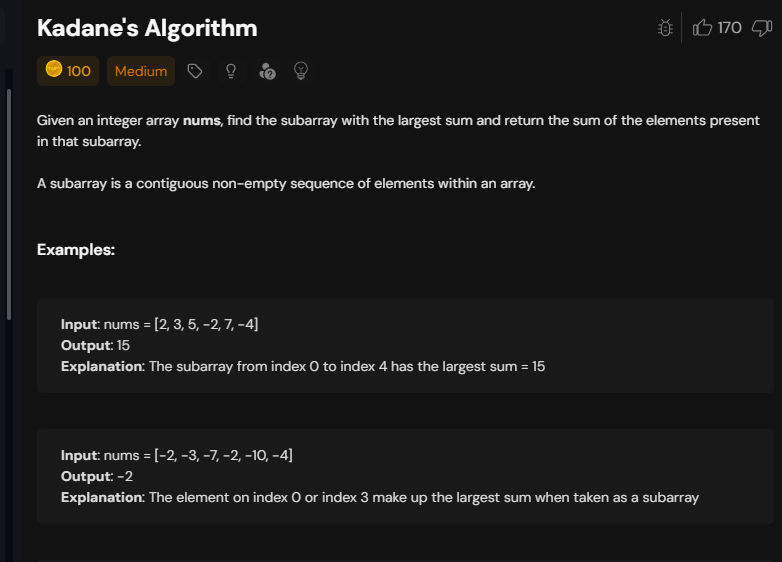
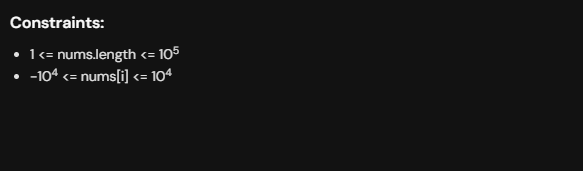
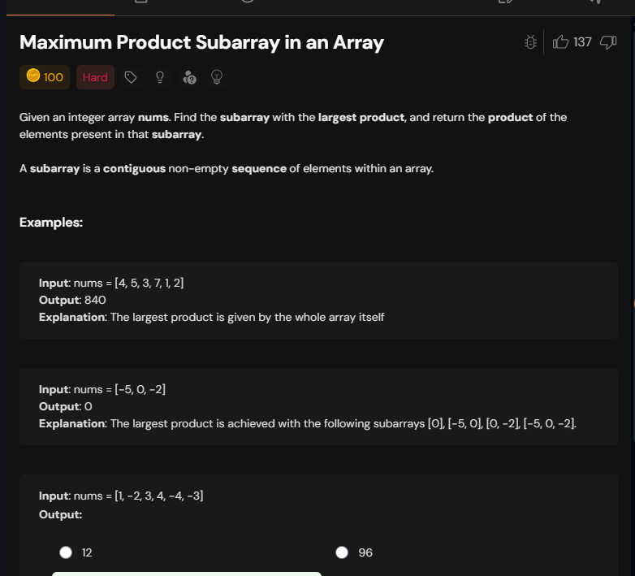

# Notes

## Q1 simple kadanes







in here qw choose whether we choose arr[i] singly or sum+arr[i] at every step,
arr[i] will be choosen anyway as we need subarray 

In subsequence we have choice to choose between arr[i] or not

```cpp

class Solution {
public:
    int maxSubArray(vector<int>& nums) {
        int mxsum=-(1e4+1);
        int sum=-(1e4+1);
        for(int n:nums){
            sum=max(sum+n,n);
            mxsum=max(sum,mxsum);
        }
        return mxsum;
    }
};
```

see constarints above we have put -(10^4+1) as -(10^4) is max nums[i] can get 


if you put -(1e9) then something is added in it say -(1e9)+-(1e3) that will circle back in positive range and give positive answer so do not put any value ,just check for constarints

## Q2 max produxt subarray




```cpp

class Solution {
public:
    int maxProduct(vector<int>& nums) {
        int mxp=nums[0];
        int mnp=nums[0];
        int prevmxp=nums[0];
        int prevmnp=nums[0];
        int n=nums.size();
        int res=nums[0];
        for(int i=1;i<n;i++){
            mxp=max({prevmxp*nums[i],prevmnp*nums[i],nums[i]});
            mnp=min({prevmxp*nums[i],prevmnp*nums[i],nums[i]});
            prevmnp=mnp;
            prevmxp=mxp;
            res=max(mxp,res);
        }

        return res;
    }
};
```
Time Complexity:O(n) due to a single for loop iterating through the input vector.

Space Complexity:O(1) as it uses a constant amount of extra space regardless of the input size.


now if you do not use prevmnp and prevmxp then see then code

```cpp

class Solution {
public:
    int maxProduct(vector<int>& nums) {
        int mxp=nums[0];
        int mnp=nums[0];
        int n=nums.size();
        int res=nums[0];
        for(int i=1;i<n;i++){
            mxp=max({mxp*nums[i],mnp*nums[i],nums[i]});
            mnp=min({mxp*nums[i],mnp*nums[i],nums[i]});
            res=max(mxp,res);
        }

        return res;
    }
};
```

i=1 we run this `mxp=max({mxp*nums[i],mnp*nums[i],nums[i]});` now when we run `mnp=min({mxp*nums[i],mnp*nums[i],nums[i]});` then mxp we just updated but we need prev mxp!! so thats why we store that in a variable.

## Q3 Maximum Sum Circular Subarray

Link--> https://leetcode.com/problems/maximum-sum-circular-subarray/description/

Given a **circular integer array** `nums` of length `n`, return the **maximum possible sum** of a non-empty subarray of `nums`.

A **circular array** means the end of the array connects to the beginning of the array. Formally, the next element of `nums[i]` is `nums[(i + 1) % n]` and the previous element of `nums[i]` is `nums[(i - 1 + n) % n]`.

A subarray may only include each element of the fixed buffer `nums` **at most once**. Formally, for a subarray `nums[i], nums[i + 1], ..., nums[j]`, there does not exist $i \le k_1, k_2 \le j$ with $k_1 \pmod n = k_2 \pmod n$.

**Example 1:**
Input: `nums = [1,-2,3,-2]`
Output: `3`
Explanation: Subarray `[3]` has maximum sum 3.

**Example 2:**
Input: `nums = [5,-3,5]`
Output: `10`
Explanation: Subarray `[5,5]` has maximum sum 5 + 5 = 10.

**Example 3:**
Input: `nums = [-3,-2,-3]`
Output: `-2`
Explanation: Subarray `[-2]` has maximum sum -2.

**Constraints:**
- $n = \text{nums.length}$
- $1 \le n \le 3 \times 10^4$
- $-3 \times 10^4 \le \text{nums}[i] \le 3 \times 10^4$


```java
class Solution {
    public int maxSubarraySumCircular(int[] nums) {
        int cmax=nums[0];
        int cmin=nums[0];
        int gmax=nums[0];
        int gmin=nums[0];
        int sum=nums[0];
        for(int i=1;i<nums.length;i++){
            cmax=Math.max(cmax+nums[i],nums[i]);
            gmax=Math.max(gmax,cmax);
            
            cmin=Math.min(cmin+nums[i],nums[i]);
            gmin=Math.min(gmin,cmin);
            
            sum+=nums[i];
        }
        
        return sum==gmin?gmax:Math.max(gmax,sum-gmin);
    }
}
```
Circular sum means after the array ends at last index we go to first index

sum==gmin satifies in case of all negatives and in that we return gmax i.e. max of all negatives as in this case if we do max(gmax,sum-gmin) =>(sum-gmin ) will give zero ,gmax will be max negative number so max(max negtive number ,0)=0 so we return only gmax here

max(gmax-gmin)


gmax: This is the best sum found in a straight line (Scenario A). It assumes the best part of the array is contiguous and doesn't need to wrap around.

sum - gmin: This is the best sum found by wrapping around (Scenario B). It assumes the "best" parts are at the edges and the "worst" part is in the middle.


### Circular Maximum Subarray Sum: Logic Breakdown

The logic behind the return statement `return sum == gmin ? gmax : Math.max(gmax, sum - gmin);` handles the two primary ways a maximum sum can exist in a circular array.

---

### 1. The Two Scenarios
In a circular array, the maximum sum subarray can appear in two forms:

* **Scenario A: The "Normal" Case (Non-circular)** The maximum sum is a standard contiguous subarray located somewhere in the middle of the array. This is exactly what **Kadane’s Algorithm** (represented by your `gmax`) calculates.
* **Scenario B: The "Circular" Case (Wrapping around)** The maximum sum starts near the end of the array and wraps around to the beginning.


---

### 2. The Logic: `sum - gmin`
To calculate the circular sum (Scenario B), we use a subtraction method:
If the maximum subarray wraps around the ends, then the elements **not** included in that maximum must form a contiguous **minimum subarray** sitting in the middle.

**The Relationship:** $$\text{Total Sum} = \text{Maximum Subarray (Circular)} + \text{Minimum Subarray (Middle)}$$

**The Solution:** $$\text{Maximum Subarray (Circular)} = \text{Total Sum} - \text{Minimum Subarray (Middle)}$$

This is why we calculate `gmin` (the global minimum subarray) and then evaluate `sum - gmin`.

---

### 3. The Edge Case: `sum == gmin`
This check handles the situation where **all numbers in the array are negative** (e.g., `[-3, -2, -1]`).

**If all numbers are negative:**
1.  `gmax` would be `-1` (the largest single element).
2.  `sum` would be `-6`.
3.  `gmin` would also be `-6` (the entire array is the minimum subarray).
4.  **The Problem:** If you strictly used the circular formula, you would get `sum - gmin` $\rightarrow$ `-6 - (-6) = 0`.

Since a subarray must contain at least one element, `0` is an incorrect result for an all-negative array. The condition `sum == gmin` detects that the minimum subarray is the entire array. In this case, we ignore the circular logic and return `gmax`.

---

### 4. Summary Table

| Component | Logic |
| :--- | :--- |
| **`sum == gmin`** | If total sum equals the minimum subarray, all elements are negative. |
| **`? gmax`** | If true, return the largest single negative number. |
| **`: Math.max(gmax, sum - gmin)`** | Otherwise, compare the **Normal Case** vs. the **Circular Case**. |