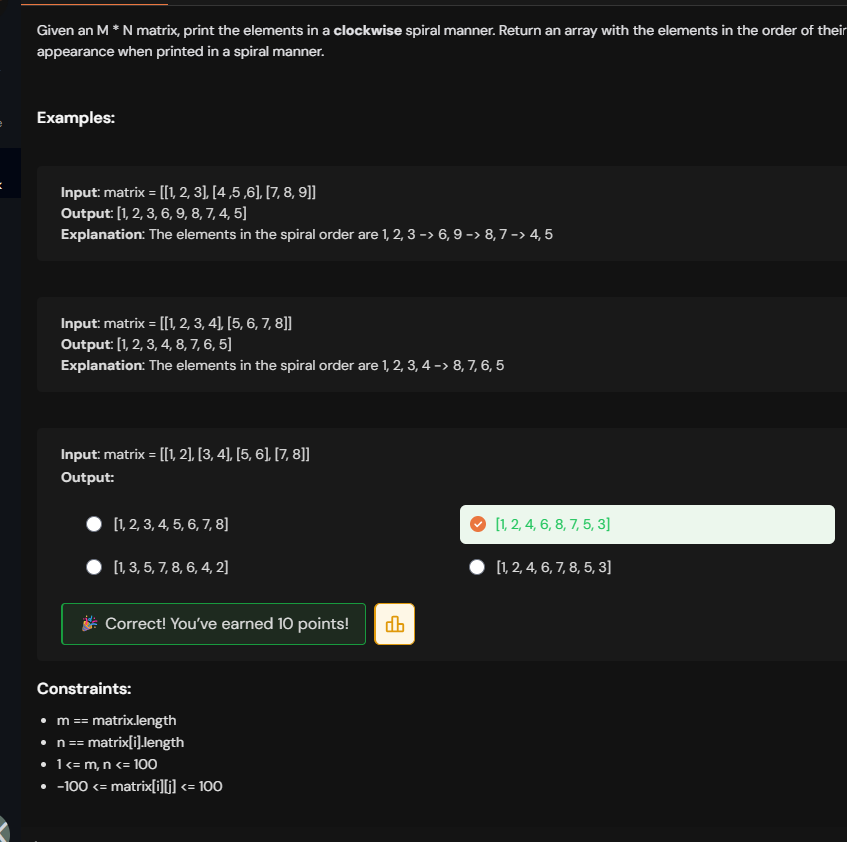
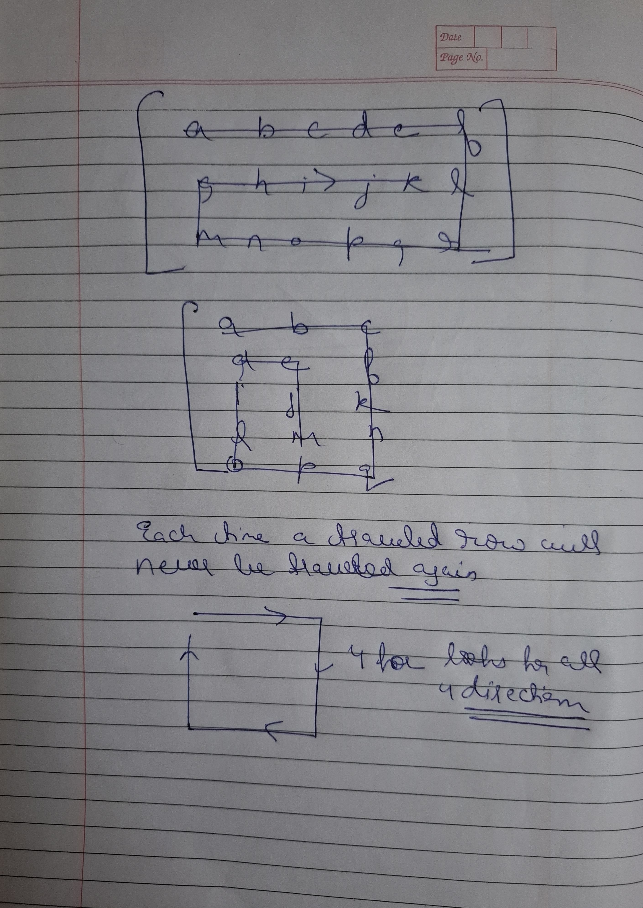
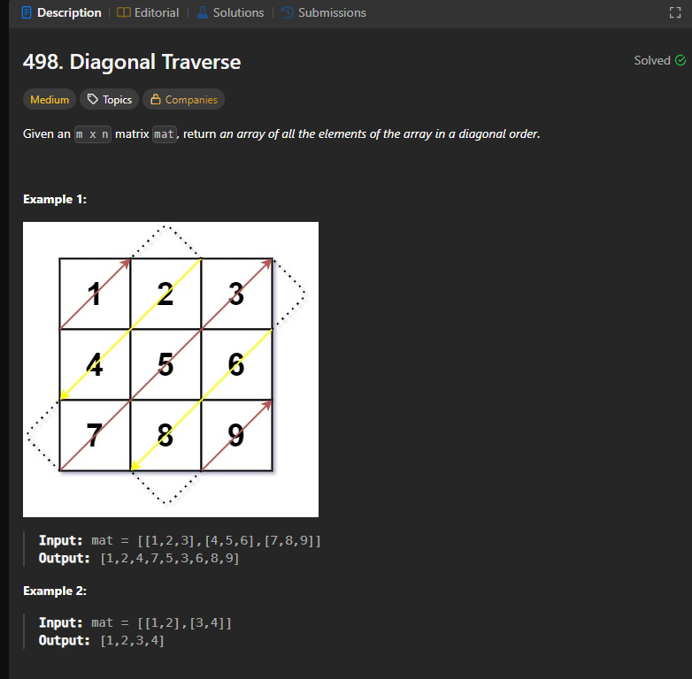
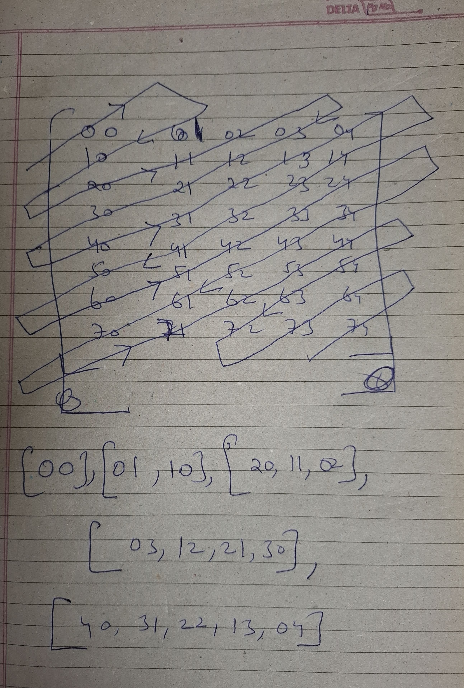

# Notes

## Spiral Matrix





```cpp

class Solution {
public:
    vector<int> spiralOrder(vector<vector<int>>& matrix) {
        int str=0,stc=0;
        int enr=matrix.size()-1;
        int enc=matrix[0].size()-1;
        vector<int> res;

        while(str<= enr && stc<=enc){

            for(int j=stc;j<=enc;j++) res.push_back(matrix[str][j]);

            str++;

            for(int i=str;i<=enr;i++) res.push_back(matrix[i][enc]);

            enc--;

            if(str<=enr){

                for(int j=enc;j>=stc;j--) res.push_back(matrix[enr][j]);

                enr--;
            }

           if(stc<=enc){
                
                for(int i=enr;i>=str;i--) res.push_back(matrix[i][stc]);

                stc++;
           }
        }

        return res;

    }
};

```
## Diagonal traversal





```cpp

class Solution {
public:
    vector<int> findDiagonalOrder(vector<vector<int>>& arr) {
        int m=arr.size();
        int n=arr[0].size();
        vector<int>res(m*n);
        int i=0;
        int row=0;
        int col=0;
        bool up=true;
        while(row<m&&col<n){
            if(up){
                while(row>0&&col<n-1){
                    res[i++]=arr[row][col];
                    row--;
                    col++;
                }
                res[i++]=arr[row][col];
                if(col==n-1) row++;
                else col++;
            }
            else
                {
                while(col>0&&row<m-1){
                    res[i++]=arr[row][col];
                    row++;
                    col--;
                }
                res[i++]=arr[row][col];
                if(row==m-1) col++;
                else row++;
            }
            up=!up;
            
        }
        
        return res;
    }
};

```


