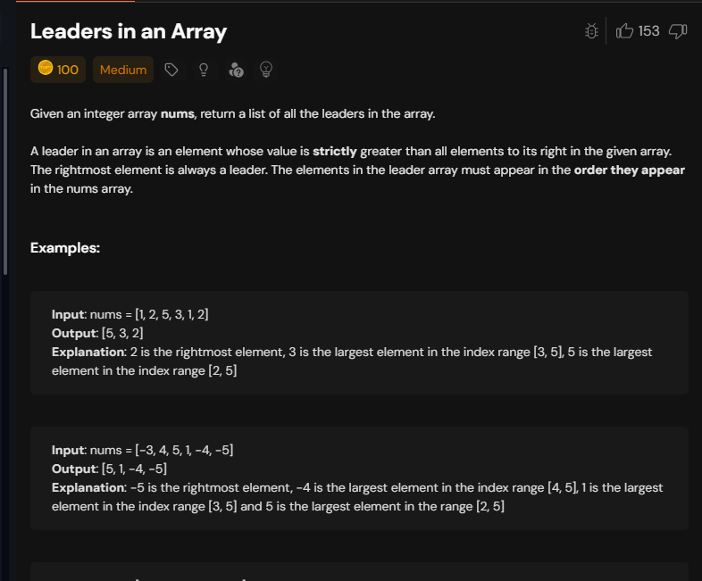

# Notes




```cpp
class Solution {
public:
    vector<int> leaders(vector<int>& nums) {
      vector<int> res;
      int n=nums.size();
      int maxel=-(1e4+1);
      for(int i=n-1;i>=0;i--){
            if(nums[i]>maxel){
                maxel=nums[i];
                res.push_back(nums[i]);
            }
      }

      reverse(res.begin(),res.end());
      return res;
    }

};
```

tc-->O(n)

## Equilibrium point 


```cpp

class Solution {
    public:
      // Function to find equilibrium point in the array.
      int findEquilibrium(vector<int> &arr) {
          long sum=0;
          for(int i=0;i<arr.size();i++){
              sum+=arr[i];
          }
          int lsum=0;
          for(int i=0;i<arr.size();i++){
              sum-=arr[i];
              if(sum==lsum) return i;
              lsum+=arr[i];
          }
          
          return -1;
          
      }
  };
  
  ```

