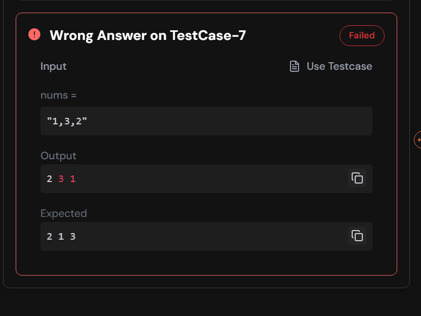
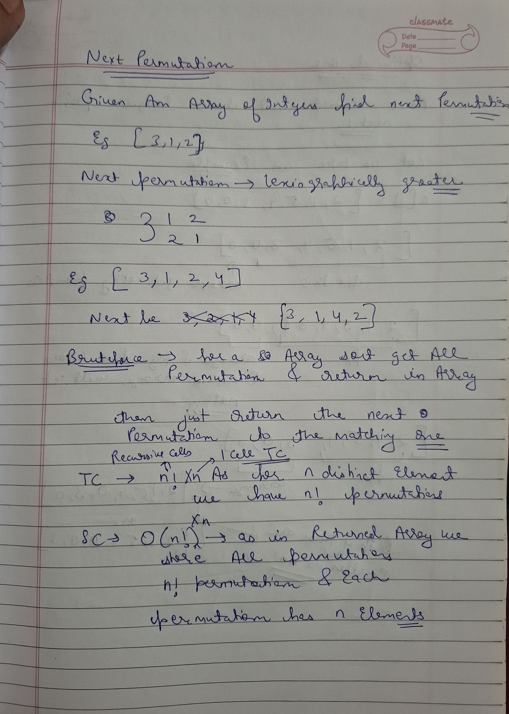
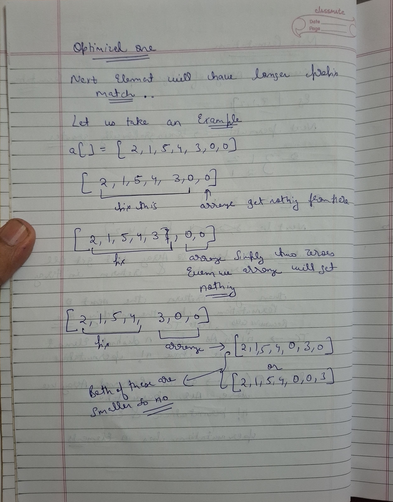
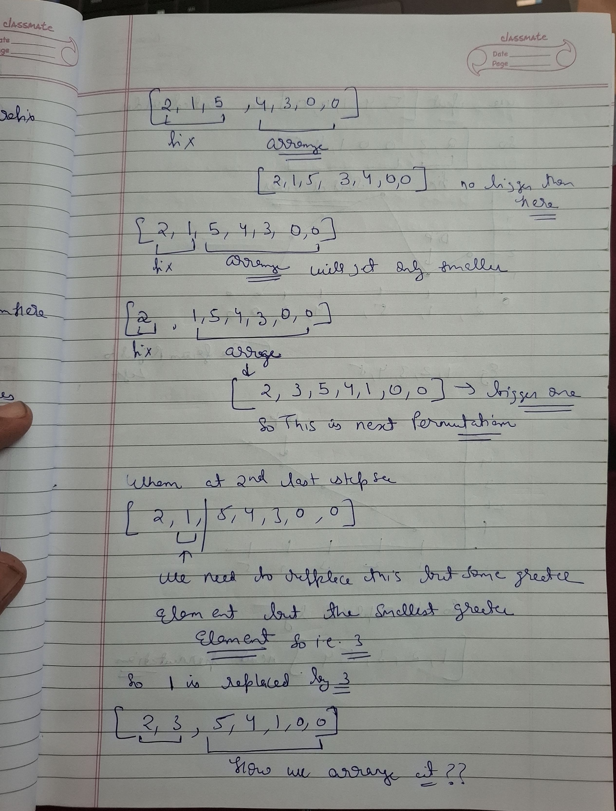
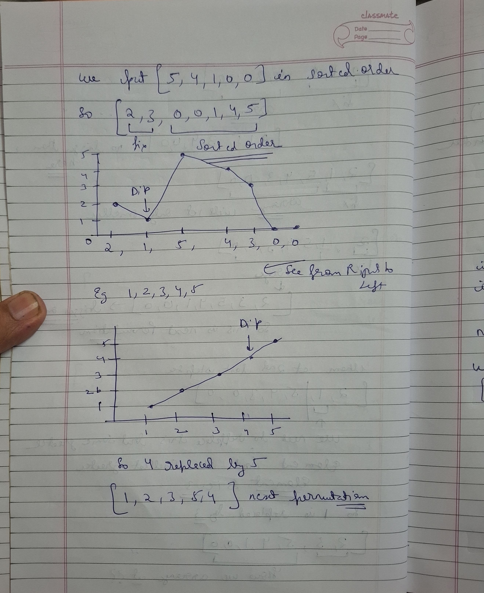
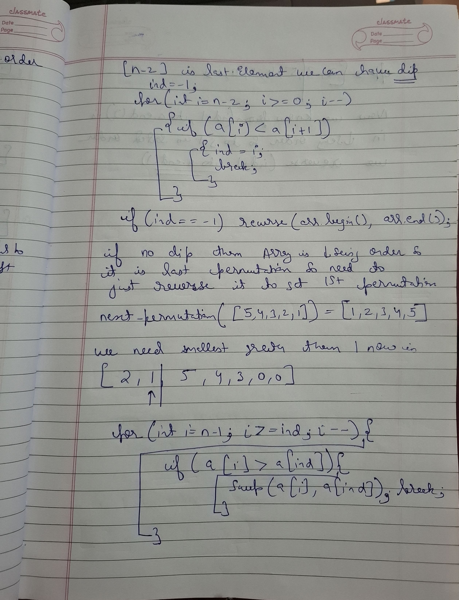
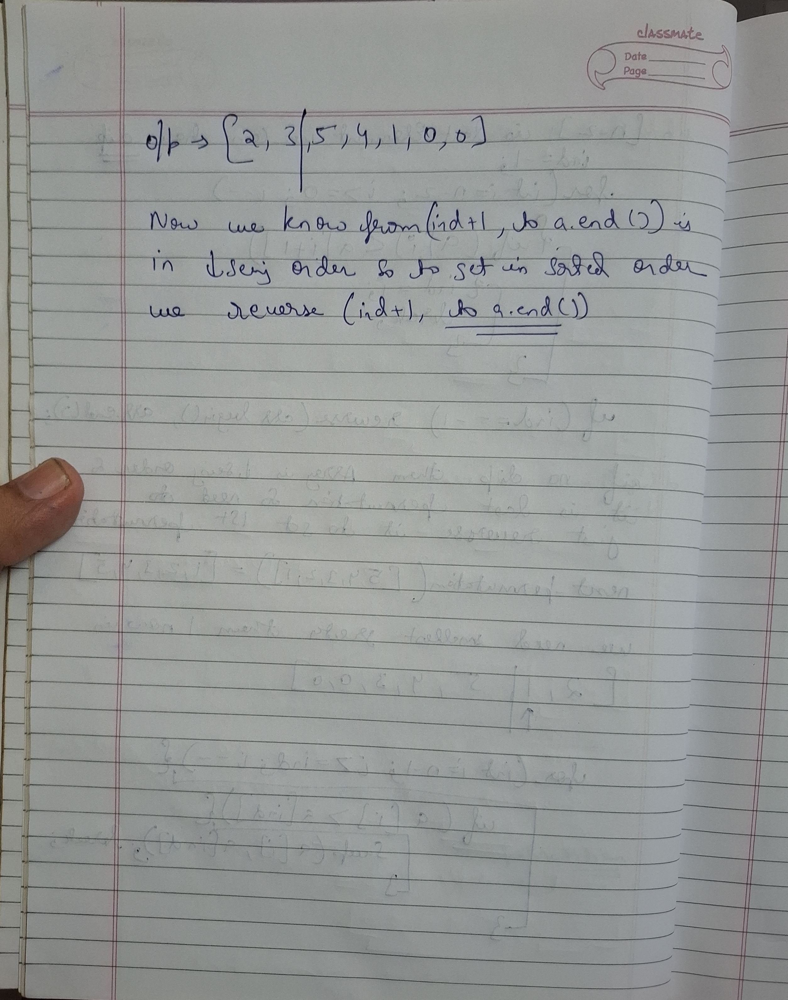

# Notes

## Bruteforce

```cpp
#include <bits/stdc++.h>
using namespace std;

class Solution {
public:
    void nextPermutation(vector<int>& nums) {

        vector<vector<int>> ans = getAllPermutations(nums);
        
        int index = -1; // Current permutation index
        for(int i = 0; i < ans.size(); i++) {
            if(nums == ans[i]) {
                index = i;
                break;
            }
        }
        if(index == ans.size() - 1) nums = ans[0];
        else nums = ans[index + 1];
        
        return;
    }
    
private:

    vector<vector<int>> getAllPermutations(vector<int> &nums) {
        vector<vector<int>> ans;
        helperFunc(0, nums, ans);
        sort(ans.begin(), ans.end()); 
        return ans; // Return the result
    }
    void helperFunc(int ind, vector<int> &nums,  vector<vector<int>> & ans) {
        if(ind == nums.size()) {
            ans.push_back(nums);
            return;
        }
        for(int i = ind; i < nums.size(); i++) {
            swap(nums[ind], nums[i]); // Swap-In
            helperFunc(ind+1, nums, ans);
            swap(nums[ind], nums[i]); // Swap-Out
        }
        
        return;
    }
};

int main() {
    vector<int> nums = {1, 2, 3};

    Solution sol; 
    cout << "Given array: ";
    for(int x : nums) cout << x << " ";
    sol.nextPermutation(nums);
    cout << "\nNext Permutation: ";
    for(int x : nums) cout << x << " ";
    
    return 0;
}
```

## i thought bettr one but failed

```cpp

class Solution {
public:
    void nextPermutation(vector<int>& nums) {
        int n=nums.size();
        for(int i=n-2;i>=0;i--){
        
            int tres=INT_MAX;
            int el=nums[i];
            int tidx=-1;
            for(int j=i+1;j<n;j++){
                if(nums[j]>el && nums[j]-el<tres){
                    tres=nums[j]-el;
                    tidx=j;
                }
            }
            if(tidx!=-1) {
                swap(nums[tidx],nums[i]);
                return;
            }
        }
        sort(nums.begin(),nums.end());
    }
};
```




## Striver solution

 
 
 
 

 

```cpp
class Solution {
public:
    void nextPermutation(vector<int>& nums) {
        int n = nums.size();
        int ind = -1; 
        for(int i = n-2; i >= 0; i--) {
            if(nums[i] < nums[i+1]) {
                ind = i;
                break;
            }
        }
        if(ind == -1) {
            reverse(nums.begin(), nums.end());
            return;
        }
        for(int i = n-1; i > ind; i--) {
            if(nums[i] > nums[ind]) {
                swap(nums[i], nums[ind]);
                break;
            }
        }
        reverse(nums.begin() + ind + 1, nums.end());
        return;
    }
};
```