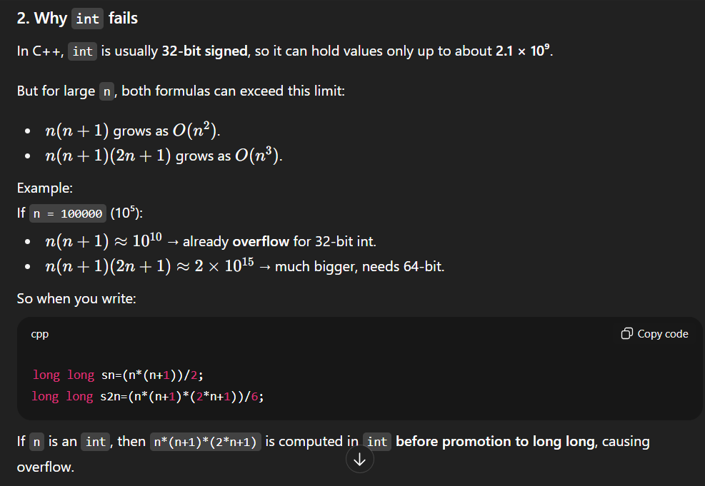
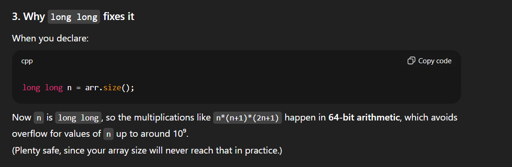

# Notes

## Find the repeating and missing number


Given an integer array nums of size n containing values from [1, n] and each value appears exactly once in the array, except for A, which appears twice and B which is missing.


Return the values A and B, as an array of size 2, where A appears in the 0-th index and B in the 1st index.

Note: You are not allowed to modify the original array.

Examples:

---

Input: nums = [3, 5, 4, 1, 1]

Output: [1, 2]

Explanation:

1 appears two times in the array and 2 is missing from nums

---

Input: nums = [1, 2, 3, 6, 7, 5, 7]

Output: [7, 4]

Explanation:

7 appears two times in the array and 4 is missing from nums.

```cpp
class Solution {
public:
    vector<int> findMissingRepeatingNumbers(vector<int> arr) {
        long long n=arr.size();
        long long sn=(n*(n+1))/2;
        long long s2n=(n*(n+1)*(2*n+1))/6;
        long long s=0;
        long long s2=0;
        for(int el:arr){
          s+=el;
          s2+=((long long)el*(long long)el);
        }
        long long xmY=s-sn;
        long long xaY=(s2-s2n)/xmY;
       
        long long x=(xmY+xaY)/2;
        long long y=xaY-x;
        return {(int)x,(int)y};
    }
};
```
int n doesnt works here





long long can handle upto 10^18 and our n is max 10^5 in constarint and can goes upto n^3 so 10^15 so long long can handle!!!

in cpp 

int for max 32 bit or 10^9 
long long for max 64 bit or 10^18

int java 

int for max 32 bit or 10^9 
long for max 64 bit or 10^18 no long long


