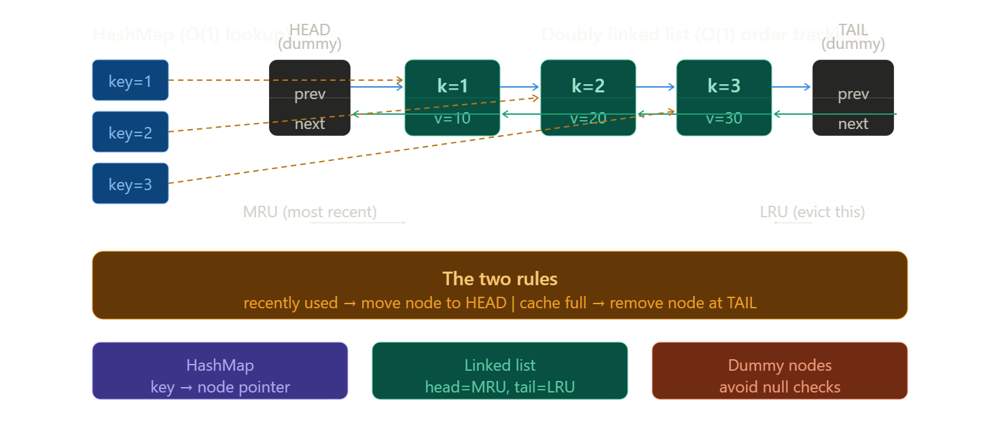
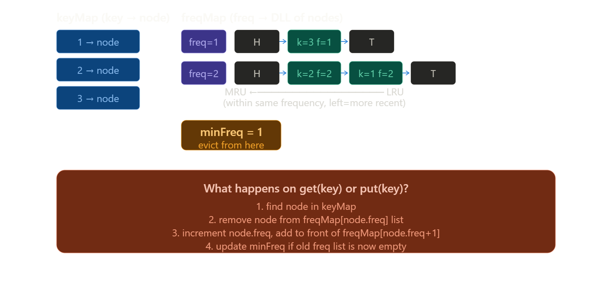
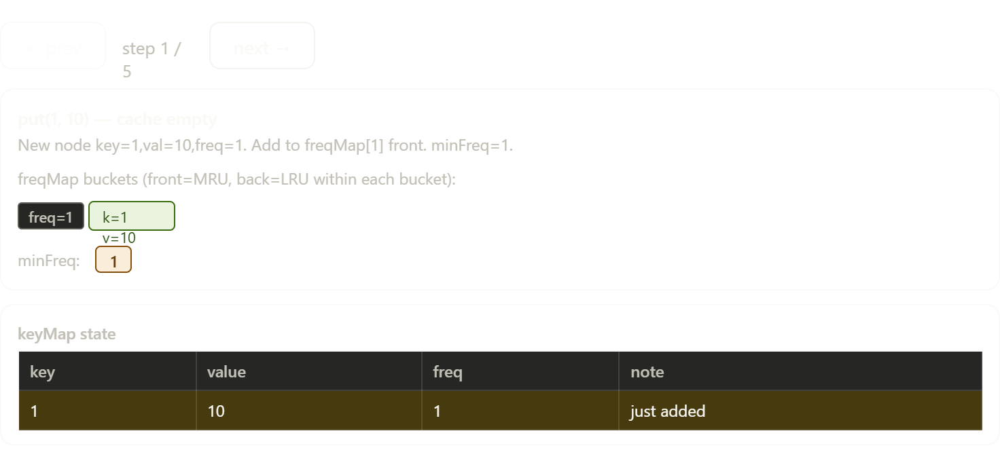
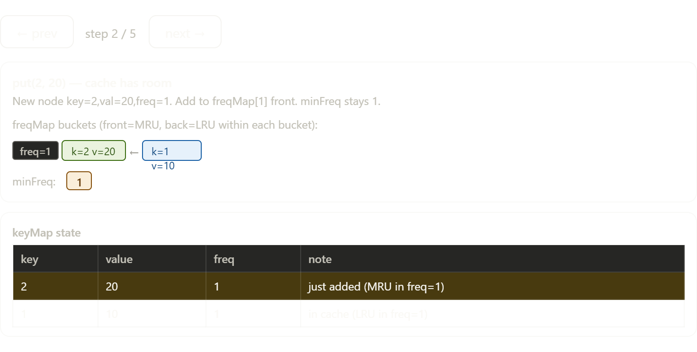
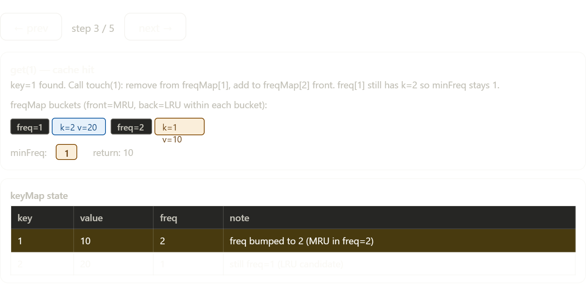
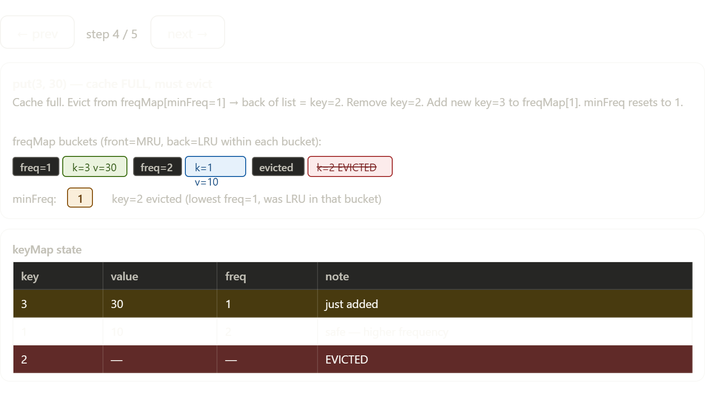
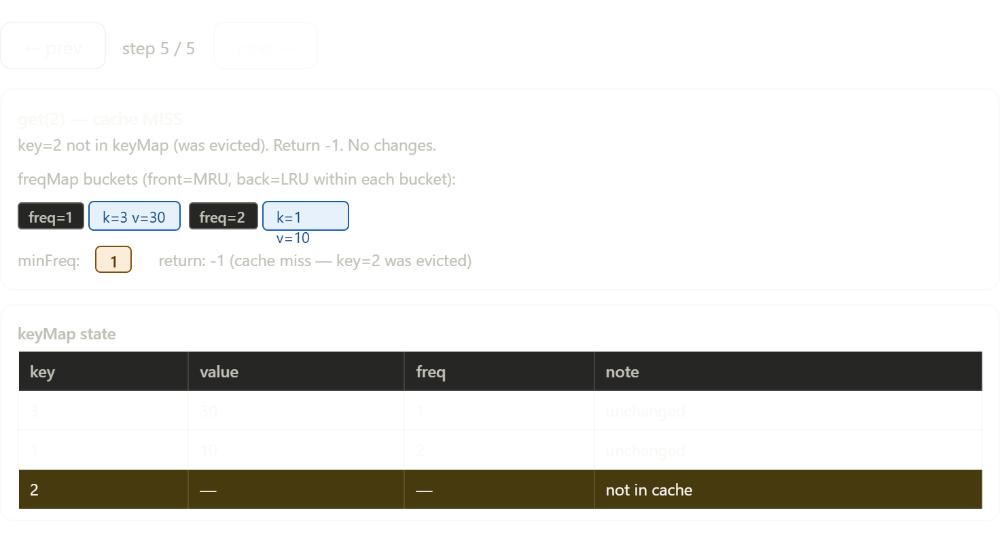

# Notes
.jpg>)

(1).jpg>) 
(2).jpg>)
 (3).jpg>) 
 (4).jpg>) (5).jpg>) (6).jpg>) 

## LRU Cache — Complete Guide

### What is LRU Cache?

**LRU = Least Recently Used**

When cache is full and you need to add something new, evict the item that was **used least recently** — the one sitting idle the longest.

> Think of it like your browser tabs. When RAM is full, the browser kills the tab you haven't touched in the longest time.

---

### The Core Operations (both must be O(1))

```
get(key)        → return value if exists, else -1
                  mark this key as "recently used"

put(key, value) → insert or update key
                  if cache full → evict least recently used first
```

---

### Why This Data Structure?

We need **two things simultaneously**:

```
1. O(1) lookup by key          → HashMap
2. O(1) track usage order      → Doubly Linked List
                                  (move to front = recently used)
                                  (tail = least recently used)
```

Neither alone works. Together they do.Here is the internal structure first — how HashMap and Doubly Linked List work together:---




(7).jpg>) (8).jpg>)


(9).jpg>) 

Great question — let me build the intuition from scratch.

---

### What Operations LRU Cache Needs

```
get(key)  → find value by key         must be O(1)
            mark as recently used      must be O(1)

put(key)  → insert or update           must be O(1)
            evict LRU if full          must be O(1)
```

ALL four operations must be **O(1)**. This constraint drives everything.

---

### Try Each Structure Alone — See Why It Fails

---

#### Only HashMap

```
get(key) → O(1) ✅  perfect for lookup

but...

"mark as recently used" — how?
"find least recently used" — how?

HashMap has NO concept of order
it's just key→value pairs
no way to know which was used least recently ❌
```

---

#### Only Array

```
idea: keep array sorted by usage
most recent at front, LRU at back

get(key):
  scan array to find key → O(n) ❌ too slow

evict LRU:
  remove last element → O(1) ✅

"mark recently used":
  find element → O(n) ❌
  move to front → O(n) shift ❌
```

---

#### Only Linked List

```
get(key):
  scan from head to find key → O(n) ❌

evict LRU:
  remove tail → O(1) ✅

"mark recently used":
  move node to head → O(1) IF you have the pointer ✅
  but FINDING the node is O(n) ❌
```

---

#### Only Queue / Stack

```
Queue naturally tracks order
but no O(1) lookup by key ❌
no O(1) removal from middle ❌
```

---

### The Problem is Always Two Things

```
Every structure fails because the problem needs TWO things:

1. FAST LOOKUP by key        → need key→value mapping
2. FAST ORDER TRACKING       → need to know who was used least recently
                               AND be able to move things around quickly
```

No single structure does both. So combine two.

---

### Why HashMap Specifically

```
HashMap gives:
  key → node pointer         O(1) lookup ✅
  key → node pointer         O(1) insert ✅
  key → node pointer         O(1) delete ✅

The VALUE stored is not just the cache value
it's a POINTER to the node in the linked list

so HashMap answers: "where is this key in the list?"
in O(1) time
```

---

### Why Doubly Linked List Specifically

```
Need to track ORDER of usage:
  most recently used → head
  least recently used → tail (evict from here)

Need to MOVE a node to head when accessed:
  this requires removing it from current position
  and inserting at head

Removing from middle of list needs:
  pointer to prev node   ← why DOUBLY linked
  pointer to next node   ← why DOUBLY linked

  node.prev.next = node.next   // bypass node
  node.next.prev = node.prev   // bypass node
  → O(1) removal ✅

Singly linked list CANNOT remove from middle in O(1)
because you don't know the prev node ❌
```

---

### Why Not Other Ordered Structures

```
TreeMap / Balanced BST:
  ordered ✅
  but O(log n) operations ❌  not fast enough

Array with timestamps:
  store last-used time with each entry
  find minimum timestamp = O(n) ❌

Deque:
  O(1) at both ends ✅
  but O(n) removal from middle ❌

Doubly Linked List:
  O(1) removal from middle ✅ (with pointer)
  O(1) insert at head ✅
  O(1) remove from tail ✅
  maintains order ✅
```

---

### How They Work Together

```
HashMap stores:      key → pointer to Node in list
LinkedList stores:   Nodes in order of usage

GET operation:
  HashMap finds the node in O(1)     ← HashMap's job
  LinkedList moves it to head O(1)   ← LinkedList's job

PUT operation (new key):
  Create node, add to head of list   ← LinkedList's job
  Store key→node in HashMap          ← HashMap's job
  If full: remove tail node          ← LinkedList's job
           remove key from HashMap   ← HashMap's job

Every single step = O(1) ✅
```

---

### The Perfect Analogy

Think of a **library with a special shelf:**

```
HashMap  =  card catalog
            "which shelf position is this book?"
            instant lookup by title

Doubly Linked List  =  the shelf itself
            books arranged by recently used
            most recent at left end
            least recent at right end
            any book can be pulled out and
            moved to left end instantly
            (because each book knows its
             left AND right neighbour)

Together:
  "get book X"  → catalog tells you exact position O(1)
                → pull it out and put at left end  O(1)

  "no space"    → throw out rightmost book         O(1)
                → remove from catalog              O(1)
```

---

### Summary

| Need | Why | Structure |
|---|---|---|
| Find key instantly | scan would be O(n) | HashMap |
| Track usage order | know who's LRU | Doubly Linked List |
| Remove from middle | need prev AND next pointer | **Doubly** (not singly) linked |
| Move to front | reorder after access | Linked List head insert |
| Evict LRU | always remove oldest | Linked List tail remove |

```
HashMap alone     → fast lookup, no order      ❌
LinkedList alone  → has order, slow lookup     ❌
HashMap + DLL     → fast lookup + fast order   ✅ O(1) everything
```

The combination is not arbitrary — each structure covers **exactly the weakness** of the other.

## Rajneesh code
```java
import java.util.*;

class LRUCache {

    private class Node {
        int key = 0;
        int value = 0;

        Node prev = null, next = null;

        Node(int key, int value) {
            this.key = key;
            this.value = value;
        }
    }

    private HashMap<Integer, Node> map;
    private Node head = null, tail = null;
    private int capacity = 0;
    private int linkedListSize = 0;

    public LRUCache(int capacity) {
        this.map = new HashMap<>();
        this.capacity = capacity;
    }

    private void addFirst(Node node) {
        if (this.head == null)
            this.head = this.tail = node;
        else {
            this.head.next = node;
            node.prev = this.head;
            this.head = node;
        }
        this.linkedListSize++;
    }

    private void removeNode(Node node) {
        if (this.linkedListSize == 1)
            this.head = this.tail = null;
        else if (this.head == node) {
            Node prevNode = node.prev;
            prevNode.next = node.prev = null;
            this.head = prevNode;
        } else if (this.tail == node) {
            Node nextNode = node.next;
            nextNode.prev = node.next = null;
            this.tail = nextNode;
        } else {
            Node prevNode = node.prev;
            Node nextNode = node.next;

            prevNode.next = nextNode;
            nextNode.prev = prevNode;

            node.prev = node.next = null;
        }
        
        this.linkedListSize--;
    }

    private void makeRecentApp(Node node) {
        if (node == this.head)
            return;

        removeNode(node);
        addFirst(node);
    }

    private Node fetchNode(int key) {
        Node node = map.get(key);
        makeRecentApp(node);
        return node;
    }

    // make it recent app and return its state
    public int get(int key) {
        if (!map.containsKey(key))
            return -1;

        return fetchNode(key).value;
    }

    // key : appName, value : stateOfApp
    public void put(int key, int value) {
        if (map.containsKey(key)) {
            Node node = fetchNode(key);
            node.value = value;
        } else {
            Node node = new Node(key, value);
            addFirst(node);
            map.put(key, node);
            if (map.size() > this.capacity) {
                Node tail = this.tail;
                removeNode(tail);
                map.remove(tail.key);
            }
        }

    }
}

/**
 * Your LRUCache object will be instantiated and called as such:
 * LRUCache obj = new LRUCache(capacity);
 * int param_1 = obj.get(key);
 * obj.put(key,value);
 */
```
Thats a good code but need to have a lot of checks in addFirst and removeNode ,better use this 

```java
class LRUCache {
  private HashMap<Integer, Node> mp;

  private class Node {
    int key;
    int val;
    Node prev = null;
    Node next = null;

    Node(int key, int val) {
      this.key = key;
      this.val = val;
    }
  }

  private Node head = null;
  private Node tail = null;
  private int cap;
  private int llSize;

  public LRUCache(int capacity) {
    mp = new HashMap<>();
    cap = capacity;
    llSize = 0;
    head = new Node(-1, -1);
    tail = new Node(-2, -2);
    head.next = tail;
    tail.prev = head;
  }

  private void removeNode(Node node) {
    Node prevNode = node. prev;
    Node nextNode = node .next;
    prevNode.next = nextNode;
    nextNode.prev = prevNode;
    node.next = null;
    node.prev = null;
    llSize--;
  }

  private void addFirst(Node node) {
    Node nextNode = head.next;
    node.prev = head;
    node.next = nextNode;
    nextNode.prev = node;
    head.next = node;
    llSize++;
  }

  private void makeRecent(Node node) {
    if (head.next == node) return;
    removeNode(node);
    addFirst(node);
  }

  private Node fetchValue(int key) {
    Node node = mp.get(key);
    makeRecent(node);
    return node;
  }

  public int get(int key) {
    if (!mp.containsKey(key)) return -1;
    return fetchValue(key).val;
  }

  public void put(int key, int value) {
    if (mp.containsKey(key)) {
      fetchValue(key).val = value;
      return;
    }
    Node node = new Node(key, value);
    addFirst(node);
    mp.put(key, node);
    if (mp.size() > this.cap) {
      Node lruNode = this.tail.prev;
      removeNode(lruNode);
      mp.remove(lruNode.key);
    }
  }
}

```
code 1 is here above code and code 2 is upper one
## Ai review 

This is a classic comparison between the **"Senior" Pattern (Sentinel Nodes)** and the **"Junior" Pattern (Conditional Checks)**.

**Verdict:** The first implementation (Code 1) is significantly better.

Here is the breakdown of why Code 1 is the standard for production systems and interviews.

###  The "Sentinel Node" Pattern (Code 1)
In Code 1, you initialize two dummy nodes: `head` and `tail`.

* **Head:** Always points to the start (but holds no data).
* **Tail:** Always points to the end (but holds no data).
* **Real Data:** Always floats between these two.

### The Magic
Because `head` and `tail` always exist, you never encounter a null pointer.

* You don't need to check `if (head == null)`.
* You don't need to check `if (size == 1)`.
* You don't need to check `if (node == tail)`.

### The "Spaghetti Logic" (Code 2)
In Code 2, `head` and `tail` can be `null`. This forces you to handle every edge case manually.

Look at the nightmare that is `removeNode` in Code 2:

```java
// Code 2: 20 lines of dangerous 'if-else' blocks
private void removeNode(Node node){
    if(llSize==1){
        // Handle single element
    } else if(node == head){
        // Handle head removal
    } else if(node == tail){
        // Handle tail removal
    } else {
        // Handle middle removal
    }
}
```

### Why this is bad:

* **Bug Prone:** It is extremely easy to forget one pointer update (e.g., forgetting to set `head.prev` to `null` when moving `head`).
* **Hard to Read:** The logic is buried under validational checks.
* **Slower (slightly):** CPU branch prediction hates excessive `if-else` chains.


## LRU Cache — Two Implementations Compared

### The Core Difference in One Line

```
Code 1 (yours):  uses DUMMY head and tail nodes
Code 2:          uses REAL head and tail, handles edge cases manually
```

---

### Side by Side Comparison

#### Constructor

**Code 1 — dummy nodes:**
```java
head = new Node(-1, -1);   // dummy head
tail = new Node(-2, -2);   // dummy tail
head.next = tail;
tail.prev = head;
```

**Code 2 — no dummies:**
```java
// head and tail start as null
// no pre-wiring needed
```

---

#### removeNode

**Code 1 — always clean, no edge cases:**
```java
private void removeNode(Node node) {
    Node prevNode = node.prev;
    Node nextNode = node.next;
    prevNode.next = nextNode;    // always works — prev is at worst dummy head
    nextNode.prev = prevNode;    // always works — next is at worst dummy tail
    node.next = null;
    node.prev = null;
    llSize--;
}
```

**Code 2 — must handle every edge case manually:**
```java
private void removeNode(Node node) {
    if (this.linkedListSize == 1)           // only one node
        this.head = this.tail = null;
    else if (this.head == node) {           // removing head
        Node prevNode = node.prev;
        prevNode.next = node.prev = null;
        this.head = prevNode;
    } else if (this.tail == node) {         // removing tail
        Node nextNode = node.next;
        nextNode.prev = node.next = null;
        this.tail = nextNode;
    } else {                                // middle node
        Node prevNode = node.prev;
        Node nextNode = node.next;
        prevNode.next = nextNode;
        nextNode.prev = prevNode;
        node.prev = node.next = null;
    }
    this.linkedListSize--;
}
```

This is the **biggest difference**. Code 1 eliminates all 4 cases with dummy nodes.

---

#### addFirst

**Code 1 — always clean:**
```java
private void addFirst(Node node) {
    Node nextNode = head.next;    // head is always dummy, never null
    node.prev = head;
    node.next = nextNode;
    nextNode.prev = node;
    head.next = node;
    llSize++;
}
```

**Code 2 — must handle empty list:**
```java
private void addFirst(Node node) {
    if (this.head == null)              // empty list edge case
        this.head = this.tail = node;
    else {
        this.head.next = node;
        node.prev = this.head;
        this.head = node;
    }
    this.linkedListSize++;
}
```

---

#### put — eviction logic

**Code 1:**
```java
if (mp.size() > this.cap) {
    Node lruNode = this.tail.prev;   // tail.prev = LRU (tail is dummy)
    removeNode(lruNode);
    mp.remove(lruNode.key);
}
```

**Code 2:**
```java
if (map.size() > this.capacity) {
    Node tail = this.tail;           // tail itself = LRU (no dummy)
    removeNode(tail);
    map.remove(tail.key);
}
```

---

### Bug in Code 2 ⚠️

```java
// Code 2 addFirst — head points to MRU
this.head.next = node;
node.prev = this.head;
this.head = node;
```

Wait — this means head = most recently used. But in removeNode:

```java
else if (this.head == node) {
    Node prevNode = node.prev;      // head.prev — but head is MRU
    prevNode.next = node.prev = null;
    this.head = prevNode;
}
```

The direction is **reversed from Code 1**. Code 2 uses:

```
head = MRU (most recent)
tail = LRU (least recent, evict this)
```

Code 1 uses:

```
head.next = MRU  (dummy head → first real node = most recent)
tail.prev = LRU  (last real node → dummy tail = least recent)
```

Both are valid — just opposite conventions. Easy to get confused when reading.

---

### Complete Comparison Table

| Feature | Code 1 (dummy nodes) | Code 2 (real head/tail) |
|---|---|---|
| Dummy nodes | ✅ yes | ❌ no |
| removeNode cases | 1 case always | 4 cases (empty/head/tail/middle) |
| addFirst cases | 1 case always | 2 cases (empty/non-empty) |
| Null pointer risk | ✅ none | ⚠️ must handle carefully |
| Code length | shorter | longer |
| Bug surface area | small | larger |
| Interview preferred | ✅ yes | harder to get right |
| Head = | dummy | MRU node |
| Tail = | dummy | LRU node |
| LRU node | `tail.prev` | `tail` |

---

### The Dummy Node Trick — Why It's Superior

```
Without dummies — 4 cases in removeNode:
  1. list has 1 node
  2. removing head
  3. removing tail
  4. removing middle

With dummies — always 1 case:
  every real node always has a valid prev (at worst = dummy head)
  every real node always has a valid next (at worst = dummy tail)
  no null checks ever needed

This is a classic linked list trick worth memorising
applies to any doubly linked list problem
```

---

### Verdict

```
Code 1  →  cleaner, safer, interview recommended
            dummy nodes eliminate all edge cases
            removeNode is 6 lines vs 15 lines

Code 2  →  more verbose, more bug-prone
            valid but harder to write correctly under pressure
            the 4-case removeNode is easy to mess up in interviews
```

> If you're ever implementing a doubly linked list from scratch — **always use dummy head and tail**. It makes every operation uniform and eliminates null checks entirely.

# LFU cache

## LFU Cache — Least Frequently Used

### LRU vs LFU — The Core Difference

```
LRU  →  evict the item unused for the LONGEST TIME
         "who was idle the longest?"

LFU  →  evict the item used the FEWEST TIMES overall
         "who was accessed the least?"
```

**Concrete example — cache capacity 2:**

```
put(1,10)   → cache: {1(freq=1), ...}
put(2,20)   → cache: {1(freq=1), 2(freq=1)}
get(1)      → cache: {1(freq=2), 2(freq=1)}   key=1 used twice now
put(3,30)   → cache full, must evict

LRU evicts: key=2  (least recently used)
LFU evicts: key=2  (lowest frequency = 1, key=1 has freq=2)

Same here — but watch this:

get(2)      → if key=2 still in LRU cache, freq becomes 2
put(4,40)   → 

LRU evicts: key=1  (key=2 was just used more recently)
LFU evicts: key=1  (both have freq=2, tie → evict least recently used among them)
```

The difference shows up when **old but frequently used** items compete with **new but rarely used** ones.

---

### Why LFU Needs a Completely Different Structure

LRU only tracks **one dimension** — time. One linked list handles it.

LFU tracks **two dimensions** — frequency AND time (for tie-breaking). You need:

```
1. key → (value, frequency)          HashMap 1
2. frequency → [list of keys]        HashMap 2  (each list = LRU within that freq)
3. minFreq tracker                   single integer
```




## LFU Cache — Complete Java Guide

### Quick Recap — LFU vs LRU

```
LRU → evict item unused for LONGEST TIME
LFU → evict item used FEWEST TIMES

LRU asks: "when was it last used?"
LFU asks: "how many times was it used?"
```

---

### Why LFU Needs More Data Structures

```
LRU needs:
  1 HashMap  (key → node)
  1 DLL      (order by time)

LFU needs:
  HashMap 1  (key → node)           find node by key
  HashMap 2  (freq → DLL of nodes)  group nodes by frequency
  int minFreq                        track which freq to evict from
```

The extra complexity comes from tracking **two dimensions** — frequency AND time (for tie-breaking within same frequency).

---

### The Three Rules

```
Rule 1: get(key)
  → find node
  → increment its frequency
  → move it from freqMap[f] to freqMap[f+1]
  → update minFreq if freqMap[f] becomes empty

Rule 2: put(key) — key exists
  → update value
  → same as get (increment frequency)

Rule 3: put(key) — new key, cache full
  → evict from freqMap[minFreq]
  → evict the TAIL of that list (LRU within same freq)
  → insert new node into freqMap[1]
  → minFreq = 1 (new node always starts at freq 1)
```

---

### The Code

```java
import java.util.*;

class LFUCache {

    // Node for doubly linked list
    private class Node {
        int key, val, freq;
        Node prev, next;

        Node(int key, int val) {
            this.key  = key;
            this.val  = val;
            this.freq = 1;       // new node always starts at freq 1
            this.prev = null;
            this.next = null;
        }
    }

    // Doubly Linked List — tracks order within same frequency
    // head.next = MRU,  tail.prev = LRU
    private class DLL {
        Node head, tail;
        int size;

        DLL() {
            head = new Node(-1, -1);   // dummy head
            tail = new Node(-2, -2);   // dummy tail
            head.next = tail;
            tail.prev = head;
            size = 0;
        }

        // add node right after dummy head (MRU position)
        void addFirst(Node node) {
            Node next = head.next;
            node.prev = head;
            node.next = next;
            next.prev  = node;
            head.next  = node;
            size++;
        }

        // remove any node from list
        void removeNode(Node node) {
            node.prev.next = node.next;
            node.next.prev = node.prev;
            node.prev = null;
            node.next = null;
            size--;
        }

        // remove and return LRU node (tail.prev)
        Node removeLast() {
            if (size == 0) return null;
            Node lru = tail.prev;
            removeNode(lru);
            return lru;
        }

        boolean isEmpty() {
            return size == 0;
        }
    }

    private HashMap<Integer, Node> keyMap;    // key → node
    private HashMap<Integer, DLL>  freqMap;   // freq → DLL
    private int capacity;
    private int minFreq;

    public LFUCache(int capacity) {
        this.capacity = capacity;
        this.minFreq  = 0;
        keyMap  = new HashMap<>();
        freqMap = new HashMap<>();
    }

    // ── core helper: increment frequency of a node ──────────
    private void updateFreq(Node node) {
        int oldFreq = node.freq;

        // remove from old freq bucket
        DLL oldList = freqMap.get(oldFreq);
        oldList.removeNode(node);

        // if old bucket is now empty AND it was the minFreq bucket
        // minFreq must increase by 1
        if (oldList.isEmpty() && oldFreq == minFreq) {
            minFreq++;
        }

        // move to new freq bucket
        node.freq++;
        freqMap.putIfAbsent(node.freq, new DLL());
        freqMap.get(node.freq).addFirst(node);
    }

    // ── get ─────────────────────────────────────────────────
    public int get(int key) {
        if (!keyMap.containsKey(key)) return -1;

        Node node = keyMap.get(key);
        updateFreq(node);           // increment frequency
        return node.val;
    }

    // ── put ─────────────────────────────────────────────────
    public void put(int key, int value) {

        if (capacity <= 0) return;

        // key exists → update value and frequency
        if (keyMap.containsKey(key)) {
            Node node = keyMap.get(key);
            node.val  = value;
            updateFreq(node);
            return;
        }

        // cache full → evict LFU node
        if (keyMap.size() >= capacity) {
            DLL minList = freqMap.get(minFreq);
            Node evicted = minList.removeLast();  // LRU within minFreq
            keyMap.remove(evicted.key);
        }

        // insert new node
        Node newNode = new Node(key, value);
        keyMap.put(key, newNode);
        freqMap.putIfAbsent(1, new DLL());
        freqMap.get(1).addFirst(newNode);
        minFreq = 1;                // new node always resets minFreq to 1
    }
}
```

---

### How Every Piece Works

#### keyMap — finds node in O(1)

```
keyMap = {
  1 → Node(key=1, val=10, freq=2)
  2 → Node(key=2, val=20, freq=1)
  3 → Node(key=3, val=30, freq=3)
}

get(2) → keyMap.get(2) → node directly → O(1)
```

#### freqMap — groups nodes by frequency

```
freqMap = {
  1 → DLL: [HEAD ↔ node2 ↔ TAIL]
  2 → DLL: [HEAD ↔ node1 ↔ TAIL]
  3 → DLL: [HEAD ↔ node3 ↔ TAIL]
}

within each DLL:
  head.next = most recently used
  tail.prev = least recently used (evict this on tie)
```

#### minFreq — tells us where to evict from

```
minFreq = 1

evict → freqMap.get(1).removeLast()
        ↑ the LRU node among all freq=1 nodes

why minFreq is always correct:
  only decreases when new node inserted (resets to 1)
  only increases by 1 when minFreq bucket becomes empty
  never jumps or skips
```

---

### Full Dry Run

```
capacity = 2
Operations: put(1,10), put(2,20), get(1), put(3,30), get(2)
```

**`put(1, 10)`**

```
new node → freq=1
keyMap  = {1→Node(1,10,freq=1)}
freqMap = {1→[HEAD↔Node1↔TAIL]}
minFreq = 1
```

**`put(2, 20)`**

```
new node → freq=1
keyMap  = {1→Node1, 2→Node2}
freqMap = {1→[HEAD↔Node2↔Node1↔TAIL]}
                    ↑MRU    ↑LRU
minFreq = 1
```

**`get(1)`**

```
found Node1 in keyMap
updateFreq(Node1):
  remove Node1 from freqMap[1]
  freqMap[1] = [HEAD↔Node2↔TAIL]  ← not empty, minFreq stays 1
  Node1.freq = 2
  add Node1 to freqMap[2]

keyMap  = {1→Node1(freq=2), 2→Node2(freq=1)}
freqMap = {1→[HEAD↔Node2↔TAIL],
           2→[HEAD↔Node1↔TAIL]}
minFreq = 1
return 10 ✅
```

**`put(3, 30)` — cache FULL**

```
size=2 == capacity=2 → must evict

evict from freqMap[minFreq=1]:
  removeLast() → Node2 (tail.prev)
  keyMap.remove(2)

insert Node3(key=3,val=30,freq=1):
  freqMap[1].addFirst(Node3)
  minFreq = 1   ← always reset on new insert

keyMap  = {1→Node1(freq=2), 3→Node3(freq=1)}
freqMap = {1→[HEAD↔Node3↔TAIL],
           2→[HEAD↔Node1↔TAIL]}
minFreq = 1
```

**`get(2)` — evicted key**

```
keyMap.containsKey(2) = false
return -1 ✅
```

---

### The updateFreq — Most Critical Method

```java
private void updateFreq(Node node) {
    int oldFreq = node.freq;

    // Step 1: remove from current bucket
    DLL oldList = freqMap.get(oldFreq);
    oldList.removeNode(node);

    // Step 2: update minFreq ONLY if this bucket
    //         is now empty AND was the minimum
    if (oldList.isEmpty() && oldFreq == minFreq) {
        minFreq++;             // can only go up by 1
    }                          // because next freq = oldFreq+1

    // Step 3: add to next frequency bucket
    node.freq++;
    freqMap.putIfAbsent(node.freq, new DLL());
    freqMap.get(node.freq).addFirst(node);
}
```

**Why minFreq only increases by 1:**

```
node moves from freq f → freq f+1
if freq f bucket is now empty:
  minimum possible freq = f+1
  so minFreq = f+1 = minFreq+1

it CANNOT jump to f+2 or higher because:
  we only moved ONE node
  that node went to f+1 specifically
  so f+1 bucket definitely has at least one node
```

---

### Complexity

| Operation | Time | Why |
|---|---|---|
| `get` | O(1) | keyMap lookup + DLL operations |
| `put` | O(1) | keyMap + freqMap + DLL all O(1) |
| Space | O(capacity) | keyMap + freqMap store at most capacity nodes |

---

### LRU vs LFU — When Each Fails

```
LRU failure case:
  put(1), put(2)
  get(1) × 100 times   ← node 1 used heavily
  put(3)               ← evicts node 2 (LRU) ✅ correct

  but what if node 2 is important and node 1 is just
  being polled in a loop? LRU doesn't care about frequency

LFU failure case:
  put(1), put(2)
  get(1) × 5           ← node 1 freq=6
  ← now node 1 is "famous" and never gets evicted
  even if it's not needed anymore
  LFU suffers from "frequency bias" for old popular items
```

```
Use LRU when: recent access = relevant (browser cache)
Use LFU when: frequency = relevant (CDN, music streaming)
```


### The Code

```cpp
class LFUCache {
    struct Node {
        int key, val, freq;
        Node(int k, int v) : key(k), val(v), freq(1) {}
    };

    int capacity, minFreq;
    unordered_map<int, list<Node>::iterator> keyMap;  // key → iterator
    unordered_map<int, list<Node>> freqMap;           // freq → DLL

    void touch(int key) {
        auto it = keyMap[key];
        int f = it->freq;
        freqMap[f].erase(it);                        // remove from old freq bucket
        if (freqMap[f].empty()) {
            freqMap.erase(f);
            if (minFreq == f) minFreq++;             // update minFreq only if bucket gone
        }
        freqMap[f+1].push_front(*it);                // add to front of new freq bucket
        freqMap[f+1].front().freq = f + 1;
        keyMap[key] = freqMap[f+1].begin();          // update iterator in keyMap
    }

public:
    LFUCache(int cap) : capacity(cap), minFreq(0) {}

    int get(int key) {
        if (!keyMap.count(key)) return -1;
        touch(key);                                  // increment frequency
        return keyMap[key]->val;
    }

    void put(int key, int val) {
        if (capacity <= 0) return;
        if (keyMap.count(key)) {
            keyMap[key]->val = val;
            touch(key);                              // update existing key
            return;
        }
        if ((int)keyMap.size() == capacity) {        // evict LFU
            auto& lruList = freqMap[minFreq];
            keyMap.erase(lruList.back().key);        // back = LRU within min freq
            lruList.pop_back();
            if (lruList.empty()) freqMap.erase(minFreq);
        }
        freqMap[1].push_front({key, val});           // new node always freq=1
        keyMap[key] = freqMap[1].begin();
        minFreq = 1;                                 // new node resets minFreq to 1
    }
};
```

---

Now let's step through a dry run. Capacity = 2, operations: `put(1,10)`, `put(2,20)`, `get(1)`, `put(3,30)`, `get(2)`.---











### LRU vs LFU — Complete Comparison

| | LRU | LFU |
|---|---|---|
| Evicts | Least recently used | Least frequently used |
| Tie-breaking | N/A — time is unique | LRU within same frequency |
| Data structure | HashMap + 1 DLL | HashMap + HashMap of DLLs |
| Complexity | O(1) get/put | O(1) get/put |
| Code complexity | Simple | Much harder |
| minFreq tracker | Not needed | Critical — tracks which bucket to evict from |
| Best for | Temporal locality (recent = relevant) | Frequency locality (popular = relevant) |
| Real use case | Browser cache, OS page cache | CDN cache, music streaming |

---

### The One Tricky Part — minFreq Update Rules

This is where most LFU implementations go wrong:

```cpp
// minFreq increases by 1 only when:
// the old freq bucket becomes EMPTY after touch
if (freqMap[oldFreq].empty() && minFreq == oldFreq)
    minFreq++;

// minFreq resets to 1 always when:
// a brand new key is inserted (new keys always start at freq=1)
minFreq = 1;  // on every new put
```

> New insertions always reset `minFreq` to 1 because the new node starts at frequency 1 — which is by definition the new minimum.


### `putIfAbsent(key, value)`

Simple one liner:

```java
map.putIfAbsent(key, value)
// "put this value ONLY IF key doesn't already exist"
```

---

### Compared to regular `put`

```java
// regular put — ALWAYS overwrites
map.put(key, value);        // replaces existing value ❌

// putIfAbsent — only inserts if missing
map.putIfAbsent(key, value); // keeps existing value ✅
```

---

### Concrete Example

```java
HashMap<Integer, String> map = new HashMap<>();
map.put(1, "hello");

map.put(1, "world");          // overwrites → map = {1:"world"}

map.putIfAbsent(1, "again");  // key exists → does NOTHING
                               // map stays {1:"world"}

map.putIfAbsent(2, "new");    // key missing → inserts
                               // map = {1:"world", 2:"new"}
```

---

### How it's Used in LFU Code

```java
freqMap.putIfAbsent(node.freq, new DLL());
freqMap.get(node.freq).addFirst(node);
```

```
Line 1: "if freqMap doesn't have a list for this frequency
         create a new empty DLL for it
         if it already has one — leave it alone"

Line 2: now safely get that list and add node to it

Without putIfAbsent you'd have to write:
  if (!freqMap.containsKey(node.freq)) {
      freqMap.put(node.freq, new DLL());
  }
  freqMap.get(node.freq).addFirst(node);

putIfAbsent collapses those 3 lines into 1 ✅
```

---

### Return Value

```java
// putIfAbsent returns the EXISTING value if key present
// returns null if key was absent (just inserted)

String old = map.putIfAbsent(1, "hello");
// old = null    → key was absent, inserted successfully
// old = "hello" → key existed, nothing changed
```

---

### One Line Summary

```
put(k,v)          → always insert/overwrite
putIfAbsent(k,v)  → insert ONLY if key missing, skip if exists
```

Yes! Very commonly asked. Here's the honest picture:

---

### Where They're Asked

```
LRU → extremely common
LFU → less common but asked at top companies
```

---

### Company-wise Reality

| Company | LRU | LFU |
|---|---|---|
| Google | ✅ very common | ✅ asked |
| Amazon | ✅ very common | rarely |
| Microsoft | ✅ common | rarely |
| Meta | ✅ common | ✅ asked |
| Uber | ✅ common | rarely |
| Startups | ✅ sometimes | almost never |

---

### How They're Asked

```
Level 1 — concept only (most common)
  "explain how LRU cache works"
  "what data structures would you use?"
  "why HashMap + DLL?"

Level 2 — code it (very common)
  "implement get() and put() in O(1)"
  usually LRU, sometimes LFU

Level 3 — extend it (senior roles)
  "how would you make it thread safe?"
  "how would you distribute it across servers?"
  "design a cache for 1 million users"
```

---

### What Interviewers Actually Want to See

```
For LRU:
  ✅ why HashMap + DLL (not just HashMap)
  ✅ why DOUBLY linked (not singly)
  ✅ why dummy nodes
  ✅ O(1) for both get and put
  ✅ clean working code

For LFU:
  ✅ understanding of 3 data structures
  ✅ why minFreq is needed
  ✅ why minFreq resets to 1 on new insert
  ✅ tie-breaking within same frequency
```

---

### Frequency of Being Asked

```
LRU — must know ⭐⭐⭐⭐⭐
  asked in almost every company
  one of the most classic DS design problems
  if you can't do LRU → red flag for interviewers

LFU — good to know ⭐⭐⭐
  asked at FAANG and product companies
  shows deeper understanding
  often asked as follow-up to LRU
  "now what if we use frequency instead of recency?"
```

---

### The Typical Interview Flow

```
Interviewer: "Design a cache"
You: clarify → "LRU or LFU?"
Interviewer: "LRU first, then we'll see"

You: explain HashMap + DLL concept
You: code it up
Interviewer: "what if two items have same frequency?"
             → now leading into LFU discussion

This is very common progression
knowing LFU gives you an edge
```

---

### Preparation Advice

```
Priority 1 — LRU (must):
  understand WHY each structure is used
  code it without looking
  handle edge cases (capacity=1, same key put twice)

Priority 2 — LFU (good to have):
  understand the 3 data structures
  understand minFreq logic
  dry run at least once on paper

Priority 3 — extensions (senior roles):
  thread safety (ReentrantLock, ConcurrentHashMap)
  distributed cache (Redis, consistent hashing)
  TTL (time to live) on cache entries
```

---

### One Honest Take

```
If you can:
  explain LRU concept clearly     → clears most interviews
  code LRU cleanly in O(1)        → clears FAANG interviews
  explain LFU on top of that      → stands out from other candidates
  discuss distributed caching     → senior/staff level conversations
```

LRU is **non-negotiable** for any SDE role at a product company. LFU is a differentiator.


## Distributed Caching — Interview Guide

### First — What Changes When Cache Goes Distributed?

```
Single machine LRU/LFU:
  one box, one cache, one process
  everything in memory
  simple ✅

Distributed cache:
  millions of users
  one machine = not enough memory
  one machine = single point of failure
  need multiple machines working together
```

---

### The Core Problem — Where Does Key Go?

```
cache cluster = 5 machines (nodes)

user requests key="user:123"
which machine holds this key?

you need a rule that:
  always sends same key to same machine   → consistency
  spreads keys evenly across machines     → load balance
  works when machines are added/removed   → flexibility
```

---

### Naive Solution — Simple Modulo Hashing

```java
int machineIndex = hash(key) % numberOfMachines;
```

```
5 machines:
  key="user:1"  → hash=101 → 101%5 = 1 → machine 1
  key="user:2"  → hash=202 → 202%5 = 2 → machine 2
  key="user:3"  → hash=303 → 303%5 = 3 → machine 3
```

**Works fine UNTIL a machine is added or removed:**

```
Machine crashes → now 4 machines
  101 % 4 = 1  ✅ same
  202 % 4 = 2  ✅ same
  303 % 4 = 3  ✅ same
  404 % 5 = 4 → 404 % 4 = 0  ❌ different machine!

Almost EVERY key maps to a different machine
→ massive cache miss
→ all requests hit the database
→ database crashes under load
→ system goes down ❌
```

---

### Real Solution — Consistent Hashing

```
Instead of hashing to a machine index
hash to a point on a RING (0 to 2^32)

Both keys AND machines are placed on this ring
Each key is served by the NEAREST machine
clockwise on the ring
```

---

### Why Consistent Hashing Solves the Problem

```
Machine removed:
  only keys that were on THAT machine
  move to the next machine clockwise
  all other keys unaffected

5 machines, 1 removed:
  Naive hashing:     ~80% keys remapped  ❌
  Consistent hashing: ~20% keys remapped ✅
```

---

### The Problems Consistent Hashing Solves

```
Problem 1 → Hot spots (one machine gets too many keys)
Solution  → Virtual nodes

Instead of placing each machine once on ring
place it 100-200 times (virtual nodes)
spreads load more evenly

  M1 → M1_v1, M1_v2, M1_v3 ... M1_v100
  M2 → M2_v1, M2_v2, M2_v3 ... M2_v100
  M3 → M3_v1, M3_v2, M3_v3 ... M3_v100

keys spread evenly across all virtual nodes
which spread evenly across real machines
```


```
Problem 2 → Machine goes down (cache miss flood)
Solution  → Replication

each key stored on N machines (N=3 typically)
primary + 2 replicas

if primary dies:
  replica takes over immediately
  no cache miss flood
  database not hammered
```

```
Problem 3 → Cache stampede
           (cached item expires → 1000 requests
            hit database simultaneously)
Solution  → Mutex lock on first request
           other requests wait
           first request fetches from DB
           populates cache
           others read from cache
```

---

### How LRU/LFU Fits Into This

```
Each machine in the cluster runs its OWN LRU/LFU cache

Request comes in:
  Step 1: consistent hashing → which machine?
  Step 2: go to that machine
  Step 3: machine runs LRU/LFU locally
          hit  → return value
          miss → fetch from DB, populate cache

So LRU/LFU is the LOCAL eviction policy
Consistent hashing is the ROUTING policy
They work at different levels
```

---

### Real World Systems

```
Redis:
  most widely used distributed cache
  uses consistent hashing for clustering
  each node runs its own eviction (LRU/LFU/etc)
  supports replication (primary + replicas)

Memcached:
  simpler than Redis
  pure cache, no persistence
  client-side consistent hashing
  each node = LRU cache

CDN (Cloudflare, Akamai):
  geographic consistent hashing
  route to nearest edge server
  each edge = LRU cache for static assets
```


---

### How to Answer in Interview

**Interviewer:** "How would you scale this LRU cache to millions of users?"

**You say:**

```
"Single machine won't work at scale for two reasons —
 memory limit and single point of failure.

 I'd distribute across a cluster using consistent hashing
 so each key always routes to the same machine.
 This avoids the massive remapping problem of modulo hashing
 when machines are added or removed.

 Each machine runs its own LRU cache locally.
 For fault tolerance I'd replicate each key
 across 3 machines — one primary, two replicas.

 To handle hot keys I'd use virtual nodes
 so load spreads evenly even if key distribution is skewed.

 For cache stampede protection I'd add a mutex
 so only one request fetches from DB on a miss
 while others wait and read from the freshly populated cache.

 In practice this is exactly what Redis cluster does."
```


### The Full Picture

```
                    Client Request
                         ↓
              Consistent Hashing Router
              (which machine handles key?)
                         ↓
         ┌───────────────┼───────────────┐
         ↓               ↓               ↓
      Machine 1       Machine 2       Machine 3
      LRU Cache       LRU Cache       LRU Cache
         ↓               ↓               ↓
      Replica         Replica         Replica
         ↓               ↓               ↓
                    Database
                  (only on miss)
```

---

### Interview Complexity Levels

| Level | What they ask | What to say |
|---|---|---|
| Junior | implement LRU | HashMap + DLL, O(1) |
| Mid | scale LRU | consistent hashing, replication |
| Senior | design cache system | all above + stampede, TTL, monitoring |
| Staff | trade-offs | Redis vs Memcached, CAP theorem, consistency models |

The progression is natural — start with data structure, then scaling, then full system design.


(12).jpg>) (13).jpg>) (14).jpg>) (15).jpg>) (16).jpg>) (17).jpg>) (18).jpg>)
