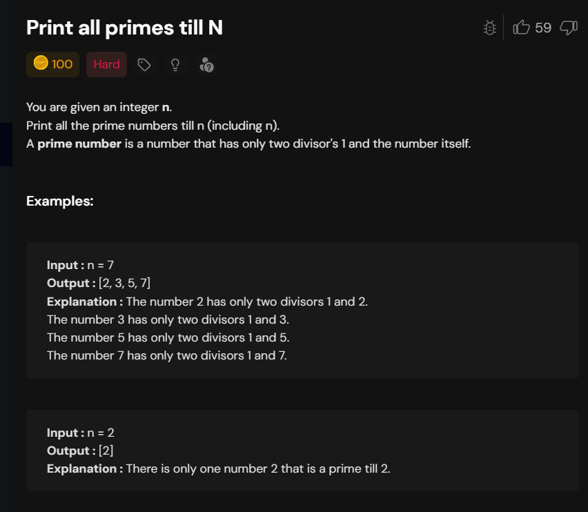
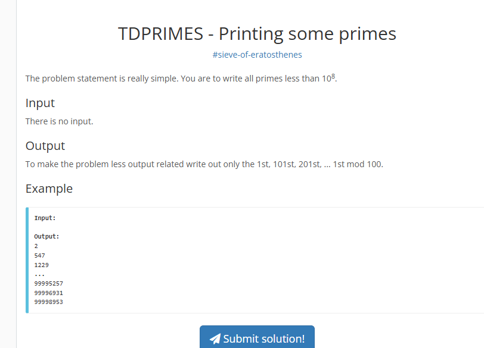

# Notes
## Prime Till N



### Brute 

For each number check isprime or not

```cpp
#include <bits/stdc++.h>
using namespace std;

class Solution {
private:
    bool isPrime(int n) {
        int count = 0;
      
        for(int i = 1; i <= sqrt(n); ++i) {
            if(n % i == 0) {

                count = count + 1;
                if(n / i != i) {
                    count = count + 1;
                }
            }
        }

        if(count == 2) return true;

        return false;
    }
    
public:
    vector<int> primeTillN(int n){
        vector<int> primes;
        for (int i = 2; i <= n; i++) {
            if (isPrime(i)){
                primes.push_back(i);
            }
        }
        return primes;
    }
};

int main() {
    int n = 7;
    
    /* Creating an instance of 
    Solution class */
    Solution sol; 
    
    // Function call to get all primes till N
    vector<int> ans = sol.primeTillN(n);
    
    cout << "All primes till N are: " << endl;
    for(int i=0; i < ans.size(); i++) {
        cout << ans[i] << " ";
    }
    
    return 0;
}

```
### seive

```cpp

class Solution{
    public:
vector<int> primeTillN(int n) {
    vector<bool> isPrime(n + 1, true); 
    isPrime[0] = isPrime[1] = false;

    // Phase 1: Marking
    for(long long i = 2; i * i <= n; i++) {
        if(isPrime[i]) {
            for(long long val = i * i; val <= n; val += i) {
                isPrime[val] = false;
            }
        }
    } 

    // Phase 2: Collecting ALL primes up to n
    vector<int> ans;
    for(int i = 2; i <= n; i++) {
        if(isPrime[i]) ans.push_back(i);
    }
    return ans;
}
};

```

# Proof: Every Composite Number $C$ has a Prime Factor $p \le \sqrt{C}$

The efficiency of the **Sieve of Eratosthenes** is based on this mathematical property, which allows us to stop the marking process once the outer loop reaches $\sqrt{n}$.

---

### The Proof by Contradiction

1.  **Definition of a Composite Number**: Let $C$ be a composite number. By definition, it can be factored into two integers $a$ and $b$ such that $C = a \times b$, where $1 < a \le b < C$.
2.  **The Assumption**: Assume for the sake of contradiction that **both** factors are strictly greater than the square root of $C$:
    * $a > \sqrt{C}$
    * $b > \sqrt{C}$
3.  **The Multiplication**: If we multiply these two inequalities together:
    * $a \times b > \sqrt{C} \times \sqrt{C}$
    * $a \times b > C$
4.  **The Contradiction**: We started with the definition $a \times b = C$, but our assumption led us to $a \times b > C$. This is a mathematical contradiction.
5.  **Conclusion**: At least one of the factors must be less than or equal to $\sqrt{C}$ (i.e., $a \le \sqrt{C}$). Since any factor is either a prime or has prime factors of its own, $C$ must have a prime factor $p$ such that $p \le \sqrt{C}$.

---

### Why This Matters for DSA Interviews

* **Sieve Optimization**: This proof justifies why the outer loop of the sieve only needs to run while $i \times i \le n$.
* **Complete Marking**: By the time $i$ reaches $\sqrt{n}$, every composite number up to $n$ has already been marked by its smallest prime factor.
* **Complexity**: This logic is crucial for maintaining the $O(N \log \log N)$ time complexity required to handle up to $10^5$ queries efficiently.
* **Range Queries**: For range $[L, R]$, this precomputation allows for a **Prefix Sum** array that answers each query in $O(1)$ time.

---

# Optimization: Why the Inner Loop Starts at $i \times i$

In the **Sieve of Eratosthenes**, starting the inner loop at $i^2$ (or $i \times i$) is a critical optimization that prevents redundant operations and ensures each composite number is marked efficiently.

---

### 1. Avoiding Redundant Marking
For any prime number $i$, its multiples are:  
$2i, 3i, 4i, \dots, (i-1)i, i^2, (i+1)i, \dots$

* When the algorithm reaches prime $i$, all multiples of $i$ that are smaller than $i^2$ have **already been marked** as non-prime by primes smaller than $i$.
* **Example for $i = 5$:**
    * $2 \times 5 = 10$: Already marked by prime **2**.
    * $3 \times 5 = 15$: Already marked by prime **3**.
    * $4 \times 5 = 20$: Already marked by prime **2**.
    * The first multiple that has not been "sieved" yet is **$5 \times 5 = 25$**.

---

### 2. Connection to Outer Loop Limit
This optimization explains why the outer loop only needs to run while $i^2 \le n$:
* If $i^2 > n$, the inner loop (starting at $i^2$) would not execute a single time because the starting value already exceeds the limit $n$.
* Once $i$ exceeds $\sqrt{n}$, every composite number in the range has already been marked by at least one of its prime factors.

---

### 3. Impact on Complexity
* **Efficiency:** Starting at $i^2$ significantly reduces the number of inner-loop iterations, especially as $i$ increases.
* **Performance:** It is a key factor in maintaining the **$O(N \log \log N)$** time complexity.
* **Practicality:** This efficiency is necessary to precompute primes up to $10^6$ and answer $10^5$ queries using the **Prefix Sum** method.

---

### Summary for Interviews
> "We start the inner loop at $i^2$ because any multiple $k \times i$ (where $k < i$) would have already been marked by the prime factors of $k$. This avoids redundant work and allows us to handle large constraints like $10^6$ in near-linear time."

---
# Time Complexity Analysis: Sieve of Eratosthenes

The time complexity of the **Sieve of Eratosthenes** is **$O(N \log \log N)$**. While the nested loops might look like $O(N^2)$, the total work is much lower because the inner loop only runs for prime numbers.

---

### 1. The Summation of Work
The total number of operations is determined by how many times we mark numbers as "not prime" in the inner loop:
* For the prime **2**, we perform $N/2$ operations.
* For the prime **3**, we perform $N/3$ operations.
* For the prime **5**, we perform $N/5$ operations.
* This continues for all primes $p$ where $p \le \sqrt{N}$.

The total complexity is the sum of these operations:
$$Total\ Operations = N \times \left( \frac{1}{2} + \frac{1}{3} + \frac{1}{5} + \frac{1}{7} + \dots + \frac{1}{p} \right)$$

---

### 2. Mertens' Second Theorem
In mathematics, the sum of the reciprocals of prime numbers up to $N$ follows a specific growth pattern:
* The series $\sum_{p \le N} \frac{1}{p}$ is approximately equal to $\log(\log N)$.
* By multiplying this by the factor of $N$ from our outer loop, we arrive at the final complexity: **$O(N \log \log N)$**.

---

### 3. Practical Efficiency
The $\log \log N$ factor grows extremely slowly, making the algorithm nearly linear:
* **Slow Growth:** For $N = 10^6$ (the limit for this problem), $\log_2(10^6) \approx 20$, and $\log_2(20) \approx 4.3$.
* **Performance:** This near-linear performance is what makes the Sieve ideal for precomputing primes up to $10^6$ to handle $10^5$ queries.

---

### Summary for Interviews
> "The Sieve of Eratosthenes is $O(N \log \log N)$ because the inner loop runs $N/p$ times only for prime values of $p$. The sum of the reciprocals of primes converges to $\log \log N$, making this algorithm highly efficient for large constraints like $10^6$."

### Optimal

previously after marking prime we pushing into array but here we mark and on that prime number ,if nobody ahs marked that we push to ans


```cpp
class Solution {
public:
    vector<int> primeTillN(int n) {
        vector<bool> isPrime(n+1, true); 
        vector<int> ans;
        for(long long i=2; i <= n; i++) {
            if(isPrime[i]) {
                ans.push_back(i);
                for(long long val = i*i; val <= n; val += i) {
                    isPrime[val] = false;
                }
            }
        }  
        return ans;
    }
};

```




```cpp
//https://www.spoj.com/problems/TDPRIMES/
#include<bits/stdc++.h>
using namespace std;
int size=(int)1e8;
bool seive[(int)1e8];
void fio()
{
    ios_base::sync_with_stdio(0); cin.tie(0); cout.tie(0);
    #ifndef ONLINE_JUDGE
        freopen("input.txt", "r", stdin);
        freopen("output.txt", "w", stdout);
    #endif
}
void seiveSol(){
   memset(seive,true,size);
    seive[0]=seive[1]=false;
    for(int i=2;i*i<=size;i++){
        if(seive[i]==true){
            for(int j=i*i;j<size;j+=i){
                seive[j]=false;
            }
        }
    }
    vector<int>prime;
    int cnt=1;
    for(int i=2;i<size;i++){
        if(seive[i]==true) {
            if(cnt%100==1){
                cout<<i<<endl;
            }
            cnt++;
        }
    }
}

int main(int argc, char const *argv[]) {
    fio();
    seiveSol();
    return 0;
}


```

# Count Primes in Range L to R

---

### Problem Statement
You are given a 2D array `queries` of dimension `n * 2`. Each entry `queries[i]` represents a range from `queries[i][0]` to `queries[i][1]` (inclusive of the endpoints).

Your task is to return an array containing the count of prime numbers present in each given range.

---

### Examples

#### Example 1
**Input:** `queries = [[2, 5], [4, 7]]`  
**Output:** `[3, 2]`  
**Explanation:** * The range 2 to 5 contains three prime numbers: 2, 3, 5.
* The range 4 to 7 contains two prime numbers: 5, 7.

#### Example 2
**Input:** `queries = [[1, 7], [3, 7]]`  
**Output:** `[4, 3]`  
**Explanation:** * The range 1 to 7 contains four prime numbers: 2, 3, 5, 7.
* The range 3 to 7 contains three prime numbers: 3, 5, 7.

---

### Constraints
* $1 \le n \le 10^5$
* $1 \le queries[i][0] \le queries[i][1] \le 10^6$

## Solution

```cpp

class Solution{
     vector<int>isPrime;
    void primeTillN() {
        isPrime[0]=isPrime[1]=0;
        for(long long i=2; i*i < 100001; i++) {
            if(isPrime[i]==1) {
                for(int val = i*i; val < 100001; val += i) {
                    isPrime[val] = 0;
                }
            }
        }  

    }
    void prefixSum(){
        for(int i=1;i<100001;i++){
            isPrime[i]+=isPrime[i-1];
        }
    }
    public:
        vector<int> primesInRange(vector<vector<int>>& queries){
            isPrime.resize(100001, 1); 
            primeTillN();
            prefixSum();
            vector<int> ans;
            for( auto q:queries){
                int l=q[0];
                int r=q[1];
                if (l == 0) ans.push_back(isPrime[r]);
                else ans.push_back(isPrime[r] - isPrime[l - 1]);
            }
            return ans;
        }
};
```
## Bitset seive

```cpp
#include <iostream>
#include <bitset>
#include <vector>

using namespace std;

// Bitset must have a size known at compile time
const int MAX_N = 1000000; 
bitset<MAX_N + 1> isPrime; 

void sieveByBitset() {
    // 1. Initialize: bitset starts with all 0s. 
    // We'll treat 1 as Prime and 0 as Not Prime.
    isPrime.set(); // Sets all bits to 1
    
    isPrime[0] = isPrime[1] = 0; // 0 and 1 are not prime

    for (long long i = 2; i * i <= MAX_N; i++) {
        if (isPrime.test(i)) { // Equivalent to isPrime[i] == 1
            for (long long val = i * i; val <= MAX_N; val += i) {
                isPrime.reset(val); // Sets bit to 0 (Not Prime)
            }
        }
    }
}

int main() {
    sieveByBitset();
    cout << "Is 7 prime? " << isPrime[7] << endl;
    cout << "Is 10 prime? " << isPrime[10] << endl;
}
```
###  Comparison Table

| Feature | `vector<int>` | `vector<bool>` | `std::bitset` |
| :--- | :--- | :--- | :--- |
| **Memory per element** | 32 bits (4 bytes) | ~1 bit (implementation dependent) | **Exactly 1 bit** |
| **Memory for $10^6$** | ~4,000 KB | ~125 KB | **~125 KB** |
| **Speed** | Standard | Slower (due to bit-packing) | **Fastest** |
| **Size flexibility** | Dynamic (Runtime) | Dynamic (Runtime) | **Static (Compile-time)** |

---

### Why use Bitset for "Primes in Range L to R"?

The problem has a limit of $10^6$.
* Using `int isPrime[1000001]` takes **4 MB**.
* Using `bitset<1000001>` takes **125 KB**.

In an interview, if you are asked to handle $10^7$ or $10^8$ range queries, a standard `int` array might hit **Memory Limit Exceeded (MLE)**, while a `bitset` will pass easily.

---

### Summary for an Interviewer

> "I used `std::bitset` to optimize the space complexity. Since we only need a true/false flag, a bitset allows us to store each flag in exactly 1 bit. This makes the sieve significantly more cache-friendly and reduces the memory footprint by 32x compared to a standard integer array."

### Memory Limits and Data Structure Selection

| Data Structure | Size (N) for 256MB Limit | Memory per Element |
| :--- | :--- | :--- |
| `vector<int>` | ~64 Million | 4 Bytes |
| `vector<long long>` | ~32 Million | 8 Bytes |
| `vector<bool>` | ~2 Billion | ~1 Bit |
| `std::bitset<N>` | ~2 Billion | **Exactly 1 Bit** |

---

### When to use `std::bitset`
1. **Size is Fixed:** Known at compile time (e.g., `const int MAX = 1e6`).
2. **Global Declaration:** Always declare large bitsets globally to avoid **Stack Overflow**.
3. **Speed:** Bitset is significantly faster for operations like counting set bits (`.count()`) or checking if any bits are set (`.any()`).
4. **Cache Efficiency:** Its compact nature makes it highly cache-friendly for algorithms like the Sieve.


### Key Constraints for `bitset` vs `vector`

* **Static vs. Dynamic Allocation:**
    * `bitset<1000000> b;` declared inside a function is stored on the **Stack**. Since the stack is usually limited (often 1MB to 8MB depending on the system), declaring a massive bitset locally will likely cause a **Stack Overflow**.
    * **The Fix:** Always declare large bitsets as **global variables** or use the `static` keyword. This moves the data to the **Data Segment**, which has a much larger capacity than the stack.

* **Runtime Input:**
    * A `std::bitset` requires its size to be a `constexpr` (known at compile time). If the size $N$ is provided by the user at runtime (e.g., `cin >> n;`), you **cannot** use `std::bitset`.
    * **The Fix:** In cases where the size is dynamic, you must use `vector<bool>` or `boost::dynamic_bitset`.

---

### Summary for an Interviewer

> "While `std::bitset` is highly efficient, it has two main constraints: it requires a compile-time constant for its size, and it is stack-allocated by default. To safely use a large bitset for a Sieve, I declare it globally to avoid stack overflow and ensure the size is predefined based on the problem's maximum constraints."

# Bitset operations

```cpp
#include <iostream>
#include <bitset>
#include <string>

using namespace std;

int main() {
    // 1. Initialization
    // Size must be a compile-time constant
    bitset<8> b1;               // [0,0,0,0,0,0,0,0] - initialized to 0s
    bitset<8> b2(42);           // [0,0,1,0,1,0,1,0] - from integer
    bitset<8> b3("1100");       // [0,0,0,0,1,1,0,0] - from string (starts from right)

    cout << "Initial b2 (42): " << b2 << endl;

    // 2. Individual Bit Manipulation
    b1[0] = 1;                  // Set bit at index 0 using array notation
    b1.set(1);                  // Set bit at index 1 to 1
    b1.set(2, 0);               // Set bit at index 2 to 0
    b1.reset(1);                // Reset bit at index 1 to 0
    b1.flip(7);                 // Toggle bit at index 7

    cout << "Modified b1: " << b1 << endl;

    // 3. Status Checks
    cout << "Is any bit set in b2? " << b2.any() << endl;
    cout << "Are all bits set in b2? " << b2.all() << endl;
    cout << "Are no bits set in b2? " << b2.none() << endl;
    cout << "How many bits are set? " << b2.count() << endl;
    cout << "Value of bit at index 3: " << b2.test(3) << endl; // Safe access with range check

    // 4. Bulk Operations
    b1.set();                   // Sets ALL bits to 1
    b1.reset();                 // Sets ALL bits to 0
    b1.flip();                  // Flips ALL bits

    // 5. Bitwise Operations (Works like integers)
    bitset<8> mask1("11110000");
    bitset<8> mask2("10101010");

    cout << "AND: " << (mask1 & mask2) << endl;
    cout << "OR:  " << (mask1 | mask2) << endl;
    cout << "XOR: " << (mask1 ^ mask2) << endl;
    cout << "NOT: " << (~mask1) << endl;
    cout << "Shift Left: " << (mask1 << 2) << endl;

    // 6. Conversion
    unsigned long ulongVal = b2.to_ulong();
    string strVal = b2.to_string();
    
    cout << "As Ulong: " << ulongVal << endl;
    cout << "As String: " << strVal << endl;

    // 7. Large Bitset Example (Global/Static Segment)
    static bitset<1000000> largeSieve; // 1 million bits
    largeSieve.set();
    cout << "Large Bitset size in bytes: " << sizeof(largeSieve) << " bytes" << endl;

    return 0;
}
```
If you want to find primes up to $10^6$ (1 million), the standard Sieve is perfect. But what if you want primes up to $10^9$ or $10^{12}$?

1. The "Memory Wall" Problem

    - The standard Sieve requires a boolean array of size $N$.To find primes up to $10^9$, you need an array of size $10^9$.That’s roughly 1 GB of RAM just for one array.
    
    - If you go up to $10^{12}$, you’d need 1,000 GB (1 Terabyte) of RAM.Most computers (and competitive programming judges) will crash because they only give you about 256MB or 512MB of memory.
    
2. The "Cache Miss" Problem (Speed)

    - Even if you had enough RAM, the standard Sieve is slow on large numbers because it jumps all over the memory.To mark multiples of 2, you jump to index 2, 4, 6, 8...To mark multiples of 17, you jump to 17, 34, 51...
    
    - When the array is huge, the CPU has to keep fetching data from the slow RAM instead of its fast "Cache." This makes the program crawl.

3. The "Segmented" Solution: 

    The "Window" IntuitionInstead of making one massive $10^9$ array, the Segmented Sieve says: "Let's only look at a small window (segment) at a time."

# Segmented seive

# The Segmented Sieve Algorithm (Range: L to R)

The **Segmented Sieve** is a memory-efficient way to find all prime numbers in a specific range $[L, R]$. It is the only practical way to handle ranges where $R$ is very large (e.g., $10^{12}$), even if the gap between $L$ and $R$ is small.

---

### Phase 1: Preparation (The Marking Tools)

1.  **Determine the Limit**: To find primes up to $R$, we only need to know the prime "markers" up to $\sqrt{R}$. 
    * *Example*: If $R = 10^6$, we only need primes up to $1,000$.
2.  **Generate Base Primes**: Run a standard **Sieve of Eratosthenes** to find all prime numbers from $2$ up to $\sqrt{R}$. Store these in a list (e.g., `base_primes`).

---

### Phase 2: Setting up the Window

3.  **Create the Segment Array**: Create a boolean array (often called `isPrime`) of size **$(R - L + 1)$**. 
    * Initialize every value in this array to `true`.
4.  **Offset Indexing (The Mapping)**: Since we can't have an index like `isPrime[1,000,000,000]`, we use a shift.
    * Number $L$ maps to `isPrime[0]`
    * Number $L+1$ maps to `isPrime[1]`
    * Any number $X$ maps to `isPrime[X - L]`

---

### Phase 3: The "Striking Out" Process

5.  **Iterate through Base Primes**: For every prime $p$ in your `base_primes` list:
    
    * **Find the First Multiple**: Calculate the first number inside your range $[L, R]$ that is a multiple of $p$.
        * Logic: Start with `(L / p) * p`. If that is less than $L$, add $p$.
    * **The Safety Frontier**: Ensure you don't accidentally mark $p$ itself as non-prime. 
        * Logic: Start marking from the larger of `p * p` or your `first_multiple`.
    * **Mark the Multiples**: Jump through the segment in steps of $p$ (i.e., $j = j + p$) and set `isPrime[j - L] = false`.

---

### Phase 4: Collection

6.  **Special Case (1)**: If your range includes the number $1$, explicitly mark `isPrime[1 - L]` as `false` because 1 is not prime.
7.  **Output**: Iterate through your `isPrime` array. If `isPrime[i]` is still `true`, the number **$(i + L)$** is a prime number.

---

### Why This Logic Works (Summary)

* **Filter Logic**: Any composite number in $[L, R]$ must have at least one prime factor $\le \sqrt{R}$. Since we use all such primes to mark the range, no composite number can "hide."
* **Memory Logic**: By only creating an array for the gap $(R - L)$, we stay within the CPU's memory limits, regardless of how large the actual numbers are.
* **Speed Logic**: Because the segment is small, it fits in the CPU's fast cache, making the "jumps" much faster than a standard large-scale sieve.


# Finding the First Multiple: The "Frog and the Wall" Logic

To start "striking out" numbers in a Segmented Sieve, we need to find exactly where our prime starts its work within the range $[L, R]$.

---

### 1. The Goal
We need to find the very first number $X$ such that:
* **$X$ is a multiple of $p$** (The frog lands there).
* **$X \ge L$** (It is inside your target section).

---

### 2. "Human" Logic vs. "Computer" Logic
**Example**: Range $[32, 50]$ and prime $p = 5$.

* **Human Way**: You count by 5s: $5, 10, 15, 20, 25, 30, \mathbf{35!}$ You found it.
* **Computer Way (The Formula)**:
    1.  `32 / 5 = 6`: Integer division drops the remainder. This tells the computer: *"5 has finished 6 full jumps before or at 32."*
    2.  `6 * 5 = 30`: This is the **last spot** the frog landed before your range.
    3.  **The Check**: Since $30 < 32$, the frog's **next** jump must be the one we need.
    4.  `30 + 5 = 35`: This is our starting point.

---

### 3. Why `(L / p) * p` Works (The "Grid" Secret)
Imagine the number line is a grid of tiles, each of size $p$.

* When you do `L / p`, you are asking: *"How many full tiles fit between 0 and L?"*
* When you multiply back by `p`, you are asking: *"Give me the coordinate of the end of the last full tile."*

**The Result**: This coordinate will **ALWAYS** be $\le L$.
* If $L$ is a multiple (e.g., $L=35, p=5$), then `(35/5)*5 = 35`. You are already at the start!
* If $L$ is NOT a multiple (e.g., $L=32, p=5$), then `(32/5)*5 = 30`. You are just a little bit behind the start.

---

### 4. Visualizing the "Jump" into the Range
Imagine $L$ is a wall. We need to find the first landing spot past that wall.

### 5. Why do we need this?

- In a Segmented Sieve, our memory "bucket" (array) only exists for the range $[L, R]$.

- If we tried to mark "30" in our array, the computer would crash or error out because our array only starts at 32.By calculating 35, we can tell the computer: "Go to index 35 - 32 (Index 3) and mark it as NOT prime."
    

## Myversion

```cpp

#include<bits/stdc++.h>
using namespace std;
int size=(int)1e5;
bool seive[(int)1e5];
void fio()
{
    ios_base::sync_with_stdio(0); cin.tie(0); cout.tie(0);
    #ifndef ONLINE_JUDGE
        freopen("input.txt", "r", stdin);
        freopen("output.txt", "w", stdout);
    #endif
}
vector<int>prime;
void seiveSol(){
   memset(seive,true,size);
    seive[0]=seive[1]=false;
    for(int i=2;i*i<=size;i++){
        if(seive[i]==true){
            for(int j=i*i;j<size;j+=i){
                seive[j]=false;
            }
        }
    }

    for(int i=2;i<size;i++){
        if(seive[i]==true) {
           prime.push_back(i);
        }
    }
}
void segmentedSeive(int m,int n){
    bool dummy[n-m+1];
    memset(dummy,true,n-m+1);
    if(m==1) dummy[0]=false;
    for(auto pr:prime){
        int firstMultiple=(m/pr)*pr;
        if(firstMultiple<m) firstMultiple+=pr;
        firstMultiple=max(firstMultiple,pr*pr);
        if(firstMultiple>n) break;
        for(int i=firstMultiple;i<=n;i+=pr){
            if(dummy[i-m]==true) dummy[i-m]=false;
        }
    }
    for(int i=m;i<=n;i++){
        if(dummy[i-m]==true){
            cout<<i<<endl;
        }
    }
}
void solve(){
    int tc;
    cin>>tc;
    seiveSol();
    for(int t=0;t<tc;t++){
        int l,r;
        cin>>l>>r;
        segmentedSeive(l,r);
        cout<<endl;
    }
}

int main(int argc, char const *argv[]) {
    fio();
    solve();
    return 0;
}

```


### Bugs 

### 1. The `firstMultiple` Logic Fix
Your current logic:
```cpp
firstMultiple = max(firstMultiple, pr * pr);
```
While pr * pr is a great optimization for the Simple Sieve, in the Segmented Sieve, it can cause an integer overflow if pr is around $10^6$ (because $10^6 \times 10^6 = 10^{12}$, which exceeds the capacity of a 32-bit int).

Better way:Only start at pr * pr if $pr \times pr \le n$. Otherwise, you might overflow or skip the range entirely. Also, ensure you use long long for all calculations involving numbers up to $10^{12}$ to avoid wrapping around.


2. Variable Length Arrays (VLA)
```C++
bool dummy[n - m + 1]; // Potential Stack Overflow
```

In C++, declaring a large array inside a function puts it on the Stack. The stack is a very limited memory region (usually 1MB to 8MB). If $n - m + 1$ is $10^6$, this takes significant space; if you have multiple recursive calls or even tighter limits, your program will crash.The Fix: Use vector<bool> dummy(n - m + 1, true);. This stores the data on the Heap, which is much larger and safer for arrays of this size.

### Why `vector<bool>` is safer than `bool dummy[N]`

1.  **Memory Location (Heap vs. Stack)**: 
    * Standard arrays are allocated on the **Stack**, which is very small (usually 1MB–8MB). Large sieves will cause a **Stack Overflow**.
    * `vector` data is stored on the **Heap**, which can handle hundreds of megabytes safely.

2.  **Bit-Packing Optimization**: 
    * C++ optimizes `vector<bool>` to use only **1 bit per element**. 
    * A standard `bool` array uses **8 bits (1 byte) per element**. 
    * This makes `vector<bool>` **8 times more memory-efficient**, allowing you to handle much larger ranges within the same memory limit.

3.  **Dynamic Sizing**: 
    * Standard C++ does not officially support Variable Length Arrays (VLAs) like `bool arr[n]`. Using them is "undefined behavior" in many compilers. 
    * `vector` is the official, safe way to handle arrays where the size is only known at runtime.

3. The memset Size Bug

```C++
memset(seive, true, size); 
```
memset works on bytes, not elements. It fills each byte of memory with the specified value. Since a bool in C++ is typically 1 byte, this happens to work in your specific case. However, if you ever changed seive to an int array (where an int is 4 bytes), memset would fill each individual byte of the integer, resulting in a corrupted value like 16843009 instead of 1.

Better way: Use fill(seive, seive + size, true); or seive.assign(size, true);. these are type-safe and work correctly regardless of the data type.

### Why `resize()` is not a substitute for `fill()` or `assign()`

* **The Problem:** `vector::resize(n, value)` only applies the `value` to **newly** added elements. If the vector is already size `n` or larger, the existing elements remain unchanged.
* **The Risk:** In a Sieve implementation used across multiple test cases, `resize()` will fail to reset previous "false" (not prime) entries back to "true".

**Correct Alternatives:**
1.  **`v.assign(size, true)`**: Resizes the vector AND sets every single element to `true`. This is the most robust method for vectors.
2.  **`fill(v.begin(), v.end(), true)`**: Leaves the size as is but overwrites every current element with `true`.
3.  **`v = vector<bool>(size, true)`**: Creates a brand new vector and replaces the old one (clean but slightly more overhead).

## Ai version

```cpp
#include <bits/stdc++.h>
using namespace std;

// Use long long for ranges up to 10^12
typedef long long ll;

const int MAX_SQRT = 100001; 
bool sieve[MAX_SQRT];
vector<int> primes;

void sieveSol() {
    fill(sieve, sieve + MAX_SQRT, true);
    sieve[0] = sieve[1] = false;
    for (ll i = 2; i * i < MAX_SQRT; i++) {
        if (sieve[i]) {
            for (ll j = i * i; j < MAX_SQRT; j += i)
                sieve[j] = false;
        }
    }
    for (int i = 2; i < MAX_SQRT; i++) {
        if (sieve[i]) primes.push_back(i);
    }
}

void segmentedSieve(ll m, ll n) {
    // Use vector to allocate on HEAP, not stack
    vector<bool> dummy(n - m + 1, true);
    
    if (m == 1) dummy[0] = false;

    for (int pr : primes) {
        // Optimization: if pr*pr > n, no more multiples to mark
        if ((ll)pr * pr > n) break;

        // Find first multiple of pr >= m
        ll firstMultiple = (m / pr) * pr;
        if (firstMultiple < m) firstMultiple += pr;

        // Ensure we don't mark the prime itself
        // (e.g., if m=2, pr=2, don't mark 2 as false)
        for (ll j = max((ll)pr * pr, firstMultiple); j <= n; j += pr) {
            dummy[j - m] = false;
        }
    }

    for (ll i = m; i <= n; i++) {
        if (dummy[i - m]) cout << i << "\n";
    }
}

void solve() {
    sieveSol(); // Precompute primes once
    int tc;
    if (!(cin >> tc)) return;
    while (tc--) {
        ll l, r;
        cin >> l >> r;
        segmentedSieve(l, r);
        if (tc > 0) cout << "\n";
    }
}

int main() {
    ios_base::sync_with_stdio(0); cin.tie(0);
    solve();
    return 0;
}
```


# The Safety Switch: max(p * p, firstMultiple)

This logic acts as a physical "hand-off" point in the algorithm, handling two different scenarios based on where your range $[L, R]$ sits on the number line.

---

### 1. Scenario A: The "Early" Range ($L$ is small)
Imagine $p = 7$, which means $p^2 = 49$.
If your range is **$[10, 100]$**:
* The first multiple of $7$ in the range is **14**.
* But the prime $7$ itself is actually *behind* your range.
* In this case, $p^2$ (49) is much larger than the first multiple (14).
* **Logic**: We start striking out at **49**.
* **Why?** Because 14, 21, 28, 35, and 42 would have already been marked by smaller primes (like 2 and 3). Starting at $p^2$ is the most efficient way to avoid "re-marking" what is already "dead."

---

### 2. Scenario B: The "Deep" Range ($L$ is large)
Imagine $p = 7$ ($p^2 = 49$), but your range is now **$[1000, 2000]$**.
* The first multiple of $7$ in the range is **1001** (since $1001 / 7 = 143$).
* Now, $1001$ is much larger than $p^2$ (49).
* **Logic**: `max(49, 1001)` is **1001**.
* **Why?** Because the "frog" (7) has already jumped way past its square. We need to start striking out at the very first spot it lands inside our specific window.

---

### 3. The "Why" behind the `max()`

| If... | `max()` picks... | Because... |
| :--- | :--- | :--- |
| **$L < p^2$** | **$p^2$** | We don't want to waste time marking numbers that smaller primes already handled. |
| **$L > p^2$** | **First Multiple** | The prime has already "matured" past its square, so we just start at the first available landing spot in our window. |

---

### 4. Summary for your Notes

**The Safety Switch: `max(p * p, firstMultiple)`**

This logic serves two critical purposes:
1.  **Efficiency**: For small $L$, it skips multiples of $p$ that have already been marked by primes smaller than $p$ (Optimization).
2.  **Correctness**: It prevents the algorithm from accidentally marking $p$ as "not prime" if $p$ happens to be the first multiple inside the range.

**Key Rule**: 
As $L$ gets larger (moving deeper into the number line), the `firstMultiple` will always eventually take over as the maximum.


# The "Prime Itself Trap"

The **"Prime Itself Trap"** is a classic logic error in Sieve algorithms. It occurs when your "striking out" logic is too simple, causing the algorithm to accidentally label a prime number as non-prime.

---

### 1. How the Trap Happens
Imagine your prime "marker" is **$p = 7$**.
If you are processing a range that starts at **$L = 5$**, a basic "first multiple" calculation would look like this:

1.  `(5 / 7) * 7 = 0`
2.  Since $0 < 5$, we add $p$: `0 + 7 = 7`.
3.  The computer concludes: *"The first multiple of 7 in this range is 7."*

**The Trap has sprung**: If your loop starts at **7** and marks it as `false`, you have just told the program that **7 is not a prime number.**

---

### 2. The Solution: The "Frontier" Rule
To avoid this trap, we use a fundamental property of numbers: **A prime $p$ only needs to start marking at its square ($p^2$).**

* For **$p = 7$**, it should never mark anything smaller than **49**.
* **Why?** Because any composite number smaller than 49 that is a multiple of 7 (like 14, 21, 28, 35, or 42) has at least one prime factor smaller than 7 (like 2, 3, or 5).
* Those smaller primes would have already "killed" those numbers before 7 ever got the chance.

---

### 3. The "Fix" in Code
By using `max(p * p, firstMultiple)`, we ensure the loop **always** starts at a composite number, leaving the prime $p$ safely marked as `true`.

| Scenario | `max(p*p, firstMultiple)` | Result |
| :--- | :--- | :--- |
| **Prime is inside range** | `max(49, 7)` | Starts at **49**. Prime 7 is saved. |
| **Prime is far behind range** | `max(49, 1001)` | Starts at **1001**. Standard marking. |

---

### Summary for your Notes

* **The Danger**: Basic math can point to the prime $p$ as its own "first multiple."
* **The Rule**: $p^2$ is the "Frontier"—the first place where $p$ is the smallest prime factor.
* **The Outcome**: Using $p^2$ as a lower bound protects the prime number from being struck out and optimizes the code by skipping numbers already handled by smaller primes.

# Complexity Analysis: Segmented Sieve

The Segmented Sieve is designed to find primes in the range $[L, R]$. Let $N$ be the value of $R$, and $\Delta$ be the range size $(R - L + 1)$.

### 1. Time Complexity
The total time complexity is effectively the same as the standard Sieve of Eratosthenes: 
**$O(N \log \log N)$**

**Why?**
* **Phase 1 (Base Primes)**: Finding primes up to $\sqrt{N}$ takes $O(\sqrt{N} \log \log \sqrt{N})$. This is negligible as $N$ grows.
* **Phase 2 (Marking the Segment)**: Each prime $p$ marks its multiples in the range $\Delta$. Across all segments, the total number of "marking" operations is the same as a single large sieve.

    The Marking Phase (The "Big" Part)
 
    This is why the total time is still $O(N \log \log N)$. 
    
    - Even if we break the range into segments, we still have to "strike out" the multiples across the entire distance from $1$ to $N$.
    
    - The number of times we "strike out" multiples of 2 is $N/2$.The number of times we "strike out" multiples of 3 is $N/3$.The sum of this harmonic series $(N/2 + N/3 + N/5 + \dots)$ is what leads to the $O(N \log \log N)$ result.Segmenting doesn't reduce the number of "strikes" we make; it just changes where we store the array while we do it.

* **Real-World Performance**: Even though the "Big O" is the same, Segmented Sieve is often **faster** in practice because it has high **Cache Locality**. Since the segment is small, it stays in the CPU's fast cache (L1/L2) instead of the slow RAM.

---

### 2. Space Complexity
This is where the Segmented Sieve wins.
**$O(\sqrt{N} + \Delta)$**

**Breakdown**:
1. **$O(\sqrt{N})$**: Needed to store the "base primes" (the marking tools) used to strike out numbers.
2. **$O(\Delta)$**: The size of the current window/segment we are processing.

**Comparison**:
* **Standard Sieve**: $O(N)$ space. To find primes up to $10^{12}$, you need **1 Terabyte** of RAM.
* **Segmented Sieve**: If $\Delta = 10^6$ (a common segment size), you only need about **1 Megabyte** of RAM.

---

### 3. Summary for Interviews

| Metric | Standard Sieve | Segmented Sieve | Winner |
| :--- | :--- | :--- | :--- |
| **Time** | $O(N \log \log N)$ | $O(N \log \log N)$ | **Segmented** (due to Cache) |
| **Space** | $O(N)$ | $O(\sqrt{N} + \Delta)$ | **Segmented** (by far) |
| **Use Case** | Small $N$ ($< 10^7$) | Large $R$, or range $[L, R]$ | **Segmented** |

**The "Senior" Conclusion**: 
The Segmented Sieve doesn't reduce the *number of operations* (Time); it reduces the *memory footprint* (Space) and optimizes how the CPU accesses that memory.

# Q Prime Factorisation of a Number

**Problem Statement:**
Given an array of integers `queries`, your task is to find the prime factorisation for each number in the array. 

For each query $n$, return a list of its prime factors in non-descending order. If a prime factor divides $n$ multiple times, it should appear in the list that many times.

---

### Examples

**Example 1:**
* **Input:** `queries = [12, 31, 48]`
* **Output:** `[[2, 2, 3], [31], [2, 2, 2, 2, 3]]`
* **Explanation:**
    * $12 = 2 \times 2 \times 3$
    * $31$ is a prime number, so its only factor is $31$.
    * $48 = 2 \times 2 \times 2 \times 2 \times 3$

**Example 2:**
* **Input:** `queries = [100, 35]`
* **Output:** `[[2, 2, 5, 5], [5, 7]]`
* **Explanation:**
    * $100 = 2 \times 2 \times 5 \times 5$
    * $35 = 5 \times 7$

---

### Constraints
* $1 \le \text{queries.length} \le 10^5$
* $2 \le \text{queries[i]} \le 10^5$

---

### Optimal Strategy Summary

1.  **Sieve Precomputation**: Since there are up to $10^5$ queries, calculating prime factors for each number from scratch ($O(\sqrt{N})$) would be too slow ($10^5 \times 316 \approx 3 \times 10^7$ operations). 
2.  **Smallest Prime Factor (SPF)**: Instead, use a modified Sieve of Eratosthenes to store the smallest prime factor for every number up to $10^5$ in an array.
3.  **Fast Queries**: For each query, "hop" through the SPF array to find all factors in $O(\log N)$ time. Total complexity becomes $O(N \log \log N)$ for the sieve + $O(Q \log N)$ for queries, which easily passes within the time limit.


```cpp
class Solution{
    vector<int> firstPrime;
    void seive() { 
        for(int i = 0; i <= 100000; i++) firstPrime[i] = i;
        for(long long i=2; i < 100001; i++) {
            if(firstPrime[i]==i) {
                for(long long val = i*i; val < 100001; val += i) {
                    if(firstPrime[val]==val){//as need to update only first prime
                        firstPrime[val]=i;
                    }
                }
            }
        }  
       
    }

    public:
        vector<vector<int>> primeFactors(vector<int>& queries){
            vector<vector<int>>res;
            firstPrime.assign(100001, 1);
            seive();
            for(int q:queries){
                vector<int>tres;
                int val=q;
                while(firstPrime[val]!=1){
                    tres.push_back(firstPrime[val]);
                    val=val/firstPrime[val];
                }
                res.push_back(tres);
            }
            return res;
        }
};
```

doing this `vector<int> firstPrime(100001, 1);` at global is wrong do not do this

### Complexity Analysis
#### Time Complexity
O(N*log(logN) + Q*logN) explanation: The seive function has a time complexity of O(N*log(logN)) where N is 100001, due to the harmonic series of primes. The primeFactors function iterates through the queries, and for each query 'q', it performs prime factorization by repeatedly dividing 'q' by its smallest prime factor. In the worst case, a number 'q' can have up to O(log q) prime factors. Since 'q' is at most 100001, this is O(logN). If there are 'Q' queries, the total time for this part is O(Q*logN). Therefore, the overall time complexity is O(N*log(logN) + Q*logN).
#### Space Complexity
O(N) explanation: The firstPrime vector is initialized with a size of 100001, which takes O(N) space where N is 100001. The result vector 'res' can store prime factors for each query. In the worst case, a query 'q' can have O(log q) prime factors. If there are 'Q' queries, the space complexity for storing results can be up to O(Q*logN). However, if we consider the auxiliary space used by the algorithm (excluding the output storage), it's dominated by the 'firstPrime' vector. Thus, the space complexity is O(N).

To make this "interview-perfect" and ensure it passes the tight time limits (usually 1-2 seconds for $10^5$ queries), we need to address three things: Precomputation, I/O Speed, and Memory Efficiency.

```cpp
#include <vector>
#include <algorithm>

using namespace std;

// Using a constant for the maximum limit as per constraints
const int MAXN = 100001;

class Solution {
    // Declaring SPF array and a flag to ensure sieve runs only once
    // We use a static vector or a global array to persist across test cases
    static int spf[MAXN];
    static bool isComputed;

    void sieve() {
        if (isComputed) return;

        // Step 1: Initialize every number as its own smallest prime factor
        for (int i = 1; i < MAXN; i++) {
            spf[i] = i;
        }

        // Step 2: Standard Sieve logic to fill SPF
        // We only need to go up to sqrt(MAXN) for the outer loop
        for (long long i = 2; i * i < MAXN; i++) {
            if (spf[i] == i) { // i is prime
                for (long long j = i * i; j < MAXN; j += i) {
                    // Update only if it's still pointing to itself
                    // This ensures we store the SMALLEST prime factor
                    if (spf[j] == j) {
                        spf[j] = (int)i;
                    }
                }
            }
        }
        isComputed = true;
    }

public:
    vector<vector<int>> primeFactors(vector<int>& queries) {
        // Precompute the DNA map once
        sieve();

        vector<vector<int>> result;
        result.reserve(queries.size()); // Optimization: Pre-allocate memory

        for (int n : queries) {
            vector<int> factors;
            
            // Step 3: Fast Factorization using SPF hops
            // Complexity: O(log N) per query
            while (n > 1) {
                factors.push_back(spf[n]);
                n /= spf[n];
            }
            
            result.push_back(factors);
        }

        return result;
    }
};

// Initialize static members
int Solution::spf[MAXN];
bool Solution::isComputed = false;
```


# Why This Code is "Optimal"

The Smallest Prime Factor (SPF) approach is considered the gold standard for handling multiple prime factorization queries. Here is the technical breakdown of why this specific implementation is optimal:

---

### 1. The `static` Sieve (Global Precomputation)
Platforms like **TUF+, LeetCode, or Codeforces** often run multiple test cases against the same class instance or create new instances for each test case.
* **The Logic**: By making `spf` and `isComputed` **static**, the $O(N \log \log N)$ work happens **exactly once** for the entire duration of the program.
* **The Impact**: Every subsequent query across different test cases starts with a fully populated "DNA Map," reducing the cost of all future factorizations to nearly zero.

### 2. Memory Pre-allocation with `reserve()`
When dealing with $10^5$ queries, the `vector<vector<int>>` would normally reallocate memory multiple times as it grows, which is a slow process involving copying existing data to new memory locations.
* **The Logic**: `result.reserve(queries.size())` tells the computer exactly how much space is needed upfront.
* **The Impact**: This prevents unnecessary memory reallocations and copies, significantly speeding up the execution time for large input sizes.

### 3. The `spf[j] == j` Check (Smallest Factor Guarantee)
This is known as the **"First Visit Rule."** * **The Logic**: In the sieve, we only update `spf[j]` if it is still pointing to itself. 
* **Example**: For the number $30$, the prime $2$ will hit it first and set `spf[30] = 2`. Later, when primes $3$ or $5$ visit $30$, the check `if (spf[j] == j)` will fail.
* **The Impact**: This ensures that we **always** store the smallest prime factor, which is required to extract factors in non-descending order efficiently.

### 4. $O(\log N)$ Query Time
Because the SPF array tells you exactly which prime to divide by next, you don't have to "search" for factors.
* **The Logic**: You "hop" from one factor to the next. Since any number $N$ can have at most $\log_2 N$ prime factors, the factorization is incredibly fast.
* **The Impact**: For $N = 10^5$, you find all factors in roughly **16 or 17 steps**, compared to **316 steps** in the $O(\sqrt{N})$ approach.

---

### Complexity Breakdown

| Complexity | Notation | Explanation |
| :--- | :--- | :--- |
| **Time (Precomputation)** | $O(MAXN \log \log MAXN)$ | Spent once to build the SPF map using the Sieve. |
| **Time (Queries)** | $O(Q \log N)$ | Each of the $Q$ queries is answered in logarithmic time. |
| **Space** | $O(MAXN)$ | Used to store the SPF array for all numbers up to the limit. |

---

# Finding the Total Number of Divisors (NOD)

Using the **Smallest Prime Factor (SPF)** array, we can calculate the total number of divisors for any number $N$ in $O(\log N)$ time.

### The Formula
If the prime factorization is $p_1^{a} \cdot p_2^{b} \cdot p_3^{c}$, then:
**$\text{Number of Divisors} = (a+1)(b+1)(c+1)$**

### The Logic
1.  **Identify the Prime**: Use `spf[n]` to find the smallest prime factor $p$.
2.  **Find the Power**: Count how many times $p$ divides $N$ consecutively. This gives you the exponent (power).
3.  **Update the Product**: Multiply your running total by `(power + 1)`.
4.  **Repeat**: Continue until $N = 1$.

### Example: $N = 12$
* `spf[12] = 2`.
* Divide 12 by 2 twice $\to$ **Power = 2**. ($N$ becomes 3).
* `spf[3] = 3`.
* Divide 3 by 3 once $\to$ **Power = 1**. ($N$ becomes 1).
* **Result**: $(2+1) \times (1+1) = 3 \times 2 = \mathbf{6}$.
* *(Verification: Divisors of 12 are 1, 2, 3, 4, 6, 12. Total = 6).*

### Why this is "Interview Gold"
This demonstrates you can combine **Number Theory** (Sieve/Factorization) with **Combinatorics** (Counting principles) to solve complex math queries instantly.

```cpp
int countTotalDivisors(int n) {
    int totalDivisors = 1;

    while (n > 1) {
        int p = spf[n]; // Get smallest prime factor
        int count = 0;

        // "Exhaust" this prime to find its power
        while (n % p == 0) {
            count++;
            n /= p;
        }

        // Apply the (power + 1) formula
        totalDivisors *= (count + 1);
    }

    return totalDivisors;
}
```