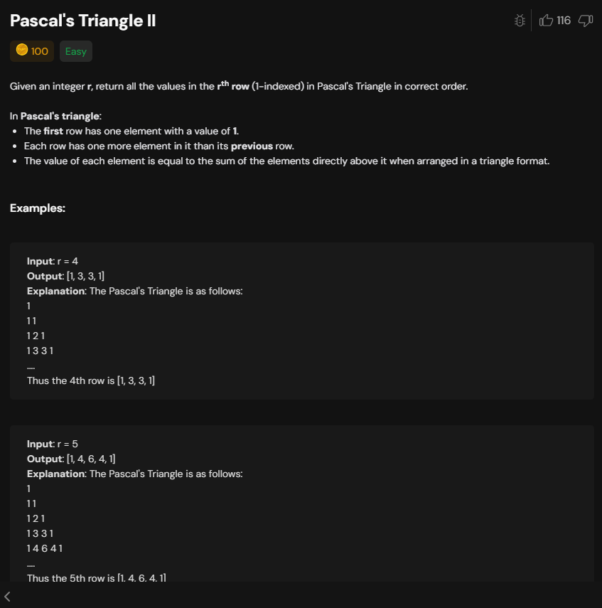
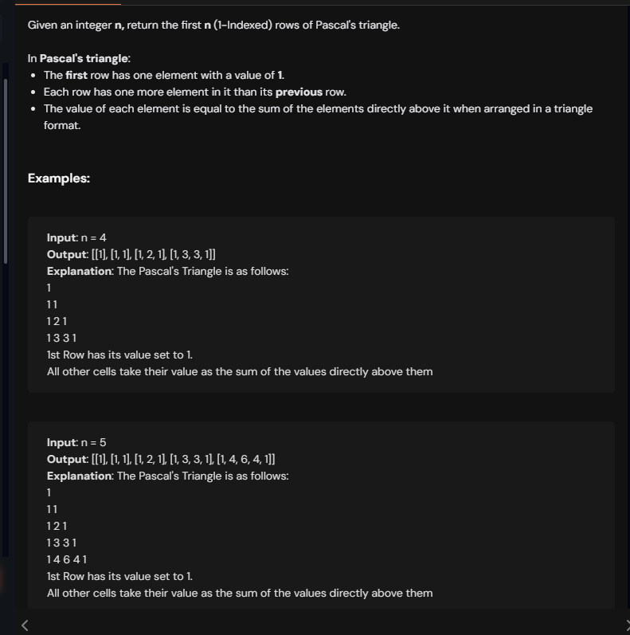

# Notes

Simple property of nCr we are going to use

nC0=nCn=1 we know

nCr=((n-r+1)*nC(r-1))/r;


We know nCr=nC(n-r) 

so for a r we can use either r or (n-r) whichever is smaller.

```cpp
class Solution {
  int nCr(int n ,int r){
    int res=1;
    r=min(r,n-r);
    for(int i=1;i<=r;i++){
      res= (res*(n-i+1))/i;
    }
    return res;
  }
public:
    int pascalTriangleI(int r, int c) {
        if(r==c) return 1;
        return nCr(r-1,c-1);
    }
};
```
tc --> O(r)




Just need to genearate whole row.

```cpp
class Solution {
 vector<int> nCr(int n ){
    int res=1;
    vector<int>resArr(1,1);
    for(int i=1;i<=n;i++){
      res= (res*(n-i+1))/i;
      resArr.push_back(res);
    }

    return resArr;
  }
public:
    vector<int> pascalTriangleII(int r) {
        return nCr(r-1);
    }
};
```



Need to generate whole triangle 

```cpp

class Solution {
   vector<int> nCr(int n ){
    int res=1;
    vector<int>resArr(1,1);
    for(int i=1;i<=n;i++){
      res= (res*(n-i+1))/i;
      resArr.push_back(res);
    }

    return resArr;
  }
public:
    vector<vector<int>> pascalTriangleIII(int n) {
        vector<vector<int>> res;
        for(int i=0;i<n;i++){
          vector<int> tres=nCr(i);
          res.push_back(tres);
        }
        return res;
    }
};

```
One more way is this 

```cpp

class Solution {

public:
    vector<vector<int>> pascalTriangleIII(int n) {
        vector<vector<int>> res;
        int size=2;
        for(int i=1;i<=n;i++){
          if(i==1) res.push_back({1});
          else {
            vector<int>v(size,0);
            v[0]=1;
            v[size-1]=1;
            int n=res.size();
            for(int j=1;j<size-1;j++){
                v[j]=res[n-1][j]+res[n-1][j-1];
            }
            res.push_back(v);
            size++;
          }
        }
        return res;
    }
};
```

Using sum of above row


