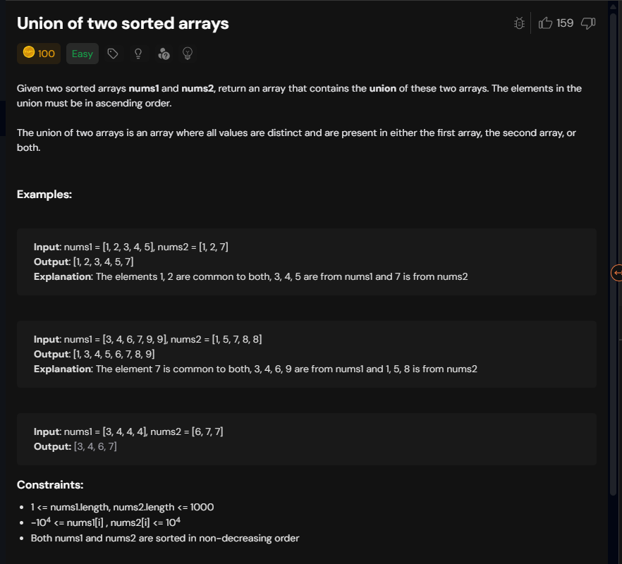
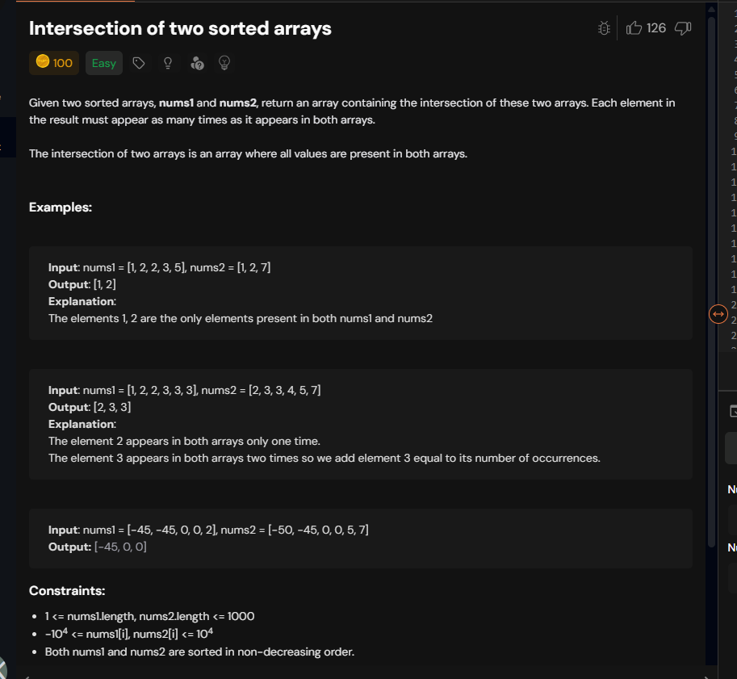

# Notes




Merge procedure jaisa hai bilkul 
```cpp

class Solution {
public:
    vector<int> unionArray(vector<int>& nums1, vector<int>& nums2) {
        int i=0,j=0;
        vector<int> res;
        while(i<nums1.size() && j<nums2.size()){
            if(nums1[i]==nums2[j]){
                int val=nums1[i];
                res.push_back(val);
                while(nums1[i]==val) i++;
                while(nums2[j]==val) j++;
            }
            else if(nums1[i]<nums2[j]){
                int val=nums1[i];
                res.push_back(val);
                while(nums1[i]==val) i++;
            }else{
                 int val=nums2[j];
                res.push_back(val);
                while(nums2[j]==val) j++;
            }

        }

        while(i<nums1.size()){
           int val=nums1[i];
            res.push_back(val);
            while(nums1[i]==val) i++;
        }

        while(j<nums2.size()){
             int val=nums2[j];
            res.push_back(val);
            while(nums2[j]==val) j++;
        }

        return res;

    }
};
```


```cpp

class Solution {
public:
    vector<int> intersectionArray(vector<int>& nums1, vector<int>& nums2) {
        int i=0,j=0;
        vector<int> res;
        while(i<nums1.size() && j<nums2.size()){
            if(nums1[i]==nums2[j]){
                int val=nums1[i];
                res.push_back(val);
                i++;
                j++;
            }
            else if(nums1[i]<nums2[j]){
                int val=nums1[i];
                while(nums1[i]==val) i++;
            }else{
                 int val=nums2[j];
                while(nums2[j]==val) j++;
            }

        }
        return res;
    }
};

```


