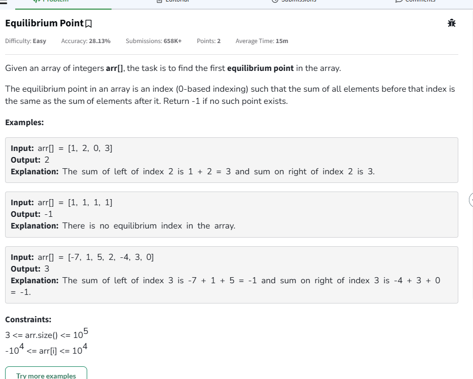

# Notes

## Q1 leaders in an array  


```cpp
class Solution {
public:
    vector<int> leaders(vector<int>& nums) {
      vector<int> res;
      int n=nums.size();
      int maxel=-(1e4+1);
      for(int i=n-1;i>=0;i--){
            if(nums[i]>maxel){
                maxel=nums[i];
                res.push_back(nums[i]);
            }
      }

      reverse(res.begin(),res.end());
      return res;
    }

};
```

tc-->O(n)

## Q2 Equilibrium point 


```cpp

class Solution {
    public:
      // Function to find equilibrium point in the array.
      int findEquilibrium(vector<int> &arr) {
          long sum=0;
          for(int i=0;i<arr.size();i++){
              sum+=arr[i];
          }
          int lsum=0;
          for(int i=0;i<arr.size();i++){
              sum-=arr[i];
              if(sum==lsum) return i;
              lsum+=arr[i];
          }
          
          return -1;
          
      }
  };
  
  ```

## Q3 remove duplicates from sorted array


Given an integer array nums sorted in non-decreasing order, remove all duplicates in-place so that each unique element appears only once.


Return the number of unique elements in the array.


If the number of unique elements be k, then,

Change the array nums such that the first k elements of nums contain the unique values in the order that they were present originally.
The remaining elements, as well as the size of the array does not matter in terms of correctness.
The driver code will assess correctness by printing and checking only the first k elements of the modified array.


An array sorted in non-decreasing order is an array where every element to the right of an element is either equal to or greater in value than that element.


Examples:
---
Input: nums = [0, 0, 3, 3, 5, 6]

Output: 4

Explanation:

Resulting array = [0, 3, 5, 6, _, _]

There are 4 distinct elements in nums and the elements marked as _ can have any value.

---

Input: nums = [-2, 2, 4, 4, 4, 4, 5, 5]

Output: 4

Explanation:

Resulting array = [-2, 2, 4, 5, _, _, _, _]

There are 4 distinct elements in nums and the elements marked as _ can have any value.


```cpp
//remove duplicates from sorted array
class Solution {
    public int removeDuplicates(int[] nums) {
        int i=1;
        int j=0;
        while(i<nums.length){
            if(nums[i]!=nums[j]) {
                j++;
                nums[j]=nums[i];
            }
            i++;
        }
        return j+1;
    }
}

```

## Q4 second largest element in an array

```java
class Solution {
    //two loops O(N)+O(N)
    public int secondLargestElement1(int[] nums) {
        int max1=nums[0];
        for(int i=1;i<nums.length;i++){
            if(nums[i]>max1) max1=nums[i];
        }

        int max2=Integer.MIN_VALUE;
        for(int i=0;i<nums.length;i++){
            if(nums[i]==max1) continue;
            if(nums[i]>max2) max2=nums[i];
        }
        return max2==Integer.MIN_VALUE?-1:max2;
    }
    //one loop O(N)
    public int secondLargestElement(int[] nums) {
        if (nums.length < 2) {
          return -1;
        }
        int largest = Integer.MIN_VALUE;
        int secondLargest = Integer.MIN_VALUE;
        for (int i = 0; i < nums.length; i++) {

            if (nums[i] > largest) {
                 secondLargest = largest;
                largest = nums[i];
            } 
            else if (nums[i] > secondLargest && nums[i] != largest) {
                secondLargest = nums[i];
            }

        }

        return secondLargest == Integer.MIN_VALUE ?  -1 : secondLargest;
}
}
```


