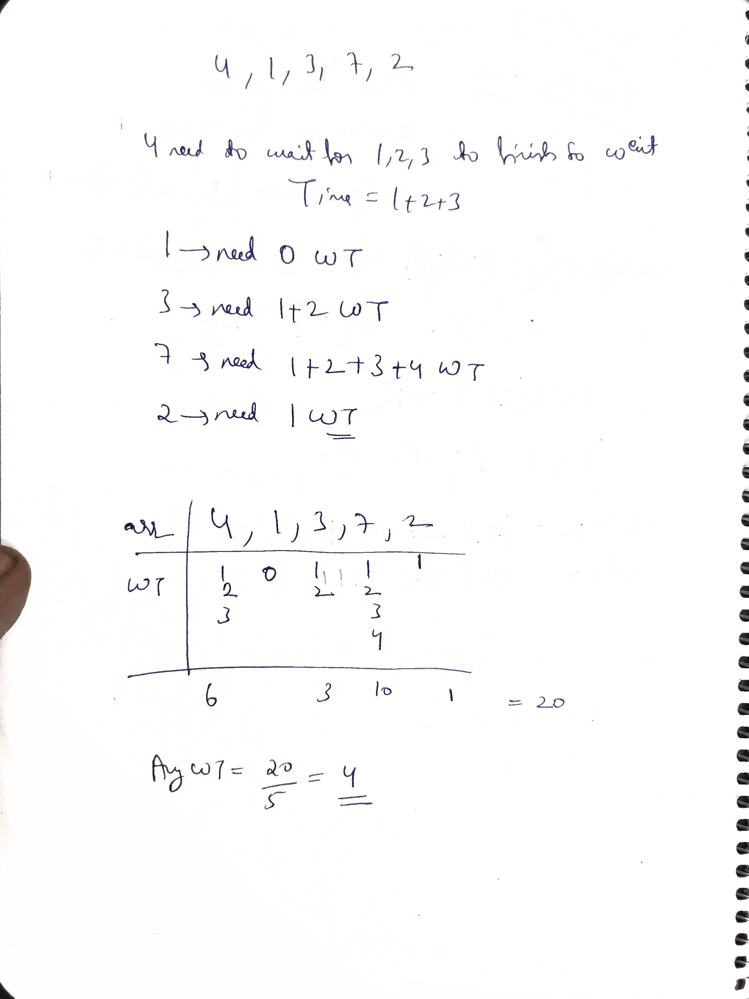

# Scheduling problems

## Q1 Job sequencing Problem


Given an 2D array Jobs of size Nx3, where Jobs[i][0] represents JobID , Jobs[i][1] represents Deadline , Jobs[i][2] represents Profit associated with that job. Each Job takes 1 unit of time to complete and only one job can be scheduled at a time.


The profit associated with a job is earned only if it is completed by its deadline. Find the number of jobs and maximum profit.

---

Examples:

---
Input : Jobs = [ [1, 4, 20] , [2, 1, 10] , [3, 1, 40] , [4, 1, 30] ]

Output : 2 60

Explanation : Job with JobID 3 can be performed at time t=1 giving a profit of 40.

Job with JobID 1 can be performed at time t=2 giving a profit of 20.

No more jobs can be scheduled, So total Profit = 40 + 20 => 60.

Total number of jobs completed are two, JobID 1, JobID 3.

So answer is 2 60.

---

Input : Jobs = [ [1, 2, 100] , [2, 1, 19] , [3, 2, 27] , [4, 1, 25] , [5, 1, 15] ]

Output : 2 127

Explanation : Job with JobID 1 can be performed at time time t=1 giving a profit of 100.

Job with JobID 3 can be performed at time t=2 giving a profit of 27.

No more jobs can be scheduled, So total Profit = 100 + 27 => 127.

Total number of jobs completed are two, JobID 1, JobID 3.

So answer is 2 127.

```cpp
class Solution{  
  public:  
    vector<int> JobScheduling(vector<vector<int>>& v) { 
    //   sort(v.begin(), v.end(), [](const vector<int>& a, const vector<int>& b) {
    //     if (a[1] == b[1]) 
    //         return a[2] > b[2]; // Descending order for v[i][2]
    //     return a[1] < b[1];     // Ascending order for v[i][1]
    // });
    
    sort(v.begin(), v.end(), [](const vector<int>& a, const vector<int>& b) {
      return a[2] > b[2]; // Descending order for v[i][2]
    });
    vector<int> vis(v.size(),-1);
    int jobs=0;
    int profit=0;
    for(int i=0;i<v.size();i++){
        int dl=v[i][1];
        while(dl>=1 && vis[dl]!=-1) {
          dl--;
        
        }
        if(dl>=1 && vis[dl]==-1){
            vis[dl]=v[i][0];
             profit+=v[i][2];
             jobs++;
          }
    }
    vector<int> res;
    res.push_back(jobs);
    res.push_back(profit);
    return res;
    }
};
```

## Q2 Shortest Job First


A software engineer is tasked with using the shortest job first (SJF) policy to calculate the average waiting time for each process. The shortest job first also known as shortest job next (SJN) scheduling policy selects the waiting process with the least execution time to run next.


You are given an array of integers bt of size n representing the burst times (execution times) of n processes.


Your task is to calculate the average waiting time for all processes when scheduled using the SJF policy. The waiting time of a process is the total time a process has to wait before its execution starts, which is the sum of burst times of all previously executed processes.


Return the floor of the average waiting time, i.e., the largest whole number less than or equal to the actual average.


Examples:

---

Input : bt = [4, 1, 3, 7, 2]

Output : 4

Explanation : The total waiting time is 20.

So the average waiting time will be 20/5 => 4.

---

Input : bt = [1, 2, 3, 4]

Output : 2

Explanation : The total waiting time is 10.

So the average waiting time will be 10/4 => 2.

---
Constraints:
1 <= n <= 10^5
1 <= bt[i] <= 10^5



```cpp
class Solution {
  public:
    long long solve(vector<int>& bt) {
        sort(bt.begin(),bt.end());
        int n=bt.size();
        long long sum=0;
        long long tsum=0;
        for(int t:bt){
            sum+=tsum;
            tsum+=t;

        }
        return (int)(sum/n);
    }
};
```