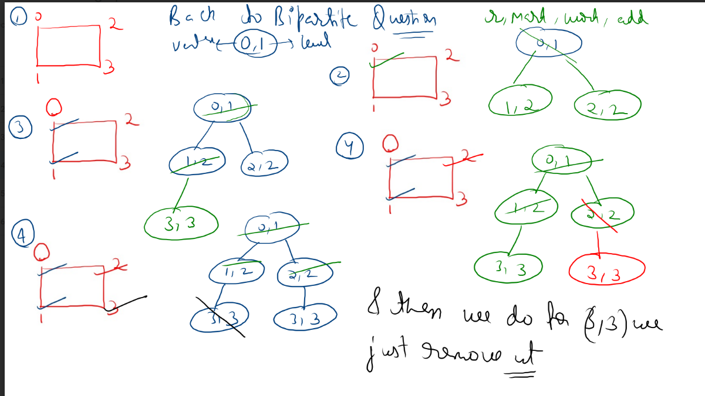
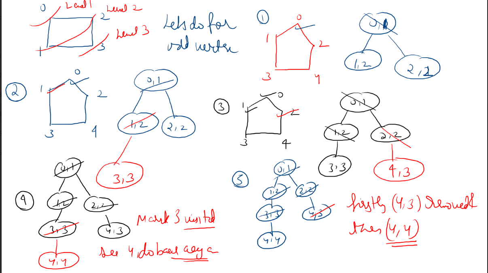
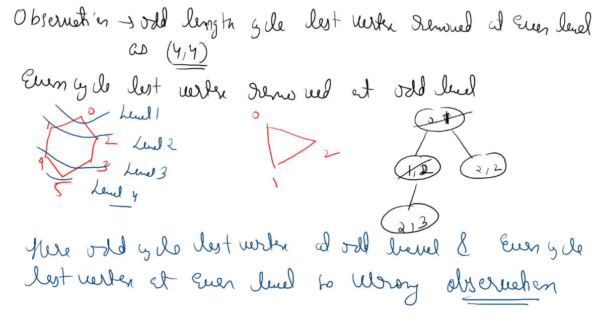
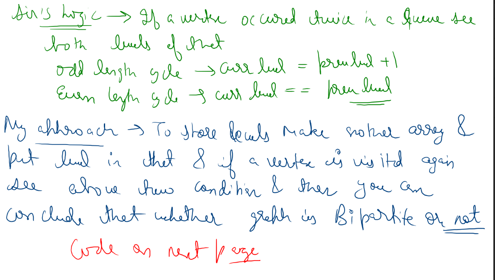
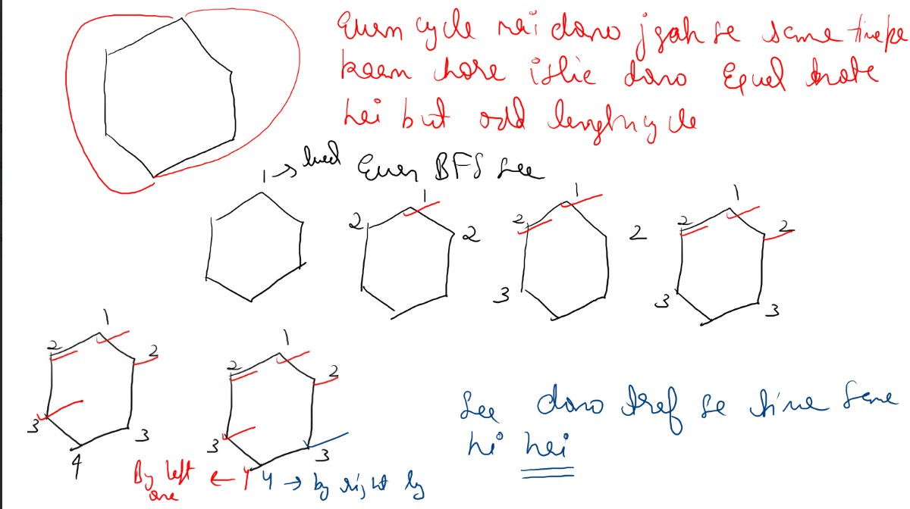
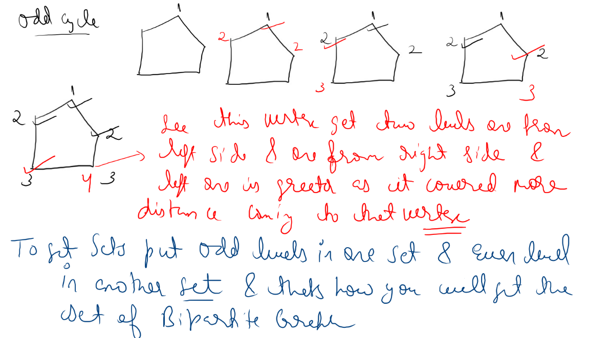

# Notes

Non-cycle --> Always bipartite 

even len cycle --> Always Bipartite

Odd len cycle--> non-bipartite

even len cycle--> last vertex visited at odd level 

odd len cycle --> last vertex visted at even level









so in old len cycle prev level will not be same as current level henec not be bipartite.

### BFS solution

```java
class Solution {
     public static class Pair{
      int v;
      int lvl;
      Pair(int v,int lvl){
         this.v=v;
         this.lvl=lvl;
      }
   }
    public boolean isBipartite(int[][] graph) {
        
    int[] lvl=new int[graph.length];
    boolean[] vis=new boolean[graph.length];
    LinkedList<Pair>q=new LinkedList<>();
    for(int v=0;v<graph.length;v++){
       if(vis[v]==false){
       q.addLast(new Pair(v,1));
       while(q.size()>0){
          Pair removed=q.remove();
          if(vis[removed.v]==true) {
              if(lvl[removed.v]==removed.lvl)
              continue;
              else {
                 return false;
              }
           }
          else lvl[removed.v]=removed.lvl;
          
          vis[removed.v]=true;
          for(int i=0;i<graph[removed.v].length;i++){
            if(vis[graph[removed.v][i]]==false){
               q.addLast(new Pair(graph[removed.v][i],removed.lvl+1));
            }
         }
         
      } 
   }
      }
    return true;
    }
}
```
 Coloring solution 

 

 
 ### Cpp

 ```cpp
class Solution{
    bool traverseDFS( vector<int>graph[],vector<int>&vis,int v,int color){
        vis[v]=color;
        for(auto nbr:graph[v]){
            if(vis[nbr]==0){
                bool isbip=traverseDFS(graph,vis,nbr,-1*color);
                if(isbip==false) return false;
            }
            else {
                int oldcolor=vis[nbr];
                int newcolor=-1*color;
                if(oldcolor!=newcolor) return false;
            }
        }
        return true;

    }
 
public:
    bool isBipartite(int V, vector<int> adj[])  {
        vector<int>vis(V);
        for(int v=0;v<V;v++){
            if(vis[v]==0){
                bool isbipartite=traverseDFS(adj,vis,v,1);
                if(isbipartite==false)
                    return false;
  
                    }
            }
        return true;
    }
};

 ```
 ### Java

```java
class Solution {

    public boolean traverseDFS(int[][]graph,int[] vis,int v,int color){
        vis[v]=color;
        for(var nbr:graph[v]){
            if(vis[nbr]==0){
                boolean isbip=traverseDFS(graph,vis,nbr,-1*color);
                if(isbip==false) return false;
            }
            else {
                int oldcolor=vis[nbr];
                int newcolor=-1*color;
                if(oldcolor!=newcolor) return false;
            }
        }
        return true;

    }
 
    

    public boolean isBipartite(int[][] graph) {
        
        int [] vis=new int[graph.length];
        for(int v=0;v<graph.length;v++){
            if(vis[v]==0){
                boolean isbipartite=traverseDFS(graph,vis,v,1);
                if(isbipartite==false)
                    return false;
  
                    }
            }
        return true;
    }
}
```