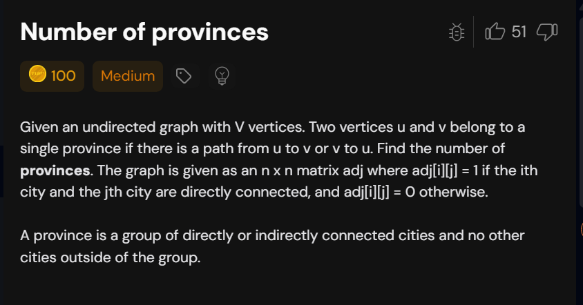

# Notes

## 1. Number of Provinces (too easy)




### Code

```cpp

class Solution{
    void dfs(vector<bool>& vis,int v,vector<int> * graph,int n){
        vis[v]=true;
        for(int  nbr:graph[v]){
            if(vis[nbr]==false){
                dfs(vis,nbr,graph,n);
            }
        }
    }
public:
    int numProvinces(vector<vector<int>> adj) {
       int n=adj.size();
       vector<int> graph[n];
       for(int i=0;i<n;i++){
        for(int j=0;j<i;j++){
            if(adj[i][j]==1){
                graph[i].push_back(j);
                graph[j].push_back(i);
            }
        }
       }

        vector<bool> vis(n,false);
        int cnt=0;
        for(int i=0;i<n;i++){
            if(vis[i]==false){
                dfs(vis,i,graph,n);
                cnt++;
            } 
            
        }
        return cnt;

    }
};

```


---

## 2.connected components

### java


```java
import java.util.*;

class Solution {
    // Function for BFS traversal
    private void bfs(int node, List<Integer>[] adjLs, 
                     boolean[] vis) {
        // Mark the node as visited
        vis[node] = true;

        // Queue required for BFS traversal
        Queue<Integer> q = new LinkedList<>();

        // To start traversal from node
        q.add(node);

        /* Keep on traversing till 
        the queue is not empty */
        while (!q.isEmpty()) {
            // Get the node
            int i = q.poll();

            // Traverse its unvisited neighbours
            for (int adjNodes : adjLs[i]) {
                if (!vis[adjNodes]) {
                    // Mark the node as visited
                    vis[adjNodes] = true;

                    // Add the node to queue
                    q.add(adjNodes);
                }
            }
        }
    }

    // Function for DFS traversal
    private void dfs(int node, List<Integer>[] adjLs, 
                     boolean[] vis) {
        // Mark the node as visited
        vis[node] = true;

        // Traverse its unvisited neighbours
        for (int it : adjLs[node]) {
            if (!vis[it]) {
                // Recursively perform DFS
                dfs(it, adjLs, vis);
            }
        }
    }

    /* Function call to find the number of 
    connected components in the given graph */
    public int findNumberOfComponent(int V, 
                                     List<List<Integer>> edges) {
        int E = edges.size();
        
        // To store adjacency list
        List<Integer>[] adjLs = new ArrayList[V];
        for (int i = 0; i < V; i++) {
            adjLs[i] = new ArrayList<>();
        }

        // Add edges to adjacency list
        for (int i = 0; i < E; i++) {
            adjLs[edges.get(i).get(0)].add(edges.get(i).get(1));
            adjLs[edges.get(i).get(1)].add(edges.get(i).get(0));
        }

        // Visited array
        boolean[] vis = new boolean[V];

        // Variable to store number of components
        int cnt = 0;

        // Start Traversal
        for (int i = 0; i < V; i++) {
            // If the node is not visited
            if (!vis[i]) {
                // Increment counter
                cnt++;

                /* Start traversal from current 
                node using any traversal */
                bfs(i, adjLs, vis);
                // dfs(i, adjLs, vis);
            }
        }

        // Return the count
        return cnt;
    }
}

class Main {
    public static void main(String[] args) {
        int V = 4;
        List<List<Integer>> edges = Arrays.asList(
            Arrays.asList(0, 1),
            Arrays.asList(1, 2)
        );

        /* Creating an instance of 
        Solution class */
        Solution sol = new Solution();

        /* Function call to find the number of 
        connected components in the given graph */
        int ans = sol.findNumberOfComponent(V, edges);

        System.out.println("The number of components in the given graph is: " + ans);
    }
}

```
### Cpp
```cpp

#include <bits/stdc++.h>
using namespace std;

class Solution {
private: 
    // Function for BFS traversal
    void bfs(int node, vector<int> adjLs[], int vis[]) {
        queue <int> q;
        q.push(node); 
        while(!q.empty()) {
            // Get the node
            int i = q.front();
            vis[i] = 1;
            q.pop();
            
            // Traverse its unvisited neighbours
            for(auto adjNodes: adjLs[i]) {
                
                if(vis[adjNodes] != 1) {
                    q.push(adjNodes);
                }
            }
        }
        
    }

    // Function for DFS traversal  
    void dfs(int node, vector<int> adjLs[], int vis[]) {
        
        vis[node] = 1; 
        for(auto it: adjLs[node]) {
            
            if(!vis[it]) {
                // Recursively perform DFS
                dfs(it, adjLs, vis); 
            }
        }
    }
    
public:

    /* find the number of 
    connected components in the given graph */
    int findNumberOfComponent(int E, int V, vector<vector<int>> &edges) {
        vector<int> adjLs[V];
        for(int i=0; i < E; i++) {
            adjLs[edges[i][0]].push_back(edges[i][1]);
            adjLs[edges[i][1]].push_back(edges[i][0]);
        }
        int vis[V] = {0}; 
        int cnt = 0; 
        
        for(int i=0; i < V; i++) {
            if(!vis[i]) {
                cnt++;
                bfs(i, adjLs, vis); 
                //dfs(i, adjLs, vis);
            }
        }
        return cnt; 
    }
};

int main() {
    int V = 4, E = 2;
    vector<vector<int>> edges = {
        {0, 1},
        {1, 2}
    };
    
    /* Creating an instance of 
    Solution class */
    Solution sol; 
    
    /* Function call to find the number of 
    connected components in the given graph */
    int ans = sol.findNumberOfComponent(E, V, edges);
    
    cout << "The number of components in the given graph is: " << ans;
    
    return 0;
}
```


