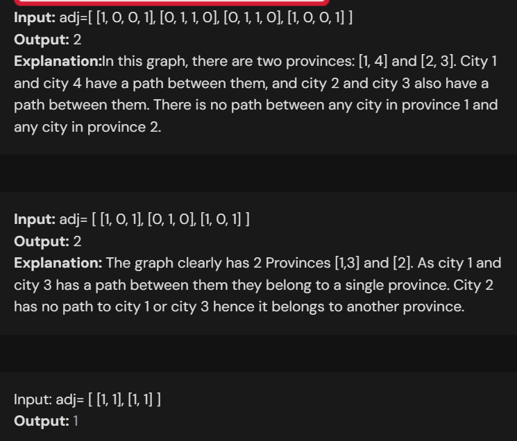
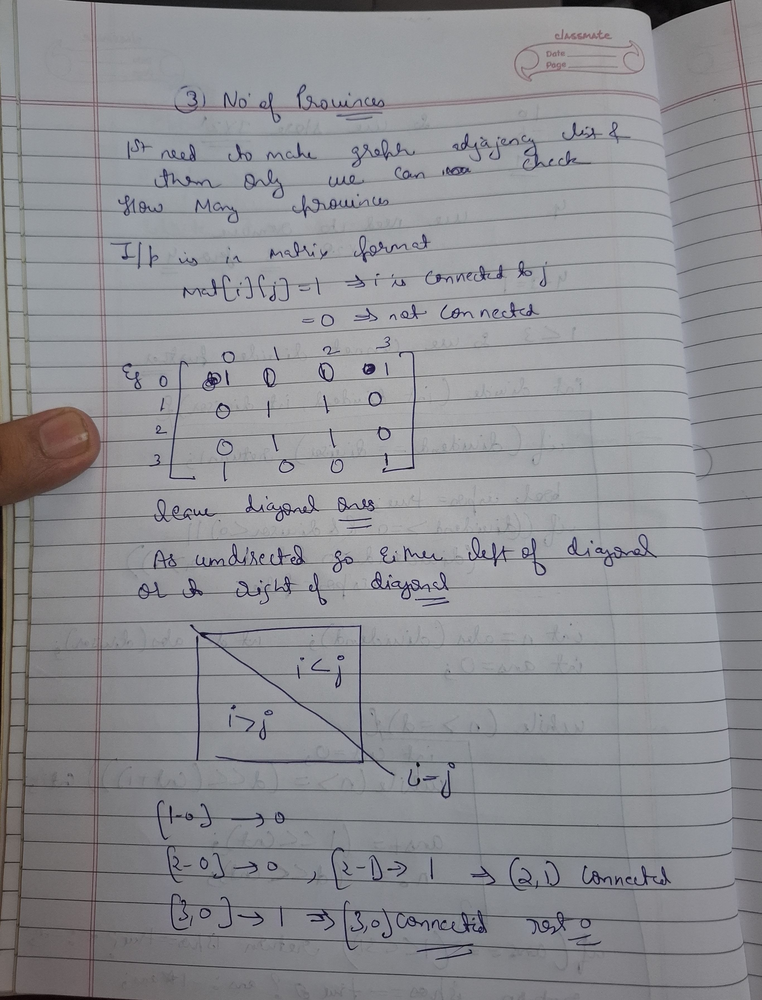
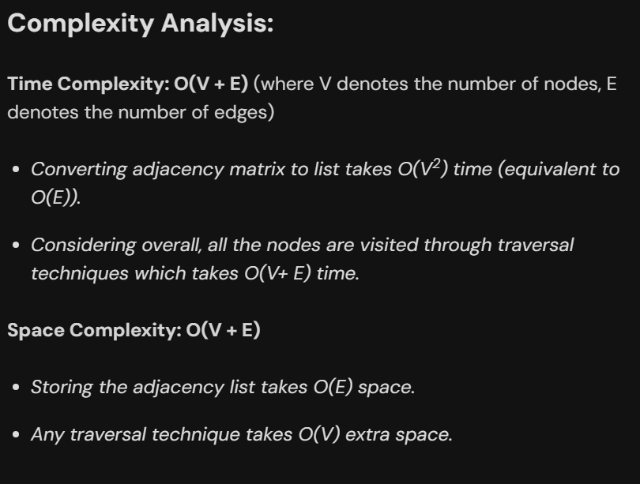

# Notes

## 1. Number of Provinces (too easy)








### Code

```cpp

class Solution{
    void dfs(vector<bool>& vis,int v,vector<int> * graph,int n){
        vis[v]=true;
        for(int  nbr:graph[v]){
            if(vis[nbr]==false){
                dfs(vis,nbr,graph,n);
            }
        }
    }
public:
    int numProvinces(vector<vector<int>> adj) {
       int n=adj.size();
       vector<int> graph[n];
       for(int i=0;i<n;i++){
        for(int j=0;j<i;j++){
            if(adj[i][j]==1){
                graph[i].push_back(j);
                graph[j].push_back(i);
            }
        }
       }

        vector<bool> vis(n,false);
        int cnt=0;
        for(int i=0;i<n;i++){
            if(vis[i]==false){
                dfs(vis,i,graph,n);
                cnt++;
            } 
            
        }
        return cnt;

    }
};

```



