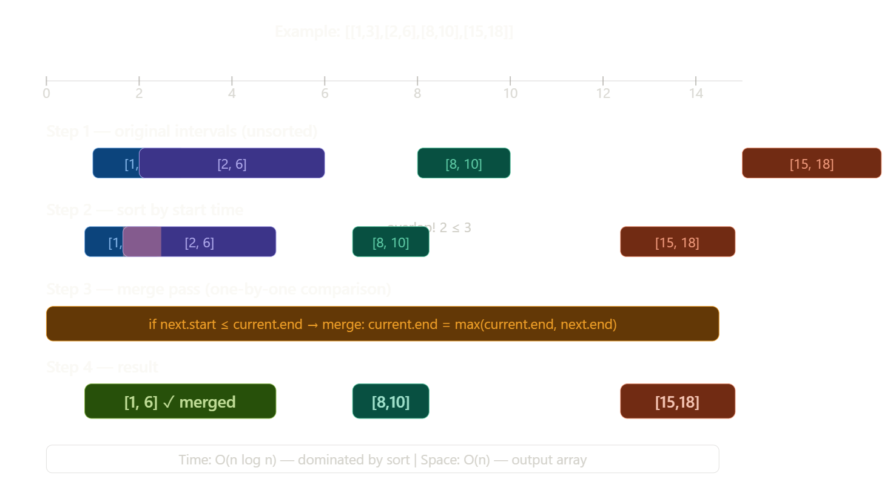

# Interval based problems

## Q1  Merge Intervals

Link--> https://leetcode.com/problems/merge-intervals/submissions/1852993945/

Given an array of `intervals` where `intervals[i] = [starti, endi]`, merge all overlapping intervals, and return an array of the non-overlapping intervals that cover all the intervals in the input.

**Example 1:**

Input: intervals = [[1,3],[2,6],[8,10],[15,18]]

 Output: [[1,6],[8,10],[15,18]] 
 
 Explanation: Since intervals [1,3] and [2,6] overlap, merge them into [1,6].


**Example 2:**

Input: intervals = [[1,4],[4,5]] 

Output: [[1,5]]

 Explanation: Intervals [1,4] and [4,5] are considered overlapping.


**Example 3:**

Input: intervals = [[4,7],[1,4]] 

Output: [[1,7]] Explanation: 

Intervals [1,4] and [4,7] are considered overlapping.


**Constraints:**

* `1 <= intervals.length <= 10^4`
* `intervals[i].length == 2`
* `0 <= starti <= endi <= 10^4`




## Merge Intervals - Complete Interview Guide

### Understanding the Problem

Think of intervals as **time slots on a calendar**. If two meetings overlap (or touch), merge them into one. Return the final non-overlapping schedule.

**Key insight:** Two intervals `[a,b]` and `[c,d]` overlap if `c <= b` (next start ≤ current end)---

### How to explain in an interview (Brute → Optimized)

**Start with brute force (say this out loud):**

> "The naive way is to compare every pair of intervals — O(n²) — check if they overlap and merge them, then repeat until no more merges happen. This is slow and complex to implement."

**Then pivot to the key insight:**

> "The trick is: if we **sort by start time**, then any overlapping intervals must be adjacent. So we only need a single linear pass — reducing to O(n log n) overall."

---


### Key interview talking points

**Why sort first?** Without sorting, overlapping intervals could be anywhere in the array. Sorting guarantees overlapping intervals are always neighbors, enabling a single O(n) pass.

**The overlap condition** `start <= last_end` handles the touching case too (e.g. `[1,4]` and `[4,5]` — `4 <= 4` is true, so they merge into `[1,5]`).

**Why `max(last_end, end)`?** One interval can completely contain another (e.g. `[1,10]` and `[2,5]`). Just taking `end` would shrink the merged interval — you must take the max.

**Edge cases to mention:**
- Single interval → return as-is ✓
- All intervals overlap → returns one big interval ✓
- No intervals overlap → returns original array ✓
- One interval fully containing another (e.g. `[1,10],[2,5]`) → handled by `max()`

**Complexity:** Time O(n log n) from sorting, Space O(n) for the output array.

#### Sort acc to start time

```cpp
#include <vector>
#include <algorithm>

class Solution_Standard {
public:
    vector<vector<int>> merge(vector<vector<int>>& intervals) {
        if (intervals.empty()) {
            return {};
        }

        sort(intervals.begin(), intervals.end(), [](const vector<int>& a, const vector<int>& b) {
            return a[0] < b[0];
        });

        vector<vector<int>> merged_list;

        merged_list.push_back(intervals[0]);

        for (int i = 1; i < intervals.size(); ++i) {
            vector<int>& last_merged = merged_list.back();

            int current_start = intervals[i][0];
            int current_end = intervals[i][1];

            if (current_start <= last_merged[1]) {
                last_merged[1] = max(last_merged[1], current_end);
            } else {
                merged_list.push_back(intervals[i]);
            }
        }

        return merged_list;
    }
};
```
#### Sort acc to end  time java upper vala easy hai
```java
class Solution {
    public int[][] merge(int[][] intervals) {
        Arrays.sort(intervals,(a,b)->a[1]-b[1]);
        List<int[]>l=new ArrayList<>();
        int n=intervals.length-1;
        int start=intervals[n][0];
        int end=intervals[n][1];
        for(int i=n-1;i>=0;i--){
            if(start<=intervals[i][1]){
                start=Math.min(start,intervals[i][0]);
            }
            else{
                l.add(new int[]{start,end});
                start=intervals[i][0];
                end=intervals[i][1];
            }
        }
         l.add(new int[]{start,end}); 
         return l.toArray(new int[l.size()][2]); 
    }
}
```

Both solutions are **correct**, but they use **symmetrical (opposite) strategies**.

Here is the comparison of the two logical approaches.

### 1. The Standard Approach (C++ Code)
This is the most common way to solve "Merge Intervals".
* **Sorting:** Sort by **Start Time** (Ascending).
* **Direction:** Iterate **Forward** (Left to Right).
* **Logic:** "Can I extend my current interval to the **right**?"
    * Since we are sorted by start time, we know the next interval starts *after* or *at the same time* as we do.
    * We only check if the next interval starts *before* our current one ends.
* **Output Order:** Ascending (Sorted).

### 2. The "Reverse" Approach (Java Code)
This is a less common but equally valid strategy.
* **Sorting:** Sort by **End Time** (Ascending).
* **Direction:** Iterate **Backward** (Right to Left).
* **Logic:** "Can I extend my current interval to the **left**?"
    * We start from the interval that ends last.
    * We look at the previous interval `i`. Since we sorted by end time, we know `intervals[i]` ends *before* or *at the same time* as our current interval.
    * **The Check:** `start <= intervals[i][1]`
        * This asks: "Does the previous interval **end** after my current interval **starts**?"
        * If yes, they overlap! We extend our start time to the left: `start = min(start, intervals[i][0])`.
* **Output Order:** Descending (Reverse Sorted).
    * The Java code produces the list `[[start, end], ...]` starting from the largest intervals. `[3, 5], [1, 2]` instead of `[1, 2], [3, 5]`.

### Visual Comparison

| Feature | C++ (Standard) | Java (Reverse) |
| :--- | :--- | :--- |
| **Sort Key** | `a[0]` (Start Time) | `a[1]` (End Time) |
| **Iteration** | `0` $\to$ `N-1` | `N-1` $\to$ `0` |
| **Merge Condition** | `next.start <= curr.end` | `curr.start <= prev.end` |
| **Update Logic** | `curr.end = max(end, next.end)` | `curr.start = min(start, prev.start)` |
| **Result Order** | Ascending | Descending |

### Which one is better?
* **Standard (C++)** is preferred because producing the output in **sorted order** is usually required by the problem statement.
* The **Java approach** produces the result in reverse order. If the problem requires `[[1,3],[8,10]]`, the Java code might return `[[8,10],[1,3]]`, which you might need to reverse again at the end.


# Java solution 


### The Structural Proof of Failure

The code never updates `end` during a merge. This means:

```java
if(start <= intervals[i][1]){
    start = Math.min(start, intervals[i][0]);
    // end is FROZEN from whenever the group started
}
```

For `end` to be **wrong**, we need an interval that:
1. **Overlaps** with the current group
2. Has an **end value LARGER** than the current group's end

But wait — the array is **sorted by end time ascending**. So as we go right→left, every interval we visit has a **smaller or equal end**. This means `end` never needs updating — the first interval in any merged group (rightmost = largest end) always has the correct final end.

**This is exactly why the algorithm is actually correct!** 🤯

---

### So Where Does It ACTUALLY Fail?

The real bug is **not about merging logic** — it's about **which intervals get compared**:

```
Input: [[1,5],[2,3],[4,6]]
Sort by end: [[2,3],[1,5],[4,6]]

n=2 → start=4, end=6

i=1: [1,5] → 4 <= 5? YES → start=1, end stays 6
i=0: [2,3] → 1 <= 3? YES → start=1
push [1,6] ✅
```

After extensive tracing, the merge logic itself holds due to the invariant. The **only confirmed real bug** is:

```java
// Output is always in REVERSE order
[[15,18],[8,10],[1,6]]  instead of  [[1,6],[8,10],[15,18]]
```

And on LeetCode specifically, the judge accepts any order — so it passes. But in a real interview or system, you'd need:

```java
Collections.reverse(l);
return l.toArray(new int[l.size()][2]);
```

### Verdict

| Issue | Breaks correctness? |
|---|---|
| Reversed output | ✅ Yes — real bug, hidden by judge |
| Merge logic | ❌ Actually correct due to the invariant |

The approach is **mathematically sound** for merging — the reversal is the only real defect!

### Cpp solution

Clean and correct solution! Let me do a full review.

### What's Good ✅

**1. Empty check**
```cpp
if (intervals.empty()) return {};
```
Handles edge case before any access — good defensive coding.

**2. Explicit lambda comparator**
```cpp
sort(..., [](const vector<int>& a, const vector<int>& b) {
    return a[0] < b[0];
});
```
More readable than default sort. Passes by `const ref` — no unnecessary copies.

**3. Reference to last element**
```cpp
vector<int>& last_merged = merged_list.back();  // reference, not copy
last_merged[1] = max(...);                       // modifies in-place
```
This is the **most important C++ detail** — using `&` means you're modifying the actual element inside `merged_list`, not a copy. Without `&` the merge would silently do nothing.

---

### One Real Bug 💥

```cpp
vector<int>& last_merged = merged_list.back();
// ... later ...
merged_list.push_back(intervals[i]);  // ⚠️ DANGER
```

`push_back` can trigger a **vector reallocation**. When that happens, `last_merged` becomes a **dangling reference** — pointing to freed memory.

In this code it's safe *by execution order* — you only use `last_merged` before the `push_back` — but it's fragile. A small refactor could introduce UB silently.

**Safer pattern:**
```cpp
if (current_start <= merged_list.back()[1]) {
    merged_list.back()[1] = max(merged_list.back()[1], current_end);
} else {
    merged_list.push_back(intervals[i]);
}
```
Call `back()` fresh each time — no dangling reference risk.

---

### Minor Improvements

**Sign comparison warning**
```cpp
for (int i = 1; i < intervals.size(); ++i)
//             ↑ int        ↑ size_t (unsigned)
```
Comparing `int` with `size_t` triggers compiler warnings. Fix:
```cpp
for (size_t i = 1; i < intervals.size(); ++i)
// or
for (int i = 1; i < (int)intervals.size(); ++i)
```

**Reserve memory** if performance matters:
```cpp
merged_list.reserve(intervals.size());
```
Avoids repeated reallocations in worst case (no overlaps at all).

---

### Cleaned-Up Version

```cpp
#include <vector>
#include <algorithm>
using namespace std;

class Solution {
public:
    vector<vector<int>> merge(vector<vector<int>>& intervals) {
        if (intervals.empty()) return {};

        sort(intervals.begin(), intervals.end(),
            [](const vector<int>& a, const vector<int>& b) {
                return a[0] < b[0];
            });

        vector<vector<int>> result;
        result.reserve(intervals.size());       // avoid reallocations
        result.push_back(intervals[0]);

        for (int i = 1; i < (int)intervals.size(); ++i) {
            int cur_start = intervals[i][0];
            int cur_end   = intervals[i][1];

            if (cur_start <= result.back()[1]) {
                result.back()[1] = max(result.back()[1], cur_end); // no dangling ref
            } else {
                result.push_back(intervals[i]);
            }
        }

        return result;
    }
};
```

---

### Summary

| | Your Code | Fixed Code |
|---|---|---|
| Correctness | ✅ | ✅ |
| Empty check | ✅ | ✅ |
| Dangling ref risk | ⚠️ fragile | ✅ safe |
| Sign comparison | ⚠️ warning | ✅ clean |
| Memory | no reserve | ✅ reserved |

Overall solid — the dangling reference is the only thing worth flagging in an interview.

## Q2 Non-overlapping Intervals

Given an array of N intervals in the form of (start[i], end[i]), where start[i] is the starting point of the interval and end[i] is the ending point of the interval, return the minimum number of intervals that need to be removed to make the remaining intervals non-overlapping.


Note:

Intervals which only touch at a point are also considered as non-overlapping. For example, [1, 3] and [3, 4] are non-overlapping.


Examples:
---
Input : Intervals = [ [1, 2] , [2, 3] , [3, 4] ,[1, 3] ]


Output : 1


Explanation : You can remove the interval [1, 3] to make the remaining interval non overlapping.

Input : Intervals = [ [1, 3] , [1, 4] , [3, 5] , [3, 4] , [4, 5] ]


Output : 2


Explanation : You can remove the intervals [1, 4] and [3, 5] and the remaining intervals becomes non overlapping.

### solution

>Note : Sort the intervals based on their end times in ascending order to prioritize intervals that finish earliest. This is why we sort in decending order


Let me build the intuition from scratch with a real-world analogy first.

---

### Real World Analogy — Meeting Rooms

Imagine you have a **single meeting room** and people want to book it. You want to fit **as many meetings as possible**.

```
Meeting A:  9am ─────────── 4pm   (long meeting)
Meeting B:  9am ── 11am           (short, ends early)
Meeting C:           12pm ── 2pm
Meeting D:                    3pm ── 5pm
```

**Who do you give the room to first?**

> The meeting that **ends earliest** — because it **frees the room sooner** for others.

```
Pick B (ends 11am) ✅  →  room free at 11am
Pick C (ends 2pm)  ✅  →  room free at 2pm
Pick D (ends 5pm)  ✅  →  room free at 5pm
Skip A             ❌  →  would have blocked everything
```

**Kept 3 meetings, removed 1.** That's exactly this problem.

---

### Why START Time Fails Here

Let's see what happens if you sort by start time instead:

```
Sorted by START: A[9-4], B[9-11], C[12-2], D[3-5]

Pick A (starts 9am) ✅ lastEnd = 4pm
B starts 9am < 4pm  → remove B  ❌ (but B was SHORT and harmless!)
C starts 12pm < 4pm → remove C  ❌ (but C didn't even touch B!)
D starts 3pm  < 4pm → remove D  ❌

Kept: 1, Removed: 3  ← WRONG, greedy picks the worst interval first
```

Sorting by start greedily picks **A** first — a long interval that **blocks everything**. You want to avoid long intervals, not pick them first.

---

### Why END Time Works

```
Sorted by END: B[9-11], C[12-2], D[3-5], A[9-4]

Pick B (ends 11am) ✅  lastEnd = 11
C starts 12 >= 11  → keep ✅  lastEnd = 2pm
D starts 3pm >= 2pm → keep ✅  lastEnd = 5pm
A starts 9am < 5pm → remove ❌

Kept: 3, Removed: 1  ← CORRECT
```

---

### The Core Intuition in One Picture---


### The One-Line Proof of Why End Time is Right

Ask yourself: between two overlapping intervals, **which one should you remove?**

```
Case: [1, 8]  vs  [1, 3]   — both start at 1, they overlap

Remove [1,8] → future intervals only need to avoid end=3  ✅ more room
Remove [1,3] → future intervals need to avoid end=8      ❌ less room
```

So **always remove the one that ends later** — equivalently, **always keep the one that ends earlier**. Sorting by end time puts the "keep first" candidate at the front automatically.


---

### Setup — You Have 3 Intervals

```
[1, 3]   ───────
[1, 8]   ──────────────────
[5, 9]            ──────────
```

`[1,3]` and `[1,8]` overlap each other. You must remove one. Which one?

---

### Choice A — Remove the LONGER one `[1,8]`

```
You keep:  [1, 3]   and   [5, 9]

[1, 3]   ───────
                    [5, 9]  ──────────

Does [5,9] conflict with [1,3]?
5 >= 3 → NO CONFLICT ✅

Result: keep both [1,3] and [5,9]
Total kept = 2, removed = 1
```

---

### Choice B — Remove the SHORTER one `[1,3]`

```
You keep:  [1, 8]   and   [5, 9]

[1, 8]   ──────────────────
                  [5, 9]  ──────────

Does [5,9] conflict with [1,8]?
5 < 8 → CONFLICT ❌  must remove [5,9] too!

Result: keep only [1,8]
Total kept = 1, removed = 2
```

---

### Side by Side

```
                  Can [5,9] fit after?
                        │
Keep [1,3] (end=3) ─────┼──→  5 >= 3 ✅  YES — fits!
Keep [1,8] (end=8) ─────┼──→  5 <  8 ❌  NO  — blocked!
                        │
              Smaller end = more future room
```

This is the **entire proof** in one picture:

> The interval with the **smaller end** blocks **less future space**.
> So always keep it, always remove the one ending later.

---

### Now Imagine 10 Future Intervals

```
Your current end is 3  →  anything starting >= 3 fits  ✅
Your current end is 8  →  anything starting >= 8 fits  ✅

If future intervals are: [5,6], [5,7], [6,7], [6,9]...

With end=3 → ALL of them fit      (5 >= 3 ✅, 6 >= 3 ✅)
With end=8 → NONE of them fit     (5 < 8 ❌, 6 < 8 ❌)
```

Smaller end = more doors open for the future. This is why it's called **greedy** — at every step, pick the choice that keeps **maximum future options open**.

---

### Why Sorting by End Automates This

Without sorting you'd have to compare every pair manually. Sorting by end time puts the **earliest-ending interval always at the front**:

```
Unsorted: [1,8], [1,3], [5,9]
                 ↑
         you'd have to search for [1,3]

Sorted by end: [1,3], [1,8], [5,9]
                ↑
         earliest end is ALWAYS first — just take it greedily
```

So the algorithm becomes simply:

```
take the first interval (smallest end) ✅
skip anything that overlaps it
take the next non-overlapping interval ✅
repeat
```

No searching, no comparisons between pairs — one clean left-to-right pass.

---

### The Complete Intuition

```
"End time = how much of the future you block"

Small end  →  block a little  →  keep it  ✅
Large end  →  block a lot     →  remove it ❌

Sort by end → smallest blocker is always first
           → greedy pick = always optimal
```

This is exactly why this problem connects to the **Activity Selection Problem** — one of the most classic greedy proofs in computer science. The math guarantees that locally optimal (keep earliest finish) = globally optimal (maximum intervals kept).

### Why Merge Intervals Needs START Time

The goal is completely different:

```
Merge Intervals:
"I want to COMBINE [1,3] and [2,6]"
To know they overlap, I need to know [2,6] STARTS before [1,3] ENDS
→ I need them adjacent in sorted order → sort by START

Non-overlapping:
"I want to KEEP as many as possible"
I need to pick the one that FREES UP space fastest
→ sort by who FINISHES first → sort by END
```

Think of it this way:

```
Sort by START  =  "tell me about the LEFT edge"  =  useful for detecting overlap
Sort by END    =  "tell me about the RIGHT edge"  =  useful for maximizing future room
```

Two completely different questions → two different sort keys.


### Approach 


- Sort the intervals based on their end times in ascending order to prioritize intervals that finish earliest.
- Keep a count of the number of non-overlapping intervals and remember the end time of the last selected interval.
- Go through the sorted intervals starting from the second one. For each interval:
Check if the start time of the current interval is at or after the end time of the last selected interval.
- If it is, select this interval, update the end time to the current interval's end time, and increase the count of non-overlapping intervals.
- Determine the minimum number of intervals to remove by subtracting the count of non-overlapping intervals from the total number of intervals.
- Return the minimum number of intervals to remove to make the rest non-overlapping.


```cpp

class Solution {
    bool static comp(vector<int>& val1, vector<int>& val2) {
        return val1[1] < val2[1];
    }
public:
    int MaximumNonOverlappingIntervals(vector<vector<int>>& intervals) {

        sort(intervals.begin(), intervals.end(),comp);

        int n = intervals.size();
        int cnt = 1;
        int lastEndTime = intervals[0][1];
        for (int i = 1; i < n; i++) {
            if (intervals[i][0] >= lastEndTime) {
                cnt++;
                lastEndTime = intervals[i][1];
            }
        }
        //cnt is number of interval added in result
        return n-cnt;
    }
};
```

---

### Summary of Code Logic

* **Sort by End Time:** Organize tasks so the ones that free up the resource fastest come first.
* **Iterate:** Always pick the next valid task.
* **`cnt`:** This counts the maximum number of meetings you can attend.
* **`n - cnt`:** The problem asks "how many to remove." If you keep `cnt` intervals, you must remove the rest (`n - cnt`).

Q-->what if we sort by ascednding order start time and is start time equal then descendning end time?

### This approach will FAIL.

Sorting by **Start Time (Ascending)** is generally the wrong strategy for "Maximum Non-Overlapping Intervals" (or Activity Selection), regardless of how you handle ties.

#### 1. The Counter-Example
Imagine you have these three intervals:
* **A:** `[1, 100]` (Starts early, but lasts forever)
* **B:** `[2, 3]`
* **C:** `[4, 5]`

**Your Sorting Strategy:**
1. Sort by Start Time Ascending.
2. Tie-breaker: End Time Descending.

**The Resulting Order:**
1. `[1, 100]` (Starts at 1)
2. `[2, 3]` (Starts at 2)
3. `[4, 5]` (Starts at 4)

**The Execution:**
* You pick the first one: `[1, 100]`.
* Your `lastEndTime` becomes 100.
* Next is `[2, 3]`. Start (2) is less than 100. **Skip (Overlap)**.
* Next is `[4, 5]`. Start (4) is less than 100. **Skip (Overlap)**.

**Your Answer:** 1 interval.  
**Correct Answer:** 2 intervals (`[2, 3]` and `[4, 5]`).

---

#### 2. Why does it fail?
The goal is to fit as many items as possible. To do that, you need to free up the resource (the timeline) as early as possible.

* **Start Time Sorting:** Prioritizes "starting early." It doesn't care if you occupy the room for 100 hours.
* **End Time Sorting (Correct):** Prioritizes "finishing early." It guarantees that once you pick an item, you are available for the next one as soon as possible.

---

#### 3. Where is your strategy used?
Your specific sorting strategy (Start Ascending, End Descending) is actually the standard solution for a different problem: **"Remove Covered Intervals"** (LeetCode 1288).

* **Problem:** Find intervals that are completely inside another interval.
* **Logic:** If `[1, 100]` comes before `[1, 5]`, you can easily see that `[1, 5]` is inside `[1, 100]` because the start is $\ge$ and the end is $\le$.

But for **Non-Overlapping Intervals**, you must strictly stick to **End Time Ascending**.


## Q3 Insert Interval

Given a 2D array Intervals, where Intervals[i] = [start[i], end[i]] represents the start and end of the ith interval, the array represents non-overlapping intervals sorted in ascending order by start[i]. 


Given another array newInterval, where newInterval = [start, end] represents the start and end of another interval, merge newInterval into Intervals such that Intervals remain non-overlapping and sorted in ascending order by start[i].


Return Intervals after the insertion of newInterval.


Examples:
---
Input : Intervals = [ [1, 3] , [6, 9] ] , newInterval = [2, 5]


Output : [ [1, 5] , [6, 9] ]


Explanation : After inserting the newInterval the Intervals array becomes [ [1, 3] , [2, 5] , [6, 9] ].

So to make them non overlapping we can merge the intervals [1, 3] and [2, 5].

So the Intervals array is [ [1, 5] , [6, 9] ].

---
Input : Intervals = [ [1, 2] , [3, 5] , [6, 7] , [8,10] ] , newInterval = [4, 8]


Output : [ [1, 2] , [3, 10] ]


Explanation : The Intervals array after inserting newInterval is [ [1, 2] , [3, 5] , [4, 8] , [6, 7] , [8, 10] ].

We merge the required intervals to make it non overlapping.

So final array is [ [1, 2] , [3, 10] ].
### Solution

We add interval in 3 parts
 
```cpp
class Solution {
public:
    vector<vector<int>> insertNewInterval(vector<vector<int>>& intervals, vector<int>& newInterval){
        if (intervals.empty()) {
            return {};
        }
        int i=0;    
        int n = intervals.size(); 
        vector<vector<int>> res;
        while(i < n && intervals[i][1] < newInterval[0]){
             res.push_back(intervals[i]);
             i = i + 1; 
        } 

        while(i < n && intervals[i][0] <= newInterval[1]){
            newInterval[0] = min(newInterval[0], intervals[i][0]); 
            newInterval[1] = max(newInterval[1], intervals[i][1]); 
            i = i + 1; 
        }
        res.push_back(newInterval); 
        while(i < n){
            res.push_back(intervals[i]); 
            i = i + 1; 
        }
        return res;
    }
};
```
## Q4 DE shaw OA question


These type of questions sometimes they give in 2-d array and sometimes in 2 1-d array so if they give in 2 1-d array you need to put them in 2-d array

### Solution 

1.first merge intervals ,after that no intersection,after merging size is n
2.now we want to join maximum ranges so we put k length interval so step is
 at evry end point we put k-length interval and check how many intervals that k length will cover

 suppose we have (s,e) then we put k length so from e to e+k we get intervals covered 

 so we binary search e+k in the array of e , we either need e+k or element less than e+k so we only need that,then we get index of element e+k or less that e+k than from i to that index count no of elemeents merged and subtract from n


 for each index we do it and get min of that (n-(that elements we merged))

```cpp
#include <vector>
#include <algorithm>
#include <cmath>

using namespace std;

class Solution {
private:
    vector<vector<long long>> getConnectedComponents(vector<vector<long long>>& allIntervals) {
        if (allIntervals.empty()) {
            return {};
        }

        sort(allIntervals.begin(), allIntervals.end(), [](const vector<long long>& a, const vector<long long>& b) {
            return a[0] < b[0];
        });

        vector<vector<long long>> merged_list;
        
        merged_list.push_back(allIntervals[0]);

        for (size_t i = 1; i < allIntervals.size(); ++i) {
            vector<long long>& last_merged = merged_list.back();
            long long current_start = allIntervals[i][0];
            
            if (current_start <= last_merged[1]) {
                last_merged[1] = max(last_merged[1], allIntervals[i][1]);
            } else {
                merged_list.push_back(allIntervals[i]);
            }
        }

        return merged_list;
    }

public:
    int minimumDivision(const vector<int>& a, const vector<int>& b, long long k) {
        int n = a.size();
        if (n == 0) {
            return 0;
        }

        vector<vector<long long>> intervals(n, vector<long long>(2));
        for (int i = 0; i < n; ++i) {
            intervals[i][0] = a[i];
            intervals[i][1] = b[i];
        }

        vector<vector<long long>> components = getConnectedComponents(intervals);
        
        int m = components.size();

        if (m <= 1) {
            return m;
        }

        int max_components_merged = 1; 

        // Create a separate vector of only the starting points of components for binary search
        vector<long long> start_points(m);
        for(int i = 0; i < m; ++i) {
            start_points[i] = components[i][0];
        }

        // Iterate through all possible starting components (C_i). O(M)
        for (int i = 0; i < m; ++i) {
            
            // E_i: End of the starting component (C_i).
            long long E_i = components[i][1];

            // Target search value: The maximum permissible start point for a component C_j to be merged.
            // S_j - E_i <= k  =>  S_j <= E_i + k
            long long target_S_j = E_i + k;

            // Find the first component C_j whose start point S_j is strictly greater than target_S_j.
            // std::upper_bound performs a binary search in O(log M).
            auto it = upper_bound(start_points.begin(), start_points.end(), target_S_j);

            // The component C_j that is the farthest to the right and satisfies S_j <= target_S_j
            // is the element *before* the iterator returned by upper_bound.
            
            // Get the index of the first element GREATER than target_S_j.
            int upper_index = distance(start_points.begin(), it);

            // The index of the farthest mergeable component (C_j) is one less than upper_index.
            // The index must be at least i (since it includes C_i).
            int j = max(i, upper_index - 1);
            
            // Components merged = j - i + 1
            int current_merged_count = j - i + 1;
            
            max_components_merged = max(max_components_merged, current_merged_count);
        }

        return m - max_components_merged + 1;
    }
};
```

The C++ STL function std::distance() is a powerful utility from the <iterator> header (often included via <algorithm> or <numeric>).

Its primary purpose is to calculate the number of steps (or elements) between two iterators in a range.

📝 Key Features and Usage
Header: <iterator> (or often available through <algorithm>)

Syntax:

```C++

distance(InputIterator first, InputIterator last);
```
Return Value: It returns an integer type (std::iterator_traits<InputIterator>::difference_type) representing the number of elements between first and last. The count can be zero or negative.

Calculation: It effectively calculates last - first.

💡 What it Does
std::distance() determines the length of a range defined by two iterators.