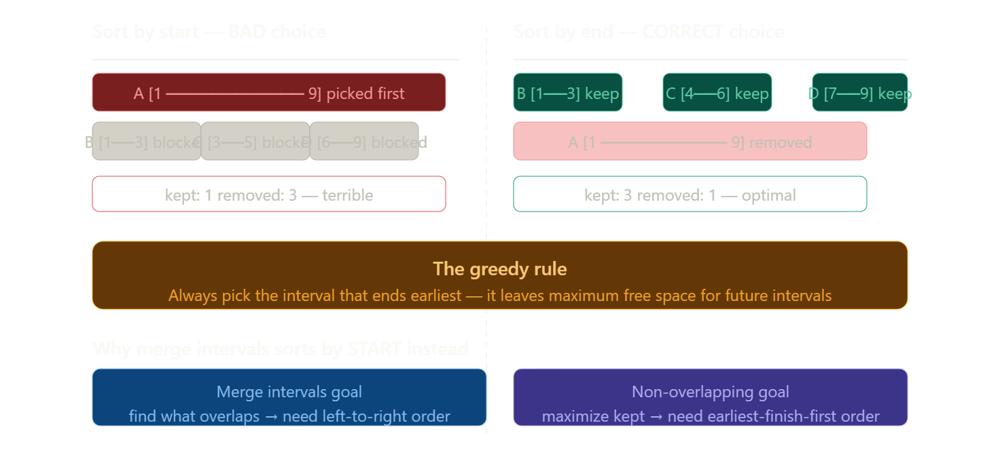
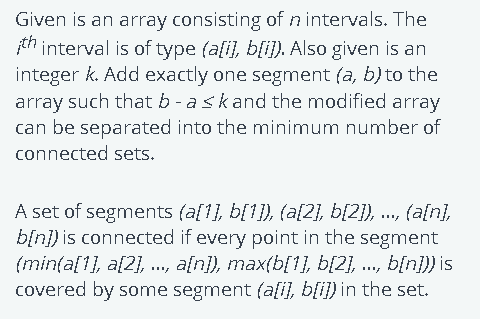
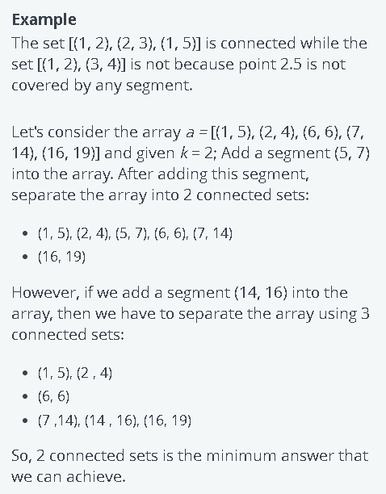
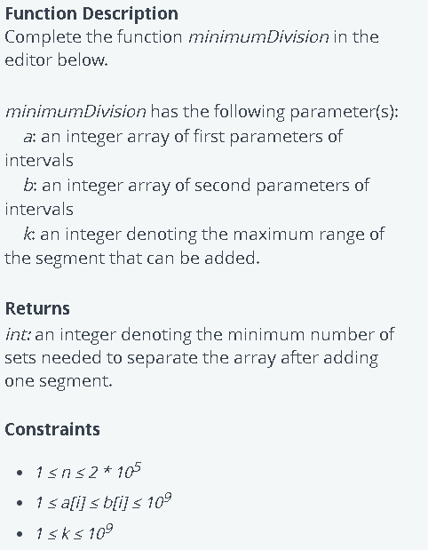

# Interval based problems

## Q1  Merge Intervals

Link--> https://leetcode.com/problems/merge-intervals/submissions/1852993945/

Given an array of `intervals` where `intervals[i] = [starti, endi]`, merge all overlapping intervals, and return an array of the non-overlapping intervals that cover all the intervals in the input.

**Example 1:**

Input: intervals = [[1,3],[2,6],[8,10],[15,18]]

 Output: [[1,6],[8,10],[15,18]] 
 
 Explanation: Since intervals [1,3] and [2,6] overlap, merge them into [1,6].


**Example 2:**

Input: intervals = [[1,4],[4,5]] 

Output: [[1,5]]

 Explanation: Intervals [1,4] and [4,5] are considered overlapping.


**Example 3:**

Input: intervals = [[4,7],[1,4]] 

Output: [[1,7]] Explanation: 

Intervals [1,4] and [4,7] are considered overlapping.


**Constraints:**

* `1 <= intervals.length <= 10^4`
* `intervals[i].length == 2`
* `0 <= starti <= endi <= 10^4`

#### Sort acc to start time

```cpp
#include <vector>
#include <algorithm>

class Solution_Standard {
public:
    vector<vector<int>> merge(vector<vector<int>>& intervals) {
        if (intervals.empty()) {
            return {};
        }

        sort(intervals.begin(), intervals.end(), [](const vector<int>& a, const vector<int>& b) {
            return a[0] < b[0];
        });

        vector<vector<int>> merged_list;

        merged_list.push_back(intervals[0]);

        for (int i = 1; i < intervals.size(); ++i) {
            vector<int>& last_merged = merged_list.back();

            int current_start = intervals[i][0];
            int current_end = intervals[i][1];

            if (current_start <= last_merged[1]) {
                last_merged[1] = max(last_merged[1], current_end);
            } else {
                merged_list.push_back(intervals[i]);
            }
        }

        return merged_list;
    }
};
```
#### Sort acc to end  time java upper vala easy hai
```java
class Solution {
    public int[][] merge(int[][] intervals) {
        Arrays.sort(intervals,(a,b)->a[1]-b[1]);
        List<int[]>l=new ArrayList<>();
        int n=intervals.length-1;
        int start=intervals[n][0];
        int end=intervals[n][1];
        for(int i=n-1;i>=0;i--){
            if(start<=intervals[i][1]){
                start=Math.min(start,intervals[i][0]);
            }
            else{
                l.add(new int[]{start,end});
                start=intervals[i][0];
                end=intervals[i][1];
            }
        }
         l.add(new int[]{start,end}); 
         return l.toArray(new int[l.size()][2]); 
    }
}
```

Both solutions are **correct**, but they use **symmetrical (opposite) strategies**.

Here is the comparison of the two logical approaches.

### 1. The Standard Approach (C++ Code)
This is the most common way to solve "Merge Intervals".
* **Sorting:** Sort by **Start Time** (Ascending).
* **Direction:** Iterate **Forward** (Left to Right).
* **Logic:** "Can I extend my current interval to the **right**?"
    * Since we are sorted by start time, we know the next interval starts *after* or *at the same time* as we do.
    * We only check if the next interval starts *before* our current one ends.
* **Output Order:** Ascending (Sorted).

### 2. The "Reverse" Approach (Java Code)
This is a less common but equally valid strategy.
* **Sorting:** Sort by **End Time** (Ascending).
* **Direction:** Iterate **Backward** (Right to Left).
* **Logic:** "Can I extend my current interval to the **left**?"
    * We start from the interval that ends last.
    * We look at the previous interval `i`. Since we sorted by end time, we know `intervals[i]` ends *before* or *at the same time* as our current interval.
    * **The Check:** `start <= intervals[i][1]`
        * This asks: "Does the previous interval **end** after my current interval **starts**?"
        * If yes, they overlap! We extend our start time to the left: `start = min(start, intervals[i][0])`.
* **Output Order:** Descending (Reverse Sorted).
    * The Java code produces the list `[[start, end], ...]` starting from the largest intervals. `[3, 5], [1, 2]` instead of `[1, 2], [3, 5]`.

### Visual Comparison

| Feature | C++ (Standard) | Java (Reverse) |
| :--- | :--- | :--- |
| **Sort Key** | `a[0]` (Start Time) | `a[1]` (End Time) |
| **Iteration** | `0` $\to$ `N-1` | `N-1` $\to$ `0` |
| **Merge Condition** | `next.start <= curr.end` | `curr.start <= prev.end` |
| **Update Logic** | `curr.end = max(end, next.end)` | `curr.start = min(start, prev.start)` |
| **Result Order** | Ascending | Descending |

### Which one is better?
* **Standard (C++)** is preferred because producing the output in **sorted order** is usually required by the problem statement.
* The **Java approach** produces the result in reverse order. If the problem requires `[[1,3],[8,10]]`, the Java code might return `[[8,10],[1,3]]`, which you might need to reverse again at the end.

## Q2 Non-overlapping Intervals

Given an array of N intervals in the form of (start[i], end[i]), where start[i] is the starting point of the interval and end[i] is the ending point of the interval, return the minimum number of intervals that need to be removed to make the remaining intervals non-overlapping.


Note:

Intervals which only touch at a point are also considered as non-overlapping. For example, [1, 3] and [3, 4] are non-overlapping.


Examples:
---
Input : Intervals = [ [1, 2] , [2, 3] , [3, 4] ,[1, 3] ]


Output : 1


Explanation : You can remove the interval [1, 3] to make the remaining interval non overlapping.

Input : Intervals = [ [1, 3] , [1, 4] , [3, 5] , [3, 4] , [4, 5] ]


Output : 2


Explanation : You can remove the intervals [1, 4] and [3, 5] and the remaining intervals becomes non overlapping.

### solution

>Note : Sort the intervals based on their end times in ascending order to prioritize intervals that finish earliest. This is why we sort in decending order

### Approach 


- Sort the intervals based on their end times in ascending order to prioritize intervals that finish earliest.
- Keep a count of the number of non-overlapping intervals and remember the end time of the last selected interval.
- Go through the sorted intervals starting from the second one. For each interval:
Check if the start time of the current interval is at or after the end time of the last selected interval.
- If it is, select this interval, update the end time to the current interval's end time, and increase the count of non-overlapping intervals.
- Determine the minimum number of intervals to remove by subtracting the count of non-overlapping intervals from the total number of intervals.
- Return the minimum number of intervals to remove to make the rest non-overlapping.



```cpp

class Solution {
    bool static comp(vector<int>& val1, vector<int>& val2) {
        return val1[1] < val2[1];
    }
public:
    int MaximumNonOverlappingIntervals(vector<vector<int>>& intervals) {

        sort(intervals.begin(), intervals.end(),comp);

        int n = intervals.size();
        int cnt = 1;
        int lastEndTime = intervals[0][1];
        for (int i = 1; i < n; i++) {
            if (intervals[i][0] >= lastEndTime) {
                cnt++;
                lastEndTime = intervals[i][1];
            }
        }
        //cnt is number of interval added in result
        return n-cnt;
    }
};
```

### Why do we sort by End Time (Ascending)?

This is a classic Greedy Strategy known as **"Earliest Finish Time First."**

#### The Intuition:
Imagine you are trying to attend as many meetings as possible in a single day.

* **Option A (Sort by Start Time):** You pick the meeting that starts at 8:00 AM. But what if that meeting lasts until 8:00 PM? It blocks the entire day! You can only attend 1 meeting.
* **Option B (Sort by End Time):** You pick the meeting that finishes the soonest. If a meeting ends at 9:00 AM, you are free immediately after to attend another one.

By picking the interval that ends earliest, you leave the **maximum possible room** for future intervals.

---

#### Visual Example
Imagine these intervals:
1.  `[1, 10]` (Starts early, but very long)
2.  `[1, 3]` (Short, finishes early)
3.  `[3, 5]` (Starts after #2 finishes)

**If you sort by Start Time:**
* You pick `[1, 10]` first.
* It overlaps with everything else. 
* **Result:** You attend 1 meeting.

**If you sort by End Time:**
* **Sorted:** `[1, 3]`, `[3, 5]`, `[1, 10]`.
* Pick `[1, 3]`. (Ends at 3).
* Next is `[3, 5]`. Does it start after 3? **Yes**. Pick it. (Ends at 5).
* Next is `[1, 10]`. Does it start after 5? **No**. Skip it.
* **Result:** You attend 2 meetings.

---

### Summary of Code Logic

* **Sort by End Time:** Organize tasks so the ones that free up the resource fastest come first.
* **Iterate:** Always pick the next valid task.
* **`cnt`:** This counts the maximum number of meetings you can attend.
* **`n - cnt`:** The problem asks "how many to remove." If you keep `cnt` intervals, you must remove the rest (`n - cnt`).

Q-->what if we sort by ascednding order start time and is start time equal then descendning end time?

### This approach will FAIL.

Sorting by **Start Time (Ascending)** is generally the wrong strategy for "Maximum Non-Overlapping Intervals" (or Activity Selection), regardless of how you handle ties.

#### 1. The Counter-Example
Imagine you have these three intervals:
* **A:** `[1, 100]` (Starts early, but lasts forever)
* **B:** `[2, 3]`
* **C:** `[4, 5]`

**Your Sorting Strategy:**
1. Sort by Start Time Ascending.
2. Tie-breaker: End Time Descending.

**The Resulting Order:**
1. `[1, 100]` (Starts at 1)
2. `[2, 3]` (Starts at 2)
3. `[4, 5]` (Starts at 4)

**The Execution:**
* You pick the first one: `[1, 100]`.
* Your `lastEndTime` becomes 100.
* Next is `[2, 3]`. Start (2) is less than 100. **Skip (Overlap)**.
* Next is `[4, 5]`. Start (4) is less than 100. **Skip (Overlap)**.

**Your Answer:** 1 interval.  
**Correct Answer:** 2 intervals (`[2, 3]` and `[4, 5]`).

---

#### 2. Why does it fail?
The goal is to fit as many items as possible. To do that, you need to free up the resource (the timeline) as early as possible.

* **Start Time Sorting:** Prioritizes "starting early." It doesn't care if you occupy the room for 100 hours.
* **End Time Sorting (Correct):** Prioritizes "finishing early." It guarantees that once you pick an item, you are available for the next one as soon as possible.

---

#### 3. Where is your strategy used?
Your specific sorting strategy (Start Ascending, End Descending) is actually the standard solution for a different problem: **"Remove Covered Intervals"** (LeetCode 1288).

* **Problem:** Find intervals that are completely inside another interval.
* **Logic:** If `[1, 100]` comes before `[1, 5]`, you can easily see that `[1, 5]` is inside `[1, 100]` because the start is $\ge$ and the end is $\le$.

But for **Non-Overlapping Intervals**, you must strictly stick to **End Time Ascending**.


## Q3 Insert Interval

Given a 2D array Intervals, where Intervals[i] = [start[i], end[i]] represents the start and end of the ith interval, the array represents non-overlapping intervals sorted in ascending order by start[i]. 


Given another array newInterval, where newInterval = [start, end] represents the start and end of another interval, merge newInterval into Intervals such that Intervals remain non-overlapping and sorted in ascending order by start[i].


Return Intervals after the insertion of newInterval.


Examples:
---
Input : Intervals = [ [1, 3] , [6, 9] ] , newInterval = [2, 5]


Output : [ [1, 5] , [6, 9] ]


Explanation : After inserting the newInterval the Intervals array becomes [ [1, 3] , [2, 5] , [6, 9] ].

So to make them non overlapping we can merge the intervals [1, 3] and [2, 5].

So the Intervals array is [ [1, 5] , [6, 9] ].

---
Input : Intervals = [ [1, 2] , [3, 5] , [6, 7] , [8,10] ] , newInterval = [4, 8]


Output : [ [1, 2] , [3, 10] ]


Explanation : The Intervals array after inserting newInterval is [ [1, 2] , [3, 5] , [4, 8] , [6, 7] , [8, 10] ].

We merge the required intervals to make it non overlapping.

So final array is [ [1, 2] , [3, 10] ].
### Solution

We add interval in 3 parts
 
```cpp
class Solution {
public:
    vector<vector<int>> insertNewInterval(vector<vector<int>>& intervals, vector<int>& newInterval){
        if (intervals.empty()) {
            return {};
        }
        int i=0;    
        int n = intervals.size(); 
        vector<vector<int>> res;
        while(i < n && intervals[i][1] < newInterval[0]){
             res.push_back(intervals[i]);
             i = i + 1; 
        } 

        while(i < n && intervals[i][0] <= newInterval[1]){
            newInterval[0] = min(newInterval[0], intervals[i][0]); 
            newInterval[1] = max(newInterval[1], intervals[i][1]); 
            i = i + 1; 
        }
        res.push_back(newInterval); 
        while(i < n){
            res.push_back(intervals[i]); 
            i = i + 1; 
        }
        return res;
    }
};
```
## Q4 DE shaw OA question







These type of questions sometimes they give in 2-d array and sometimes in 2 1-d array so if they give in 2 1-d array you need to put them in 2-d array

### Solution 

1.first merge intervals ,after that no intersection,after merging size is n
2.now we want to join maximum ranges so we put k length interval so step is
 at evry end point we put k-length interval and check how many intervals that k length will cover

 suppose we have (s,e) then we put k length so from e to e+k we get intervals covered 

 so we binary search e+k in the array of e , we either need e+k or element less than e+k so we only need that,then we get index of element e+k or less that e+k than from i to that index count no of elemeents merged and subtract from n


 for each index we do it and get min of that (n-(that elements we merged))

```cpp
#include <vector>
#include <algorithm>
#include <cmath>

using namespace std;

class Solution {
private:
    vector<vector<long long>> getConnectedComponents(vector<vector<long long>>& allIntervals) {
        if (allIntervals.empty()) {
            return {};
        }

        sort(allIntervals.begin(), allIntervals.end(), [](const vector<long long>& a, const vector<long long>& b) {
            return a[0] < b[0];
        });

        vector<vector<long long>> merged_list;
        
        merged_list.push_back(allIntervals[0]);

        for (size_t i = 1; i < allIntervals.size(); ++i) {
            vector<long long>& last_merged = merged_list.back();
            long long current_start = allIntervals[i][0];
            
            if (current_start <= last_merged[1]) {
                last_merged[1] = max(last_merged[1], allIntervals[i][1]);
            } else {
                merged_list.push_back(allIntervals[i]);
            }
        }

        return merged_list;
    }

public:
    int minimumDivision(const vector<int>& a, const vector<int>& b, long long k) {
        int n = a.size();
        if (n == 0) {
            return 0;
        }

        vector<vector<long long>> intervals(n, vector<long long>(2));
        for (int i = 0; i < n; ++i) {
            intervals[i][0] = a[i];
            intervals[i][1] = b[i];
        }

        vector<vector<long long>> components = getConnectedComponents(intervals);
        
        int m = components.size();

        if (m <= 1) {
            return m;
        }

        int max_components_merged = 1; 

        // Create a separate vector of only the starting points of components for binary search
        vector<long long> start_points(m);
        for(int i = 0; i < m; ++i) {
            start_points[i] = components[i][0];
        }

        // Iterate through all possible starting components (C_i). O(M)
        for (int i = 0; i < m; ++i) {
            
            // E_i: End of the starting component (C_i).
            long long E_i = components[i][1];

            // Target search value: The maximum permissible start point for a component C_j to be merged.
            // S_j - E_i <= k  =>  S_j <= E_i + k
            long long target_S_j = E_i + k;

            // Find the first component C_j whose start point S_j is strictly greater than target_S_j.
            // std::upper_bound performs a binary search in O(log M).
            auto it = upper_bound(start_points.begin(), start_points.end(), target_S_j);

            // The component C_j that is the farthest to the right and satisfies S_j <= target_S_j
            // is the element *before* the iterator returned by upper_bound.
            
            // Get the index of the first element GREATER than target_S_j.
            int upper_index = distance(start_points.begin(), it);

            // The index of the farthest mergeable component (C_j) is one less than upper_index.
            // The index must be at least i (since it includes C_i).
            int j = max(i, upper_index - 1);
            
            // Components merged = j - i + 1
            int current_merged_count = j - i + 1;
            
            max_components_merged = max(max_components_merged, current_merged_count);
        }

        return m - max_components_merged + 1;
    }
};
```

The C++ STL function std::distance() is a powerful utility from the <iterator> header (often included via <algorithm> or <numeric>).

Its primary purpose is to calculate the number of steps (or elements) between two iterators in a range.

📝 Key Features and Usage
Header: <iterator> (or often available through <algorithm>)

Syntax:

```C++

distance(InputIterator first, InputIterator last);
```
Return Value: It returns an integer type (std::iterator_traits<InputIterator>::difference_type) representing the number of elements between first and last. The count can be zero or negative.

Calculation: It effectively calculates last - first.

💡 What it Does
std::distance() determines the length of a range defined by two iterators.