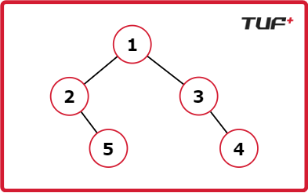

# Notes


.jpg) .jpg) .jpg) .jpg) .jpg) .jpg) .jpg) .jpg) .jpg) .jpg) .jpg) .jpg) .jpg) .jpg) .jpg) .jpg) .jpg) .jpg) .jpg) .jpg) .jpg) .jpg) .jpg) .jpg) .jpg) .jpg) .jpg) .jpg) .jpg)


## Print path from root to  every leaf


Given the root of a binary tree. Return all the root-to-leaf paths in the binary tree.


A leaf node of a binary tree is the node which does not have a left and right child.


Example 1

Input : root = [1, 2, 3, null, 5, null, 4]

Output : [ [1, 2, 5] , [1, 3, 4] ]

Explanation : There are only two paths from root to leaf.

From root 1 to 5 , 1 -> 2 -> 5.

From root 1 to 4 , 1 -> 3 -> 4.




### My sol 1 

```cpp

/**
 * Definition for a binary tree node.
 * struct TreeNode {
 *     int data;
 *     TreeNode *left;
 *     TreeNode *right;
 *      TreeNode(int val) : data(val) , left(nullptr) , right(nullptr) {}
 * };
 **/

class Solution{
	vector<vector<int>> res;
	vector<int> tres;
	void getAllpaths(TreeNode * node){
		if(node->left==nullptr && node->right==nullptr){
			tres.push_back(node->data);
			res.push_back(tres);
			tres.pop_back();
			return;
		}
		tres.push_back(node->data);
		if(node->left!=nullptr){
			getAllpaths(node->left);
		}
		if(node->right!=nullptr){
			getAllpaths(node->right);
		}
		tres.pop_back();
	}
	public:
		vector<vector<int>> allRootToLeaf(TreeNode* root) {
            getAllpaths(root);
			return res;
		}
};
```

### My sol 2

```cpp
/**
 * Definition for a binary tree node.
 * struct TreeNode {
 *     int data;
 *     TreeNode *left;
 *     TreeNode *right;
 *      TreeNode(int val) : data(val) , left(nullptr) , right(nullptr) {}
 * };
 **/

class Solution{
	vector<vector<int>> res;
	vector<int> tres;
	void getAllpaths(TreeNode * node){
		if(node==nullptr) return;
		tres.push_back(node->data);
		if(node->left==nullptr && node->right==nullptr){
			res.push_back(tres);
		}else{
			getAllpaths(node->left);
			getAllpaths(node->right);
		}
		
		tres.pop_back();
	}
	public:
		vector<vector<int>> allRootToLeaf(TreeNode* root) {
            getAllpaths(root);
			return res;
		}
};
```
