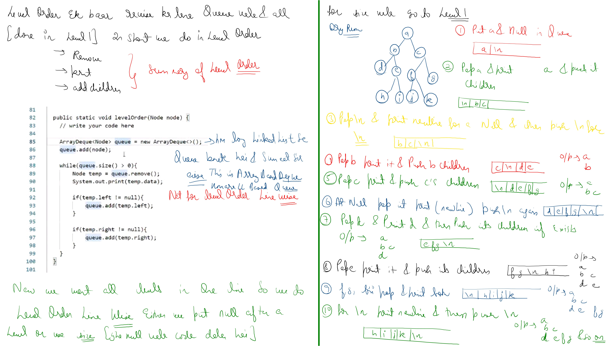

# Notes

## Normal tree
```cpp

#include <bits/stdc++.h>

using namespace std;

class Node {
    public: Node * left;
    Node * right;
    int val;

    Node(int val) {
        this -> val = val;
        this -> left = nullptr;
        this -> right = nullptr;
    }
};

Node * binaryTree() {

    int x;
    cout << "Enter node value" << "\n";
    cin >> x;
    if (x == -1) return nullptr;
    Node * node = new Node(x);

    cout << "Enter left value";
    node -> left = binaryTree();

    cout << "Enter right value";
    node -> right = binaryTree();

    return node;

}

void inorderTraversal(vector < int > & vec, Node * node) {
    if (node == nullptr) return;

    inorderTraversal(vec, node -> left);
    vec.push_back(node -> val);
    inorderTraversal(vec, node -> right);
}

void print(vector < int > & v) {

    for (int i = 0; i < v.size(); i++) {
        cout << v[i] << ",";
    }
}

int main() {
    Node * root = binaryTree();

    vector < int > vec;
    inorderTraversal(vec, root);
    print(vec);
    return 0;
}
```

.jpg) .jpg) .jpg) 

# 1161. Maximum Level Sum of a Binary Tree

Given the `root` of a binary tree, the level of its root is `1`, the level of its children is `2`, and so on.

Return the **smallest** level `x` such that the sum of all the values of nodes at level `x` is **maximal**.

### Example 1:
**Input:** root = [1,7,0,7,-8,null,null]  
**Output:** 2  
**Explanation:** Level 1 sum = 1.  
Level 2 sum = 7 + 0 = 7.  
Level 3 sum = 7 + -8 = -1.  
So we return the level with the maximum sum which is level 2.

### Example 2:
**Input:** root = [989,null,10250,98693,-89388,null,null,null,-32127]  
**Output:** 2  

### Constraints:
* The number of nodes in the tree is in the range `[1, 10^4]`.
* `-10^5 <= Node.val <= 10^5`

Link--> https://leetcode.com/problems/maximum-level-sum-of-a-binary-tree/description/?envType=daily-question&envId=2026-01-06

```cpp
/**
 * Definition for a binary tree node.
 * struct TreeNode {
 *     int val;
 *     TreeNode *left;
 *     TreeNode *right;
 *     TreeNode() : val(0), left(nullptr), right(nullptr) {}
 *     TreeNode(int x) : val(x), left(nullptr), right(nullptr) {}
 *     TreeNode(int x, TreeNode *left, TreeNode *right) : val(x), left(left), right(right) {}
 * };
 */
class Solution {
public:
    int maxLevelSum(TreeNode* root) {
        long long res=-(1e18);
        queue<TreeNode *>q;
        q.push(root);
        int lvl=1;
        int reslvl=-1;
        while(q.size()>0){
            int sz=q.size();
            long long sum=0;
           while(sz-->0){
             TreeNode* node=q.front();
                q.pop();
                sum+=(node->val);
                if(node->left!=nullptr) q.push(node->left);
                if(node->right!=nullptr) q.push(node->right);
           }

           if(sum>res){
            res=sum;
            reslvl=lvl;
           }
           lvl++;
        }
        return reslvl;
    }
};

```


.jpg) .jpg) .jpg) .jpg) .jpg) .jpg)


 .jpg) 
 .jpg) 
 
 ```cpp
#include<bits/stdc++.h>
using namespace std;
struct Node
{
    int data;
    Node* left;
    Node* right;
};
class Solution {
    public:
      // Function to return a list of nodes visible from the top view
      // from left to right in Binary Tree.
      vector<int> topView(Node *root) {
          vector<int> res;
          unordered_map<int,Node*>mp;
          queue<pair<Node*,int>>q;
          int left=0,right=0;
          q.push({root,0});
          while(q.size()>0){
              int sz=q.size();
              while(sz-->0){
                  pair<Node*,int> rem=q.front();
                  q.pop();
                  if(mp.find(rem.second)!=mp.end()){
                      mp[rem.second]=rem.first;
                  }
                  if(rem.second<left) left=rem.second;
                  if(rem.second>right) right=rem.second;
                  if(rem.first->left!=nullptr){
                      q.push({rem.first->left,rem.second-1});
                  }
                   if(rem.first->right!=nullptr){
                      q.push({rem.first->right,rem.second+1});
                  }
              }
          }
          
          for(int i=left;i<=right;i++){
              res.push_back(mp[i]->data);
          }
          return res;
          
    }
}
```
 
 .jpg) .jpg) .jpg) .jpg) .jpg) .jpg) .jpg) .jpg) 