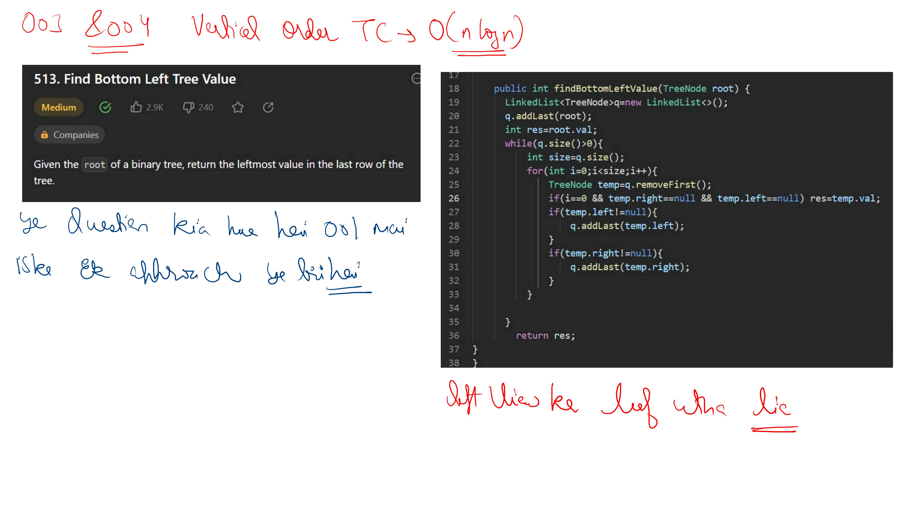

# Notes

.jpg) .jpg) .jpg)
.jpg) .jpg) .jpg) .jpg) .jpg) .jpg) .jpg) 


---

See this code is of Find inorder predecessor and succesor in BST 

```cpp
/**
 * Definition for a binary tree node.
 * struct TreeNode {
 *     int data;
 *     TreeNode *left;
 *     TreeNode *right;
 *      TreeNode(int val) : data(val) , left(nullptr) , right(nullptr) {}
 * };
 **/

class Solution {
    TreeNode* ancpred = nullptr;
    TreeNode* ancsucc = nullptr;
    TreeNode* inorderPred(TreeNode* node) {
        if (node->left == nullptr) return nullptr;
        TreeNode* curr = node->left;
        while (curr->right != nullptr) curr = curr->right;
        return curr;
    }
    TreeNode* inorderSucc(TreeNode* node) {
        if (node->right == nullptr) return nullptr;
        TreeNode* curr = node->right;
        while (curr->left != nullptr) curr = curr->left;
        return curr;
    }
    TreeNode* find(TreeNode* root, int val) {
        if (root == nullptr) return root;
        if (val == root->data) return root;
        if (val > root->data) {
            ancpred = root;
            return find(root->right, val);
        } else {
            ancsucc = root;
            return find(root->left, val);
        }
    }

   public:
    vector<int> succPredBST(TreeNode* root, int key) {
        TreeNode* node = find(root, key);
        vector<int> res(2, -1);
        TreeNode* pred = inorderPred(node);
        TreeNode* succ = inorderSucc(node);
        if (pred != nullptr)
            res[0] = pred->data;
        else if (ancpred != nullptr)
            res[0] = ancpred->data;
        if (succ != nullptr)
            res[1] = succ->data;
        else if (ancsucc != nullptr)
            res[1] = ancsucc->data;
        return res;
    }
};
```
### Scope Difference (The "Ancestor" Problem)

**1. General Predecessor (Global):**
* If a node has no left child, its "Predecessor" is actually one of its **ancestors (parents)** further up the tree.
* **Example:** In a tree `1 -> 2` (2 is the right child), the predecessor of 2 is 1. Standard logic usually requires a stack or parent pointers to find this.

**2. Morris Predecessor (Local):**
* The Morris algorithm only looks for a predecessor **inside the left subtree**.
* If `curr->left` is `NULL`, Morris says "No predecessor logic needed here," and simply moves to the right.
* It does **not** attempt to find the ancestor-predecessor.


### In the context of the Morris Traversal algorithm, the "Predecessor" logic never looks up to ancestors. It is strictly limited to the Left Subtree.

Here is the precise distinction that confirms your statement:

---

### 1. General Inorder Predecessor (The Mathematical Definition)
If you ask for the inorder predecessor of a node `X`:

* **Case A (Has Left Child):** It is the **rightmost** node in `X`'s left subtree.
* **Case B (No Left Child):** It is the **nearest ancestor** where `X` is in the right subtree.

---

### 2. Morris Predecessor (The Algorithmic Step)
The helper function inside Morris Traversal `getPredecessor(curr)` only handles **Case A**.

* **Logic:** It goes to `curr->left`, then keeps going right until the end.

#### Why no Ancestors?
If `curr` has **no left child (Case B)**, the Morris algorithm **doesn't look for a predecessor at all.**
* It simply says: *"No left child? Okay, print curr and move to `curr->right`."*
* It relies on the **thread** created previously (by the ancestor) to have brought us here, but it does not actively search back for that ancestor.


.jpg) .jpg) .jpg) .jpg) .jpg) .jpg) .jpg) .jpg) .jpg) .jpg) .jpg) .jpg) .jpg) .jpg) .jpg) .jpg) .jpg) .jpg) .jpg) 

### Inorder morris
```cpp

class Solution {
private:
TreeNode * getInorderPredecessor(TreeNode * node){
    TreeNode *tnode=node->left;
    while(tnode->right!=nullptr && tnode->right!=node) tnode=tnode->right;
    return tnode;
}
public:
    vector<int> getInorder(TreeNode* root) {
    	vector<int> res;
        TreeNode * curr=root;
        while(curr!=nullptr){
            if(curr->left==nullptr){
                res.push_back(curr->data);
                curr=curr->right;
            }else {
                TreeNode *inorderPredecessor=getInorderPredecessor(curr);
                if(inorderPredecessor->right==nullptr){
                    //need to traverse

                    //res.push_back(curr->data);
                    inorderPredecessor->right=curr;
                    curr=curr->left;
                }else{
                    //already traversed

                    inorderPredecessor->right=nullptr;

                    //as inorder is L N R so to print current node if left tree is there we must
                    //travel left tree so that's why putting the data here

                    //if it was preorder then need to uncomment line 45 as that is N L R 
                    // so node 1st traversed then we go to left subtree so print in untraversed part
                    res.push_back(curr->data);
                    curr=curr->right;
                }
            }
        }
        return res;
    }
};

```

### The "Senior Engineer" Breakdown: Why Morris Traversal is Dangerous
The "issue with threads" in Morris Traversal refers to **Thread Safety (Concurrency)**, not the "threaded pointers" used by the algorithm itself. Here is why Morris Traversal is risky in a multi-threaded environment (like a web server or high-frequency trading system).

### 1. The "Physical Mutation" Risk
Most traversal algorithms (Recursion, Stack, Queue) are **Read-Only**. You can have 1,000 threads reading a tree simultaneously with a Stack approach, and they will never interfere.

**Morris Traversal is a Write operation disguised as a Read operation.**
To save space, it temporarily "rewires" the tree by changing a `null` right child to point back to the current node (creating a temporary cycle).

#### The Disaster Scenario (Race Condition)
Imagine **Thread A** is validating the BST using Morris Traversal, and **Thread B** just wants to search for a value.
1. **Thread A** is at Node 50. It finds the predecessor (Node 40) and links `40.right = 50`.
2. **Thread B** wakes up and searches for Node 45. It reaches Node 40.
3. **Thread B** checks `40.right`. In a normal tree, this is `null`. But right now, it points to 50.
4. **Thread B** follows the link to 50, thinking 50 is the right child of 40.

**Result:** Thread B enters an **Infinite Loop** (50 $\to$ 40 $\to$ 50) or returns incorrect data because the tree topology is physically broken.

### 2. The "Crash & Corrupt" Risk
What happens if a thread crashes halfway through the traversal?
* **Recursion/Stack:** The stack is reclaimed, and the tree remains untouched.
* **Morris:** If the thread dies while "temporary" links are active, those links are **never removed**.

**Result:** Your tree is now **permanently corrupted** with random cycles. The next time any code tries to traverse it, that code will crash the system.

### 3. The Performance Illusion (Cache Coherency)
Even with locks, Morris Traversal "dirties" memory pages.
* Since you are writing to pointers (changing `null` to `curr`), the CPU marks those cache lines as **modified**.
* This forces other CPU cores to invalidate their cache of the tree structure.

**The Irony:** You used Morris to save space ($O(1)$), but by mutating pointers, you triggered **Cache Coherency traffic** that might make it slower than a Stack approach in a multi-core system.

---

### Summary for Interview
> "While Morris Traversal is elegant for $O(1)$ space, it is **not thread-safe** because it mutates the tree structure during traversal. In a concurrent environment, this causes 'dirty reads' where other threads see cycles, and risks permanent corruption if the traversal crashes before restoring pointers. I would only use it in strictly single-threaded, memory-constrained environments, such as embedded systems."