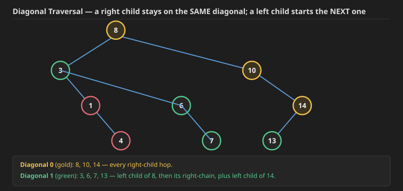

## Q1. Vertical Order Traversal of a Binary Tree (LeetCode 987)


**Problem:** Given the `root` of a binary tree, calculate the **vertical order traversal** of the binary tree.

For each node at position `(row, col)`, its left and right children will be at positions `(row + 1, col - 1)` and `(row + 1, col + 1)` respectively. The root of the tree is at `(0, 0)`.

The **vertical order traversal** of a binary tree is a list of top-to-bottom orderings for each column index starting from the leftmost column and ending on the rightmost column. There may be multiple nodes in the same row and same column. In such a case, sort these nodes by their values.

Return *the **vertical order traversal** of the binary tree*.

**Example 1:**
```
Input: root = [3,9,20,null,null,15,7]
Output: [[9],[3,15],[20],[7]]
Explanation:
Column -1: Only node 9 is in this column.
Column 0: Nodes 3 and 15 are in this column in that order from top to bottom.
Column 1: Only node 20 is in this column.
Column 2: Only node 7 is in this column.
```

**Example 2:**
```
Input: root = [1,2,3,4,5,6,7]
Output: [[4],[2],[1,5,6],[3],[7]]
Explanation:
Column -2: Only node 4 is in this column.
Column -1: Only node 2 is in this column.
Column 0: Nodes 1, 5, and 6 are in this column.
       1 is at the top, so it comes first.
       5 and 6 are at the same position (2, 0), so we order them by their value, 5 before 6.
Column 1: Only node 3 is in this column.
Column 2: Only node 7 is in this column.
```

**Example 3:**
```
Input: root = [1,2,3,4,6,5,7]
Output: [[4],[2],[1,5,6],[3],[7]]
Explanation:
This case is the exact same as example 2, but with nodes 5 and 6 swapped.
Note that the solution remains the same since 5 and 6 are in the same location
and should be ordered by their values.
```

**Constraints:**
- The number of nodes in the tree is in the range `[1, 1000]`.
- `0 <= Node.val <= 1000`

**The key idea:** unlike a normal level order traversal, here we need to track **both** the horizontal level (`h`, i.e. the row — needed to order nodes top-to-bottom within a column, and to break ties by value when two nodes share the exact same row *and* column) **and** the vertical level (`v`, i.e. the column — needed to group nodes into the right output list, and to know the overall left-to-right column range).

Store a `HashMap<Integer, PriorityQueue<Pair>>`, keyed by vertical column `v`; the value is a min-heap of `(node, h)` pairs ordered by `h` first, then by node value on ties — so a plain `ArrayList` would need an explicit sort before extraction, but a `PriorityQueue` keeps things sorted automatically as elements are inserted, which is why the existing code below builds the heap's comparator to break ties on `h` first, then on value.

**Dry run** on `root = [3,9,20,null,null,15,7]`: BFS starting `(3, h=0, v=0)`. Pop `3` → map `{0: [(3,0)]}`; push `(9, h=1, v=-1)` and `(20, h=1, v=1)`. Pop `9` → map `{-1: [(9,1)], 0: [(3,0)]}`; no children. Pop `20` → map `{1: [(20,1)]}`; push `(15, h=2, v=0)` and `(7, h=2, v=2)`. Pop `15` → map `{0: [(3,0), (15,2)]}` (the priority queue keeps `3` before `15` since `h=0 < h=2`). Pop `7` → map `{2: [(7,2)]}`. Final columns range from `-1` to `2`, and reading each column's heap top-to-bottom gives `[[9], [3,15], [20], [7]]`, matching the expected output.

This is exactly BFS at heart — the code already existing below implements this with a `LinkedList` as the queue and a `HashMap<Integer, PriorityQueue<Pair>>`, and it's already correct and accepted in both Java and C++, so it's left untouched below.

.jpg) .jpg) .jpg) .jpg) .jpg) 

## Java code

```java

class Solution {
    class pair{
        TreeNode node;
        int h;
        int v;
        pair(TreeNode node,int h,int v){
            this.node=node;
            this.h=h;
            this.v=v;
        }
    }
    public List<List<Integer>> verticalTraversal(TreeNode root) {
        LinkedList<pair>q=new LinkedList<>();
        q.addLast(new pair(root,0,0));

        Map<Integer,PriorityQueue<pair>>mp=new HashMap<>();

        int lmv=0,rmv=0;
        while(q.size()>0){
            pair temp=q.removeFirst();
            if(temp.v<lmv) lmv=temp.v;
            if(temp.v>rmv) rmv=temp.v;
            if(mp.containsKey(temp.v)==false){
                mp.put(temp.v,new PriorityQueue<>((a,b)->{
                  return a.h==b.h? a.node.val-b.node.val:a.h-b.h;
                }));
            }
            mp.get(temp.v).add(temp);
            if(temp.node.left!=null){
                q.addLast(new pair(temp.node.left,temp.h+1,temp.v-1));
            }
            if(temp.node.right!=null){
                q.addLast(new pair(temp.node.right,temp.h+1,temp.v+1));
            }
        }
        List<List<Integer>>res=new ArrayList<>();
        int idx=0;
        for(int vlvl=lmv;vlvl<=rmv;vlvl++){
            List<Integer>tres=new ArrayList<>();
            PriorityQueue<pair>pq=mp.get(vlvl);
            while(pq.size()>0){
                pair rem=pq.remove();
                tres.add(rem.node.val);
            }
            res.add(tres);
        }
        return res;
    }
}

```


## Cpp solution ,same as above but good one

```cpp
class Solution {
public:
    vector<vector<int>> verticalTraversal(TreeNode* root) {
        // List to store the final result
        vector<vector<int>> result;

        if (root == nullptr) {
            return result;
        }
        map<int, map<int, priority_queue<int, vector<int>, greater<int>>>> nodesMap;
        queue<pair<TreeNode*, pair<int, int>>> q;
        q.push({root, {0, 0}});  // (node, {x, y})
        while (!q.empty()) {
            auto p = q.front();
            q.pop();
            TreeNode* node = p.first;
            int x = p.second.first;
            int y = p.second.second;
            nodesMap[x][y].push(node->data);
            if (node->left != nullptr) {
                q.push({node->left, {x - 1, y + 1}});
            }
            if (node->right != nullptr) {
                q.push({node->right, {x + 1, y + 1}});
            }
        }
        for (auto& p : nodesMap) {
            vector<int> column;
            for (auto& q : p.second) {
                while (!q.second.empty()) {
                    column.push_back(q.second.top());
                    q.second.pop();
                }
            }
            result.push_back(column);
        }

        return result;
    }
};
```
# Vertical Order Traversal: Logic & Structure

This implementation is highly efficient because it leverages the C++ Standard Template Library (STL) to handle sorting logic automatically. By using a nested map structure combined with a min-heap, you ensure that the final output adheres to the three required constraints: column order, row order, and value order for ties.

---

### 1. The Data Structure Breakdown
`map<int, map<int, priority_queue<int, vector<int>, greater<int>>>> nodesMap;`

* **Outer `map<int, ...>`**: Manages the **Horizontal Level ($x$)**. Because `std::map` is an ordered associative container, it automatically arranges your columns from left to right (e.g., -2, -1, 0, 1, 2).
* **Inner `map<int, ...>`**: Manages the **Vertical Level ($y$)**. This ensures that within a single column, nodes are processed strictly from top to bottom.
* **`priority_queue<..., greater<int>>`**: This acts as a **Min-Heap**. If multiple nodes exist at the exact same $(x, y)$ coordinate, the min-heap ensures the smallest value is retrieved first, satisfying the tie-breaker rule.

---

### 2. Why this is better than a simple vector
Using a `vector` inside the inner map would require a manual sorting step for every coordinate pair before finalizing the results. By using a **Min-Heap**, you maintain the sorting property dynamically during the insertion phase. This makes the code:
1.  **More elegant**: The logic is declarative rather than imperative.
2.  **Less error-prone**: You avoid forgetting a `.sort()` call on specific sub-vectors.
3.  **Streamlined**: The final extraction involves simply popping elements until the heap is empty.

---

### 3. Complexity Analysis

| Metric | Complexity | Explanation |
| :--- | :--- | :--- |
| **Time Complexity** | $O(N \log N)$ | Each of the $N$ nodes is inserted into maps and a priority queue. Each insertion takes logarithmic time relative to the number of elements. |
| **Space Complexity** | $O(N)$ | You are storing every node exactly once within the nested data structure. |

---

### 4. Implementation Snippet
```cpp
// Example of how the traversal might be structured
void traverse(TreeNode* root, int x, int y, auto& nodesMap) {
    if (!root) return;
    
    // Insert node value into the min-heap at specific (x, y)
    nodesMap[x][y].push(root->val);
    
    // Standard DFS approach
    traverse(root->left, x - 1, y + 1, nodesMap);
    traverse(root->right, x + 1, y + 1, nodesMap);
}
```

## Q2. Diagonal Traversal of Binary Tree (GFG)

Now let's move to another question: Diagonal Traversal of a Binary Tree. Think about it — it's rated a Medium-difficulty question, but the idea is short once it clicks.

**Problem:** Given a Binary Tree, print the **diagonal traversal** of the binary tree.

Consider lines of slope -1 passing between nodes. Given a Binary Tree, print all diagonal elements in a binary tree belonging to the same line.

If the diagonal elements are present in two different subtrees, then the left subtree's diagonal elements should be taken first, and then the right subtree's.

**Example:**
```
Input:
              8
           /     \
          3       10
         /  \        \
        1    6       14
            /  \      /
           4    7   13

Output: 8 10 14 3 6 7 13 1 4
```

**Constraints:**
- `1 <= Number of nodes <= 10^5`
- `1 <= Data of a node <= 10^5`

**Expected Time Complexity:** `O(N)`.
**Expected Auxiliary Space:** `O(N)`.

**The core idea:** a **right child stays on the same diagonal** as its parent; a **left child starts a new diagonal**, one further along.


.jpg) .jpg) .jpg) .jpg) .jpg) 
### Approach 1: BFS with a queue

Keep a queue of `(node, diagonal)` pairs, starting with `(root, 0)`. Pop a pair, record its node's value into a `Map<diagonal, List<value>>`, then push `(node.left, diagonal+1)` and `(node.right, diagonal)` (same diagonal for the right child). Track the maximum diagonal number seen. At the end, concatenate the map's lists in order `0, 1, 2, ..., maxDiagonal`.

**Dry run** on the example above (`8(3(1(_,4), 6(_,7)), 10(_,14(13,_)))`):
- Pop `(8,0)`: map `{0:[8]}`. Push `(3,1)`, `(10,0)`.
- Pop `(3,1)`: map `{0:[8], 1:[3]}`. Push `(1,2)`, `(6,1)`.
- Pop `(10,0)`: map `{0:[8,10]}`. `10.left` is null; push `(14,0)`.
- Pop `(1,2)`: map `{2:[1]}`. `1.left` is null; push `(4,2)`.
- Pop `(6,1)`: map `{1:[3,6]}`. `6.left` is null; push `(7,1)`.
- Pop `(14,0)`: map `{0:[8,10,14]}`. Push `(13,1)` (`14.left`); `14.right` is null.
- Pop `(4,2)`: map `{2:[1,4]}`.
- Pop `(7,1)`: map `{1:[3,6,7]}`.
- Pop `(13,1)`: map `{1:[3,6,7,13]}`.

Concatenating diagonals `0, 1, 2`: `[8,10,14] + [3,6,7,13] + [1,4] = [8,10,14,3,6,7,13,1,4]`, matching the expected output exactly.

**Java** (submitted without errors):
```java
class Tree {
    class pair {
        Node node;
        int diag;
        pair(Node node, int diag) {
            this.node = node;
            this.diag = diag;
        }
    }

    public ArrayList<Integer> diagonal(Node root) {
        int mxdiag = 0;
        LinkedList<pair> q = new LinkedList<>();
        Map<Integer, List<Integer>> mp = new HashMap<>();
        q.addLast(new pair(root, 0));
        while (q.size() > 0) {
            pair temp = q.removeFirst();
            if (temp.diag > mxdiag) mxdiag = temp.diag;
            if (mp.containsKey(temp.diag) == false)
                mp.put(temp.diag, new ArrayList<>());
            mp.get(temp.diag).add(temp.node.data);
            if (temp.node.left != null) {
                q.addLast(new pair(temp.node.left, temp.diag + 1));
            }
            if (temp.node.right != null) {
                q.addLast(new pair(temp.node.right, temp.diag));
            }
        }
        ArrayList<Integer> res = new ArrayList<>();
        for (int i = 0; i <= mxdiag; i++) {
            List<Integer> tres = mp.get(i);
            for (var val : tres) {
                res.add(val);
            }
        }
        return res;
    }
}
```

**C++** (same logic, added since only Java existed):
```cpp
class Tree {
    struct pair_ {
        Node* node;
        int diag;
        pair_(Node* node, int diag) : node(node), diag(diag) {}
    };

public:
    vector<int> diagonal(Node* root) {
        int mxdiag = 0;
        deque<pair_> q;
        map<int, vector<int>> mp;
        q.push_back(pair_(root, 0));
        while (q.size() > 0) {
            pair_ temp = q.front();
            q.pop_front();
            if (temp.diag > mxdiag) mxdiag = temp.diag;
            mp[temp.diag].push_back(temp.node->data);
            if (temp.node->left != nullptr) {
                q.push_back(pair_(temp.node->left, temp.diag + 1));
            }
            if (temp.node->right != nullptr) {
                q.push_back(pair_(temp.node->right, temp.diag));
            }
        }
        vector<int> res;
        for (int i = 0; i <= mxdiag; i++) {
            for (int val : mp[i]) {
                res.push_back(val);
            }
        }
        return res;
    }
};
```

### Approach 2: Recursive (DFS-based) — same idea, no queue needed

Pass the current diagonal number down as a recursion parameter: recurse left with `diagonal + 1`, recurse right with the same `diagonal`, adding the current node to `map[diagonal]` before recursing.

**A boundary case worth watching for:** if the tree is empty (`root == null`), `mxdiag` never gets updated away from its default `0`, but the map has no entry for key `0` either — so the extraction loop's `mp.get(0)` would return `null`, and iterating over it throws a `NullPointerException`. Two ways to fix this: **(1)** initialize `mxdiag` to `-1` so the extraction loop's condition (`i <= mxdiag`) is false immediately for an empty tree, or **(2)** add `if (tres == null) continue;` inside the extraction loop.

**Java:**
```java
class Tree {
    private void solveRecursive(Node root, Map<Integer, List<Integer>> mp, int diag, int[] mxdiag) {
        if (root == null) return;
        if (mp.containsKey(diag) == false) {
            mp.put(diag, new ArrayList<>());
        }
        mp.get(diag).add(root.data);
        if (diag > mxdiag[0]) mxdiag[0] = diag;
        solveRecursive(root.left, mp, diag + 1, mxdiag);
        solveRecursive(root.right, mp, diag, mxdiag);
    }

    public ArrayList<Integer> diagonal(Node root) {
        Map<Integer, List<Integer>> mp = new HashMap<>();
        int[] mxdiag = new int[]{-1}; // -1 guards against an empty tree
        solveRecursive(root, mp, 0, mxdiag);
        ArrayList<Integer> res = new ArrayList<>();
        for (int i = 0; i <= mxdiag[0]; i++) {
            List<Integer> tres = mp.get(i);
            for (var val : tres) {
                res.add(val);
            }
        }
        return res;
    }
}
```

**C++:**
```cpp
class Tree {
    void solveRecursive(Node* root, map<int, vector<int>>& mp, int diag, int& mxdiag) {
        if (root == nullptr) return;
        mp[diag].push_back(root->data);
        if (diag > mxdiag) mxdiag = diag;
        solveRecursive(root->left, mp, diag + 1, mxdiag);
        solveRecursive(root->right, mp, diag, mxdiag);
    }

public:
    vector<int> diagonal(Node* root) {
        map<int, vector<int>> mp;
        int mxdiag = -1; // guards against an empty tree
        solveRecursive(root, mp, 0, mxdiag);
        vector<int> res;
        for (int i = 0; i <= mxdiag; i++) {
            for (int val : mp[i]) {
                res.push_back(val);
            }
        }
        return res;
    }
};
```

**Time Complexity: `O(N)`** for both approaches — every node is visited exactly once, doing `O(1)` map insertion work (amortized, for a `HashMap`; `O(log N)` per insertion for C++'s `map`, giving `O(N log N)` there specifically — using an `unordered_map` instead would restore the `O(N)` bound in C++ too).
**Space Complexity: `O(N)`** — the map holds every node's value exactly once, plus `O(N)` for the BFS queue (Approach 1, worst case a completely left-skewed tree) or `O(H)` for the recursion stack (Approach 2).


## Q3. Boundary Traversal of Binary Tree (GFG)

**Problem:** Given a Binary Tree, find its **Boundary Traversal**. The traversal should be in the following order:
1. **Left boundary nodes**: defined as the path from the root to the left-most node (a node with no left child, and if it has no left child, is not a leaf, take its right child). The left-most node is **NOT** included in this set.
2. **Leaf nodes**: All the leaf nodes, from left to right, that are **not** part of the left or right boundary.
3. **Reverse right boundary nodes**: defined as the path from the right-most node to the root. The right-most node is **NOT** included in this set. This is traversed in reverse order, so that it can be combined with the left boundary and leaf nodes to form a clockwise boundary of the tree.

Note: If the root doesn't have a left subtree or a right subtree, then the root itself is the left-most or right-most node, respectively. Also, if a node happens to be both a leaf and part of the left/right boundary, it belongs to the boundary only (it's not double-counted as a leaf).

**Example:**
```
Input:
              1
           /     \
          2       3
         /  \       \
        4    5       6
            /  \     /
           7    8   9

Output: 1 2 4 7 8 9 6 3
```

**Expected Time Complexity:** `O(N)`. **Expected Auxiliary Space:** `O(N)`.

**A tempting but wrong shortcut:** it's natural to think Boundary Traversal is just `LeftView + BottomView + reverse(RightView)`. This can go wrong, though — **Bottom View** includes whichever node happens to be the *last* one visited in each column, which can be an **internal** node (one that still has children), not necessarily a leaf.


 For example, in a tree `a(b, c(d, e))`, the Bottom View is `b, d, c, e` — but `c` has children `d` and `e`, so `c` should **not** appear in the true boundary at all (it's neither a true leaf nor on the outer edge in the way Boundary Traversal defines it). This is exactly why Boundary Traversal needs its own dedicated left-boundary / leaves / right-boundary logic, rather than being assembled from the three standard "views."

**The three pieces, and how they're combined:**
- The **left boundary** is filled top-down, in the natural (preorder-like) order it's visited.
- The **right boundary** is filled bottom-up — which is exactly why the existing `traverseright` function below adds the current node to the result **after** its recursive call returns, achieving the reversed order without needing an explicit `reverse()` step afterward.
- A node with no children (a genuine leaf) is excluded from both the left-boundary and right-boundary walks (they stop as soon as they would reach a leaf), and leaves are instead collected once, separately, via a plain left-to-right DFS over all leaves.

**A few implementation pitfalls worth knowing** (found while arriving at the correct version below):
1. **Don't add a leaf inside the left/right boundary walk.** If `traverseleft`/`traverseright` kept recursing all the way to an actual leaf and added it too, that leaf would be double-counted (once by the boundary walk, once by the leaf-collection pass) — the fix is to stop and return immediately once a node with no children is reached, without adding it.
2. **Don't double-count the root.** Calling `traverseleft(root, res)` (instead of `traverseleft(root.left, res)`) would add the root a second time, since the root is already added once at the very start. The boundary walks must start from `root.left` / `root.right`, not `root` itself.
3. **Watch the single-node tree edge case.** If leaf-collection is called just once as `traverseleaves(root, res)`, a tree with only a root node would get that root added as a "leaf" *in addition to* it already being added as the root — calling leaf-collection **twice**, once on `root.left` and once on `root.right`, sidesteps this (for a single-node tree, both calls immediately hit `null` and add nothing).

**Dry run** on a custom tree `a(b(d(h(i,j),_), e(k,l)), c(f, g(m(n,o),_)))`:
- **Left boundary** (from `root.left = b`, stopping before the first leaf): `b` (has children) → `d` (has children) → `h` (has children) → `h.left = i` is a leaf, so the walk stops here without adding `i`. Left boundary so far: `[b, d, h]`.
- **Leaves, left subtree of root** (`b`'s subtree, left to right): `i, j` (under `h`), then `k, l` (under `e`). Gives `[i, j, k, l]`.
- **Leaves, right subtree of root** (`c`'s subtree, left to right): `f` (a leaf itself), then `n, o` (under `m`). Gives `[f, n, o]`.
- **Right boundary** (from `root.right = c`, stopping before the first leaf, then reversed): the path down is `c → g → m → o` (`o` is a leaf, stop before adding it); reversed, this contributes `[m, g, c]`.

**Full result:** `a` (root) `+ [b,d,h] + [i,j,k,l] + [f,n,o] + [m,g,c]` = **`a, b, d, h, i, j, k, l, f, n, o, m, g, c`**.


```java


class Solution {
        public void traverseleft(TreeNode root,List<Integer>res){
		if(root==null) return;
        //as dont print leaf leaf orinted in other method
		if(root.left==null && root.right==null) return;
		res.add(root.data);
		if(root.left!=null) traverseleft(root.left,res);
		else traverseleft(root.right,res);
	}
	public void traverseleaves(TreeNode root,List<Integer>res){
		if(root==null) return ;
		if(root.left==null && root.right==null) {
		    res.add(root.data);
		    return;
		    
		}
		traverseleaves(root.left,res);
		traverseleaves(root.right,res);
	}

	public void traverseright(TreeNode root,List<Integer>res){
		if(root==null) return;
	    if(root.left==null && root.right==null) return;
         //as dont print leaf leaf orinted in other method
		if(root.right!=null) traverseright(root.right,res);
		else traverseright(root.left,res);
		res.add(root.data);
	}
    public List<Integer> boundary(TreeNode root) {
        List<Integer>res=new ArrayList<>();
		if(root==null) return res;
		res.add(root.data);
		traverseleft(root.left,res);
		traverseleaves(root.left,res);
		traverseleaves(root.right,res);
		traverseright(root.right,res);
		return res;
    }
}
```

**C++** (same logic, added since only Java existed):
```cpp
class Solution {
public:
    void traverseleft(TreeNode* root, vector<int>& res) {
        if (root == nullptr) return;
        if (root->left == nullptr && root->right == nullptr) return;
        res.push_back(root->data);
        if (root->left != nullptr) traverseleft(root->left, res);
        else traverseleft(root->right, res);
    }

    void traverseleaves(TreeNode* root, vector<int>& res) {
        if (root == nullptr) return;
        if (root->left == nullptr && root->right == nullptr) {
            res.push_back(root->data);
            return;
        }
        traverseleaves(root->left, res);
        traverseleaves(root->right, res);
    }

    void traverseright(TreeNode* root, vector<int>& res) {
        if (root == nullptr) return;
        if (root->left == nullptr && root->right == nullptr) return;
        if (root->right != nullptr) traverseright(root->right, res);
        else traverseright(root->left, res);
        res.push_back(root->data);
    }

    vector<int> boundary(TreeNode* root) {
        vector<int> res;
        if (root == nullptr) return res;
        res.push_back(root->data);
        traverseleft(root->left, res);
        traverseleaves(root->left, res);
        traverseleaves(root->right, res);
        traverseright(root->right, res);
        return res;
    }
};
```

# Time Complexity Analysis: Boundary Traversal

The overall time complexity of this algorithm is **$O(N)$**, where **$N$** is the total number of nodes in the binary tree. 

### Why is it $O(N)$?
Even though the logic is split into four separate functions, we are essentially performing a few linear passes over different sections of the tree.

---

### 1. Breakdown by Phase
| Phase | Logic | Complexity |
| :--- | :--- | :--- |
| **Root Access** | A simple $O(1)$ operation to add the first node. | $O(1)$ |
| **Left Boundary** | Travels from the root down to the bottom-left. In the worst case (a skewed tree), it visits $H$ nodes (Height of the tree). | $O(H)$ |
| **Leaf Traversal** | This is a full Depth First Search (DFS) that visits **every node** in the tree to check if it's a leaf. | $O(N)$ |
| **Right Boundary** | Similar to the left boundary, it travels from the root down the right side, visiting $H$ nodes. | $O(H)$ |

---

### 2. Final Calculation
The total work done is the sum of these parts:
$$T(n) = O(1) + O(H) + O(N) + O(H)$$

Since the height of a tree ($H$) can at most be $N$ (in a skewed tree) and is usually $\log N$ in a balanced tree, the **$O(N)$** term from the leaf traversal dominates the overall complexity.

---

### 3. Space Complexity
* **$O(H)$**: This is determined by the recursion stack. 
    * In a **balanced tree**, the space complexity is $O(\log N)$.
    * In a **skewed tree**, the space complexity is $O(N)$.
* Additionally, we use **$O(N)$** space to store the result in the `ArrayList`.

---

### Summary for Interviews
> "The time complexity is linear, **$O(N)$**, because the leaf traversal phase must visit every node in the tree exactly once to identify the leaves. The boundary traversals (left and right) only visit nodes along the height of the tree, which is at most $N$ but typically much less."