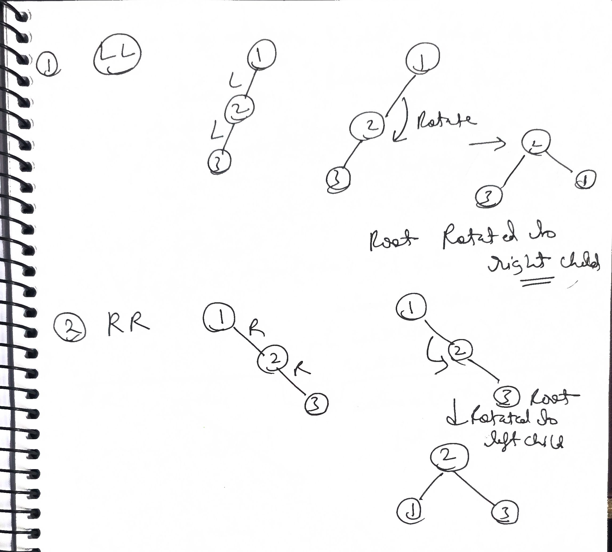
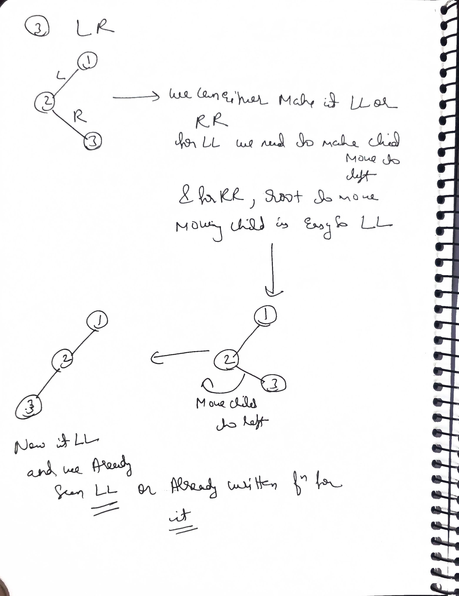
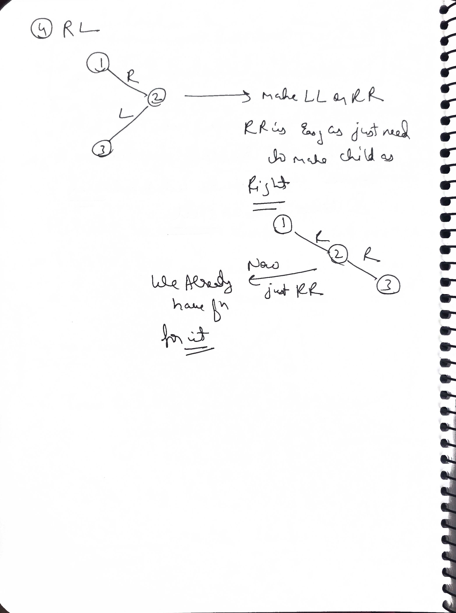
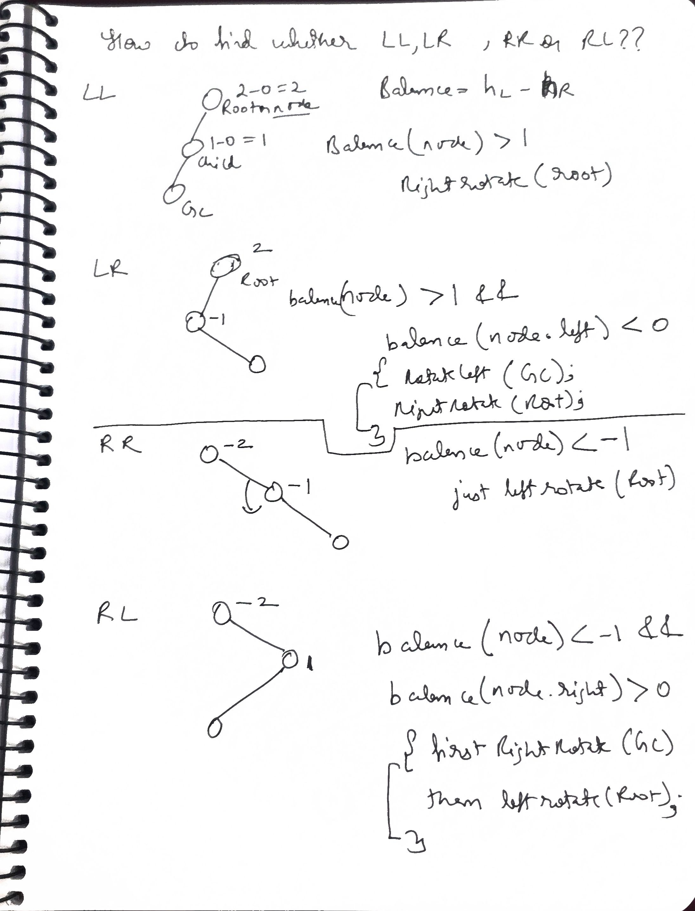

Q--> do avl tree asked in interviews to code?

### No.

You will almost never be asked to write the code for an AVL Tree (or Red-Black Tree) from scratch in a 45-minute coding interview.

Here is why, and what you actually need to know instead.

---

### 1. Why it is not asked
* **Time Constraints:** Writing a fully functional AVL Tree with **Left-Left**, **Left-Right**, **Right-Right**, and **Right-Left** rotation logic takes 100+ lines of bug-free code. It is physically impossible to do this cleanly while explaining your thought process in 20-30 minutes.
* **Too Much Memorization:** It tests your ability to memorize textbook code, not your problem-solving skills. Interviewers prefer problems that require logic (like "Lowest Common Ancestor" or "Burn Tree").
* **Standard Libraries Exist:** In the real world, you use `std::set` (C++) or `TreeMap` (Java), which are already implemented as Self-Balancing BSTs (usually Red-Black Trees).

---

### 2. What you DO need to know (The "Concept Check")
While you won't code it, you must be able to answer conceptual questions about it during a System Design or C++ deep-dive interview:

* **What is it?** A BST where the difference in height between left and right subtrees is at most **1** for every node.
* **Time Complexity:**
    * **Search:** $O(\log N)$ (Guaranteed, unlike normal BST which can be $O(N)$).
    * **Insert/Delete:** $O(\log N)$.
* **Rotations:** You might be asked to draw a rotation on a whiteboard or explain "Left Rotation" conceptually.
    * *Example:* "If the tree becomes right-heavy, we rotate left to pull the parent down and the right child up."
* **AVL vs. Red-Black:**
    * **AVL:** Strictly balanced (better for lookup-heavy tasks).
    * **Red-Black:** Loosely balanced (better for insertion-heavy tasks, less rotations needed).

---

### 3. The Only Exception
If you are interviewing for a very specific **Low-Level Systems / Database Kernel** role (e.g., at NVIDIA, database teams at Oracle/Google), they might ask you to implement a simple **Left Rotation** function.


# 1. Why AVL Trees Are Needed

## Ordinary BST Complexity

In a Binary Search Tree:

```text
left subtree values  < node value
right subtree values > node value
```

Search, insertion, and deletion take `O(h)`, where `h` is the tree height.

For a balanced BST:

```text
h = O(log n)
```

But inserting already sorted data into an ordinary BST can create:

```text
10
  \
   20
     \
      30
        \
         40
```

Now:

```text
h = O(n)
```

and BST operations degrade to `O(n)`.

## AVL Guarantee

An AVL tree is a self-balancing BST. For every node:

```text
|height(left subtree) - height(right subtree)| <= 1
```

After insertion or deletion, rotations restore this condition while preserving inorder order.

---

# 2. Height and Balance Factor

**Discussed around:** `~00:06:00`  
**Implemented around:** `~00:21:00`

## Convention Used

These notes use:

```text
height(null) = -1
height(leaf) = 0
```

The balance factor is:

```text
balance = left height - right height
```

Therefore:

```text
balance =  0 -> equal subtree heights
balance =  1 -> left side is one level taller
balance = -1 -> right side is one level taller
balance >  1 -> left-heavy and unbalanced
balance < -1 -> right-heavy and unbalanced
```

## AVL Node

```java
static class AVLNode {
    int val;
    AVLNode left;
    AVLNode right;

    int height;
    int balance;

    AVLNode(int val) {
        this.val = val;
        this.height = 0;
        this.balance = 0;
    }
}
```

## Updating Height and Balance

```java
static int height(AVLNode node) {
    return node == null ? -1 : node.height;
}

static void update(AVLNode node) {
    if (node == null) {
        return;
    }

    int leftHeight = height(node.left);
    int rightHeight = height(node.right);

    node.height = Math.max(leftHeight, rightHeight) + 1;
    node.balance = leftHeight - rightHeight;
}
```

## Important Ordering Rule

After a rotation, update the lower/old root first, then the new root.

The new root's height depends on the already-correct height of its child.

---

# 3. The Four Imbalance Cases

**Discussed around:** `~00:15:00`

The current node's balance tells us the heavy side. Its heavy child's balance tells us whether the path continues in the same direction or bends.

| Case | Current node | Heavy child | Required operation |
|---|---|---|---|
| LL | left-heavy | left-heavy or balanced | right rotation |
| LR | left-heavy | right-heavy | left rotate child, then right rotate root |
| RR | right-heavy | right-heavy or balanced | left rotation |
| RL | right-heavy | left-heavy | right rotate child, then left rotate root |

## Why Child Balance Can Be Zero

During insertion, the heavy child's balance usually identifies LL/RR using `+1` or `-1`.

During deletion, it may be `0`. Therefore robust conditions are:

```text
left-heavy root:
    left child balance >= 0 -> LL
    left child balance <  0 -> LR

right-heavy root:
    right child balance <= 0 -> RR
    right child balance >  0 -> RL
```

---

# 4. Right Rotation

**Implemented around:** `~00:30:00`

## Used For

The direct LL case:

```text
        A                         B
       / \                       / \
      B   T4    right(A)        T1  A
     / \        -------->           / \
    T1 T2                          T2 T4
```

## Pointer Changes

Before changing pointers, save:

```text
B  = A.left
T2 = B.right
```

Then:

```text
B.right = A
A.left  = T2
```

## Java Implementation

```java
static AVLNode rotateRight(AVLNode a) {
    AVLNode b = a.left;
    AVLNode transfer = b.right;

    b.right = a;
    a.left = transfer;

    update(a);
    update(b);

    return b;
}
```

The method must return `b`, because `b` is now the root of this subtree.

---

# 5. Left Rotation

**Implemented around:** `~00:33:00`

## Used For

The direct RR case:

```text
      A                              B
     / \                            / \
    T1  B       left(A)            A  T4
       / \      -------->         / \
      T2 T4                      T1 T2
```

## Java Implementation

```java
static AVLNode rotateLeft(AVLNode a) {
    AVLNode b = a.right;
    AVLNode transfer = b.left;

    b.left = a;
    a.right = transfer;

    update(a);
    update(b);

    return b;
}
```

## Rotation Invariant

Rotations change the shape but preserve inorder order.

Before and after either rotation:

```text
all values in T1 < B < all values in T2 < A < all values in T4
```

or its mirror.

That is why the BST property remains valid.

---

# 6. Double Rotations

**Discussed around:** `~00:39:00`

## LR Case

The root is left-heavy, but its left child is right-heavy:

```text
       A
      /
     B
      \
       C
```

First convert LR to LL:

```java
root.left = rotateLeft(root.left);
```

Then fix LL:

```java
return rotateRight(root);
```

## RL Case

The root is right-heavy, but its right child is left-heavy:

```text
    A
     \
      B
     /
    C
```

First convert RL to RR:

```java
root.right = rotateRight(root.right);
```

Then:

```java
return rotateLeft(root);
```

---

# 7. Unified Rebalancing Helper

**Starts around:** `~00:24:00`

Every insertion or deletion can call one common method:

```java
static AVLNode rebalance(AVLNode root) {
    if (root == null) {
        return null;
    }

    update(root);

    if (root.balance > 1) {
        if (root.left.balance >= 0) {
            // LL
            return rotateRight(root);
        } else {
            // LR
            root.left = rotateLeft(root.left);
            return rotateRight(root);
        }
    }

    if (root.balance < -1) {
        if (root.right.balance <= 0) {
            // RR
            return rotateLeft(root);
        } else {
            // RL
            root.right = rotateRight(root.right);
            return rotateLeft(root);
        }
    }

    return root;
}
```

## Why Use `> 1` and `< -1`

In a correctly maintained AVL insertion/deletion, imbalance normally reaches only `+2` or `-2`.

Using:

```java
root.balance > 1
root.balance < -1
```

is more defensive than checking exactly `2` and `-2`, particularly when balancing an arbitrary existing BST.

---

# Question 1 — Insert into an AVL Tree

**Starts around:** `~00:45:00`

## Algorithm

1. Perform ordinary recursive BST insertion.
2. On the way back from recursion, update each ancestor's metadata.
3. Rebalance every ancestor.
4. Return the possibly new subtree root.

## Java Implementation

```java
static AVLNode insert(AVLNode root, int value) {
    if (root == null) {
        return new AVLNode(value);
    }

    if (value < root.val) {
        root.left = insert(root.left, value);
    } else if (value > root.val) {
        root.right = insert(root.right, value);
    } else {
        // Duplicate policy: ignore this value.
        return root;
    }

    return rebalance(root);
}
```

## Why the Return Assignment Matters

A rotation changes the root of the affected subtree.

Therefore:

```java
root.left = insert(root.left, value);
```

is required. Calling `insert(root.left, value)` without assignment loses the new subtree root after a rotation.

Similarly, the public/root call must keep the returned value:

```java
root = insert(root, value);
```

## Example: LL Insertion

Insert:

```text
30, 20, 10
```

Before rebalancing:

```text
    30
   /
  20
 /
10
```

At node `30`:

```text
balance(30) = 2
balance(20) = 1
```

This is LL, so right-rotate `30`:

```text
   20
  /  \
10   30
```

## Example: LR Insertion

Insert:

```text
30, 10, 20
```

Before:

```text
    30
   /
  10
    \
     20
```

At node `30`:

```text
balance(30) = 2
balance(10) = -1
```

Steps:

1. left-rotate node `10`;
2. right-rotate node `30`.

Result:

```text
   20
  /  \
10   30
```

## Complexity

Because the tree remains balanced:

- Search path: `O(log n)`
- Updating and rotating ancestors: `O(log n)`
- Each ancestor needs at most a constant amount of rotation work
- Total insertion: `O(log n)`
- Recursive stack: `O(log n)`

## Common Insertion Mistakes

- Rebalancing before recursively inserting.
- Forgetting to update height before checking balance.
- Updating only the balance but not the height.
- Returning the old root after a rotation.
- Forgetting to connect the recursive return value.
- Using the inserted value alone to decide rotations during deletion; deletion requires child-balance checks.

---

# Question 2 — Delete from an AVL Tree

**Starts around:** `~02:09:00`

## Step 1: Ordinary BST Deletion

Find the node using BST ordering.

### Zero or one child

Return the surviving child:

```java
if (root.left == null) {
    return root.right;
}

if (root.right == null) {
    return root.left;
}
```

### Two children

Replace the value with:

- maximum of the left subtree, or
- minimum of the right subtree.

Then delete that replacement value from its original location.

## Step 2: Rebalance on the Return Path

Deletion can reduce the height of a subtree, making an ancestor unbalanced.

After the ordinary BST deletion:

```java
return rebalance(root);
```

## Java Implementation

```java
static AVLNode delete(AVLNode root, int value) {
    if (root == null) {
        return null;
    }

    if (value < root.val) {
        root.left = delete(root.left, value);
    } else if (value > root.val) {
        root.right = delete(root.right, value);
    } else {
        if (root.left == null) {
            return root.right;
        }

        if (root.right == null) {
            return root.left;
        }

        AVLNode predecessor = maximum(root.left);
        root.val = predecessor.val;
        root.left = delete(root.left, predecessor.val);
    }

    return rebalance(root);
}

static AVLNode maximum(AVLNode node) {
    while (node.right != null) {
        node = node.right;
    }
    return node;
}
```

## Why Deletion Is More Subtle

Insertion adds one node to one path. After the first repair, higher ancestors are often already balanced.

Deletion can decrease subtree height and cause imbalance at several ancestors. The recursive return path must therefore rebalance every ancestor.

## Child Balance of Zero

After deletion, this is a valid LL-type configuration:

```text
root.balance      = 2
root.left.balance = 0
```

It still requires a right rotation.

That is why the conditions use:

```java
root.left.balance >= 0
root.right.balance <= 0
```

## Complexity

- Time: `O(log n)`
- Recursive stack: `O(log n)`

## Common Deletion Mistakes

- Performing BST deletion but never rebalancing.
- Returning early from a two-child case before rebalancing.
- Copying the predecessor and not deleting its original occurrence.
- Using strict `> 0`/`< 0` child-balance tests and mishandling a zero balance.
- Rebalancing only the physically removed node instead of all ancestors.

---

# Question 3 — Balance a Binary Search Tree

**LeetCode 1382 starts around:** `~02:24:00`

## Problem

Given the root of a possibly skewed BST, return any height-balanced BST containing the same node values.

The inorder order must remain sorted, but the exact final shape is not unique.

## Important Difference from Normal AVL Insertion

An AVL insertion starts with a tree that is already balanced and introduces only one new node.

LeetCode 1382 may provide an arbitrarily skewed tree whose balance factor is much larger than `2` in magnitude. A helper written only for the normal AVL invariant may need repeated rotations or careful bottom-up processing.

---

## Approach A — Inorder Array + Balanced Reconstruction

This is the simplest and most reliable interview solution.

### Observation

Inorder traversal of a BST produces sorted values.

For a sorted range:

1. choose its middle value as the root;
2. recursively build the left half;
3. recursively build the right half.

Choosing the middle keeps subtree sizes as equal as possible.

### Java Implementation

```java
import java.util.*;

class Solution {
    public TreeNode balanceBST(TreeNode root) {
        List<Integer> values = new ArrayList<>();
        inorder(root, values);
        return build(values, 0, values.size() - 1);
    }

    private void inorder(
        TreeNode root,
        List<Integer> values
    ) {
        if (root == null) {
            return;
        }

        inorder(root.left, values);
        values.add(root.val);
        inorder(root.right, values);
    }

    private TreeNode build(
        List<Integer> values,
        int left,
        int right
    ) {
        if (left > right) {
            return null;
        }

        int middle = left + (right - left) / 2;
        TreeNode root = new TreeNode(values.get(middle));

        root.left = build(values, left, middle - 1);
        root.right = build(values, middle + 1, right);

        return root;
    }
}
```

### Complexity

- Inorder traversal: `O(n)`
- Reconstruction: `O(n)`
- Total time: `O(n)`
- Value array: `O(n)`
- Recursion stack: `O(n)` for the initial skewed-tree inorder traversal in the worst case

### Reusing Existing Nodes

Instead of storing values, store node references:

```java
List<TreeNode> nodes
```

Before rebuilding, assign new left and right links from the midpoint recursion. This avoids allocating new nodes but still uses an `O(n)` array.

---

## Approach B — Rotation-Based Balancing

**Explored from:** `~02:39:00` onward

The lecture reuses:

- stored height;
- balance-factor calculation;
- left rotation;
- right rotation;
- the four-case rotation selector.

The conceptual bottom-up plan is:

1. balance the left subtree;
2. balance the right subtree;
3. update the current node's height;
4. rotate the current node if necessary;
5. continue until the resulting subtree satisfies the balance condition.

## Rotation Helper for a Standard Tree Node

If the platform's `TreeNode` does not contain a height field, maintain heights externally:

```java
Map<TreeNode, Integer> heights = new IdentityHashMap<>();
```

or recalculate them during a dedicated bottom-up transformation.

A node type containing height makes the mechanics clearer:

```java
static AVLNode balanceWithRotations(AVLNode root) {
    if (root == null) {
        return null;
    }

    root.left = balanceWithRotations(root.left);
    root.right = balanceWithRotations(root.right);
    update(root);

    while (Math.abs(root.balance) > 1) {
        root = rebalance(root);

        // A large pre-existing imbalance may require further
        // balancing of a subtree exposed by the rotation.
        root.left = balanceWithRotations(root.left);
        root.right = balanceWithRotations(root.right);
        update(root);
    }

    return root;
}
```

## Caution About the Rotation Approach

For ordinary AVL insertion/deletion, the precondition is that the tree was balanced before one local update.

For an arbitrary skewed BST:

- balance magnitude can be much greater than `2`;
- one local rotation may not completely balance the subtree;
- heights must be updated after every pointer change;
- nodes displaced by a rotation may themselves still be unbalanced.

The inorder-rebuild method is therefore shorter, easier to prove, and usually preferred for LeetCode 1382.

## Space Trade-off

| Approach | Time | Extra space | Reuses original structure? |
|---|---:|---:|---|
| Inorder array + rebuild | `O(n)` | `O(n)` | optionally |
| Carefully implemented rotations | depends on implementation | `O(h)` stack plus height storage if needed | yes |

---

  
  
 


 
# Complete Reusable AVL Class

```java
public class AVLTree {
    static class Node {
        int value;
        int height;
        int balance;
        Node left;
        Node right;

        Node(int value) {
            this.value = value;
        }
    }

    private Node root;

    public void insert(int value) {
        root = insert(root, value);
    }

    public void delete(int value) {
        root = delete(root, value);
    }

    public boolean contains(int value) {
        Node current = root;

        while (current != null) {
            if (value < current.value) {
                current = current.left;
            } else if (value > current.value) {
                current = current.right;
            } else {
                return true;
            }
        }

        return false;
    }

    private Node insert(Node node, int value) {
        if (node == null) {
            return new Node(value);
        }

        if (value < node.value) {
            node.left = insert(node.left, value);
        } else if (value > node.value) {
            node.right = insert(node.right, value);
        } else {
            return node;
        }

        return rebalance(node);
    }

    private Node delete(Node node, int value) {
        if (node == null) {
            return null;
        }

        if (value < node.value) {
            node.left = delete(node.left, value);
        } else if (value > node.value) {
            node.right = delete(node.right, value);
        } else {
            if (node.left == null) {
                return node.right;
            }

            if (node.right == null) {
                return node.left;
            }

            Node predecessor = node.left;
            while (predecessor.right != null) {
                predecessor = predecessor.right;
            }

            node.value = predecessor.value;
            node.left = delete(node.left, predecessor.value);
        }

        return rebalance(node);
    }

    private Node rebalance(Node node) {
        update(node);

        if (node.balance > 1) {
            if (balance(node.left) < 0) {
                node.left = rotateLeft(node.left);
            }
            return rotateRight(node);
        }

        if (node.balance < -1) {
            if (balance(node.right) > 0) {
                node.right = rotateRight(node.right);
            }
            return rotateLeft(node);
        }

        return node;
    }

    private Node rotateRight(Node a) {
        Node b = a.left;
        Node transfer = b.right;

        b.right = a;
        a.left = transfer;

        update(a);
        update(b);
        return b;
    }

    private Node rotateLeft(Node a) {
        Node b = a.right;
        Node transfer = b.left;

        b.left = a;
        a.right = transfer;

        update(a);
        update(b);
        return b;
    }

    private void update(Node node) {
        int leftHeight = height(node.left);
        int rightHeight = height(node.right);

        node.height = Math.max(leftHeight, rightHeight) + 1;
        node.balance = leftHeight - rightHeight;
    }

    private int height(Node node) {
        return node == null ? -1 : node.height;
    }

    private int balance(Node node) {
        return node == null ? 0 : node.balance;
    }
}
```

---

# Rotation Decision Table

| Root balance | Heavy-child balance | Case | Fix |
|---:|---:|---|---|
| `> 1` | `>= 0` | LL | rotate right |
| `> 1` | `< 0` | LR | rotate left child, then rotate right |
| `< -1` | `<= 0` | RR | rotate left |
| `< -1` | `> 0` | RL | rotate right child, then rotate left |

## Memory Shortcut

```text
same direction  -> one rotation
opposite bend   -> two rotations
```

The final rotation is always opposite to the root's heavy side:

```text
left-heavy root  -> final right rotation
right-heavy root -> final left rotation
```

---

# AVL Invariants to Verify

After every insertion, deletion, or rotation, check:

## BST invariant

```text
all left values < node value < all right values
```

## Height invariant

```text
node.height =
    max(height(node.left), height(node.right)) + 1
```

## Balance invariant

```text
node.balance =
    height(node.left) - height(node.right)
```

## AVL invariant

```text
-1 <= node.balance <= 1
```

## Link invariant

No subtree is lost during rotation. The middle/transfer subtree must be reattached.

---

# Common Rotation Bugs

## 1. Losing the transfer subtree

Incorrect:

```java
b.right = a;
a.left = null;
```

Correct:

```java
AVLNode transfer = b.right;
b.right = a;
a.left = transfer;
```

## 2. Updating heights in the wrong order

After rotation:

```java
update(oldRoot);
update(newRoot);
```

## 3. Not returning the new root

Every rotation changes the subtree root.

## 4. Using stale balance factors

Call `update(root)` before selecting a rotation.

## 5. Reversing LR and RL

```text
LR: left child rotates left; root rotates right
RL: right child rotates right; root rotates left
```

## 6. Assuming a rotation changes only two links

The transfer subtree must preserve the complete BST ordering.

---

# Complexity Summary

| Operation | Ordinary skewed BST | AVL tree |
|---|---:|---:|
| Search | `O(n)` worst case | `O(log n)` |
| Insert | `O(n)` worst case | `O(log n)` |
| Delete | `O(n)` worst case | `O(log n)` |
| Single rotation | — | `O(1)` |
| Rebuild balanced BST from inorder | — | `O(n)` |

AVL nodes use `O(1)` additional metadata per node for height/balance.

---

# Final Revision Checklist

- An AVL tree is both a BST and height-balanced.
- Use one consistent height convention.
- Balance factor in this lecture is `left height - right height`.
- Update height before checking balance.
- LL requires a right rotation.
- RR requires a left rotation.
- LR requires left rotation on the child, then right rotation on the root.
- RL requires right rotation on the child, then left rotation on the root.
- Update the old root before the new root after rotation.
- Insertion and deletion must return the possibly rotated subtree root.
- Deletion must rebalance every ancestor on the return path.
- Child balance `0` matters during AVL deletion.
- For LeetCode 1382, inorder plus midpoint reconstruction is the cleanest `O(n)` solution.


