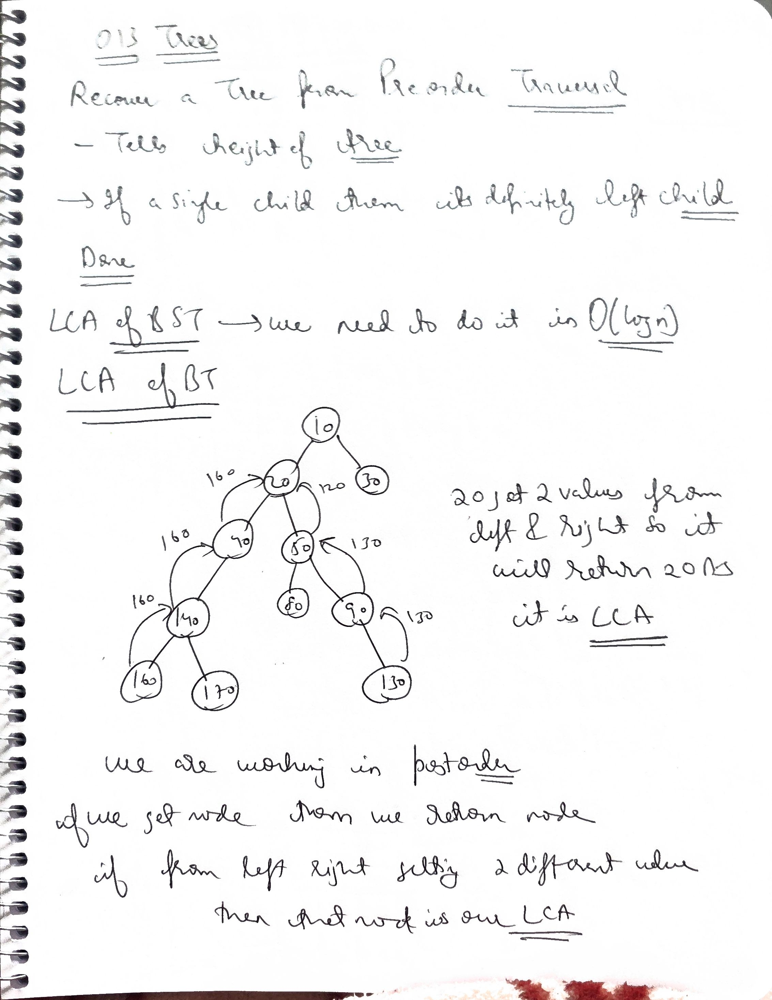
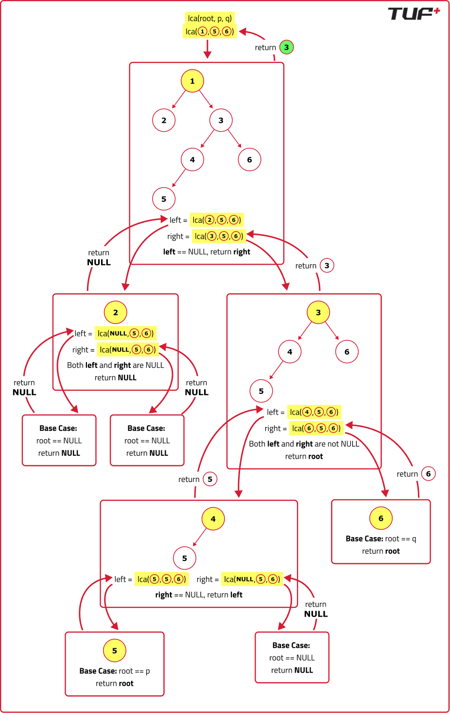

# Q1 Recover a Tree From Preorder Traversal

Link--> https://leetcode.com/problems/recover-a-tree-from-preorder-traversal/

We run a preorder depth-first search (DFS) on the `root` of a binary tree.

At each node in this traversal, we output `D` dashes (where `D` is the depth of this node), then we output the value of this node. If the depth of a node is `D`, the depth of its immediate child is `D + 1`. The depth of the `root` node is `0`.

If a node has only one child, that child is guaranteed to be the **left child**.

Given the output `traversal` of this traversal, recover the tree and return its `root`.

---

### Example 1:
**Input:** traversal = "1-2--3--4-5--6--7"
**Output:** [1,2,5,3,4,6,7]

### Example 2:
**Input:** traversal = "1-2--3---4-5--6---7"
**Output:** [1,2,5,3,null,6,null,4,null,7]

### Example 3:
**Input:** traversal = "1-401--349---90--88"
**Output:** [1,401,null,349,88,90]

---

### Constraints:
* The number of nodes in the original tree is in the range `[1, 1000]`.
* 1 <= Node.val <= 10^9
* The length of `traversal` is in the range [1, 10^5].

### My sol 

```cpp
/**
 * Definition for a binary tree node.
 * struct TreeNode {
 *     int val;
 *     TreeNode *left;
 *     TreeNode *right;
 *     TreeNode() : val(0), left(nullptr), right(nullptr) {}
 *     TreeNode(int x) : val(x), left(nullptr), right(nullptr) {}
 *     TreeNode(int x, TreeNode *left, TreeNode *right) : val(x), left(left), right(right) {}
 * };
 */
class Solution {
    pair<int,int> getNode(string& s,int i){
            string str="";
            for(int idx=i;idx<s.size();idx++){
                if(s[idx]=='-'){
                    return {stoi(str),idx};
                }
                str+=s[idx];
            }
            return {stoi(str),s.size()};
    }
    int cntDash(string& s,int i){
        int cnt=0;
        for(int idx=i;idx<s.size();idx++){
            if(s[idx]!='-') return cnt;
            cnt++;
        }
        return -1;
    }
    int helper(TreeNode* node,int i,int depth,string &s){
        int cnt1=cntDash(s,i);
        if(cnt1==depth){
            pair<int,int>lnode=getNode(s,i+cnt1);
            node->left=new TreeNode(lnode.first);
            int rstart=helper(node->left,lnode.second,depth+1,s);
            int cnt2=cntDash(s,rstart);
            if(cnt2==depth){
                pair<int,int>rnode=getNode(s,rstart+cnt2);
                node->right=new TreeNode(rnode.first);
                int ed=helper(node->right,rnode.second,depth+1,s);
                return ed;
            }
            return rstart;
        }
        return i;
    }
public:
    TreeNode* recoverFromPreorder(string traversal) {
        
        pair<int,int>node=getNode(traversal,0);
        TreeNode * root=new TreeNode(node.first);
        if(node.second==traversal.size()) return root;
        helper(root,node.second,1,traversal);
        return root;
        

    }
};

```
Time Complexity: $O(N^2)$ in the worst case (specifically due to string building).

- In your getNode function, you were doing str += s[idx]. In C++, string concatenation inside a loop can lead to $O(K^2)$ where $K$ is the length of the string being built, because a new string may be allocated and copied repeatedly.Additionally, if you use s.substr() or manual concatenation frequently in deep recursion, the total time can spike.

Space Complexity: $O(N + H)$ 
- $O(H)$ for the recursion stack.
- $O(N)$ for the temporary string str objects created at each level of the recursion

### Sir solution

```cpp
class Solution {
    int i = 0; // Global-like pointer
public:
    TreeNode* recoverFromPreorder(string s) {
        i = 0; // Reset for each call
        return helper(s, 0);
    }

    TreeNode* helper(string& s, int depth) {
        int j = 0;
        // 1. Look ahead: Count dashes without moving 'i'
        while (i + j < s.size() && s[i + j] == '-') {
            j++;
        }

        // 2. Depth mismatch: This is not the node we are looking for
        if (j != depth) return nullptr;

        // 3. Match found: Move 'i' past the dashes
        int startVal = i + j;
        int k = 0;
        while (startVal + k < s.size() && s[startVal + k] != '-') {
            k++;
        }

        // 4. Extract value and update global 'i'
        int val = stoi(s.substr(startVal, k));
        i = startVal + k;

        // 5. Build children
        TreeNode* node = new TreeNode(val);
        node->left = helper(s, depth + 1);
        node->right = helper(s, depth + 1);

        return node;
    }
};
```
##### Time Complexity: $O(N)$
 - Each character in the string traversal is visited a constant number of times.The index i only moves forward and never moves backward.
 
 - Even though there are nested while loops and recursion, the global pointer i ensures we process the string linearly from $0$ to $N$.
 
 #### Space Complexity: $O(H)$
 
 $H$ is the height of the tree. In the worst case (a skewed tree), this could be $O(N)$. This space is used by the recursion stack.

Here too using stoi instead can do this 

```cpp

// Instead of this:
// int val = stoi(s.substr(startVal, k));

// Do this:
int val = 0;
while (i < s.size() && isdigit(s[i])) {
    val = val * 10 + (s[i] - '0');
    i++;
}
```
# Q2  Lowest Common Ancestor of a Binary Search Tree

Given a binary search tree (BST), find the lowest common ancestor (LCA) node of two given nodes in the BST.

According to the definition of LCA on Wikipedia: “The lowest common ancestor is defined between two nodes `p` and `q` as the lowest node in `T` that has both `p` and `q` as descendants (where we allow a node to be a descendant of itself).”

---

### Example 1:
**Input:** root = [6,2,8,0,4,7,9,null,null,3,5], p = 2, q = 8
**Output:** 6
**Explanation:** The LCA of nodes 2 and 8 is 6.

### Example 2:
**Input:** root = [6,2,8,0,4,7,9,null,null,3,5], p = 2, q = 4
**Output:** 2
**Explanation:** The LCA of nodes 2 and 4 is 2, since a node can be a descendant of itself according to the LCA definition.

### Example 3:
**Input:** root = [2,1], p = 2, q = 1
**Output:** 2

---

### Constraints:
* The number of nodes in the tree is in the range `[2, 10^5]`.
* `-10^9 <= Node.val <= 10^9`
* All `Node.val` are **unique**.
* `p != q`
* `p` and `q` will exist in the BST.

Link--> https://leetcode.com/problems/lowest-common-ancestor-of-a-binary-search-tree/submissions/628285028/
```java
/**
 * Definition for a binary tree node.
 * public class TreeNode {
 *     int val;
 *     TreeNode left;
 *     TreeNode right;
 *     TreeNode(int x) { val = x; }
 * }
 */

class Solution {
    public TreeNode lowestCommonAncestor(TreeNode node, TreeNode d1, TreeNode d2) {
        if(node==null) return null;
    if(node.val<d1.val && node.val<d2.val)
     return lowestCommonAncestor(node.right,d1,d2);
    else if(node.val>d2.val  && node.val>d1.val)
     return lowestCommonAncestor(node.left,d1,d2);
    else 
    return node;
    }
}
```

```cpp

class Solution {
public:
    TreeNode* lca(TreeNode* node, int d1, int d2) {
        while (node != nullptr) {
            if (node->data < d1 && node->data < d2) {
                node = node->right;
            } else if (node->data > d1 && node->data > d2) {
                node = node->left;
            } else {
                // Split point found or node matches d1/d2
                return node;
            }
        }
        return nullptr;
    }
};
```
### Performance Breakdown
#### Time Complexity: $O(H)$, where $H$ is the height of the tree. In the worst case (a skewed tree), this is $O(N)$, but for a balanced BST, it is $O(\log N)$.

#### Space Complexity: $O(H)$ due to the recursion stack.

# Q3 Lowest Common Ancestor of a Binary Tree

Link--> https://leetcode.com/problems/lowest-common-ancestor-of-a-binary-tree/description/

Given a binary tree, find the lowest common ancestor (LCA) of two given nodes in the tree.

According to the definition of LCA on Wikipedia: “The lowest common ancestor is defined between two nodes `p` and `q` as the lowest node in `T` that has both `p` and `q` as descendants (where we allow a node to be a descendant of itself).”

---

### Example 1:
**Input:** root = [3,5,1,6,2,0,8,null,null,7,4], p = 5, q = 1

**Output:** 3

**Explanation:** The LCA of nodes 5 and 1 is 3.

### Example 2:
**Input:** root = [3,5,1,6,2,0,8,null,null,7,4], p = 5, q = 4

**Output:** 5

**Explanation:** The LCA of nodes 5 and 4 is 5, since a node can be a descendant of itself.

---

### Constraints:
* The number of nodes in the tree is in the range `[2, 10^5]`.
* -10^9 <= Node.val <= 10^9
* All Node.val are unique.
* p != q
* p and q will exist in the tree.

----


### Solution



```cpp
#include <bits/stdc++.h>
using namespace std;

struct TreeNode {
    int data;
    TreeNode* left;
    TreeNode* right;
    TreeNode(int val) : data(val), left(NULL), right(NULL) {}
};

class Solution {
public:
    TreeNode* lowestCommonAncestor(TreeNode* root, TreeNode* p, TreeNode* q) {
        // Base case
        if (root == NULL || root == p || root == q) {
            return root;
        }
        
        // Search in left and right subtrees
        TreeNode* left = lowestCommonAncestor(root->left, p, q);
        TreeNode* right = lowestCommonAncestor(root->right, p, q);
        
        // Result
        if (left == NULL) {
            return right;
        } else if (right == NULL) {
            return left;
        } else { // Both left and right are not null, we found our result
            return root;
        }
    }
};

int main() {
    // Construct a simple binary tree
    TreeNode* root = new TreeNode(3);
    root->left = new TreeNode(5);
    root->right = new TreeNode(1);
    root->left->left = new TreeNode(6);
    root->left->right = new TreeNode(2);
    root->right->left = new TreeNode(0);
    root->right->right = new TreeNode(8);

    Solution solution;
    TreeNode* p = root->left; // Node with value 5
    TreeNode* q = root->right; // Node with value 1

    TreeNode* lca = solution.lowestCommonAncestor(root, p, q);
    cout << "Lowest Common Ancestor: " << lca->data << endl;

    return 0;
}

```
In that version, if the code hits p, it returns p and never looks at the children of p. If q was inside p's subtree, the code would never "see" it.

If p or q (or both) are not present in the tree, your current code will return whichever node it does find. If it finds neither, it returns NULL.

In an interview setting, this is often called the "Missing Node Problem." Your current logic is "optimistic"—if it sees p, it assumes q is somewhere else or a descendant, and immediately returns p. If q isn't actually in the tree, this leads to a false positive.

### 2-pass solution

```cpp
class Solution {
    bool find(TreeNode* root, TreeNode* target) {
        if (!root) return false;
        if (root == target) return true;
        return find(root->left, target) || find(root->right, target);
    }

public:
    TreeNode* lowestCommonAncestor(TreeNode* root, TreeNode* p, TreeNode* q) {
        // Only run LCA if both nodes are guaranteed to exist
        if (!find(root, p) || !find(root, q)) return nullptr;
        
        return helper(root, p, q);
    }

    TreeNode* helper(TreeNode* root, TreeNode* p, TreeNode* q) {
        if (!root || root == p || root == q) return root;
        
        TreeNode* left = helper(root->left, p, q);
        TreeNode* right = helper(root->right, p, q);
        
        if (!left) return right;
        if (!right) return left;
        return root;
    }
};
```

### 1-pass solution

```cpp

class Solution {
    bool pFound = false;
    bool qFound = false;

    TreeNode* helper(TreeNode* root, TreeNode* p, TreeNode* q) {
        if (!root) return nullptr;

        // In a general tree where nodes might be missing, 
        // we shouldn't return immediately upon finding one.
        // We need to keep searching to see if the OTHER node exists.
        TreeNode* left = helper(root->left, p, q);
        TreeNode* right = helper(root->right, p, q);

        if (root == p) {
            pFound = true;
            return root;
        }
        if (root == q) {
            qFound = true;
            return root;
        }

        if (left && right) return root;
        return left ? left : right;
    }

public:
    TreeNode* lowestCommonAncestor(TreeNode* root, TreeNode* p, TreeNode* q) {
        pFound = false;
        qFound = false;
        
        TreeNode* res = helper(root, p, q);
        
        // Final check: did we actually see both?
        if (pFound && qFound) return res;
        
        return nullptr;
    }
};
```
Like same as sumeet sir solution that we need to travel whole treee first and then we get the LCA

#### Sumeet sir solution1

```java

// Function to return the lowest common ancestor in a Binary Tree.
Node lca(Node root, int n1, int n2) {
    Node lca = helper(root, n1, n2);
    return lca;
}

Node helper(Node node, int n1, int n2) {
    if (node == null) {
        return null;
    }

    Node left = helper(node.left, n1, n2);
    Node right = helper(node.right, n1, n2);

    if (node.data == n1) {
        return node;
    } else if (node.data == n2) {
        return node;
    } else if (left != null && right != null) {
        return node;
    } else if (left != null) {
        return left;
    } else if (right != null) {
        return right;
    } else {
        return null;
    }
}
```
This is sufficient if it is guaranteed both are present

This code returns lca even if one of value is not present, so we use 2 flags 

#### Sumeet Sir solution2

```java
class Solution
{
    boolean n1flag = false;
    boolean n2flag = false;
    //Function to return the lowest common ancestor in a Binary Tree.
	Node lca(Node root, int n1,int n2)
	{
		n1flag = false;
		n2flag = false;
		
		Node lca = helper(root, n1, n2);
		
		if(n1flag && n2flag){
		    return lca;
		} else {
		    return null;
		}
	}
	
	public Node helper(Node node, int n1, int n2){
	    if(node == null){	
	        return null;
	    }
	    
	    Node left = helper(node.left, n1, n2);
	    Node right = helper(node.right, n1, n2);
	    
	    if(node.data == n1){
	        n1flag = true;
	        return node;
	    } else if(node.data == n2){
	        n2flag = true;
	        return node;
	    } else if(left != null && right != null){
	        return node;
	    } else if(left!= null){
	        return left;
	    } else if(right != null){
	        return right;
	    } else {
	        return null;
	    }
	}
}

```

Here we have just used flag just to handle if we get both values or not!!

