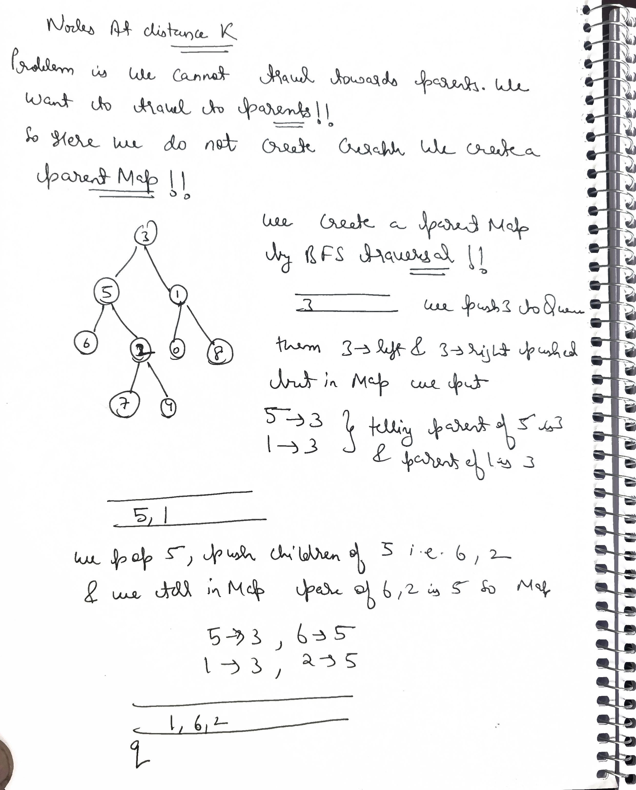
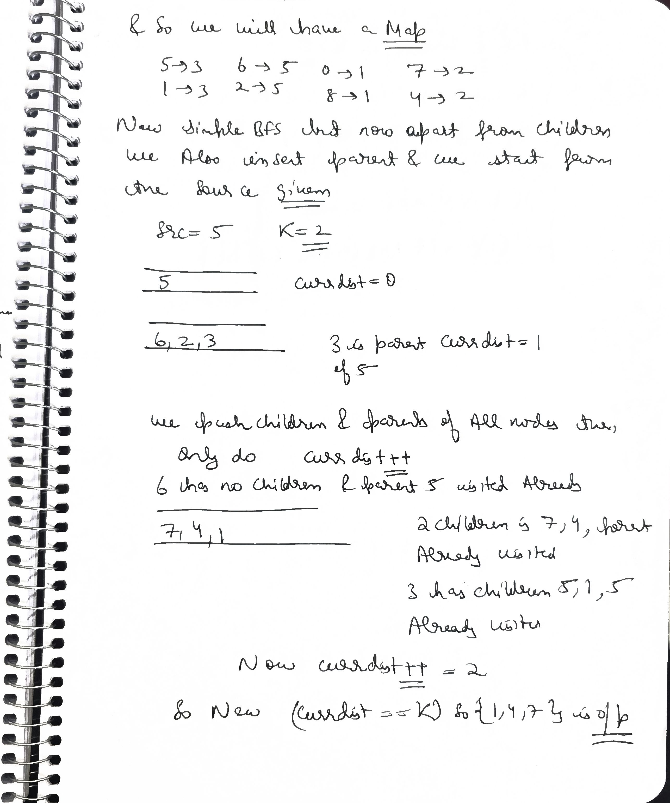

# Q1 LC129. Sum Root to Leaf Numbers

### **Problem Link**
[Sum Root to Leaf Numbers - LeetCode](https://leetcode.com/problems/sum-root-to-leaf-numbers/description/)

---

### **Problem Statement**
You are given the `root` of a binary tree containing digits from `0` to `9` only.

Each root-to-leaf path in the tree represents a number.
- For example, the root-to-leaf path `1 -> 2 -> 3` represents the number `123`.

Return the **total sum of all root-to-leaf numbers**. Test cases are generated so that the answer will fit in a **32-bit** integer.

A **leaf** node is a node with no children.

---

### **Example 1**
**Input:** `root = [1, 2, 3]`  
**Output:** `25`  
**Explanation:** The root-to-leaf path `1->2` represents the number `12`.  
The root-to-leaf path `1->3` represents the number `13`.  
Therefore, sum = `12 + 13 = 25`.

### **Example 2**
**Input:** `root = [4, 9, 0, 5, 1]`  
**Output:** `1026`  
**Explanation:** The root-to-leaf path `4->9->5` represents the number `495`.  
The root-to-leaf path `4->9->1` represents the number `491`.  
The root-to-leaf path `4->0` represents the number `40`.  
Therefore, sum = `495 + 491 + 40 = 1026`.

---

### **Constraints**
- The number of nodes in the tree is in the range `[1, 1000]`.
- `0 <= Node.val <= 9`
- The depth of the tree will not exceed `10`.

---

```java
/**
 * Definition for a binary tree node.
 * public class TreeNode {
 *     int val;
 *     TreeNode left;
 *     TreeNode right;
 *     TreeNode() {}
 *     TreeNode(int val) { this.val = val; }
 *     TreeNode(int val, TreeNode left, TreeNode right) {
 *         this.val = val;
 *         this.left = left;
 *         this.right = right;
 *     }
 * }
 */
class Solution {
    int sum=0;
    private void helper(TreeNode node,int num,TreeNode par,TreeNode root){

        if(node.left==null && node.right==null){
            num=num*10+node.val;
            sum+=num;
            return;
        }
        
       
        num=num*10+node.val;
        if(node.left!=null )helper(node.left,num,node,root);
        if(node.right!=null )helper(node.right,num,node,root);
    }
    public int sumNumbers(TreeNode root) {
        helper(root,0,null,root);
        return sum;
    }
}
```
TC-->O(n)

# Q2 662. Maximum Width of Binary Tree

### **Problem Link**
[Maximum Width of Binary Tree - LeetCode](https://leetcode.com/problems/maximum-width-of-binary-tree/description/)

---

### **Problem Statement**
Given the `root` of a binary tree, return the **maximum width** of the given tree.

The **maximum width** of a tree is the maximum **width** among all levels.

The **width** of one level is defined as the length between the end-nodes (the leftmost and rightmost non-null nodes), where the null nodes between the end-nodes that would be present in a complete binary tree extending down to that level are also counted into the length calculation.

It is guaranteed that the answer will in the range of a **32-bit** signed integer.

---

### **Example 1**
**Input:** `root = [1, 3, 2, 5, 3, null, 9]`  
**Output:** `4`  
**Explanation:** The maximum width exists in the third level with length 4 (`5, 3, null, 9`).

### **Example 2**
**Input:** `root = [1, 3, 2, 5, null, null, 9, 6, null, 7]`  
**Output:** `7`  
**Explanation:** The maximum width exists in the fourth level with length 7 (`6, null, null, null, null, null, 7`).

### **Example 3**
**Input:** `root = [1, 3, 2, 5]`  
**Output:** `2`  
**Explanation:** The maximum width exists in the second level with length 2 (`3, 2`).

---

### **Constraints**
- The number of nodes in the tree is in the range `[1, 3000]`.
- `-100 <= Node.val <= 100`


```java
/**
 * Definition for a binary tree node.
 * public class TreeNode {
 *     int val;
 *     TreeNode left;
 *     TreeNode right;
 *     TreeNode() {}
 *     TreeNode(int val) { this.val = val; }
 *     TreeNode(int val, TreeNode left, TreeNode right) {
 *         this.val = val;
 *         this.left = left;
 *         this.right = right;
 *     }
 * }
 */
class Solution {
    class Pair{
        long min;
        long max;
        Pair(long min,long max){
            this.min=min;
            this.max=max;
        }
    }
    private void helper(TreeNode node ,int dep,long idx,Map<Integer,Pair>mp){
        if(node==null) return;
        helper(node.left,dep+1,2*idx,mp);
        helper(node.right,dep+1,2*idx+1,mp);
        if(mp.containsKey(dep)){
            Pair p=mp.get(dep);
            p.max=Math.max(idx,p.max);
        }else{
            mp.put(dep,new Pair(idx,idx));
        }
        Pair p=mp.get(dep);
        maxWidth=Math.max(maxWidth,p.max-p.min+1);
    }
    long maxWidth;
    public int widthOfBinaryTree(TreeNode root) {
        maxWidth=0;
        Map<Integer,Pair>mp=new HashMap<>();
        helper(root,1,1,mp);
        return (int)maxWidth;
    }
}
```
segment tree vala conecpt use kia hai assume kr do perfect BT hai 

```java

/**
 * Definition for a binary tree node.
 * public class TreeNode {
 *     int val;
 *     TreeNode left;
 *     TreeNode right;
 *     TreeNode() {}
 *     TreeNode(int val) { this.val = val; }
 *     TreeNode(int val, TreeNode left, TreeNode right) {
 *         this.val = val;
 *         this.left = left;
 *         this.right = right;
 *     }
 * }
 */
class Solution {
    class Pair{
        long min;
        long max;
        Pair(long min,long max){
            this.min=min;
            this.max=max;
        }
    }
    private void helper(TreeNode node ,int dep,long idx,Map<Integer,Pair>mp){
        if(node==null) return;
        helper(node.left,dep+1,2*idx+1,mp);
        helper(node.right,dep+1,2*idx+2,mp);
        if(mp.containsKey(dep)){
            Pair p=mp.get(dep);
            p.max=Math.max(idx,p.max);
        }else{
            mp.put(dep,new Pair(idx,idx));
        }
        Pair p=mp.get(dep);
        maxWidth=Math.max(maxWidth,p.max-p.min+1);
    }
    long maxWidth;
    public int widthOfBinaryTree(TreeNode root) {
        maxWidth=0;
        Map<Integer,Pair>mp=new HashMap<>();
        helper(root,1,1,mp);
        return (int)maxWidth;
    }
}
```

Q-->Is this Dp on trees??

### No. This is **NOT** Dynamic Programming on Trees.

While it uses recursion, this solution is classified as **DFS with Indexing (or Numbering)**.

Here is the distinct difference:

---

### 1. Direction of Information Flow
* **DP on Trees (Bottom-Up):**
    The parent asks the children: *"Hey, what is your height/max path?"* The children compute their answer and return it **UP** to the parent. The parent cannot solve its problem without the children's answers.
    * *Example:* Diameter, Max Path Sum.

* **Your Code (Top-Down):**
    The parent tells the children: *"Here is your index (`2*idx`). Go calculate your position."* The information flows **DOWN**.
    The "Width" isn't calculated by combining child results; it's calculated by aggregating the indices (min and max) at each specific depth level globally using a Map.

---

### 2. Dependency
* **DP:** The solution for Node `X` depends on the solution for `X->left` and `X->right`.
* **Your Code:** The width of "Level 3" does not depend on the width of "Level 4". The levels are independent. You are simply traversing the tree and tagging every node with a coordinate ID.

---

### Critical Interview Note: The "Overflow" Bug
While your logic is correct for "Width", this specific DFS implementation has a major flaw that interviewers will point out: **Integer Overflow**.

In a skewed tree (like a linked list going right), the index grows exponentially: $1, 3, 7, 15, 31 \dots 2^{depth}$.

* If the tree depth reaches 64, $2^{64}$ will overflow even a `long`.
* **DFS goes deep.** If the tree is depth 1000, your `idx` calculation will break completely.

---

### The "Interview Standard" Solution:
Use **BFS (Level Order Traversal)**.

* **Why?** In BFS, you process one level at a time.
* **The Trick:** At every level, you can "normalize" the indices. You can subtract the index of the first node from all other nodes in that level to keep the numbers small, preventing overflow.

```text
helper(node.right, dep + 1, 2 * idx + 1, mp); 
//                          ^^^^^^^^^^^
//                          RIGHT HERE
```
### The Math of the Explosion

In a binary tree indexing scheme:
* **Level 0:** Index 1
* **Level 1:** Index 3 (Right child)
* **Level 2:** Index 7
* **Level 10:** Index $\approx 1,024$ ($2^{10}$)
* **Level 64:** Index $\approx 1.8 \times 10^{19}$ ($2^{64}$)

---

### The "Skewed Tree" Test Case

Imagine a tree that is just a straight line of nodes always going Right. This is a valid binary tree.
In LeetCode problems, tree height can often go up to **1,000 to 3,000**.

If you go down just **65 levels** to the right:
* Your formula tries to calculate $2^{65}$.
* The maximum value a `unsigned long long` (64-bit integer) can hold is $2^{64} - 1$.
* **Result:** The number wraps around to 0 (or becomes garbage/negative if signed).

---

### Why BFS fixes this but DFS cannot

* **In BFS:** We process the whole level at once. We can see the first node has index 2,000,000 and the last has 2,000,005. We can mathematically subtract 2,000,000 from both to reset them to 0 and 5 before moving to the next level. This keeps numbers small.
* **In DFS:** We dive straight to the bottom. We hit depth 1000 before we ever visit the other side of the tree. We are carrying this massive index $2^{1000}$ down with us, and we can't "reset" it because we don't know what the other nodes at that level look like yet.

---

### Summary
The overflow happens at `2 * idx` when depth > 64. Since standard integer types in C++ are fixed size (64-bit), they cannot physically store the index needed for a tree deeper than 64 levels.

## BFS sol

```cpp
#include <bits/stdc++.h>
using namespace std;

struct TreeNode {
    int data;
    TreeNode *left;
    TreeNode *right;
    TreeNode(int val) : data(val), left(nullptr), right(nullptr) {}
};

class Solution {
public:
    int widthOfBinaryTree(TreeNode* root) {
        if (!root) return 0;

        int ans = 0;
        queue<pair<TreeNode*, long long>> q;
        q.push({root, 0});

        while (!q.empty()) {
            int size = q.size();
            long long mmin = q.front().second; 
            long long first, last;

            for (int i = 0; i < size; i++) {
                // Normalization: subtract mmin to keep indices small
                long long cur_id = q.front().second - mmin;
                TreeNode* node = q.front().first;
                q.pop();

                if (i == 0) first = cur_id;
                if (i == size - 1) last = cur_id;

                if (node->left) 
                    q.push({node->left, cur_id * 2 + 1});
                
                if (node->right) 
                    q.push({node->right, cur_id * 2 + 2});
            }
            
            ans = max(ans, (int)(last - first + 1));
        }
        return ans;
    }
};

int main() {
    TreeNode* root = new TreeNode(3);
    root->left = new TreeNode(5);
    root->right = new TreeNode(1);
    root->left->left = new TreeNode(6);
    root->left->right = new TreeNode(2);
    root->right->left = new TreeNode(0);
    root->right->right = new TreeNode(8);
    root->left->right->left = new TreeNode(7);
    root->left->right->right = new TreeNode(4);

    Solution sol;
    cout << "Maximum width: " << sol.widthOfBinaryTree(root) << endl;

    return 0;
}
```
### Explanation of the Logic

This solution uses **BFS (Breadth-First Search)** with a clever indexing strategy to calculate the width.

---

### 1. The Indexing Strategy
We imagine the binary tree is mapped into an array (like a Binary Heap). If a parent node has index `i`:
* **Left Child Index:** `2 * i + 1`
* **Right Child Index:** `2 * i + 2`

By assigning these indices, we preserve the relative position of nodes even if there are `null` gaps between them.

---

### 2. Level Order Traversal (BFS)
We process the tree level by level. At any specific level, the "Width" is simply the distance between the index of the last node and the index of the first node.

$$Width = Index_{last} - Index_{first} + 1$$

---

### 3. The "Normalization" Trick (Crucial)
In a very deep tree (e.g., a tree that goes only right for 1000 levels), the index `i` would become massive ($2^{1000}$), causing an **Integer Overflow**.

To fix this, at the start of every level, we **normalize** the indices.
1.  We take the index of the very first node in the current level (`mmin`).
2.  We **subtract `mmin`** from every node in that level.

This resets the indexing to start from `0` at every level, keeping numbers small while preserving the relative distance (width) between nodes.

---

### 4. Execution Flow
* **Queue:** Stores `{Node, Index}`.
* **Loop:** For each level, record `first` (index of first node) and `last` (index of last node).
* **Update Max:** `ans = max(ans, last - first + 1)`.
* **Push Children:** Calculate their new indices based on the normalized parent index.

# Q Longest even sum path 

We need to tell the longest path from any node to any node such that the path weight should be even!!


### Longest Path with Even Sum (Tree DP)

This is a classic **Tree Dynamic Programming (DP)** problem. The goal is to find the longest path (number of nodes) such that the sum of all node values in that path is even.

---

### The Logic
Since a path in a tree can "curve" through a node (going from the left child, up to the node, and down to the right child), we need to check every node to see if it can serve as the **"highest point" (anchor)** of the longest path.

For every node, we need to know two specific values from its children to make a decision:
1.  **`max_even_len`**: The longest path extending down into the subtree that has an **EVEN** sum.
2.  **`max_odd_len`**: The longest path extending down into the subtree that has an **ODD** sum.

We denote the return state of our recursive DFS call as a pair: `{max_even_len, max_odd_len}`.

---

### Transition Rules (Based on `node.val`)

How the current node affects the paths coming up from its children:

* **If `node.val` is EVEN:**
    * `Even + Even = Even`: Adding this node to an existing **Even** path keeps it **Even**.
    * `Even + Odd = Odd`: Adding this node to an existing **Odd** path keeps it **Odd**.
* **If `node.val` is ODD:**
    * `Odd + Even = Odd`: Adding this node to an existing **Even** path makes it **Odd**.
    * `Odd + Odd = Even`: Adding this node to an existing **Odd** path makes it **Even**.

---

### Combining Paths (The "Anchor" Step)
At each node, we try to connect a path coming from the left child and a path coming from the right child to form a larger path passing through the current node. We only update the global maximum if the total sum of the combined path is **Even**.

**Possible "Even" combinations at the anchor node:**
1.  `Left_Even + Right_Even + Current_Node` (if `node.val` is even)
2.  `Left_Odd + Right_Odd + Current_Node` (if `node.val` is even)
3.  `Left_Even + Right_Odd + Current_Node` (if `node.val` is odd)
4.  ...and so on for all permutations that result in an even total.

---

```cpp
class Solution {
    int ans;
    pair<int, int> dfs(TreeNode* root) {
        if (!root) return {0, -1e9};

        pair<int, int> left = dfs(root->left);
        pair<int, int> right = dfs(root->right);

        int le = left.first;
        int lo = left.second;
        int re = right.first;
        int ro = right.second;
        
        int me = -1e9, mo = -1e9;

        if (root->val % 2 == 0) {
            me = max(le, re) + 1;
            mo = max(lo, ro) + 1;

            if (le >= 0 && re >= 0) ans = max(ans, le + re + 1);
            if (lo >= 0 && ro >= 0) ans = max(ans, lo + ro + 1);
        } else {
            me = max(lo, ro) + 1;
            mo = max(le, re) + 1;

            if (le >= 0 && ro >= 0) ans = max(ans, le + ro + 1);
            if (lo >= 0 && re >= 0) ans = max(ans, lo + re + 1);
        }

        return {me, mo};
    }

public:
    int solve(TreeNode* root) {
        ans = 0;
        dfs(root);
        return ans;
    }
};
```
With comments

```cpp
/**
 * Definition for a binary tree node.
 * struct TreeNode {
 * int val;
 * TreeNode *left;
 * TreeNode *right;
 * TreeNode() : val(0), left(nullptr), right(nullptr) {}
 * TreeNode(int x) : val(x), left(nullptr), right(nullptr) {}
 * TreeNode(int x, TreeNode *left, TreeNode *right) : val(x), left(left), right(right) {}
 * };
 */
class Solution {
    int maxPath = 0;
    const int INF = 1e9;

    // Returns a pair: {length of longest EVEN sum path, length of longest ODD sum path}
    // These paths must start at the current node and go downwards.
    pair<int, int> dfs(TreeNode* root) {
        if (!root) {
            // Base case: Null node.
            // Even sum path length is 0 (sum 0 is even).
            // Odd sum path is impossible (-INF).
            return {0, -INF};
        }

        pair<int, int> left = dfs(root->left);
        pair<int, int> right = dfs(root->right);

        int le = left.first;  // Left Even
        int lo = left.second; // Left Odd
        int re = right.first; // Right Even
        int ro = right.second;// Right Odd

        int myEven = -INF, myOdd = -INF;

        // --- Logic if Current Node is Even ---
        if (root->val % 2 == 0) {
            // Extend downward paths: Even+Even=Even, Odd+Even=Odd
            myEven = max(le, re) + 1;
            myOdd = max(lo, ro) + 1;

            // Anchor logic: Form a path L -> Node -> R
            // We need Total Sum to be Even.
            // Options: Even + Even + Even OR Odd + Even + Odd
            maxPath = max(maxPath, le + 1 + re);
            maxPath = max(maxPath, lo + 1 + ro);
        } 
        // --- Logic if Current Node is Odd ---
        else {
            // Extend downward paths: Odd+Odd=Even, Even+Odd=Odd
            // Note: Adding odd node flips the parity of the child's path
            myEven = max(lo, ro) + 1;
            myOdd = max(le, re) + 1;

            // Anchor logic: Form a path L -> Node -> R
            // We need Total Sum to be Even.
            // Options: Even + Odd + Odd OR Odd + Odd + Even
            maxPath = max(maxPath, le + 1 + ro);
            maxPath = max(maxPath, lo + 1 + re);
        }

        return {myEven, myOdd};
    }

public:
    int solve(TreeNode* root) {
        maxPath = 0;
        dfs(root);
        return maxPath;
    }
};
```

`maximum path sum` and `maximum univalvalue path` which we have done are also dp on trees

### Complexity Analysis
* **Time Complexity:** $O(N)$, where $N$ is the number of nodes. We visit each node once and perform constant-time math at each step.
* **Space Complexity:** $O(H)$, where $H$ is the height of the tree, due to the recursion stack.

### If conditions

### Parity Logic: Combining Odd Paths through an Even Node

This specific check happens when the current node's value is **EVEN**. The line `if (lo >= 0 && ro >= 0)` checks if we can form a valid path by connecting an **Odd Sum Path** from the left and an **Odd Sum Path** from the right.

---

### 1. The Math (Parity Logic)
We want the total path sum to be **Even**. Since the current node (root) is **Even**, we look at the paths coming from the subtrees:

$$\text{Total Sum} = \text{LeftSum} + \text{RootVal} + \text{RightSum}$$

If we choose **Odd** paths from both sides:
$$\text{Odd} + \text{Even} + \text{Odd} = \mathbf{Even}$$

Because $\text{Odd} + \text{Odd} = \text{Even}$, and $\text{Even} + \text{Even} = \text{Even}$, connecting two Odd paths via an Even node creates a perfectly valid **Even path**.

---

### 2. Why check `lo >= 0` and `ro >= 0`?
In implementation, we typically initialize variables like `lo` (left-odd) and `ro` (right-odd) to a very small negative number (e.g., `-1e9`) to represent an **"Impossible"** state (i.e., no such path exists).

* **The Problem:** If `lo` is negative, the left child does not have any path with an Odd sum. 
* **The Risk:** If we didn't check `lo >= 0`, we might accidentally calculate `-1e9 + -1e9 + 1`. This would result in a massive negative number, or if we mistakenly used `0` for impossible, we would be counting paths that don't actually exist.

---

### Summary
* **Context:** `root->val` is **Even**.
* **Goal:** Find a path passing *through* the root with an **Even** total sum.
* **Logic:** This line attempts to stitch together:
    > **Left Odd Path** $\longleftrightarrow$ **Even Root** $\longleftrightarrow$ **Right Odd Path**
* **Result:** The two "Odds" cancel each other out to make the total sum **Even**.

---

**Would you like me to show you the complementary logic for when the root's value is ODD?**

---
### Why this is Classed as DP on Trees

It is called **DP on Trees** because it follows the exact same mathematical structure as standard Dynamic Programming, just on a different data structure (a tree instead of an array).

Here is the breakdown of why this specific logic classifies as DP:

---

### 1. It Uses "States" ($DP[i]$)
In standard DP (like Climbing Stairs), you define a state `dp[i] = "Ways to reach step i"`. In this problem, we implicitly define a state for every node $u$:
* **`dp[u].even`**: Length of the longest path starting at $u$ and going down with an **even** sum.
* **`dp[u].odd`**: Length of the longest path starting at $u$ and going down with an **odd** sum.

This pair `{even, odd}` is the **DP State** for that node.

---

### 2. It Has a "Recurrence Relation" (Transition)
Just like $dp[i] = dp[i-1] + dp[i-2]$, the answer for the current node depends entirely on the optimal answers of its children.

**If the current node value is Even:**
* $dp[node].even = \max(dp[left].even, dp[right].even) + 1$
* $dp[node].odd = \max(dp[left].odd, dp[right].odd) + 1$

**If the current node value is Odd:**
* $dp[node].even = \max(dp[left].odd, dp[right].odd) + 1$
* $dp[node].odd = \max(dp[left].even, dp[right].even) + 1$

This formula allows us to build the solution **Bottom-Up** (from leaves to root), which is the core definition of DP.

---

### 3. Optimal Substructure
To solve the problem for the root, you don't need to know the exact details of every path in the subtrees. You only need the **summary** (the optimal lengths) from the left and right children. The optimal solution for the whole tree is built directly from the optimal solutions of its sub-parts (subtrees).

---

### Why People Get Confused
We usually associate DP with a `dp[][]` table or array. In Tree DP, the **Recursion Stack** acts as the DP table:
1.  When `dfs(left)` returns, that value is temporarily stored in memory.
2.  We use it immediately to compute the `root`'s value.
3.  Once the `root` returns, the `left` value is discarded because it has been "absorbed" into the parent's state.

Even though we don't explicitly write `vector<int> dp`, the logic is **pure Dynamic Programming**.

---

# Print all nodes at a distance of K in BT


### **Problem Statement**
Given the `root` of a binary tree, the value of a target node `target`, and an integer `k`.

Return an array of the values of all nodes that have a **distance `k`** from the target node.

The answer can be returned in **any order**.

---

### **Example 1**
**Input:** `root = [3, 5, 1, 6, 2, 0, 8, null, null, 7, 4], target = 5, k = 2`  
**Output:** `[7, 4, 1]`  
**Explanation:** The nodes that are a distance 2 from the target node (with value 5) have values 7, 4, and 1.

### **Example 2**
**Input:** `root = [1], target = 1, k = 3`  
**Output:** `[]`  
**Explanation:** There are no nodes at distance 3 from the target node.

---

### **Constraints**
- The number of nodes in the tree is in the range `[1, 500]`.
- `0 <= Node.val <= 500`
- All the values `Node.val` are **unique**.
- `target` is the value of one of the nodes in the tree.
- `0 <= k <= 1000`

---

```cpp
/**
 * Definition for a binary tree node.
 * struct TreeNode {
 *     int data;
 *     TreeNode *left;
 *     TreeNode *right;
 *      TreeNode(int val) : data(val) , left(nullptr) , right(nullptr) {}
 * };
 **/

class Solution {
    unordered_map<TreeNode*, vector<TreeNode*>> mp;
    void makegraph(TreeNode* node) {
        if (node == nullptr) return;
        makegraph(node->left);
        makegraph(node->right);
        if (node->left != nullptr) {
            mp[node].push_back(node->left);
            mp[node->left].push_back(node);
        }
        if (node->right != nullptr) {
            mp[node].push_back(node->right);
            mp[node->right].push_back(node);
        }
    }

    void bfs(TreeNode* src, int k, vector<int>& res) {
        unordered_map<TreeNode*, bool> vis;
        queue<pair<TreeNode*,int>> q;
        q.push({src,0});
        while (q.size() > 0) {
            pair<TreeNode*,int> rem = q.front();
            q.pop();
            vis[rem.first]=true;
            if(rem.second==k) res.push_back(rem.first->data);
            for (auto nbr : mp[rem.first]) {
                if (vis[nbr] == false) {
                    q.push({nbr,rem.second+1});
                }
            }
        }
    }

   public:
    vector<int> distanceK(TreeNode* root, TreeNode* target, int k) {
        makegraph(root);
        vector<int> res;
        bfs(target, k, res);
        return res;
    }
};
```
But if nodes =10^3 then this will create stack overflow !!

# When NOT to use DFS (Depth First Search) in Tree Problems

In interviews, choosing the wrong traversal is a major **"Red Flag"** because it shows you don't understand the underlying mechanics of how algorithms interact with memory and logic.

Here is the definitive guide on when **NOT** to use DFS.

---

### 1. The "Shortest Path" Rule
* **Scenario:** You need to find the shortest distance, minimum steps, or the "closest" node.
* **Problem Examples:** "Minimum Depth of Binary Tree", "Shortest Distance between Two Nodes", "Closest Leaf Node".
* **Why DFS Fails:** DFS dives to the bottom first. It might find *a* path to the target, but to ensure it is the *shortest* path, DFS must explore **all other paths** to compare them.
* **Better Alternative:** **BFS (Breadth First Search)**. BFS guarantees that the first time you touch the target, it is via the shortest path.

### 2. The "Skewed Tree" Constraint (Stack Overflow)
* **Scenario:** The constraints state $N \ge 10^4$ or $10^5$, and the tree is not guaranteed to be balanced (e.g., it could look like a Linked List).
* **Why DFS Fails:** Recursive DFS uses the system **Call Stack**.
    * Standard Stack Size: ~1MB to 8MB.
    * Each recursive call consumes memory.
    * If the tree is a straight line of 20,000 nodes, your code will crash with `StackOverflowError` (Java) or `Segmentation Fault` (C++).
* **Better Alternative:** **BFS** (uses Heap memory for the Queue, which is much larger) or **Iterative DFS** (using an explicit `stack<TreeNode*>`).

### 3. The "Level-Based" Logic
* **Scenario:** The problem asks you to process nodes "Level by Level" or connect nodes at the same level.
* **Problem Examples:** "Populating Next Right Pointers", "Binary Tree Level Order Traversal", "Average of Levels".
* **Why DFS Fails:** DFS moves vertically. To connect horizontal nodes (siblings/cousins), you have to pass messy `level` variables and maintain HashMaps to remember *"where was I at this level previously?"*
* **Better Alternative:** **BFS**. It naturally processes nodes row-by-row.

### 4. The "Simultaneous Spread" Problems
* **Scenario:** Something is spreading from a starting point (like fire, water, or infection) at 1 unit per second.
* **Problem Examples:** "Time to Burn Tree", "Rotting Oranges" (Graph/Grid version).
* **Why DFS Fails:** DFS simulates one single path of fire burning to the end, then backtracks and burns another path. It cannot simulate "everything burning at once."
* **Better Alternative:** **BFS**. It perfectly simulates simultaneous expansion.

---

### Summary Checklist for Interviews

| If the problem asks for... | Do NOT use DFS because... | Use This Instead |
| :--- | :--- | :--- |
| **Minimum depth/steps** | DFS is inefficient (must check all paths). | **BFS** |
| **Nearest node/target** | DFS might find a far one first. | **BFS** |
| **Level-order output** | DFS requires extra Maps/Variables. | **BFS** |
| **Max constraints ($N > 10^5$)** | Stack Overflow risk on skewed trees. | **BFS** or **Morris Traversal** |
| **K-Distance away** | Hard to go "up" and "down" simultaneously. | **BFS + Parent Map** |

---

### One Exception
If the problem asks for **Maximum depth** or **Longest path**, DFS is totally fine (and often easier to write) because you have to visit every node anyway.


Q--> If the tree is a straight line of 20,000 nodes, your code will crash with StackOverflowError (Java) or Segmentation Fault (C++). 20000 nodes is 0.2MB 

# Why 20,000 Recursive Calls is Dangerous

You are doing the math for **Heap Memory** (data storage), but Recursion uses **Stack Memory** (execution context). These are two very different things.

Here is the technical breakdown of why 20,000 recursive calls is dangerous, even if the data seems small.

---

### 1. The Math of a "Stack Frame"
When you call `dfs(node)`, the program doesn't just store "one pointer" (8 bytes). It pushes an entire **Stack Frame** onto the call stack.

A single stack frame contains:
* **Return Address:** Where to go back to after this function finishes (8 bytes).
* **Saved Base Pointer (RBP):** To restore the previous stack frame (8 bytes).
* **Function Arguments:** `root`, `target`, `k`, `&visited`, etc. (8-32 bytes).
* **Local Variables:** Any `int`, `bool`, or iterators declared inside the function.
* **Register Spills:** Saving CPU registers that this function needs to use.
* **Alignment Padding:** The compiler aligns frames to 16-byte boundaries for performance.

**Realistic Size:**
Even a minimal DFS function usually consumes **48 to 64 bytes** per frame in a 64-bit environment.

---

### 2. The Real Calculation
Let's redo the math for a skewed tree (linked list) of depth 20,000.

$$20,000 \text{ calls} \times 64 \text{ bytes/frame} \approx 1.28 \text{ MB}$$

---

### 3. The "Default Limit" Problem
This is where the crash happens:

* **Windows Default Stack Size:** 1 MB (Visual Studio / MSVC).
    * **Result:** $1.28 \text{ MB} > 1 \text{ MB} \rightarrow$ **Stack Overflow (Crash).**
* **Linux/Mac Default:** Usually 8 MB.
    * **Result:** 20k might pass here.
* **LeetCode/Online Judges:** Usually provide ample stack (often ~8MB or unlimited within memory), but they set strict limits on Time/Memory.

---

### 4. The "Standard Constraint" ($10^5$)
Most tree problems have constraints up to $N = 10^5$.

$$100,000 \times 64 \text{ bytes} \approx 6.4 \text{ MB}$$

This is dangerously close to the 8MB limit. If your DFS function is slightly heavier (e.g., you declare a `vector` or `string` inside the recursion), you will blow past 8MB easily.

---

### Summary
* You are right that the **data** (the Tree Nodes themselves) only takes ~0.2 MB on the Heap.
* But the **recursion** (the path to get there) takes ~1.2 MB+ on the Stack.

Since the **Stack is tiny** (1MB on Windows) compared to the **Heap** (GBs of RAM), DFS is unsafe for $N > 10^4$ on many standard environments. This is why iterative solutions (using `stack<Node*>`) are preferred for "production-grade" or "safe" code—they use the Heap, which has gigabytes of space.

Let us see striver solution
 
```cpp

class Solution {
public:
    vector<int> distanceK(TreeNode* root, TreeNode* target, int k) {
        // Step 1: Create a map to store the parent of each node
        unordered_map<TreeNode*, TreeNode*> parentMap;
        queue<TreeNode*> q;
        q.push(root);
        while (!q.empty()) {
            TreeNode* node = q.front();
            q.pop();
            // If the left child exists, map its parent and push it into the queue
            if (node->left) {
                parentMap[node->left] = node;
                q.push(node->left);
            }
            // If the right child exists, map its parent and push it into the queue
            if (node->right) {
                parentMap[node->right] = node;
                q.push(node->right);
            }
        }

        // Step 2: Use BFS to find all nodes at distance k from the target
        vector<int> result;
        unordered_set<TreeNode*> visited;
        q.push(target);
        visited.insert(target);
        int currentDistance = 0;

        // Continue BFS until the desired distance is reached
        while (!q.empty()) {
            if (currentDistance == k) {
                // Collect all nodes at distance k
                while (!q.empty()) {
                    result.push_back(q.front()->data);
                    q.pop();
                }
                return result;
            }
            int size = q.size();
            for (int i = 0; i < size; i++) {
                TreeNode* node = q.front();
                q.pop();
                // Check left child
                if (node->left && visited.find(node->left) == visited.end()) {
                    q.push(node->left);
                    visited.insert(node->left);
                }
                // Check right child
                if (node->right && visited.find(node->right) == visited.end()) {
                    q.push(node->right);
                    visited.insert(node->right);
                }
                // Check parent
                if (parentMap.find(node) != parentMap.end() && visited.find(parentMap[node]) == visited.end()) {
                    q.push(parentMap[node]);
                    visited.insert(parentMap[node]);
                }
            }
            currentDistance++;
        }

        return result;
    }
};
```


### **Complexity Analysis**
- **Time Complexity:** $O(N)$
  - We traverse the tree once to map parents ($O(N)$).
  - We traverse the tree again (BFS) starting from the target ($O(N)$ in worst case).
- **Space Complexity:** $O(N)$
  - To store the parent pointers map ($O(N)$).
  - To store the BFS queue and visited set ($O(N)$).


# Minimum time taken to burn the Binary Tree from a Node
---

### **Problem Statement**
Given a binary tree and a **target** node value. You need to find the **minimum time** required to burn the complete binary tree if the target is set on fire.

It is known that in **1 second**, all nodes connected to a given node get burned. That is, if a node is on fire, its **left child**, **right child**, and **parent** will get burned in the next second.

Return the minimum time required to burn the entire tree.

---

### **Example 1**
**Input:**
```text
      1
    /   \
   2     3
  / \     \
 4   5     6
    /     / \
   7     8   9
target = 8
```
root = [1, 2, 3, 4, 5, null, 6, null, null, 7, null, 8, 9], target = 8

Output: 7

Explanation: The target node 8 is set on fire at t = 0.

t = 1: Node 6 burns.

t = 2: Nodes 3, 9 burn.

t = 3: Node 1 burns.

t = 4: Node 2 burns.

t = 5: Nodes 4, 5 burn.

t = 6: Node 7 burns.

t = 7: The last node (7) is fully burnt.
Total time = 7 seconds.

#### Constraints
1 <= Number of Nodes <= $10^4$<br>
-$10^5$ <= Node.val <= $10^5$<br>
All Node.val values are unique.

## My sol
```cpp
/**
 * Definition for a binary tree node.
 * struct TreeNode {
 *     int data;
 *     TreeNode *left;
 *     TreeNode *right;
 *      TreeNode(int val) : data(val) , left(nullptr) , right(nullptr) {}
 * };
 **/

class Solution {
    int res = 0;
    unordered_map<int, vector<int>> mp;
    void makegraph(TreeNode* node) {
        if (node == nullptr) return;
        makegraph(node->left);
        makegraph(node->right);
        if (node->left != nullptr) {
            mp[node->data].push_back(node->left->data);
            mp[node->left->data].push_back(node->data);
        }
        if (node->right != nullptr) {
            mp[node->data].push_back(node->right->data);
            mp[node->right->data].push_back(node->data);
        }
    }

    void bfs(int src) {
        unordered_map<int, bool> vis;
        queue<pair<int, int>> q;
        q.push({src, 0});

        while (q.size() > 0) {
            pair<int, int> rem = q.front();
            q.pop();
            vis[rem.first] = true;
            res = max(res, rem.second);
            for (auto nbr : mp[rem.first]) {
                if (vis[nbr] == false) {
                    q.push({nbr, rem.second + 1});
                }
            }
        }
    }

   public:
    int timeToBurnTree(TreeNode* root, int start) {
        makegraph(root);

        bfs(start);
        return res;
    }
};
```

Beware of the Recursion Depth in makegraph. If the tree is a straight line of 10,000 nodes, makegraph will crash with a Stack Overflow. You should ideally use iteration (Queue) to build the graph too.

Now from nodes at dist k i have my code 

```cpp
/**
 * Definition for a binary tree node.
 * struct TreeNode {
 *     int data;
 *     TreeNode *left;
 *     TreeNode *right;
 *      TreeNode(int val) : data(val) , left(nullptr) , right(nullptr) {}
 * };
 **/

class Solution {
   public:
    int timeToBurnTree(TreeNode* root, int start) {
        unordered_map<TreeNode*, TreeNode*> parentMap;
        queue<TreeNode*> q;
        q.push(root);
		TreeNode* target=nullptr;
        while (!q.empty()) {
            TreeNode* node = q.front();
            q.pop();
            if(node->data==start) target=node;
            if (node->left) {
                parentMap[node->left] = node;
                q.push(node->left);
            }
        
            if (node->right) {
                parentMap[node->right] = node;
                q.push(node->right);
            }
        }
		 unordered_set<TreeNode*> visited;
        q.push(target);
        visited.insert(target);
        int currentTime = -1;
        while (!q.empty()) {
            
            int size = q.size();
            for (int i = 0; i < size; i++) {
                TreeNode* node = q.front();
                q.pop();
                if (node->left && visited.find(node->left) == visited.end()) {
                    q.push(node->left);
                    visited.insert(node->left);
                }
                if (node->right && visited.find(node->right) == visited.end()) {
                    q.push(node->right);
                    visited.insert(node->right);
                }
                if (parentMap.find(node) != parentMap.end() && visited.find(parentMap[node]) == visited.end()) {
                    q.push(parentMap[node]);
                    visited.insert(parentMap[node]);
                }
            }
            currentTime++;
        }
		return currentTime;
    }
};
```

Why ` currentTime = -1;`? as when queue takes out src npdes of fire it do not spread ,spread is done when children of source node comes out !!

or see Striver solution
```cpp
#include <bits/stdc++.h>
using namespace std;

/**
 * Definition for a binary tree node.
 */
struct TreeNode {
    int data;
    TreeNode* left;
    TreeNode* right;
    TreeNode(int val) : data(val), left(nullptr), right(nullptr) {}
};

class Solution {
public:
    // Method to burn the tree starting from a given node
    int timeToBurnTree(TreeNode* root, int start) {
        // Create a map to store the parent nodes
        unordered_map<TreeNode*, TreeNode*> mpp;
        // Get the target node (starting node for burning)
        TreeNode* target = bfsToMapParents(root, mpp, start);
        // Find the maximum distance to burn the tree
        int maxi = findMaxDistance(mpp, target);
        return maxi;
    }

private:
    // Method to map parents of all nodes using BFS
    TreeNode* bfsToMapParents(TreeNode* root, unordered_map<TreeNode*, TreeNode*>& mpp, int start) {
        // Queue for BFS
        queue<TreeNode*> q;
        // Push the root node to the queue
        q.push(root);
        TreeNode* res = new TreeNode(-1);

        while (!q.empty()) {
            // Get the front node from the queue
            TreeNode* node = q.front();
            q.pop();
            // Check if this is the start node
            if (node->data == start) res = node;
            // Map the left child to its parent
            if (node->left != nullptr) {
                mpp[node->left] = node;
                q.push(node->left);
            }
            // Map the right child to its parent
            if (node->right != nullptr) {
                mpp[node->right] = node;
                q.push(node->right);
            }
        }
        return res;
    }

    // Method to find the maximum distance to burn the tree
    int findMaxDistance(unordered_map<TreeNode*, TreeNode*>& mpp, TreeNode* target) {
        // Queue for BFS to find max distance
        queue<TreeNode*> q;
        q.push(target);
        // Map to check visited nodes
        unordered_map<TreeNode*, int> vis;
        vis[target] = 1;
        int maxi = 0;

        while (!q.empty()) {
            int size = q.size();
            int fl = 0;

            for (int i = 0; i < size; i++) {
                TreeNode* node = q.front();
                q.pop();

                // Check left child
                if (node->left != nullptr && vis.find(node->left) == vis.end()) {
                    fl = 1;
                    vis[node->left] = 1;
                    q.push(node->left);
                }

                // Check right child
                if (node->right != nullptr && vis.find(node->right) == vis.end()) {
                    fl = 1;
                    vis[node->right] = 1;
                    q.push(node->right);
                }

                // Check parent node
                if (mpp.find(node) != mpp.end() && vis.find(mpp[node]) == vis.end()) {
                    fl = 1;
                    vis[mpp[node]] = 1;
                    q.push(mpp[node]);
                }
            }
            // Increment max distance if any node was burned
            if (fl == 1) maxi++;
        }
        return maxi;
    }
};

// Main method to test the functionality
int main() {
    Solution sol;

    // Create the binary tree
    TreeNode* root = new TreeNode(1);
    root->left = new TreeNode(2);
    root->right = new TreeNode(3);
    root->left->left = new TreeNode(4);
    root->left->right = new TreeNode(5);
    root->right->left = new TreeNode(6);
    root->right->right = new TreeNode(7);

    int start = 4;

    // Get the time to burn the tree
    int result = sol.timeToBurnTree(root, start);
    cout << "Time to burn the tree: " << result << endl;

    return 0;
}

```

here we have used flag `fl`

### The Variable `fl` (Flag)

The variable `fl` (short for flag) is a critical logic check to prevent an **"Off-By-One"** error.

Its purpose is to answer the question: **"Did the fire actually spread to any NEW nodes during this second?"**

---

### The Problem It Solves
In a BFS simulation, the queue processes nodes level-by-level.
* **Time 0:** You start with the target node in the queue.
* **Time 1:** You process the target, and its neighbors catch fire.
* ...

#### The Last Step (The Trap)
Imagine the fire reaches the **"leaf"** nodes (the ends of the tree).
1.  The queue is **not empty** (the leaves are in there).
2.  The `while` loop runs one last time.
3.  You pop the leaves. You check their neighbors.
4.  **Result:** All neighbors are already visited or null. **No new nodes are added to the queue.**

**Without `fl`:**
If you simply did `maxi++` every time the loop ran, you would count this "Last Step" as an extra second.
* **Actual Time to Burn:** 5 seconds.
* **Your Result:** 6 seconds (because of the final check).

---

### With `fl`
The flag acts as a gatekeeper:
1.  **Reset `fl = 0`** at the start of the level.
2.  If you successfully push a neighbor to the queue (meaning the fire spread), **set `fl = 1`**.
3.  Only increment `maxi` if `fl == 1`.

---

### Example Walkthrough
Imagine a tiny tree: `1 -- 2` (Start at `1`).

**Iteration 1 (Processing Node 1):**
* Pop `1`.
* Check neighbor `2`: Not visited. Push `2`. Set `fl = 1`.
* End of loop: `fl` is `1`. `maxi` becomes `1`.

**Iteration 2 (Processing Node 2):**
* Pop `2`.
* Check neighbors: `1` is visited. No other neighbors.
* `fl` remains `0`.
* End of loop: `fl` is `0`. `maxi` stays `1`.

**Result:** `1` second. (Correct).
*(Without `fl`, Iteration 2 would have incremented `maxi` to `2`, which is wrong).*

