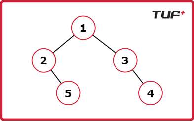

# Daimeter of tree

## Definition

The diameter is the length of the longest path between any two nodes.

The path:

- may or may not pass through the root;
- may have two leaf endpoints, but LeetCode defines it between any two nodes;
- is usually measured in **edges** on LeetCode 543.

## Height Convention

These notes use:

```text
height(null) = -1
height(leaf) = 0
```

Therefore the path through a node has:

```text
leftHeight + rightHeight + 2 edges
```

If height is measured in nodes instead, the formulas change. Always use one convention consistently.

## Three Diameter Candidates

For every node:

```text
1. best diameter completely inside the left subtree
2. best diameter completely inside the right subtree
3. longest path passing through the current node
```

Thus:

```text
diameter(root) =
    max(
        diameter(root.left),
        diameter(root.right),
        height(root.left) + height(root.right) + 2
    )
```

---

## Approach 1 — Separate Height Calls


```java
static int height(TreeNode root) {
    if (root == null) {
        return -1;
    }

    return Math.max(
        height(root.left),
        height(root.right)
    ) + 1;
}

static int diameterSlow(TreeNode root) {
    if (root == null) {
        return 0;
    }

    int leftDiameter = diameterSlow(root.left);
    int rightDiameter = diameterSlow(root.right);

    int throughRoot =
        height(root.left) + height(root.right) + 2;

    return Math.max(
        throughRoot,
        Math.max(leftDiameter, rightDiameter)
    );
}
```

### Complexity

- Balanced tree: about `O(n log n)`
- Skewed tree: `O(n²)`
- Stack: `O(h)`

The repeated `height` calls recalculate the same subtrees.

---

## Approach 2 — Return Diameter and Height Together


Each subtree returns:

```text
[diameter, height]
```

```java
static class DiaPair {
    int diameter;
    int height;

    DiaPair(int diameter, int height) {
        this.diameter = diameter;
        this.height = height;
    }
}

static DiaPair diameterPair(TreeNode root) {
    if (root == null) {
        return new DiaPair(0, -1);
    }

    DiaPair left = diameterPair(root.left);
    DiaPair right = diameterPair(root.right);

    int height = Math.max(left.height, right.height) + 1;

    int throughRoot = left.height + right.height + 2;
    int diameter = Math.max(
        throughRoot,
        Math.max(left.diameter, right.diameter)
    );

    return new DiaPair(diameter, height);
}
```

### Complexity

- Time: `O(n)`
- Stack: `O(h)`

---

## Approach 3 — Return Height, Update Global Diameter


```java
class Solution {
    private int bestDiameter;

    public int diameterOfBinaryTree(TreeNode root) {
        bestDiameter = 0;
        calculateHeight(root);
        return bestDiameter;
    }

    private int calculateHeight(TreeNode root) {
        if (root == null) {
            return -1;
        }

        int leftHeight = calculateHeight(root.left);
        int rightHeight = calculateHeight(root.right);

        bestDiameter = Math.max(
            bestDiameter,
            leftHeight + rightHeight + 2
        );

        return Math.max(leftHeight, rightHeight) + 1;
    }
}
```

## Common Diameter Mistakes

- Assuming the longest path must pass through the root.
- Mixing edge-based and node-based heights.
- Returning the path through the current node instead of the subtree height.
- Forgetting to reset the global answer between test cases.
- Using the repeated-height solution while claiming `O(n)` time.


```cpp
/**
 * Definition for a binary tree node.
 * struct TreeNode {
 * int val;
 * TreeNode *left;
 * TreeNode *right;
 * TreeNode() : val(0), left(nullptr), right(nullptr) {}
 * TreeNode(int x) : val(x), left(nullptr), right(nullptr) {}
 * TreeNode(int x, TreeNode *left, TreeNode *right) : val(x), left(left), right(right) {}
 * };
 */
class Solution {
    int maxDia = 0;

    int height(TreeNode* root) {
        if (!root) return 0;

        int lh = height(root->left);
        int rh = height(root->right);

        maxDia = max(maxDia, lh + rh);

        return 1 + max(lh, rh);
    }

public:
    int diameterOfBinaryTree(TreeNode* root) {
        maxDia = 0;
        height(root);
        return maxDia;
    }
};
```
Better use variable by reference
```cpp
class Solution {
    // Helper function takes 'ans' by reference
    int height(TreeNode* root, int& ans) { 
        if (!root) return 0;
        
        int lh = height(root->left, ans);
        int rh = height(root->right, ans);
        
        // Update the 'ans' variable that lives in main/wrapper
        ans = max(ans, lh + rh);
        
        return 1 + max(lh, rh);
    }

public:
    int diameterOfBinaryTree(TreeNode* root) {
        int ans = 0; // Local variable
        height(root, ans); // Passed by reference
        return ans; // It holds the correct max value now
    }
};
```

### this is Classic Tree DP.

Just like the "Max Path Sum" problem, the "Diameter of Binary Tree" fits the **Dynamic Programming** framework perfectly because it relies on **Optimal Substructure**.

Here is the breakdown:

---

### 1. The DP State (What you return)
In DP, you solve a smaller problem to help solve a larger one.
* **Subproblem:** "What is the longest path starting at this node and going down?" (i.e., The Height).
* **Recurrence Relation:**
    $$Height(node) = 1 + \max(Height(left), Height(right))$$

You cannot know the height of the current node until you have the optimal answers (heights) from your children.

---

### 2. The DP Transition (The "Combine" Step)
At every node, you use the answers from the subproblems (`left_height` and `right_height`) to compute two things:

1.  **The Local Answer (Diameter through Root):**
    $$CurrentDiameter = Height(left) + Height(right)$$
    We update the global maximum with this value.

2.  **The State for Parent (Height):**
    We return `1 + max(lh, rh)` so the parent node can solve its own subproblem.

---

### 3. Why it is DP and not just "Recursion"
* **Recursion** is the mechanism (how we traverse).
* **Dynamic Programming** is the logic (building the solution bottom-up).

Because we compute the answer for the leaves first, then their parents, then the root, we are building the solution using **Bottom-Up DP**.

---

### Comparison

| Feature | Max Path Sum | Diameter of Tree |
| :--- | :--- | :--- |
| **State (Returned)** | Max path sum ending at node | Max depth (Height) ending at node |
| **Formula** | `node.val + max(left, right)` | `1 + max(left, right)` |
| **Global Update** | `left + right + node.val` | `left + right` |

---

### Conclusion:
You are 100% correct. "Calculating height via Post-Order Traversal" **IS** the DP state calculation. The "Diameter" is just a value we derive from that state.


## Print path from root to  every leaf


Given the root of a binary tree. Return all the root-to-leaf paths in the binary tree.


A leaf node of a binary tree is the node which does not have a left and right child.


Example 1

Input : root = [1, 2, 3, null, 5, null, 4]

Output : [ [1, 2, 5] , [1, 3, 4] ]

Explanation : There are only two paths from root to leaf.

From root 1 to 5 , 1 -> 2 -> 5.

From root 1 to 4 , 1 -> 3 -> 4.




### My sol 1 

```cpp

/**
 * Definition for a binary tree node.
 * struct TreeNode {
 *     int data;
 *     TreeNode *left;
 *     TreeNode *right;
 *      TreeNode(int val) : data(val) , left(nullptr) , right(nullptr) {}
 * };
 **/

class Solution{
	vector<vector<int>> res;
	vector<int> tres;
	void getAllpaths(TreeNode * node){
		if(node->left==nullptr && node->right==nullptr){
			tres.push_back(node->data);
			res.push_back(tres);
			tres.pop_back();
			return;
		}
		tres.push_back(node->data);
		if(node->left!=nullptr){
			getAllpaths(node->left);
		}
		if(node->right!=nullptr){
			getAllpaths(node->right);
		}
		tres.pop_back();
	}
	public:
		vector<vector<int>> allRootToLeaf(TreeNode* root) {
            getAllpaths(root);
			return res;
		}
};
```

### My sol 2

```cpp
/**
 * Definition for a binary tree node.
 * struct TreeNode {
 *     int data;
 *     TreeNode *left;
 *     TreeNode *right;
 *      TreeNode(int val) : data(val) , left(nullptr) , right(nullptr) {}
 * };
 **/

class Solution{
	vector<vector<int>> res;
	vector<int> tres;
	void getAllpaths(TreeNode * node){
		if(node==nullptr) return;
		tres.push_back(node->data);
		if(node->left==nullptr && node->right==nullptr){
			res.push_back(tres);
		}else{
			getAllpaths(node->left);
			getAllpaths(node->right);
		}
		
		tres.pop_back();
	}
	public:
		vector<vector<int>> allRootToLeaf(TreeNode* root) {
            getAllpaths(root);
			return res;
		}
};
```
