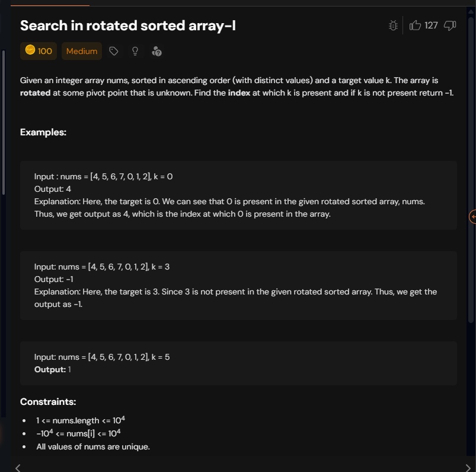

# Notes



```cpp
class Solution {

    int bs(vector<int> &nums, int target,int low ,int high){
        int n=nums.size();
        while(low<=high){
            int mid=(low+high)/2;
            if(nums[mid]==target) return mid;
            // Check if the left part is sorted
            if (nums[low] <= nums[mid]) {
                if (nums[low] <= target && target <= nums[mid]) {
                    // Target exists in the left sorted part
                    high = mid - 1 ;
                } else {
                    // Target does not exist in the left sorted part
                    low = mid + 1;
                }
            } else {
                // Check if the right part is sorted
                if (nums[mid] <= target && target <= nums[high]) {
                    // Target exists in the right sorted part
                    low = mid + 1;
                } else {
                    // Target does not exist in the right sorted part
                    high = mid - 1;
                }
        }
        }
        return -1;
    }
public:
    int search(vector<int> &nums, int k) {
       return bs(nums,k,0,nums.size()-1);
    }
};

```


