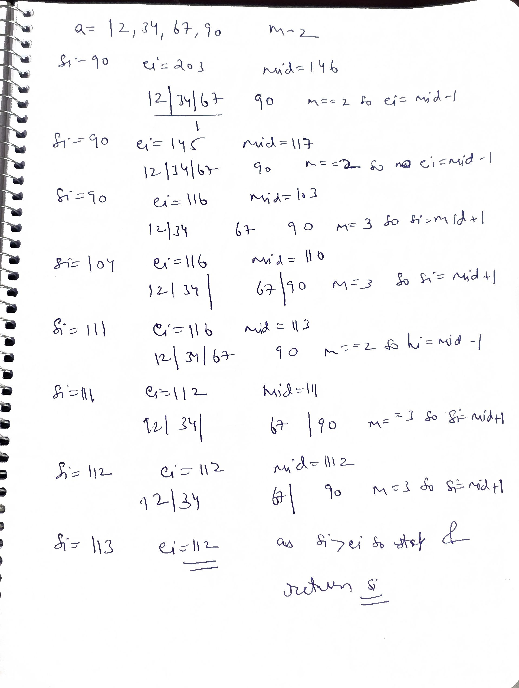
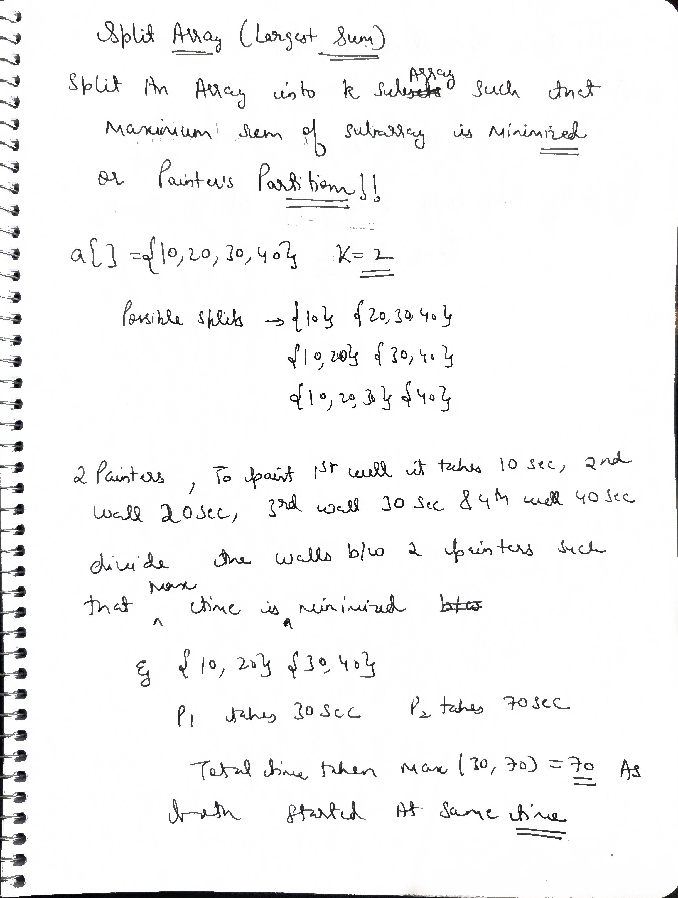
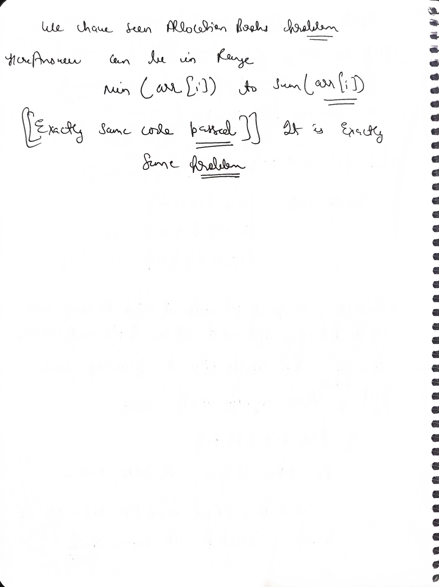

# Q1  Find the Smallest Divisor Given a Threshold

## Problem Description

Given an array of positive integers `nums` and an integer `threshold` (also referred to as `limit`), your task is to find the smallest positive integer divisor such that when you divide all the elements in the array by this divisor and sum up the results, the total sum is less than or equal to the `threshold` value.

**Important Note:** When dividing each element, the result **must be rounded up to the nearest integer** (i.e., you must use the ceiling function: $\left\lceil \frac{\text{num}}{\text{divisor}} \right\rceil$).

## Examples

**Example 1:**
- **Input:** `nums = [1, 2, 5, 9]`, `threshold = 6`
- **Output:** `5`
- **Explanation:**
    * If divisor is 4, sum = $\lceil 1/4 \rceil + \lceil 2/4 \rceil + \lceil 5/4 \rceil + \lceil 9/4 \rceil = 1 + 1 + 2 + 3 = 7$. (7 > 6, so 4 is too small)
    * If divisor is 5, sum = $\lceil 1/5 \rceil + \lceil 2/5 \rceil + \lceil 5/5 \rceil + \lceil 9/5 \rceil = 1 + 1 + 1 + 2 = 5$. (5 $\le$ 6, so 5 is the smallest valid divisor)

**Example 2:**
- **Input:** `nums = [2, 3, 5, 7, 11]`, `threshold = 11`
- **Output:** `3`

## Constraints

* `1 <= nums.length <= 5 * 10^4`
* `1 <= nums[i] <= 10^6`
* `nums.length <= threshold <= 10^6`


## Solution Explaination

$\sum (x[i]/div) \leq \text{limit}$ we need to find $\underline{\text{div}}$

---

**Base case:** if $\sum x[i] \leq \text{limit} \Rightarrow \text{div} = 1$


 if $\text{div} > \max(x[i])$
then $\sum x[i] \text{ /div} = 0$
But we need $\leq \text{limit}$ not to zero
& $\text{limit} \leq 10^6$

So at max  $\text{div} = \max(x[i])$

So for $2$ to $max(x[i])$ we need to check by **Binary Search** !!

```cpp

class Solution {
  bool min_div(int div,vector<int> &nums, int limit){
    int sum=0;
    for(int el:nums){
      sum+=((el+div-1)/div);
    }
    return sum<=limit;
  }
public:
  int smallestDivisor(vector<int> &nums, int limit) {
       
      long long sum=accumulate(nums.begin(),nums.end(),0);
      if(sum<=limit ) return 1;

      auto max_it=max_element(nums.begin(),nums.end());
      int max_el=*max_it;

      int si=2;
      int ei=max_el;
      int ans=INT_MAX;
      while(si<=ei){
        int mid=(si+ei)/2;

        if(min_div(mid,nums,limit)==true){
           ans=min(ans,mid);
           ei=mid-1;
        }else{
          si=mid+1;
        }

      }
      return ans;

    }
};
```


### Complexity Analysis
- Time Complexity
    O(n log m), where n is the size of nums and m is the maximum element in nums.
- Space Complexity
    O(1), excluding the input array.


## Methods for Integer Ceiling Division $\left\lceil \frac{N}{D} \right\rceil$

Here are two primary methods for calculating the ceiling of a division between two positive integers ($N$ and $D$) in C++.

---

## Method 1: Mathematical Formula (Recommended for Integers)

This is the most efficient and widely used method as it relies only on **integer arithmetic**, avoiding the overhead and potential precision issues of floating-point numbers.

The formula is:
$$\text{Ceiling}(N, D) = \frac{N + D - 1}{D}$$
*(Note: The division operation used here is standard C++ integer division, which inherently performs the floor operation $\lfloor \cdot \rfloor$.)*

### How it Works:

* **Case 1: $N$ is Perfectly Divisible by $D$**
    * Example: $N=10, D=5$. $\frac{10}{5} = 2$.
    * Formula: $\frac{10 + 5 - 1}{5} = \frac{14}{5}$. Integer division gives $\lfloor 2.8 \rfloor = 2$. (Correct)

* **Case 2: $N$ is NOT Perfectly Divisible by $D$**
    * Example: $N=11, D=5$. $\lceil \frac{11}{5} \rceil = \lceil 2.2 \rceil = 3$.
    * Formula: $\frac{11 + 5 - 1}{5} = \frac{15}{5}$. Integer division gives $3$. (Correct)

### C++ Code Example (Method 1)

```cpp
#include <iostream>

long long ceil_division_integer(long long numerator, long long denominator) {
    // This formula works for positive numerator and positive denominator.
    if (denominator == 0) {
        // Handle division by zero error
        std::cerr << "Error: Division by zero.\n";
        return -1; 
    }
    
    // N + D - 1 / D
    return (numerator + denominator - 1) / denominator;
}

int main() {
    long long N1 = 11;
    long long D1 = 5; // Expected: ceil(2.2) = 3
    
    long long N2 = 10;
    long long D2 = 5; // Expected: ceil(2.0) = 2
    
    long long result1 = ceil_division_integer(N1, D1);
    long long result2 = ceil_division_integer(N2, D2);

    std::cout << N1 << " / " << D1 << " ceiling is: " << result1 << "\n";
    std::cout << N2 << " / " << D2 << " ceiling is: " << result2 << "\n";

    return 0;
}
```

## Method 2: Using Floating Point Conversion (`std::ceil`)

This method is more readable and uses the standard mathematical function, but it involves floating-point arithmetic, which is generally slightly slower and can sometimes introduce tiny precision errors (though highly unlikely in this simple context).

### Steps:

1.  Cast one of the integers to a `double` or `float`.
2.  Perform the division.
3.  Use `std::ceil()` from the `<cmath>` header.
4.  Cast the result back to an integer type.

### C++ Code Example (Method 2)

```cpp
#include <iostream>
#include <cmath> // Required for std::ceil

int ceil_division_float(int numerator, int denominator) {
    if (denominator == 0) {
        std::cerr << "Error: Division by zero.\n";
        return -1;
    }

    // Cast numerator to double to force floating-point division
    double result = static_cast<double>(numerator) / denominator;

    // Calculate the ceiling and cast back to int
    return static_cast<int>(std::ceil(result));
}

int main() {
    int N1 = 11;
    int D1 = 5;
    
    int N2 = 10;
    int D2 = 5;

    int result1 = ceil_division_float(N1, D1);
    int result2 = ceil_division_float(N2, D2);

    std::cout << N1 << " / " << D1 << " ceiling is: " << result1 << "\n";
    std::cout << N2 << " / " << D2 << " ceiling is: " << result2 << "\n";

    return 0;
}
```
# Q2  Minimum days to make M bouquets

## Problem Statement
You are given 'N' roses and you are also given an array 'arr' where 'arr[i]' denotes that the 'ith' rose will bloom on the 'arr[i]th' day. You can only pick already bloomed roses that are adjacent to make a bouquet. Exactly 'k' adjacent bloomed roses are required to make a single bouquet. 

Find the minimum number of days required to make at least 'm' bouquets, each containing 'k' roses. Return -1 if it is not possible.

---

### Examples

**Example 1:**
- **Input:** `n = 8, arr = [7, 7, 7, 7, 13, 11, 12, 7], m = 2, k = 3`
- **Output:** `12`
- **Explanation:** - On the 12th day, the first 4 flowers and the last 3 flowers will have bloomed. 
    - Array status: `[7, 7, 7, 7, _, 11, 12, 7]` (where numbers ≤ 12 are bloomed).
    - We can make one bouquet with the first 3 flowers and another with the last 3 flowers.

**Example 2:**
- **Input:** `n = 5, arr = [1, 10, 3, 10, 2], m = 3, k = 2`
- **Output:** `-1`
- **Explanation:** - To make 3 bouquets of 2 flowers each, we need at least 6 flowers (3 * 2 = 6). 
    - Since we only have 5 flowers, it is impossible.

**Example 3:**
- **Input:** `n = 5, arr = [1, 10, 3, 10, 2], m = 3, k = 1`
- **Output:** `3`
- **Explanation:**
    - On day 3, flowers at indices 0, 2, and 4 have bloomed. 
    - Each can form a bouquet since `k=1`. Total = 3 bouquets.

---

### Constraints
- `1 <= n <= 10^5`
- `1 <= arr[i] <= 10^9`
- `1 <= m <= 10^6`
- `1 <= k <= n`

---
 ### Code

 ```cpp
class Solution {
  bool isItPossible(vector<int>& nums,int k, int m,int day){
    int cnt=0;
    for(int n:nums){
      if(n<=day){ 
        cnt++;
        
      }else{
        if(cnt>=k){
          m-=(cnt/k);
        }
        cnt=0;
      }
    } 

    if(cnt>=k){
        m-=(cnt/k);
    }
    return (m<=0);
  }
public:
int roseGarden(int n,vector<int> nums, int k, int m) {
  long long prod=k*m;
  if(n<prod) return -1;
  auto max_it=max_element(nums.begin(),nums.end());
  int max_el=*max_it;
  auto min_it=min_element(nums.begin(),nums.end());
  int min_el=*min_it;
  int si=min_el;
  int ei=max_el;
  while(si<=ei){
  int mid=(si+ei)/2;
  if(isItPossible(nums,k,m,mid)){
    ei=mid-1;
    }else{
      si=mid+1;
    }
  }

    return (ei+1);   
  }
};
 ```


 .jpg>) 
 .jpg>) 
 .jpg>) 
 .jpg>) 
 .jpg>) 
 .jpg>) 
 .jpg>) 
 .jpg>) 
 .jpg>) 
 .jpg>) 
 .jpg>) 
 .jpg>) 
 .jpg>) 
 .jpg>) 
 .jpg>) 
 .jpg>) 
 .jpg>) 
 .jpg>) 
 .jpg>) 
 .jpg>) 
 .jpg>) 
 .jpg>) 
 .jpg>) 
 .jpg>) 
 .jpg>) 
 .jpg>) 
 .jpg>) 
 .jpg>) 
 .jpg>) 
 .jpg>)
 
 ```cpp
 
 class Solution {
    bool isItPossible(vector<int> nums, int h,int d){
        long long sum=0;
        for(int n:nums){
            sum+=((n+d-1)/d);
        }
        return sum<=h;
    }
public:
int minimumRateToEatBananas(vector<int> nums, int h) {
        auto max_it=max_element(nums.begin(),nums.end());
        int max_el=*max_it;
        int si=1;
        int ei=max_el;
        while(si<=ei){
            int mid=(si+ei)/2;
            if(isItPossible(nums,h,mid)){
                ei=mid-1;
            }else{
                si=mid+1;
            }
        }

        return (ei+1);
    }
};

 ```

using (n+d-1)/d to find ceil(n/d)...

then simple for d we have range till from 1 till max(all arr[i]); as after that all will give 1 on ceil (x[i]/d) so no need to search their

then if possible d to do in h time then we need to find more less so ei=mid-1 

else si=mid+1

 
  .jpg>) 
 .jpg>)
 .jpg>) 
 .jpg>) 
 
  ## Square root
 same code but now we see si<=ei ,now we need to increment or decement si and  ei ,we cannot keep si=mid or ei=mid now as now on si=ei when we dont chnage and keep si=mid then it will never be change and be in TLE.

so we keep si=mid+1 and at last return (si-1)

```cpp
class Solution {
public:
    int mySqrt(int x) {
        if(x==0 ||x==1) return x;
        int si=1;
        int ei=x-1;
        while(si<=ei){
            int mid=(si+ei)/2;
            if(mid>(x/mid)) ei=mid-1;
            else si=mid+1;
        }
        return (si-1);
    }
};
```

### Nth root

#### Problem Statement
Given two positive integers `n` and `m`, you need to find the `nth` root of `m`. 
The `nth` root of a number `m` is a number `x` such that $x^n = m$.

If the `nth` root is an integer, return that integer value. If the `nth` root is not an integer (i.e., `m` is not a perfect `nth` power), return `-1`.

---

#### Example 1
**Input:** `n = 3`, `m = 27`  
**Output:** `3`  
**Explanation:** $3^3 = 27$, so the 3rd root of 27 is 3.

##### Example 2
**Input:** `n = 4`, `m = 69`  
**Output:** `-1`  
**Explanation:** There is no integer `x` such that $x^4 = 69$.

---

#### Constraints
* $1 \le n \le 30$
* $1 \le m \le 10^9$

```cpp
class Solution {
    int power(int mid, int n, int m) {
        long long ans = 1, base = mid;
        
        while (n > 0) {
            if (n % 2) {
                ans = ans * base;
                if (ans > m) return 2;  // Early exit
                n--;
            } 
            else {
                n /= 2;
                base = base * base;
                if(base > m) return 2;
            }
        }
        if (ans == m) return 1;
        return 0;
    }
public:
  int NthRoot(int N, int M) {
       if(M==1) return 1;
       if(N==1) return M;
      int si=2;
      int ei=M-1;
      while(si<=ei){
        int mid=(si+ei)/2;
        int pow=power(mid,N,M);
        if(pow==1) return mid;
        else if(pow==0) si=mid+1;
        else ei=mid-1;
      }
      return -1;
    }
};

```

#### Complexity Analysis
- Time Complexity
The time complexity is O(log(M) * log(N)) due to the binary search from 2 to M-1 and the power function.
- Space Complexity
The space complexity is O(1) as it uses a constant amount of extra space.
 
 .jpg>) 
 


 .jpg>) 
 .jpg>) 
 .jpg>) 
 .jpg>) 
 .jpg>) 
 .jpg>) 
 .jpg>) 
 .jpg>) 
 .jpg>) 
 .jpg>) 
 .jpg>) 
 .jpg>) 
 .jpg>) 
 .jpg>) 
 .jpg>) 
 .jpg>) 
 .jpg>) 
 .jpg>) 
 .jpg>) 
 .jpg>) 
 .jpg>) 

```java


//User function Template for Java

class Solution {
 private static boolean isItPossible(int arr[],int K,double mid){
     int station=0;
     for(int i=1;i<arr.length;i++){
         station+=(arr[i]-arr[i-1])/mid;
         if(station>K) return true;
     }
     return false;
     
 }
  public static double findSmallestMaxDist(int arr[],int K) {
    int n=arr.length;
    double si=0;
    double ei=1e9;
    while((ei-si)>1e-6){
        double mid=(si+ei)/2.0;
        if(isItPossible(arr,K,mid)) si=mid+1e-6;
        else ei=mid;
    }
    return ei;
  }
}
     
```

 .jpg>)

 # Q3 Agggresive cows

## AGGRCOW - Aggressive cows

**Problem Code:** AGGRCOW
**Topics:** Binary Search

Link--> https://www.spoj.com/problems/AGGRCOW/

---

### Problem Description

Farmer John has built a new long barn, with $N$ ($2 \le N \le 100,000$) stalls. The stalls are located along a straight line at positions $x_1, \dots, x_N$ ($0 \le x_i \le 1,000,000,000$).

His $C$ ($2 \le C \le N$) cows don't like this barn layout and become aggressive towards each other once put into a stall. To prevent the cows from hurting each other, FJ wants to assign the cows to the stalls, such that the minimum distance between any two of them is as large as possible. What is the largest minimum distance?

### Input

- **t**: the number of test cases, then $t$ test cases follow.
- **Line 1**: Two space-separated integers: $N$ and $C$.
- **Lines 2..N+1**: Line $i+1$ contains an integer stall location, $x_i$.

### Output

For each test case, output one integer: the largest minimum distance.

---

### Example

**Input:**
```text
1
5 3
1
2
8
4
9
```
**Output:**

```text 
3
```

 ```cpp

 int agressiveCows(){
    int n,c;
    cin>>n>>c;
    int arr[n];
    for(int i=0;i<n;i++){
        cin>>arr[i];
    }
    sort(arr,arr+n);
    int lo=0,hi=arr[n-1]-arr[0];
    while(lo<=hi){
        int mid=(lo+hi)/2;
        int lastCowPlacedPos=arr[0];
        int cowPlaced=1;
        for(int i=1;i<n;i++){
            if(arr[i]-lastCowPlacedPos>=mid){
                cowPlaced++;
                lastCowPlacedPos=arr[i];
            }
            if(cowPlaced==c) break;
        }
        if(c==cowPlaced) lo=mid+1;
        else hi=mid-1;
    }
    return hi;
}
void solve(){
    int tc;
    cin>>tc;
    for(int i=0;i<tc;i++){
        cout<<agressiveCows()<<endl;
    }
}
```

Full code 

```cpp
#include<bits/stdc++.h>
using namespace std;

#define ff              first
#define ss              second
#define ll             long long
#define lli 				long long int
#define pb              push_back
#define mp              make_pair
#define pii             pair<int,int>
#define vi              vector<int>
#define mii             map<int,int>
#define umii			unordered_map<int, int>
#define pq_max          priority_queue<int>
#define pq_min          priority_queue<int,vi,greater<int> >
#define setbits(x)      __builtin_popcountll(x)
#define zrobits(x)      __builtin_ctzll(x)
#define mod             1000000007
#define inf             1e18
#define ps(x,y)         fixed<<setprecision(y)<<x
#define mid(s,e)         (s+(e-s)/2)
#define mk(arr,n,type)  type *arr=new type[n];
#define w(t)            int t; cin>>t; while(t--)
#define DEBUG(x) 		cout << '>' << #x << ':' << x << endl;
#define REP(i,n) 		for(int i=0;i<(n);i++)
#define FOR(i,a,b) 		for(int i=(a);i<=(b);i++)
#define FORD(i,a,b) 	for(int i=(a);i>=(b);i--)

void fio()
{
    ios_base::sync_with_stdio(0); cin.tie(0); cout.tie(0);
    #ifndef ONLINE_JUDGE
        freopen("input.txt", "r", stdin);
        freopen("output.txt", "w", stdout);
    #endif
}
int agressiveCows(){
    int n,c;
    cin>>n>>c;
    int arr[n];
    for(int i=0;i<n;i++){
        cin>>arr[i];
    }
    sort(arr,arr+n);
    int lo=0,hi=arr[n-1]-arr[0];
    while(lo<=hi){
        int mid=(lo+hi)/2;
        int lastCowPlacedPos=arr[0];
        int cowPlaced=1;
        for(int i=1;i<n;i++){
            if(arr[i]-lastCowPlacedPos>=mid){
                cowPlaced++;
                lastCowPlacedPos=arr[i];
            }
            if(cowPlaced==c) break;
        }
        if(c==cowPlaced) lo=mid+1;
        else hi=mid-1;
    }
    return hi;
}
void solve(){
    int tc;
    cin>>tc;
    for(int i=0;i<tc;i++){
        cout<<agressiveCows()<<endl;
    }
}
int main(int argc, char const *argv[]) {
    fio();
    solve();
    return 0;
}

```

### Code partial 

```cpp
class Solution {
public:
    int aggressiveCows(vector<int> &arr, int k) {
        int n=arr.size();
        sort(arr.begin(),arr.end());
    int lo=0,hi=arr[n-1]-arr[0];
    while(lo<=hi){
        int mid=(lo+hi)/2;
        int lastCowPlacedPos=arr[0];
        int cowPlaced=1;
        for(int i=1;i<n;i++){
            if(arr[i]-lastCowPlacedPos>=mid){
                cowPlaced++;
                lastCowPlacedPos=arr[i];
            }
            if(cowPlaced==k) break;
        }
        if(k==cowPlaced) lo=mid+1;
        else hi=mid-1;
    }
    return hi;
    }
};
```

# Q4 2485. Find the Pivot Integer

**Difficulty:** Easy
**Topics:** Math, Prefix Sum

Link-->https://leetcode.com/problems/find-the-pivot-integer/description/

---

### Problem Description

Given a positive integer `n`, find the pivot integer `x` such that:

- The sum of all elements between `1` and `x` inclusively equals the sum of all elements between `x` and `n` inclusively.

Return the pivot integer `x`. If no such integer exists, return `-1`. It is guaranteed that there will be at most one pivot index for the given input.

---

### Examples

**Example 1:**

**Input:** `n = 8`
**Output:** `6`
**Explanation:** `6` is the pivot integer since: `1 + 2 + 3 + 4 + 5 + 6 = 6 + 7 + 8 = 21`.

**Example 2:**

**Input:** `n = 1`
**Output:** `1`
**Explanation:** `1` is the pivot integer since: `1 = 1`.

**Example 3:**

**Input:** `n = 4`
**Output:** `-1`
**Explanation:** It can be proved that no such integer exist.

---

### Constraints

- `1 <= n <= 1000`


```cpp

class Solution {
    public int pivotInteger(int n) {
        int s=(n*(n+1))/2;
        int lo=1;
        int hi=n;
        while(lo<=hi){
            int x=(lo+hi)/2;
            int s1=(x*(x+1))/2;
            int s2=s-s1+x;
            if(s1==s2) return x;
            else if(s1<s2) lo=x+1;
            else hi=x-1;
        }
        return -1;
        
    }
}
```

# Q5 book allocation problem 


Given an array nums of n integers, where nums[i] represents the number of pages in the i-th book, and an integer m representing the number of students, allocate all the books to the students so that each student gets at least one book, each book is allocated to only one student, and the allocation is contiguous.


Allocate the books to m students in such a way that the maximum number of pages assigned to a student is minimized. If the allocation of books is not possible, return -1.


Example 1

Input: nums = [12, 34, 67, 90], m=2

Output: 113

Explanation: The allocation of books will be 12, 34, 67 | 90. One student will get the first 3 books and the other will get the last one.

Example 2

Input: nums = [25, 46, 28, 49, 24], m=4

Output: 71

Explanation: The allocation of books will be 25, 46 | 28 | 49 | 24.


```cpp

class Solution {
    bool booksallocatedTomStudents(vector<int> &arr, int m,long long k){
        int student=1;
        int i=0;
        long long sum=0;
        while(i<arr.size()){
            sum+=arr[i];
            if(sum>k) {
                student++;
                sum=arr[i];
            }
            i++;
        }
        return student<=m;
    } 
public:
    int findPages(vector<int> &arr, int m)  {
        long long si=*max_element(arr.begin(),arr.end());
        //si is max element as if we take min element it will not satisfy to give that min 
        //element to all m students
        long long ei=accumulate(arr.begin(),arr.end(),0);
        if(m==1) return ei;
        if (m > arr.size()) return -1;//edge case
        while(si<=ei){
            long long mid=(si+ei)/2;
            if(booksallocatedTomStudents(arr,m,mid)) {
                ei=mid-1;
            }
            else si=mid+1;
        }
        return si;
    }
};
```

If we able to fill for less than m students we need less values



the template `while(lo <= hi)` is the **Standard Industry Choice** for "Binary Search on Answer" problems (like *Koko Eating Bananas*, *Aggressive Cows*, *Book Allocation*, etc.).

Here is why it works so perfectly for this specific type of problem.

---

### 1. The "False-True" Structure
Binary Search on Answer problems always have a **Monotonic** search space. For "Minimum" problems (like Koko), the possible answers usually look like this:

| Value | Too Slow | Too Slow | Too Slow | **Valid** | Valid | Valid |
| :--- | :--- | :--- | :--- | :--- | :--- | :--- |
| **Logic** | False | False | False | **True** | True | True |

We want to find the **First True**.

---

### 2. How the Template Automatically Finds the Boundary
When you use `lo = mid + 1` and `hi = mid - 1`, the pointers act like magnets with opposite polarities:
* **`lo` hates False:** Whenever it sees **False** (logic invalid), it runs away to the right (`lo = mid + 1`).
* **`hi` hates True:** Whenever it sees **True** (logic valid), it runs away to the left (`hi = mid - 1`).

---

### 3. The "Cross" (The Magic Moment)
Because of this behavior, when the loop ends (`lo > hi`), the pointers will always land on opposite sides of the boundary line.

```text
Values:  [False, False, False] | [True,  True,  True]
Index:     2      3      4     |   5      6      7
                         ^         ^
                        hi        lo
```                        

* **`hi` (Index 4):** Points to the **Last False** (Largest value that doesn't work).
* **`lo` (Index 5):** Points to the **First True** (Smallest value that works).

---

### 4. Cheat Sheet for Return Values
This template is powerful because the return value changes based on what you are looking for. You don't even need an `ans` variable if you memorize this:

| Problem Type | Goal | Example | Return |
| :--- | :--- | :--- | :--- |
| **Minimization** | Find smallest valid $x$ | Koko Eating Bananas | `return lo;` |
| **Maximization** | Find largest valid $x$ | Maximize Sweetness | `return hi;` |

---

### Summary
* **Can you use it?** Yes.
* **Is it good?** It is the best.
* **Why?** Because `lo` and `hi` naturally separate the "Valid" world from the "Invalid" world. You just pick the pointer that is standing in the "Valid" world.

# Q6  Split Array - Largest Sum
 or Painter's Partition
 or Book Allocation Exactly same code
### Problem Statement
Given an integer array `a` of size `n` and an integer `k`, split the array `a` into `k` non-empty subarrays such that the largest sum of any subarray is **minimized**. Your task is to return the minimized largest sum of the split.

A **subarray** is a contiguous part of the array.

---

### Examples

#### Example 1:
**Input:** `n = 5`, `a = [1, 2, 3, 4, 5]`, `k = 3`  
**Output:** `6`  
**Explanation:** There are many ways to split the array into 3 consecutive subarrays. The best way is to split it into `[1, 2, 3]`, `[4]`, and `[5]`. The sums are 6, 4, and 5. The largest among them is 6. Any other way to split will result in a larger "maximum sum."

#### Example 2:
**Input:** `n = 3`, `a = [3, 5, 1]`, `k = 3`  
**Output:** `5`  
**Explanation:** Since `k` is equal to the number of elements, each element must be its own subarray: `[3]`, `[5]`, and `[1]`. The largest sum among these is 5.

---

### Constraints
* `1 ≤ n ≤ 10^4`
* `1 ≤ k ≤ n`
* `1 ≤ a[i] ≤ 10^4`

---
 

```cpp
class Solution {
    bool booksallocatedTomStudents(vector<int> &arr, int m, long long k) {
        int student = 1;
        int i = 0;
        long long sum = 0;
        while (i < arr.size()) {
            sum += arr[i];
            if (sum > k) {
                student++;
                sum = arr[i];
            }
            i++;
        }
        return student <= m;
    }

   public:
    int largestSubarraySumMinimized(vector<int> &arr, int m) {
        long long si = *max_element(arr.begin(), arr.end());
        long long ei = accumulate(arr.begin(), arr.end(), 0);
        if (m == 1) return ei;
        if (m > arr.size()) return -1;  // edge case
        while (si <= ei) {
            long long mid = (si + ei) / 2;
            if (booksallocatedTomStudents(arr, m, mid)) {
                ei = mid - 1;
            } else
                si = mid + 1;
        }
        return si;
    }
};
```

---

### Complexity Analysis
* **Time Complexity:** `O(N * log(Sum(a) - Max(a)))`  
    * Where `N` is the number of elements in the array.
    * The binary search runs `log(range)` times, and for each step, we traverse the array once (`O(N)`).
* **Space Complexity:** `O(1)`  
    * No extra data structures are used.