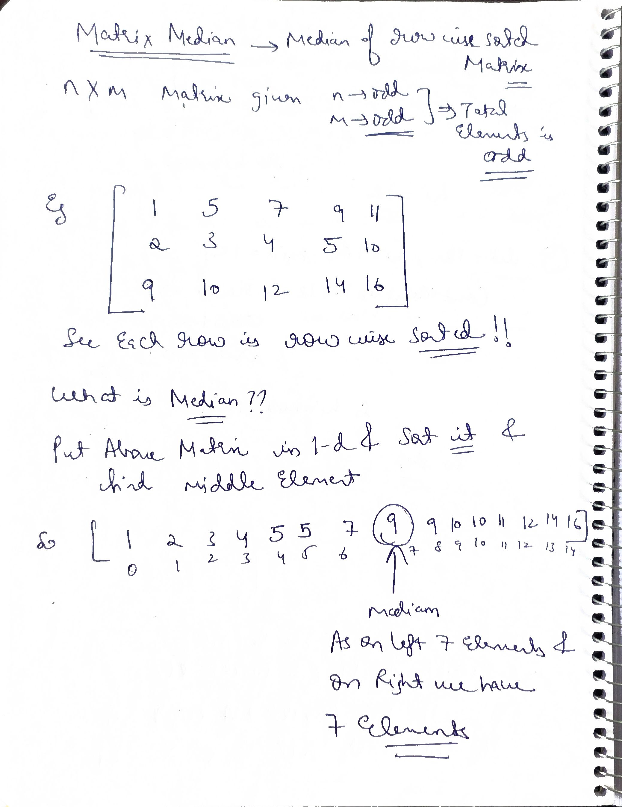
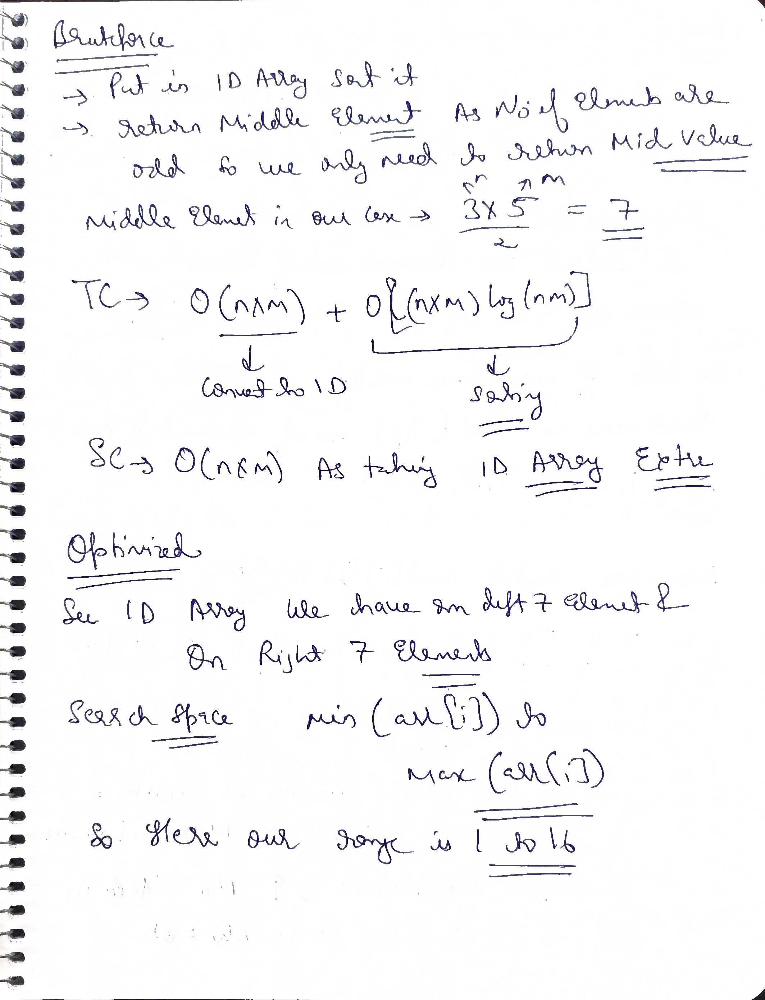
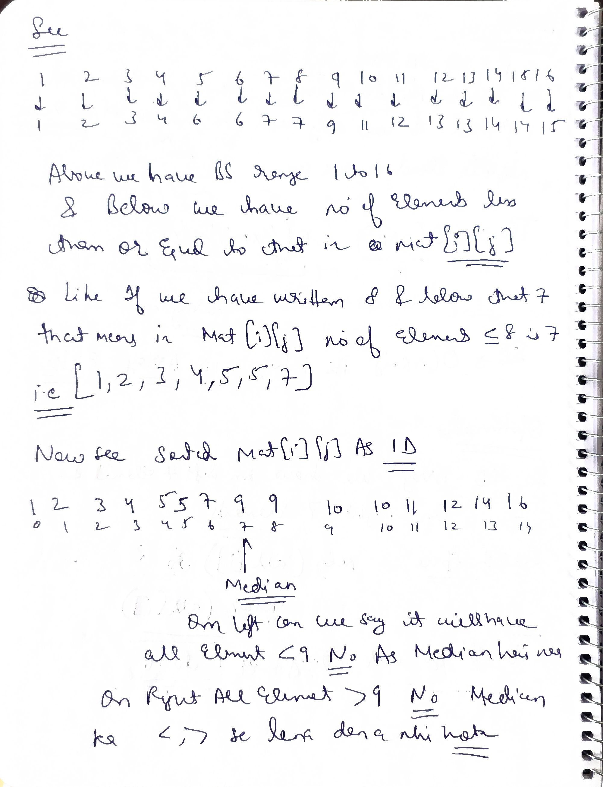
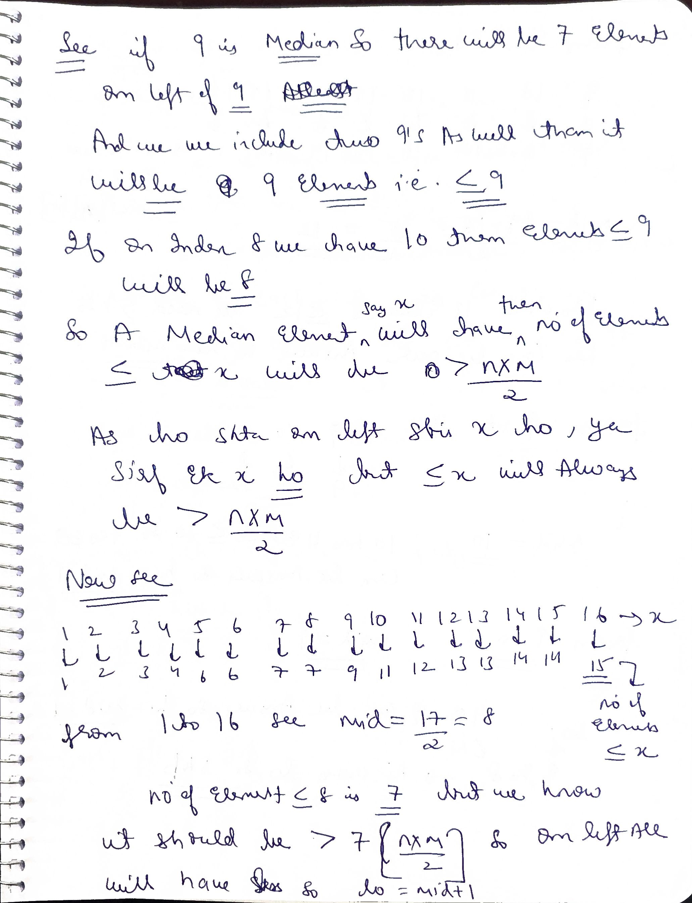
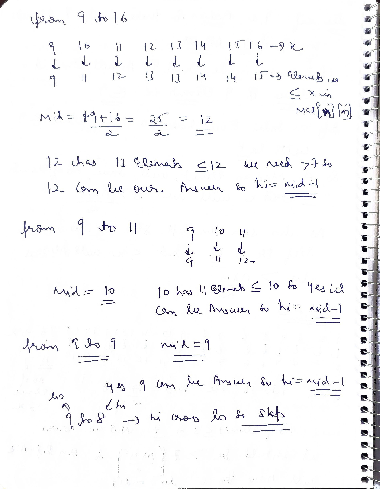
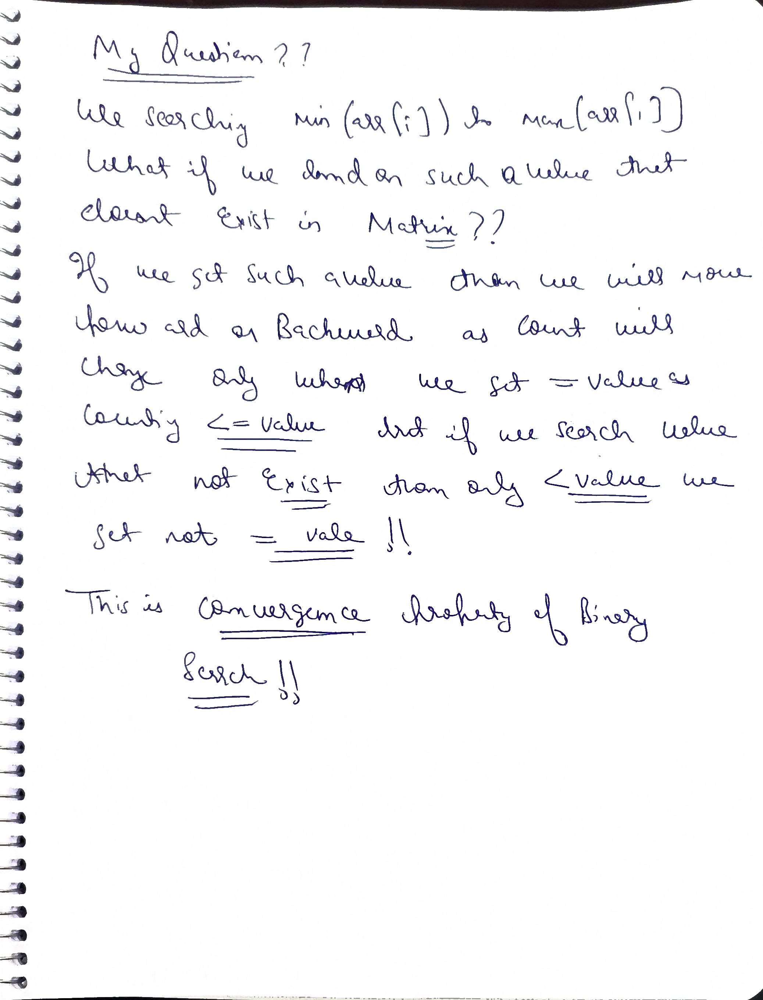

# Q1 Median Matrix


Given a 2D array matrix that is row-wise sorted. The task is to find the median of the given matrix.

---

Example 1

Input: matrix=[ [1, 4, 9], [2, 5, 6], [3, 7, 8] ] 

Output: 5

Explanation: If we find the linear sorted array, the array becomes 1 2 3 4 5 6 7 8 9. So, median = 5

---

Example 2

Input: matrix=[ [1, 3, 8], [2, 3, 4], [1, 2, 5] ] 

Output: 3

Explanation: If we find the linear sorted array, the array becomes 1 1 2 2 3 3 4 5 8. So, median = 3

  
  
  
  
 
### Code


```cpp

class Solution{
    int countElementLessThanEqualTo(int val,vector<vector<int>>&mat,int n,int m){
        int cnt=0;
        for(int i=0;i<mat.size();i++){
            cnt+=(upper_bound(mat[i].begin(),mat[i].end(),val)-mat[i].begin());
        }
        return cnt;
    }
public:
    int findMedian(vector<vector<int>>&matrix) {
        int n = matrix.size();
        int m = matrix[0].size(); 
        
        int low = INT_MAX, high = INT_MIN;

        for (int i = 0; i < n; i++) {
            low = min(low, matrix[i][0]);
            high = max(high, matrix[i][m - 1]);
        }
         int req = (n * m) / 2;
            while (low <= high) {
                int mid=(low+high)/2;
                if(countElementLessThanEqualTo(mid,matrix,n,m)>req) high=mid-1;
                else low=mid+1;
          }
          return low;
    }
};
```
or 

```cpp
class Solution{
    int countElementLessThanEqualTo(int val,vector<vector<int>>&mat,int n,int m){
        int cnt=0;
        for(int i=0;i<mat.size();i++){
            cnt+=(upper_bound(mat[i].begin(),mat[i].end(),val)-mat[i].begin());
        }
        return cnt;
    }
public:
    int findMedian(vector<vector<int>>&matrix) {
        int n = matrix.size();
        int m = matrix[0].size(); 
        
        int low = INT_MAX, high = INT_MIN;

        for (int i = 0; i < n; i++) {
            low = min(low, matrix[i][0]);
            high = max(high, matrix[i][m - 1]);
        }
         int req = (n * m) / 2;
            while (low <= high) {
                int mid=(low+high)/2;
                if(countElementLessThanEqualTo (mid,matrix,n,m)>req) high=mid-1;
                else low=mid+1;
          }
          return high+1;
    }
};
```

same code just returning (high+1) as on last iteration high,low will be on same element and then 

# Q2 Search in a 2D matrix

Given a 2-D array mat where the elements of each row are sorted in non-decreasing order, and the first element of a row is greater than the last element of the previous row (if it exists), and an integer target, determine if the target exists in the given mat or not.


Example 1

Input: mat = [ [1, 2, 3, 4], [5, 6, 7, 8], [9, 10, 11, 12] ], target = 8

Output: True

Explanation: The target = 8 exists in the 'mat' at index (1, 3).

Example 2

Input: mat = [ [1, 2, 4], [6, 7, 8], [9, 10, 34] ], target = 78

Output: False

Explanation: The target = 78 does not exist in the 'mat'. Therefore in the output, we see 'false'.

Constraints

 -  n == mat.length
 -  m == mat[i].length
  - 1 <= m, n <= 100
  - -$10^4$ <= mat[i][j], target <= $10^4$

### Brute --> Serach in every cell O(n*m)

### Better-->

```cpp

#include <bits/stdc++.h>
using namespace std;

class Solution {
private:
    //Fuction to perform binary search 
    bool binarySearch(vector<int>& mat, int target) {
        int n = mat.size(); 
        int low = 0, high = n - 1;

        //Perform binary search
        while (low <= high) {
            int mid = (low + high) / 2;
            
            //Return true if target is found
            if (mat[mid] == target) return true;
            else if (target > mat[mid]) low = mid + 1;
            else high = mid - 1;
        }
        //Return false if target not found
        return false;
    }
public:
    //Function to search for a given target in matrix
    bool searchMatrix(vector<vector<int>>& mat, int target) {
        int n = mat.size();
        int m = mat[0].size();

        for (int i = 0; i < n; i++) {
            
            /*Check if there is a possibility that
            the target can be found in current row*/
            if (mat[i][0] <= target && target <= mat[i][m - 1]) {
                
                /*Return result fetched 
                from helper function*/
                return binarySearch(mat[i], target);
            }
        }
        // Return false if target is not found
        return false; 
    }
};

int main() {
    
    vector<vector<int>> matrix = {{1, 2, 3, 4}, {5, 6, 7, 8}, {9, 10, 11, 12}};
    int target = 8;
    
    //Create an instace of Solution class
    Solution sol;
    
    bool result = sol.searchMatrix(matrix, target);
    
    // Output the result
    result ? cout << "true\n" : cout << "false\n";
    
    return 0;
}

```

Complexity Analysis: 

Time Complexity: O(N + logM), where N is given row number, M is given column number. The rows are traversed in O(N) time complexity. Binary search is applied only once for a particular row, resulting in a time complexity of O(N + logM) instead of O(N*logM).

Space Complexity: As no additional space is used, so the Space Complexity is O(1).

### Optimal
treat 2d matrix as 1d

#### Why it works??

the first element of a row is greater than the last element of the previous row (if it exists)
[Given in question]

```cpp
#include <bits/stdc++.h>
using namespace std;

class Solution {
public:
    //Function to search for a given target in matrix
    bool searchMatrix(vector<vector<int>>& mat, int target) {
        int n = mat.size();
        int m = mat[0].size();

        int low = 0, high = n * m - 1;
        //Perform binary search
        while (low <= high) {
            int mid = (low + high) / 2;
                
            //Calculate the row and column
            int row = mid / m, col = mid % m;
                
            //If target is found return true
            if (mat[row][col] == target) return true;
            else if (mat[row][col] < target) low = mid + 1;
            else high = mid - 1;
        }
        // Return false if target is not found
        return false; 
    }
};

int main() {
    
    vector<vector<int>> matrix = {{1, 2, 3, 4}, {5, 6, 7, 8}, {9, 10, 11, 12}};
    int target = 8;
    
    //Create an instace of Solution class
    Solution sol;
    
    bool result = sol.searchMatrix(matrix, target);
    
    // Output the result
    result ? cout << "true\n" : cout << "false\n";
    
    return 0;
}

```

Complexity Analysis: 

Time Complexity: $O(log(N*M))$, where N is the number of rows in the matrix, M is the number of columns in each row. As, binary search is being applied on the 1-D array of size $N*M$.

Space Complexity: As no additional space is used, so the Space Complexity is O(1).

#### Follow up
Can this approach be extended to 3D or higher-dimensional arrays?

For higher-dimensional arrays: Flatten the array into a 1D structure and apply binary search. Use modular arithmetic to map 1D indices to multi-dimensional coordinates.