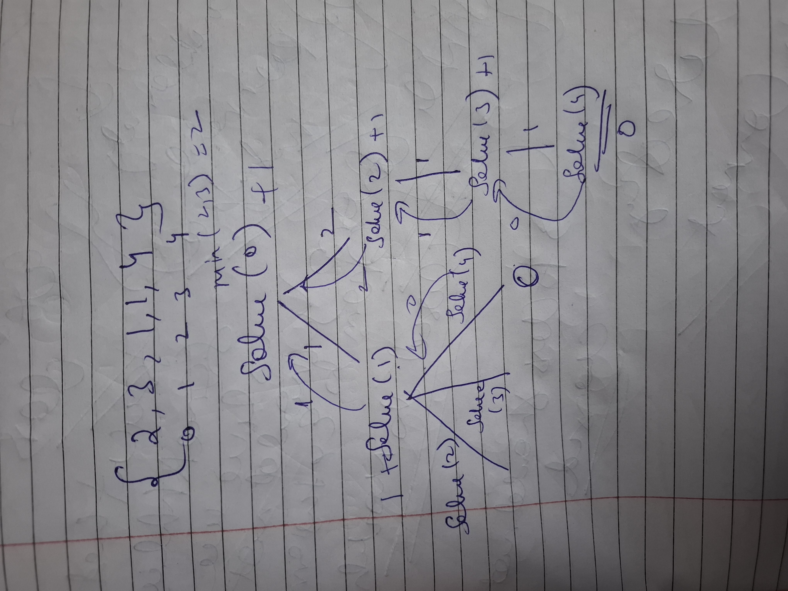

# Q1--> Jump game -2

Link-->https://leetcode.com/problems/jump-game-ii/





see solve(2) is called againa and again so used DP

### Recursion

```cpp
class Solution {
    int solve(vector<int>& nums ,int n,int i){
        if(i==n-1) return 0;
        int ways=10001;
        for(int j=1;j<=nums[i];j++){

            if(i+j<=n-1){
                ways=min(ways,solve(nums,n,i+j));
            }
        }
        return ways+1;
    }
public:
    int jump(vector<int>& nums) {
       return  solve(nums,nums.size(),0);
    }
};

```

### Memoization

```cpp
class Solution {
    int solve(vector<int>& nums ,int n,int i,vector<int>& dp){
        if(i==n-1) return 0;
        if(dp[i]!=-1) return dp[i];
        int ways=10001;
        for(int j=1;j<=nums[i];j++){

            if(i+j<=n-1){
                ways=min(ways,solve(nums,n,i+j,dp));
            }
        }
        return dp[i]=ways+1;
    }
public:
    int jump(vector<int>& nums) {
        vector<int> dp (nums.size(),-1);
       return  solve(nums,nums.size(),0,dp);
    }
};

```
# Q2-->House Robber

### Problem Statement
A robber is targeting a street of houses to rob. Each house has a specific amount of money stashed. However, there is a security constraint: adjacent houses have security systems connected, and the police will be alerted if two adjacent houses are broken into on the same night.

Given an integer array `money` where `money[i]` represents the amount of money in the `(i+1)`-th house, return the **maximum amount of money** you can rob tonight without alerting the police.

---

### Examples

#### Example 1:
**Input:** `money = [2, 1, 4, 9]`  
**Output:** `11`  
**Explanation:** Rob house 1 (money = 2) and house 3 (money = 4) is not optimal. The best way is to rob house 1 (money = 2) and house 4 (money = 9). Total = 2 + 9 = 11.

#### Example 2:
**Input:** `money = [1, 5, 2, 1, 6]`  
**Output:** `11`  
**Explanation:** Rob house 2 (money = 5) and house 5 (money = 6). Total = 5 + 6 = 11.

---

### Constraints
* `1 <= money.length <= 10^5`
* `0 <= money[i] <= 1000`

---

### The Dynamic Programming Strategy

At every house `i`, the robber has two choices:
1.  **Rob the current house:** If the robber robs house `i`, they cannot have robbed house `i-1`. Therefore, the total money is `money[i] + (max money from houses up to i-2)`.
2.  **Skip the current house:** If the robber skips house `i`, the total money is simply the `(max money from houses up to i-1)`.

The recurrence relation is:  
`dp[i] = max(money[i] + dp[i-2], dp[i-1])`

---
```cpp
class Solution {
    public int rob(int[] nums) {
        int[] memo = new int[nums.length];
        Arrays.fill(memo, -1); // -1 means "not yet calculated"
        return solve(nums.length - 1, nums, memo);
    }

    private int solve(int i, int[] nums, int[] memo) {
        // Base Case: If we go past the first house, we get 0 money
        if (i < 0) return 0;
        
        // Base Case: If we are at the first house, we must rob it
        if (i == 0) return nums[0];

        // Memoization Check: Have we solved this house before?
        if (memo[i] != -1) return memo[i];

        // Decision: 
        // 1. Rob house i: Add current money + jump to house i-2
        int pick = nums[i] + solve(i - 2, nums, memo);
        
        // 2. Skip house i: Move to house i-1
        int skip = solve(i - 1, nums, memo);

        // Store and return the best choice
        return memo[i] = Math.max(pick, skip);
    }
}
```
### Optimal Approach: Space Optimization ($O(1)$ Space)

Since `dp[i]` only depends on the results of the two previous houses (`i-1` and `i-2`), we don't need a full array. We can use two variables to track the "previous" and "current" maximums.

#### Steps:
1.  Initialize `prev2 = 0` (represents $dp[i-2]$) and `prev = 0` (represents $dp[i-1]$).
2.  Iterate through the `money` array:
    * Calculate `current = max(house_money + prev2, prev)`.
    * Update `prev2 = prev`.
    * Update `prev = current`.
3.  Return `prev`.

```java
class Solution {
    public int rob(int[] nums) {
        int n = nums.length;
        if (n == 0) return 0;
        if (n == 1) return nums[0];

        int prev2 = 0;      // max money 2 houses ago (dp[i-2])
        int prev1 = 0;      // max money 1 house ago (dp[i-1])

        for (int money : nums) {
            // Choice: Rob this house (money + prev2) OR Skip it (prev1)
            int current = Math.max(money + prev2, prev1);
            
            // Move the "window" forward
            prev2 = prev1;
            prev1 = current;
        }

        return prev1;
    }
}
```
---

### Complexity Analysis
* **Time Complexity:** $O(N)$ — We traverse the array once.
* **Space Complexity:** $O(1)$ — We only use a few variables regardless of the number of houses.

---

### Note: House Robber II (Circular Houses)
If the houses are arranged in a **circle** (the first and last houses are neighbors), the problem changes slightly. You simply run the above logic twice:
1.  Once for houses `0` to `n-2` (excluding the last house).
2.  Once for houses `1` to `n-1` (excluding the first house).
The final answer is the `max` of these two results.
## memoization

```cpp
class Solution {
    public int rob(int[] nums) {
        int n = nums.length;
        if (n == 1) return nums[0];

        // Memo tables for two different scenarios
        int[] memo1 = new int[n];
        int[] memo2 = new int[n];
        Arrays.fill(memo1, -1);
        Arrays.fill(memo2, -1);

        // Scenario 1: Consider houses from index 0 to n-2 (Skip Last)
        int planA = solve(n - 2, 0, nums, memo1);
        
        // Scenario 2: Consider houses from index 1 to n-1 (Skip First)
        int planB = solve(n - 1, 1, nums, memo2);

        return Math.max(planA, planB);
    }

    private int solve(int i, int startLimit, int[] nums, int[] memo) {
        // Base Case: If we hit the boundary of our current slice
        if (i < startLimit) return 0;
        if (i == startLimit) return nums[i];

        if (memo[i] != -1) return memo[i];

        int pick = nums[i] + solve(i - 2, startLimit, nums, memo);
        int skip = solve(i - 1, startLimit, nums, memo);

        return memo[i] = Math.max(pick, skip);
    }
}
```

## Tabulation

```cpp
class Solution {
private:
    //Function to solve the problem using tabulation
    int func(vector<int> &nums){
        int ind = nums.size();
        vector<int> dp(ind, 0);
        
        // Base case
        dp[0] = nums[0];

        // Iterate through the elements of the array
        for (int i = 1; i < ind; i++) {
            
            /* Calculate maximum value by either picking
            the current element or not picking it*/
            int pick = nums[i];
            if (i > 1)
                pick += dp[i - 2];
            int nonPick = dp[i - 1];

            // Store the maximum value in dp array
            dp[i] = max(pick, nonPick);
        }

        /* The last element of the dp array
        will contain the maximum sum*/
        return dp[ind-1];
    }
public:
    //Function to find the maximum money robber can rob
    int houseRobber(vector<int>& money) {
        int n = money.size();
        vector<int> arr1;
        vector<int> arr2;
       
        //If array has only one element, return that
        if(n==1)
           return money[0];
        
        for(int i=0; i<n; i++){
            /*Store every element in 
            arr1 except the last element*/
            if(i!=n-1) arr1.push_back(money[i]);
            
            /*Store every element in 
            arr2 except the first element*/
            if(i!=0) arr2.push_back(money[i]);
        }
        int ans1 = func(arr1);
        
        int ans2 = func(arr2);
    
        //Return the maximum of an1 and ans2
        return max(ans1,ans2);
    }
};
```
### Optimized


```cpp
class Solution {
    public int rob(int[] nums) {
        int n = nums.length;
        if (n == 1) return nums[0];

        // Scenario 1: Ignore the first house, consider houses [1...n-1]
        int planA = solveLinear(nums, 1, n - 1);
        
        // Scenario 2: Ignore the last house, consider houses [0...n-2]
        int planB = solveLinear(nums, 0, n - 2);

        return Math.max(planA, planB);
    }

    // Helper function (House Robber I logic)
    private int solveLinear(int[] nums, int start, int end) {
        int prev2 = 0;
        int prev1 = 0;

        for (int i = start; i <= end; i++) {
            int current = Math.max(nums[i] + prev2, prev1);
            prev2 = prev1;
            prev1 = current;
        }
        return prev1;
    }
}
```

# Q3-->Maximum Sum of Non-Adjacent Elements

### Problem Statement
Given an array of `N` positive integers, find the maximum sum of a subsequence such that no two elements in the subsequence are adjacent in the array.

In other words, you need to pick a subset of numbers from the array such that their sum is maximized, but you cannot pick any two numbers that are next to each other.

---

### Examples

#### Example 1:
**Input:** `nums = [2, 1, 4, 9]`  
**Output:** `11`  
**Explanation:** - Picking [2, 4] gives 6.
- Picking [1, 9] gives 10.
- Picking [2, 9] gives 11.
The maximum sum is 11.

#### Example 2:
**Input:** `nums = [1, 2, 3, 1, 3, 5, 8, 1, 9]`  
**Output:** `24`  
**Explanation:** Picking [1, 3, 3, 8, 9] gives 1 + 3 + 3 + 8 + 9 = 24.

---

### Constraints
* `1 <= N <= 10^5`
* `1 <= nums[i] <= 10^9`

---

### The "Pick or Non-Pick" Logic
For every element at index `i`, we have two choices:
1. **Pick the element:** If we pick `nums[i]`, we must add its value to the maximum sum we could get starting from `i-2` (since we cannot pick `i-1`).
2. **Don't pick the element:** If we skip `nums[i]`, the maximum sum is whatever we could get from index `i-1`.

---

### Approaches

#### 1. Recursive with Memoization ($O(N)$ Time, $O(N)$ Space)


```cpp
class Solution{
private:
    // Function to solve the problem using memoization
    int func(int ind, vector<int> &arr, vector<int> &dp) {
        // Base cases
        if (ind == 0) 
            return arr[ind];
        if (ind < 0)  
            return 0;
        
        if(dp[ind] != -1){
            return dp[ind];
        }
        // Choosing the current element
        int pick = arr[ind] + func(ind - 2, arr, dp);  
        
        // Skipping the current element
        int nonPick = 0 + func(ind - 1, arr, dp);  

        /* Store the result in dp 
        array and return the maximum */
        return dp[ind] = max(pick, nonPick);
    }
public:
    /*Function to calculate the maximum
    sum of nonAdjacent elements*/
    int nonAdjacent(vector<int>& nums) {
        int ind = nums.size()-1;
        
        //Initialize the dp array with -1
        vector<int> dp(ind+1, -1);
        
        //Return the maximum sum
        return func(ind, nums, dp);
    }
};
```

#### 2. Optimized Iterative (Tabulation) ($O(N)$ Time, $O(1)$ Space)

Since we only ever need the values from i-1 and i-2, we can replace the DP array with two variables, prev and prev2.

```cpp
public int maximumNonAdjacentSum(int[] nums) {
    int n = nums.length;
    int prev = nums[0];
    int prev2 = 0;
    
    for (int i = 1; i < n; i++) {
        int pick = nums[i] + prev2;
        int nonPick = 0 + prev;
        
        int curi = Math.max(pick, nonPick);
        prev2 = prev;
        prev = curi;
    }
    return prev;
}
```
Relation to "House Robber"This problem is identical to the House Robber I problem. The constraint of "non-adjacent elements" is the same as "not robbing adjacent houses." The logic, complexity, and optimizations are exactly the same.


Complexity Analysis

Time Complexity: $O(N)$ — We iterate through the array once.

Space Complexity: $O(1)$ — In the optimized version, we only use two variables to store previous states.


