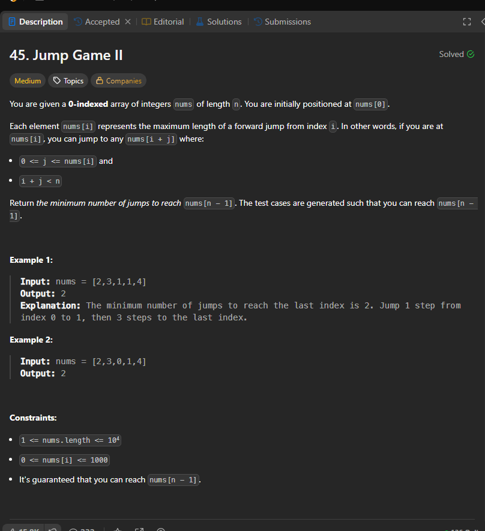

# Notes

Link-->https://leetcode.com/problems/jump-game-ii/





see solve(2) is called againa and again so used DP

### Recursion

```cpp
class Solution {
    int solve(vector<int>& nums ,int n,int i){
        if(i==n-1) return 0;
        int ways=10001;
        for(int j=1;j<=nums[i];j++){

            if(i+j<=n-1){
                ways=min(ways,solve(nums,n,i+j));
            }
        }
        return ways+1;
    }
public:
    int jump(vector<int>& nums) {
       return  solve(nums,nums.size(),0);
    }
};

```

### Memoization

```cpp
class Solution {
    int solve(vector<int>& nums ,int n,int i,vector<int>& dp){
        if(i==n-1) return 0;
        if(dp[i]!=-1) return dp[i];
        int ways=10001;
        for(int j=1;j<=nums[i];j++){

            if(i+j<=n-1){
                ways=min(ways,solve(nums,n,i+j,dp));
            }
        }
        return dp[i]=ways+1;
    }
public:
    int jump(vector<int>& nums) {
        vector<int> dp (nums.size(),-1);
       return  solve(nums,nums.size(),0,dp);
    }
};

```