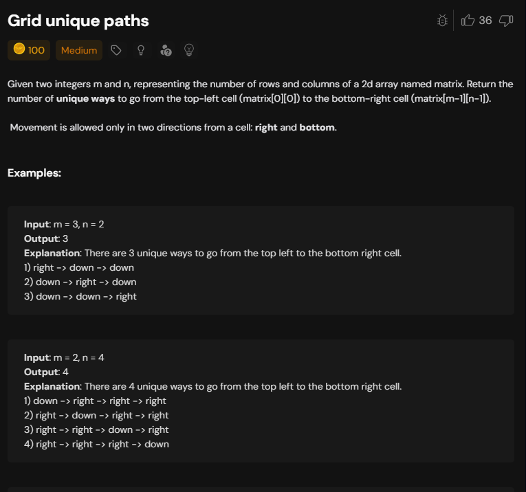
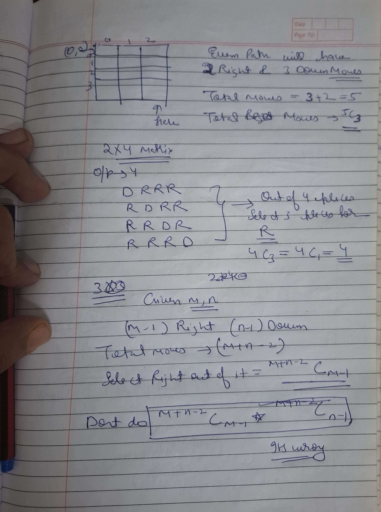
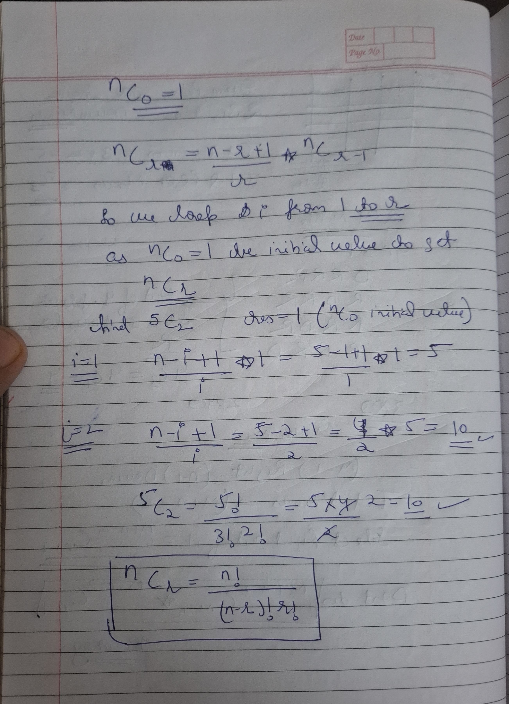
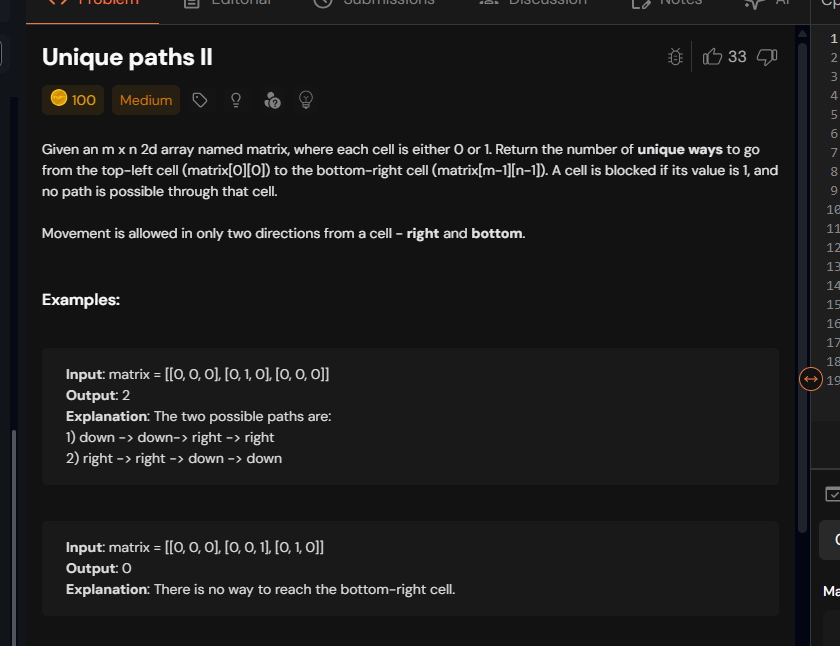

# Notes
## Unique path-1



### combination approach





```cpp
class Solution {
long long nCr(int n, int r) {
    if (r < 0 || r > n) return 0;
    if (r == 0 || r == n) return 1;
     r = min(r, n - r); 
    long long res = 1; // nC0
    for (int i = 1; i <= r; i++) {
        res = res * (n - i + 1) / i; // property: nCi = nC(i-1) * (n - i + 1) / i
    }
    return res;
}
public:
    int uniquePaths(int m, int n) {
        return (int)nCr(m+n-2,m-1);
    }
};

```

### Dp approach

```cpp
class Solution {
int paths(vector<vector<int>>& dp,int i ,int j,int m,int n){
    if(i<0 || i>=m || j<0 || j>=n  ) return 0;
    if(i==m-1 && j==n-1 ) return 1;
    if(dp[i][j]!=-1) return dp[i][j];
    int ans=0;
    ans+=paths(dp,i+1,j,m,n);
    ans+=paths(dp,i,j+1,m,n);
    return dp[i][j]=ans;
}

public:
    int uniquePaths(int m, int n) {
        vector<vector<int>> dp(m,vector<int>(n,-1));
        return paths(dp,0,0,m,n);
    }
};
```

No need of matrix here as all paths we can go.

## Unique path-2




Here can move only onto cells having 0

```cpp

class Solution {
int paths(vector<vector<int>>& mat,vector<vector<int>>& dp,int i ,int j,int m,int n){
    if(i<0 || i>=m || j<0 || j>=n || mat[i][j]==1  ) return 0;
    if(i==m-1 && j==n-1 && mat[i][j]==0) return 1;
    if(dp[i][j]!=-1) return dp[i][j];
    int ans=0;
    ans+=paths(mat,dp,i+1,j,m,n);
    ans+=paths(mat,dp,i,j+1,m,n);
    return dp[i][j]=ans;
}

public:
    int uniquePathsWithObstacles(vector<vector<int>>& mat) {
        int m=mat.size();
        int n=mat[0].size();
        vector<vector<int>> dp(m,vector<int>(n,-1));
        return paths(mat,dp,0,0,m,n);
    }
};

```


