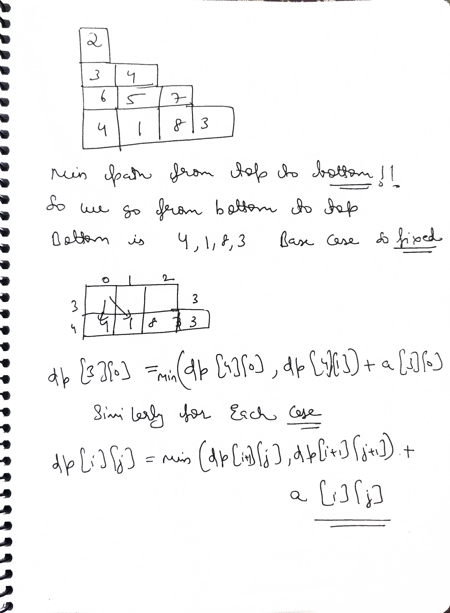
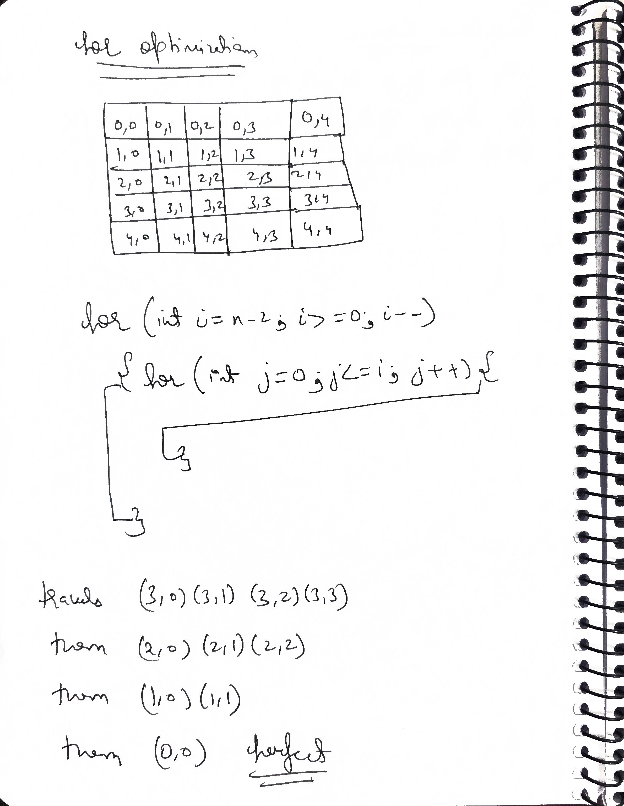

# **Q1 LC 120. Triangle**

https://leetcode.com/problems/triangle/description/?envType=problem-list-v2&envId=dynamic-programming

**Problem Statement:**
Given a `triangle` array, return the minimum path sum from top to bottom.
For each step, you may move to an adjacent number of the row below. More formally, if you are on index `i` on the current row, you may move to either index `i` or index `i + 1` on the next row.

**Example 1:**

* **Input:** triangle = [[2],[3,4],[6,5,7],[4,1,8,3]]
* **Output:** 11
* **Explanation:** The minimum path sum from top to bottom is 2 + 3 + 5 + 1 = 11.

**Example 2:**

* **Input:** triangle = [[-10]]
* **Output:** -10

**Constraints:**

* 1 <= triangle.length <= 200
* triangle[0].length == 1
* triangle[i].length == triangle[i - 1].length + 1
* -10^4 <= triangle[i][j] <= 10^4

**Follow up:** Could you do this using only O(n) extra space, where n is the total number of rows in the triangle?

 
## Mycode

```cpp
class Solution {
public:
    int minimumTotal(vector<vector<int>>& tri) {
        int n=tri.size();
        int m=tri[n-1].size();
        vector<vector<int>>dp(n,vector<int>(m,0));
        for(int i=n-1;i>=0;i--){
            for(int j=0;j<=m-1;j++){
                if(i==n-1){
                    dp[i][j]=tri[i][j];
                    continue;
                }
                dp[i][j]=min(dp[i+1][j],dp[i+1][j+1])+tri[i][j];
            }
            m--;
        }
        return dp[0][0];
    }
};
```
## Ai review

Your bottom-up logical architecture is mathematically flawless. You correctly identified that starting from the bottom completely eliminates the messy out-of-bounds edge cases that happen when you try to go top-down.

However, if you submit this in an interview, the interviewer will immediately point out two architectural inefficiencies:

### 1. The Branch Predictor Penalty

Inside your nested loop, you have this block:

```cpp
if(i == n-1) {
    dp[i][j] = tri[i][j];
    continue;
}

```

You are forcing the CPU to evaluate this `if` statement for *every single element* in the triangle, even though it is only true for the very first row you process. It is much cleaner (and faster) to initialize the base case outside the loop, and start your `for` loop at `n - 2`.

Also, because row `i` in a triangle always has exactly `i + 1` elements, you don't need to manually track and decrement the `m` variable. Your inner loop can just be `for(int j = 0; j <= i; j++)`.

### 2. The Memory Leak (O(N²) Space)

You allocated a full 2D matrix: `vector<vector<int>>dp(n, vector<int>(m, 0));`.
If you look closely at your state transition equation `dp[i][j] = min(dp[i+1][j], dp[i+1][j+1])`, you will notice that to calculate row `i`, you **only** need the data from row `i+1`. Once you move up to row `i-1`, the data in row `i+1` is dead memory.

You can collapse this entire 2D matrix into a single 1D array, hitting the `O(n)` space follow-up requirement perfectly.

```cpp
#include <vector>
#include <algorithm>
using namespace std;

class Solution {
public:
    int minimumTotal(vector<vector<int>>& triangle) {
        int n = triangle.size();
        
        // Step 1: Initialize a 1D DP array with the absolute bottom row.
        // This instantly sets up your base case (O(n) space constraint met).
        vector<int> dp = triangle[n - 1];
        
        // Step 2: Start from the second-to-last row (n-2) and move upwards.
        // This eliminates the need for the "if (i == n-1)" check inside the loop.
        for (int i = n - 2; i >= 0; i--) {
            
            // Row 'i' always has exactly 'i + 1' elements, so j goes up to i.
            // No need to manually track a separate 'm' variable.
            for (int j = 0; j <= i; j++) {
                
                // We overwrite the current dp[j] with the new minimum path.
                // dp[j] acts as the "left child" and dp[j+1] acts as the "right child".
                dp[j] = triangle[i][j] + min(dp[j], dp[j + 1]);
            }
        }
        
        // By the time we reach the top peak, dp[0] contains the global minimum.
        return dp[0];
    }
};
```
