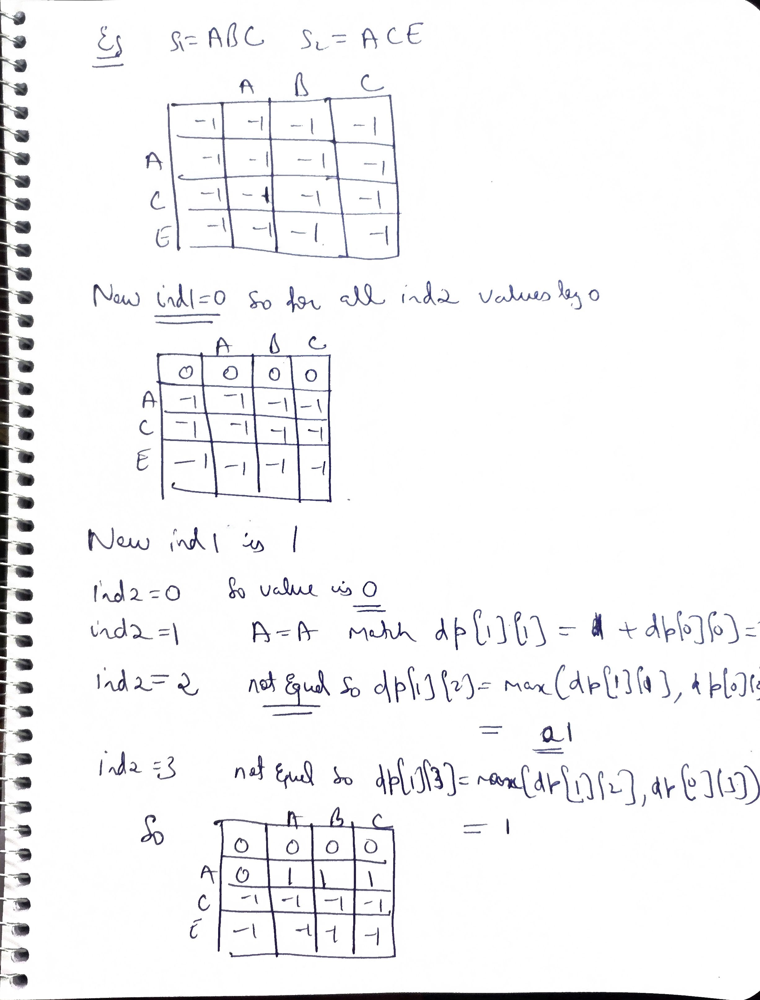
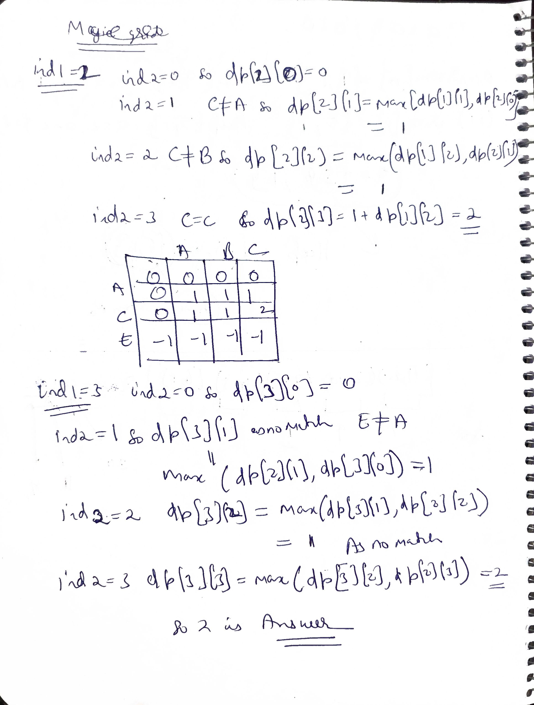

# Notes

.jpg>) .jpg>)

# The Gap Method (Diagonal / Interval DP)

The **Gap Method** is a specific way of filling a Dynamic Programming table where you solve for all substrings of length 1 (gap 0), then length 2 (gap 1), then length 3 (gap 2), and so on.

The Gap Method is a specialized technique for Interval Dynamic Programming. Unlike standard DP, which often moves from left to right (like a prefix), the Gap Method focuses on a range that starts small and expands outward.

## When to use the Gap Method

You should use the Gap Method when the problem depends on a specific **range or interval $[i, j]$** within a single sequence, rather than a relationship between two different strings. It is specifically useful for:

### 1. Palindrome Problems
* **Longest Palindromic Subsequence**
* **Longest Palindromic Substring**
* **Minimum Insertions to make a palindrome**
* *Logic:* These depend on whether the characters at the boundaries ($i$ and $j$) match and the state of the inner substring $[i+1, j-1]$.

### 2. Optimal Strategy Games
* **Predict the Winner**
* **Stone Game**
* *Logic:* Used when players can pick elements from either end of an array, changing the available range $[i, j]$ for the next turn.

### 3. Matrix Chain Multiplication
* Finding the most efficient way to multiply a sequence of matrices.
* *Logic:* The cost to multiply a chain from index $i$ to $j$ depends on splitting the range at some $k$ and calculating costs for $[i, k]$ and $[k+1, j]$.

### 4. Optimal Binary Search Tree
* Constructing a BST with the minimum search cost.
* *Logic:* The answer for a large range $[i, j]$ depends on smaller "inner" ranges like $[i+1, j-1]$ or $[i+1, j]$ after choosing a root.

---

## Visualizing the Table Fill


Unlike standard row-by-row tabulation, the Gap Method fills the matrix **diagonally**, starting from the main diagonal (where $i=j$) and moving toward the top-right corner.

# Understanding the Gap Method (Interval DP)

The **Gap Method** is a specialized technique for **Interval Dynamic Programming**. Unlike standard DP, which often moves from left to right (like a prefix), the Gap Method focuses on a **range** that starts small and expands outward.

---

### 1. The Core Philosophy: "Inside-Out"
In most DP problems (like LCS), you compare two separate strings. However, in interval problems, you are analyzing **one string** and calculating properties of its internal segments.

* **Smallest Unit:** A single character at index $i$ (a range of length 1).
* **Expansion:** To calculate a property for the range $[3, 7]$, you typically need the result from its "inner" sub-range $[4, 6]$.


---

### 2. Why use a "Gap"?
In a 2D matrix `dp[i][j]`, `i` represents the start index and `j` represents the end index.

* **The Dependency Problem:** If you fill the matrix row-by-row, you might try to calculate `dp[0][5]` (a large range) before you have computed `dp[1][4]` (its inner sub-range).
* **The Gap Solution:** The Gap Method ensures you calculate all substrings of length 1, then length 2, then length 3, etc. This guarantees that when you solve for any range, all its **smaller inner sub-ranges** are already solved and stored in the table.


---

###  Detailed Use Cases

#### A. Palindrome Problems
Palindromes are inherently symmetrical. To check if $S[i \dots j]$ is a palindrome:
1.  Check if $S[i] == S[j]$.
2.  If they match, check the "inner" range $S[i+1 \dots j-1]$.
*Since the inner range is always smaller, the Gap Method handles this dependency perfectly.*

#### B. Optimal Strategy Games (e.g., Stone Game / Predict the Winner)
In these games, players pick numbers from either the **left end (i)** or the **right end (j)**.
* If you pick $i$, the next player inherits the range $[i+1, j]$.
* If you pick $j$, the next player inherits the range $[i, j-1]$.
*To find the best move for $[i, j]$, you must have already computed the best moves for the smaller intervals $[i+1, j]$ and $[i, j-1]$.*

#### C. Matrix Chain Multiplication
To find the minimum cost to multiply a sequence of matrices from index $i$ to $j$, you must split the range at every possible point $k$:
* `Cost(i, j) = min(Cost(i, k) + Cost(k+1, j) + multiplication_cost)`
*The segments $[i, k]$ and $[k+1, j]$ are always smaller "gaps" than the total range $[i, j]$.*


---

###  Code Structure
The "Gap" represents the distance between $i$ and $j$ ($j = i + gap$).

```cpp
for (int gap = 0; gap < n; gap++) {             // Gap size increases (0, 1, 2...)
    for (int i = 0, j = gap; j < n; i++, j++) { // Slide the window of size 'gap'
        if (gap == 0) {
            dp[i][j] = ...; // Base case: ranges of length 1
        } else {
            // Logic using already computed inner states:
            // dp[i+1][j], dp[i][j-1], or dp[i+1][j-1]
        }
    }
}
```
# Matrix Chain Multiplication (MCM) using the Gap Method

In **Matrix Chain Multiplication (MCM)**, the goal is to find the most efficient way to multiply a sequence of matrices. The "Gap Method" is the ideal approach because you cannot determine the cost of multiplying a large chain until you know the minimum cost of all its smaller sub-chains.

---

### 1. The Core Philosophy
Suppose you have a chain of matrices $A, B, C, D$. To find the optimal way to multiply the entire set $(ABCD)$, you must evaluate every possible "split" point $k$:
* $(A)(BCD)$
* $(AB)(CD)$
* $(ABC)(D)$

To solve for the **Gap of 3** (from $A$ to $D$), you must have already calculated the results for:
* **Gap 0:** Individual matrices $(A, B, C, D)$
* **Gap 1:** Pairs $(AB, BC, CD)$
* **Gap 2:** Triples $(ABC, BCD)$


---

### 2. Filling the DP Table (Diagonal by Diagonal)

In the DP table `dp[i][j]`, the value represents the minimum scalar multiplications needed to multiply matrices from index $i$ to $j$.

#### **Step 1: Gap 0 (Length 1) — `dp[i][i]`**
A single matrix cannot be multiplied by itself. The cost is **0**.
* `dp[0][0] = 0, dp[1][1] = 0, dp[2][2] = 0...`
* This fills the **main diagonal** of your matrix.

#### **Step 2: Gap 1 (Length 2) — `dp[i][i+1]`**
The cost to multiply two adjacent matrices $A_i$ and $A_{i+1}$.
* There is only one way to multiply them: $(A_i \times A_{i+1})$.
* This fills the diagonal immediately above the main one.

#### **Step 3: Gap 2 (Length 3) — `dp[i][i+2]`**
Now we look at three matrices (e.g., $ABC$). We check two split positions:
1. $(A)(BC) \rightarrow$ `dp[i][i] + dp[i+1][i+2] + combine_cost`
2. $(AB)(C) \rightarrow$ `dp[i][i+1] + dp[i+2][i+2] + combine_cost`
* We store the **minimum** of these two.


---

### 3. Visualizing the Dependency
The Gap Method ensures that by the time you reach a larger gap, the required smaller gaps are already solved and stored.

| $i \setminus j$ | 0 (A) | 1 (B) | 2 (C) | 3 (D) |
| :--- | :---: | :---: | :---: | :---: |
| **0 (A)** | **Gap 0** | Gap 1 | Gap 2 | **Gap 3 (Final)** |
| **1 (B)** | - | **Gap 0** | Gap 1 | Gap 2 |
| **2 (C)** | - | - | **Gap 0** | Gap 1 |
| **3 (D)** | - | - | - | **Gap 0** |

---

### 4. Implementation Logic
Here is the standard C++ structure for the MCM Gap Method:

```cpp
// p[] contains dimensions: Matrix i is p[i-1] x p[i]
for (int gap = 1; gap < n; gap++) { 
    for (int i = 1; i < n - gap; i++) {
        int j = i + gap;
        dp[i][j] = INT_MAX;
        
        // k is the split point
        for (int k = i; k < j; k++) {
            int q = dp[i][k] + dp[k+1][j] + (p[i-1] * p[k] * p[j]);
            if (q < dp[i][j]) {
                dp[i][j] = q;
            }
        }
    }
}
```
Why "Gap" is essential here:
If you tried to fill this matrix row-by-row (left-to-right), the calculation for dp[1][4] would require dp[2][4]. Since Row 2 comes after Row 1, the value wouldn't be ready yet.

# Understanding Range-Based (Interval) DP

In the context of Dynamic Programming, **"Range Based"** (or Interval Based) means that the state of your problem is defined by a **start index ($i$)** and an **end index ($j$)** within the same string or array.

When we say a problem is range-based, we are saying: *"To find the answer for the segment from $i$ to $j$, I must first know the answers for the smaller segments inside it."*

---

### 1. The "Range" vs. the "Prefix"
To understand range-based DP, it helps to compare it to standard linear DP:

* **Prefix-Based (Simple DP):** You solve for `dp[i]`, which represents the answer from $0$ to $i$. You only move in one direction (left to right).
    * *Example:* Fibonacci, House Robber.
* **Range-Based (Interval DP):** You solve for `dp[i][j]`, which represents the answer for the specific "window" or "chunk" starting at $i$ and ending at $j$.
    * *Example:* Longest Palindromic Subsequence.


---

### 2. What defines the "Range" in your LPS code?
In your `lps(s, i, j, dp)` function, the **range** is the substring defined by the indices $i$ and $j$.

* **Shrinking the Range:** When characters match (`s[i] == s[j]`), you move the boundaries **inward** to a smaller range: `(i+1, j-1)`.
* **Splitting the Range:** When they don't match, you try two different sub-ranges:
    1. The range excluding the first character: `(i+1, j)`
    2. The range excluding the last character: `(i, j-1)`

---

### 3. Why the "Gap" is the "Size" of the Range
When we use the Gap Method, the **"Gap"** is literally the distance between $i$ and $j$, which corresponds to the **length of the range minus one**.

| Gap Value | Range Length | Examples ($i$ to $j$) |
| :--- | :--- | :--- |
| **0** | 1 character | `[0,0], [1,1], [2,2]` |
| **1** | 2 characters | `[0,1], [1,2], [2,3]` |
| **2** | 3 characters | `[0,2], [1,3], [2,4]` |

**Range-based logic** dictates that you cannot solve a range of length 3 until you have finished all ranges of length 1 and 2. This is why we iterate using the gap.


---

### 4. Visualizing the Range Expansion
Imagine the string `"CHARACTER"`. Range-based DP processes it like this:
1. **Length 1:** "C", "H", "A", "R"... (All solved)
2. **Length 2:** "CH", "HA", "AC", "CR"... (All solved)
3. **Length 3:** "CHA", "HAC", "ACR"... (All solved)
4. ...and so on until it solves the full range "CHARACTER".


---

### Summary
**"Range-based"** means the subproblems are **sub-segments** of the original input. You solve the problem by starting with the smallest possible segments (single elements) and merging them to form larger and larger segments until you cover the entire range from $0$ to $n-1$.

### Lps

#### memoization

```java

class Solution {
    public int lps(String s,int i,int j,int[][]dp){
        if(i>j||i==j){
            return dp[i][j]=(i>j)?0:1;
        }
        if(dp[i][j]!=0) return dp[i][j];
        if(s.charAt(i)==s.charAt(j))
            dp[i][j]=lps(s,i+1,j-1,dp)+2;
        else
            dp[i][j]=Math.max(lps(s,i+1,j,dp),lps(s,i,j-1,dp));
        
        return dp[i][j];
    }
    public int longestPalindromeSubseq(String s) {
        int n=s.length();
        int[][] dp=new int[n][n];
        return lps(s,0,n-1,dp);
    }
}

```

##### Cpp

```cpp

class Solution{
  int lps(string s,int i,int j,vector<vector<int>> &dp){
        if(i>j||i==j){
            return dp[i][j]=(i>j)?0:1;
        }
        if(dp[i][j]!=-1) return dp[i][j];
        if(s[i]==s[j])
            dp[i][j]=lps(s,i+1,j-1,dp)+2;
        else
            dp[i][j]=max(lps(s,i+1,j,dp),lps(s,i,j-1,dp));
        
        return dp[i][j];
    }
  public: 
  int longestPalinSubseq(string s) {
             int n = s.size();

        vector<vector<int>> dp(n, vector<int>(n, -1));
        //Return the result
        return lps(s,0 , n-1, dp);      
    }
};

```

#### Tabulation

```java

class Solution {
    public int longestPalindromeSubseq(String s) {
        int n = s.length();
        int[][] dp = new int[n][n];

        // g is the gap between i and j (distance)
        for (int g = 0; g < n; g++) {
            // i is start, j is end. j = i + g
            for (int i = 0, j = g; j < n; i++, j++) {
                
                // Base Case: Gap 0 (Length 1 string)
                if (g == 0) {
                    dp[i][j] = 1;
                } 
                // Base Case: Gap 1 (Length 2 string)
                else if (g == 1) {
                    dp[i][j] = (s.charAt(i) == s.charAt(j)) ? 2 : 1;
                } 
                // General Case: Substrings of length 3 or more
                else {
                    if (s.charAt(i) == s.charAt(j)) {
                        // Look at the inner substring: dp[i+1][j-1]
                        dp[i][j] = 2 + dp[i + 1][j - 1];
                    } else {
                        // Max of excluding either the first or last character
                        dp[i][j] = Math.max(dp[i + 1][j], dp[i][j - 1]);
                    }
                }
            }
        }
        // Result is for the full string: from index 0 to n-1
        return dp[0][n - 1];
    }
}
```
.jpg>) 
.jpg>) 
.jpg>)
 .jpg>) 
 .jpg>) 

 # Longest Common Subsequence (LCS) Formula

The **Longest Common Subsequence** of two strings is calculated using a 2D Dynamic Programming table. For two strings $S1$ (length $n$) and $S2$ (length $m$), the value $dp[i][j]$ represents the length of the LCS of the prefix $S1[0 \dots i-1]$ and $S2[0 \dots j-1]$.

---

### 1. The Mathematical Formula

The recurrence relation is defined as follows:

$$
dp[i][j] = 
\begin{cases} 
0 & \text{if } i=0 \text{ or } j=0 \\
1 + dp[i-1][j-1] & \text{if } S1[i-1] = S2[j-1] \\
\max(dp[i-1][j], dp[i][j-1]) & \text{if } S1[i-1] \neq S2[j-1] 
\end{cases}
$$

---

### 2. Logic Breakdown

#### **Base Case (Initialization)**
When $i=0$ or $j=0$, one of the strings is empty. An empty string has no characters in common with any other string, so:
* `dp[0][j] = 0` for all $j$
* `dp[i][0] = 0` for all $i$

#### **Case 1: Characters Match ($S1[i-1] == S2[j-1]$)**
If the characters at the current indices match, they contribute to the common subsequence. We take the result from the prefixes *excluding* these characters (the diagonal cell) and add 1.


#### **Case 2: Characters Do Not Match ($S1[i-1] \neq S2[j-1]$)**
If the characters don't match, the current LCS length is the best we could do by either:
1.  Ignoring the current character of $S1$ (`dp[i-1][j]`)
2.  Ignoring the current character of $S2$ (`dp[i][j-1]`)

We take the **maximum** of these two. 

> **Note on Redundancy:** We do not include $dp[i-1][j-1]$ in the `max()` because $dp[i-1][j]$ and $dp[i][j-1]$ already consider that diagonal value in their own calculations. Thus, $dp[i-1][j-1]$ is already "covered."


---

### 3. Complexity Analysis
* **Time Complexity:** $O(n \times m)$ — Every cell in the matrix is computed once.
* **Space Complexity:** $O(n \times m)$ — A 2D array is used to store all states.

---

### 4. Summary Table of Dependencies

| Scenario | Dependency | Direction |
| :--- | :--- | :--- |
| **Match** | $1 + dp[i-1][j-1]$ | Diagonal Up-Left |
| **No Match** | $\max(dp[i-1][j], dp[i][j-1])$ | Top or Left |

### Why is $dp[i-1][j-1]$ ignored when characters don't match?

When $S1[i-1] \neq S2[j-1]$, the formula is:
$$dp[i][j] = \max(dp[i-1][j], dp[i][j-1])$$

We do **not** need to include $dp[i-1][j-1]$ because it is **redundant**. 

**The Proof:**
1. $dp[i-1][j]$ is calculated as $\max(dp[i-2][j], dp[i-1][j-1])$. Thus, $dp[i-1][j] \ge dp[i-1][j-1]$.
2. $dp[i][j-1]$ is calculated as $\max(dp[i-1][j-1], dp[i][j-2])$. Thus, $dp[i][j-1] \ge dp[i-1][j-1]$.

Since both neighbors are already at least as large as the diagonal value, the diagonal value can never be the "maximum" in a way that changes the result.

##  LCS Memoization

```cpp
class Solution {
   int func(string& s1, string& s2, int ind1, int ind2, vector<vector<int>>& dp) {

    if (ind1 < 0 || ind2 < 0) return 0;
    if (dp[ind1][ind2] != -1) return dp[ind1][ind2];
    if(s1[ind1]==s2[ind2]) 
      return dp[ind1][ind2]=1+func(s1, s2, ind1-1, ind2 -1, dp);
    else 
      return dp[ind1][ind2]=max(func(s1, s2, ind1, ind2 -1, dp),func(s1, s2, ind1-1, ind2, dp));
   }
  public:
    int lcs(string str1, string str2) {
        int n = str1.size();
        int m = str2.size();

        vector<vector<int>> dp(n, vector<int>(m, -1));
        //Return the result
        return func(str1, str2, n - 1, m - 1, dp);
    }
};

```

## Tabulation

isse tabulation mai dikkat aaegi ab ind1-1,ind2-1 alag se handle krna pdega so no 

```cpp
class Solution {
   int func(string& s1, string& s2, int Nm1, int Mm1, vector<vector<int>>& dp) {

    for(int ind1=0;ind1<=Nm1;ind1++){
      for(int ind2=0;ind2<=Mm1;ind2++){
          if(s1[ind1]==s2[ind2]) dp[ind1][ind2]=1+dp[ind1-1][ind2 -1];
          else dp[ind1][ind2]=max(dp[ind1][ ind2 -1],dp[ ind1-1][ ind2]);
      }
    }
      return dp[Nm1][Mm1];
   }
  public:
    int lcs(string str1, string str2) {
        int n = str1.size();
        int m = str2.size();

        vector<vector<int>> dp(n, vector<int>(m, -1));
        //Return the result
        return func(str1, str2, n - 1, m - 1, dp);
    }
};


```
instead make  dp array of string.size()+1, in recusrion avoid less than zero vali condition as tabulation mai handle krna difficult rehta usko 

```cpp
class Solution {
   int func(string& s1, string& s2, int N, int M, vector<vector<int>>& dp) {

    for(int ind1=0;ind1<=N;ind1++){
      for(int ind2=0;ind2<=M;ind2++){
          if(ind1==0||ind2==0){
            dp[ind1][ind2]=0;
            continue;
          }
          if(s1[ind1-1]==s2[ind2-1]) dp[ind1][ind2]=1+dp[ind1-1][ind2 -1];
          else dp[ind1][ind2]=max(dp[ind1][ ind2 -1],dp[ ind1-1][ ind2]);
      }
    }
      return dp[N][M];
   }
  public:
    int lcs(string str1, string str2) {
        int n = str1.size();
        int m = str2.size();

        vector<vector<int>> dp(n+1, vector<int>(m+1, -1));
        //Return the result
        return func(str1, str2, n , m, dp);
    }
};


```






### LCS of 3 strings

Link--> https://www.geeksforgeeks.org/problems/lcs-of-three-strings0028/1

```cpp
class Solution {
  public:
    int lcsOf3(string& s1, string& s2, string& s3) {
        int n = s1.size();
        int m = s2.size();
        int o = s3.size();

        // Create a 3D DP table initialized to 0
        // Size: (n+1) x (m+1) x (o+1)
        vector<vector<vector<int>>> dp(n + 1, vector<vector<int>>(m + 1, vector<int>(o + 1, 0)));

        for (int i = 1; i <= n; i++) {
            for (int j = 1; j <= m; j++) {
                for (int k = 1; k <= o; k++) {
                    
                    if (s1[i-1] == s2[j-1] && s2[j-1] == s3[k-1]) {
                        dp[i][j][k] = 1 + dp[i-1][j-1][k-1];
                    } else {
                        // Take max of moving back in any one of the 3 directions
                        dp[i][j][k] = max({dp[i-1][j][k], 
                                           dp[i][j-1][k], 
                                           dp[i][j][k-1]});
                    }
                }
            }
        }
        return dp[n][m][o];
        
    }
};


```

.jpg>)
 .jpg>) 
 .jpg>) 
 .jpg>) 
 .jpg>) 

```cpp
class Solution {
    int func(string& s1, string& s2, int N, int M, vector<vector<int>>& dp) {

    for(int ind1=0;ind1<=N;ind1++){
      for(int ind2=0;ind2<=M;ind2++){
          if(ind1==0||ind2==0){
            dp[ind1][ind2]=(ind1==0)?ind2:ind1;
            continue;
          }
          if(s1[ind1-1]==s2[ind2-1]) 
              dp[ind1][ind2]=dp[ind1-1][ind2 -1];
          else 
          dp[ind1][ind2]=1+min({dp[ind1][ ind2 -1],dp[ ind1-1][ ind2],dp[ind1-1][ind2 -1]});
      }
    }
      return dp[N][M];
   }
  public:
    int editDistance(string str1, string str2) {
        int n = str1.size();
        int m = str2.size();

        vector<vector<int>> dp(n+1, vector<int>(m+1, -1));
        //Return the result
        return func(str1, str2, n , m, dp);
    }
};


```

 .jpg>) .jpg>) .jpg>) .jpg>) .jpg>) .jpg>) .jpg>) 

## Tabulation

```cpp
class Solution {
    int func(string& s1, string& s2, int N, int M, vector<vector<int>>& dp) {
        for (int ind1 = 0; ind1 <= N; ind1++) {
            for (int ind2 = 0; ind2 <= M; ind2++) {
                if (ind1 == 0 || ind2 == 0) {
                    dp[ind1][ind2] = (ind1 == 0) ? ind2 : ind1;
                    continue;
                }
                if (s1[ind1 - 1] == s2[ind2 - 1])
                    dp[ind1][ind2] = dp[ind1 - 1][ind2 - 1];
                else
                    dp[ind1][ind2] =
                        1 + min({dp[ind1][ind2 - 1], dp[ind1 - 1][ind2]});
            }
        }
        return dp[N][M];
    }

   public:
    int minOperations(string str1, string str2) {
        int n = str1.size();
        int m = str2.size();

        vector<vector<int>> dp(n + 1, vector<int>(m + 1, -1));
        // Return the result
        int val = func(str1, str2, n, m, dp);
       return val;
    }
};
```

# Comparison: Sliding Window vs. Interval DP

While both **Interval DP** and **Sliding Window** involve looking at "ranges" or "segments" of data, they are fundamentally different tools used for different categories of problems.

The simplest way to distinguish them: **Sliding Window** is for finding a "good" segment, while **Interval DP** is for finding the "best" way to combine or break down segments.

---

### 1. Key Differences at a Glance

| Feature | Sliding Window | Interval DP (Gap Method) |
| :--- | :--- | :--- |
| **Goal** | Find a contiguous subarray that meets a specific condition (sum, unique chars). | Find the optimal result for a range by merging smaller sub-ranges. |
| **Pointer Movement** | Linear ($i$ and $j$ move forward based on a condition). | Diagonal (window expands from size 1 up to $N$). |
| **Time Complexity** | $O(N)$ — Very efficient. | $O(N^2)$ or $O(N^3)$ — Much slower. |
| **Dependencies** | No dependency on sub-segments; just add or remove elements as you slide. | Large ranges **must** wait for smaller "inner" ranges to be solved first. |

---

### 2. When to use Sliding Window
Use this when you are looking for a **contiguous** block that satisfies a constraint. You expand the window (move `j`) until you break the rule, then shrink it (move `i`) until the rule is satisfied again.

**Classic Examples:**
* Longest Subarray with sum $\le K$.
* Smallest window containing all characters of another string.
* Maximum sum of $K$ consecutive elements.


---

### 3. When to use Interval DP
Use this when the problem asks for an **optimal value** (Min, Max, or Total count) for a range $[i, j]$, and the solution for that range depends on the results of smaller intervals inside it (like $[i+1, j-1]$) or by splitting it into two pieces $[i, k]$ and $[k+1, j]$.

**Classic Examples:**
* **Longest Palindromic Subsequence:** Depends on the inner range $[i+1, j-1]$.
* **Matrix Chain Multiplication:** Depends on splitting the range $[i, j]$ at every possible $k$.
* **Burst Balloons:** The value of the last balloon depends on what happened in the sub-intervals before it.


---

### 4. Comparison of "State"

**Sliding Window State:**
We typically do not store a table. We maintain a running variable (like `currentSum` or a `HashMap`) as we slide across the array.
* **Memory:** Usually $O(1)$ or $O(K)$.

**Interval DP State:**
We store a 2D table `dp[i][j]` where every possible pair of $i$ and $j$ represents the "best" answer for that specific range.
* **Memory:** $O(N^2)$.

---

### 5. Summary

* **Sliding Window:** * **Philosophy:** "Expansion and Contraction."
    * **Order:** Two pointers move from index $0$ to $n$.
    * **Use Case:** Finding a specific segment.
* **Interval DP:** * **Philosophy:** "Inside-Out / Merging."
    * **Order:** Gap Method (Diagonal). Solve for length 1, then 2, then 3...
    * **Use Case:** Optimizing a range based on its sub-parts.


---

### Why you can't use Sliding Window for Palindromic Subsequence
In a **Subsequence**, the characters do not have to be next to each other. Sliding window only looks at contiguous blocks (Substrings). Because a subsequence can "skip" over characters, you need to store the results of all previous sub-ranges to decide if the current characters at $i$ and $j$ can be added to an existing sequence.

# The "One Entity" Rule of Interval DP

Your observation is exactly right: **Interval DP is defined by boundaries ($i$ and $j$) within a single object.** In problems like **LCS**, the indices $i$ and $j$ refer to two completely different strings. In **Interval DP**, both $i$ and $j$ refer to the **same** string or array, creating a "window" that looks inward.

---

### 1. Comparison: LCS vs. Interval DP

| Feature | Two-String DP (e.g., LCS) | Interval DP (e.g., LPS, MCM) |
| :--- | :--- | :--- |
| **Input Type** | 2 different strings/arrays | 1 single string/array |
| **State $dp[i][j]$** | $i$ is for String A, $j$ is for String B | Both $i$ and $j$ are indices in the **same** string |
| **Physical Meaning** | "How much of String A matches String B?" | "What is the property of the segment between $i$ and $j$?" |
| **Traversal** | Row-by-Row (Linear) | **Gap Method (Diagonal)** |


---

### 2. Why the Gap Method doesn't work for 2 Strings
The Gap Method relies on the fact that as a gap increases, it encompasses smaller sub-segments of the **same space**.

* **In LCS (Two Strings):** If you move $i$ in String A, it has no physical relationship to index $j$ in String B. They are like two parallel lines that never meet.
* **In Interval DP (One String):** $i$ and $j$ are moving toward or away from each other on the same line. To know the answer for the "big" range $[0, 10]$, you **must** know the answer for the "inner" range $[1, 9]$.


---

### 3. The Only Exception: The "Palindrome Trick"
The only time these two worlds overlap is when we turn a "one-string" problem into a "two-string" problem. 

To find the **Longest Palindromic Subsequence** of String $S$:
1.  **Interval Way:** Use the Gap Method on String $S$.
2.  **LCS Way:** Use standard 2D DP on String $S$ and its reverse $S^R$. 

In the second method, you are treating the reversed string as a "second entity," allowing you to use simple row-by-row DP instead of the Gap Method.

---

### 4. Summary of Dependencies

* **Standard DP (LCS):**
    $dp[i][j]$ depends on $dp[i-1][j]$ and $dp[i][j-1]$.
    *(Looking at shorter prefixes of two strings)*.

* **Interval DP (LPS):**
    $dp[i][j]$ depends on $dp[i+1][j-1]$.
    *(Looking at the inner heart of the same string)*.


---

### Conclusion
**Interval DP is about the relationship between two points in the same space.** Because two different strings do not share a common "inner range," the Gap Method and Interval DP logic are reserved for single-entity problems.
