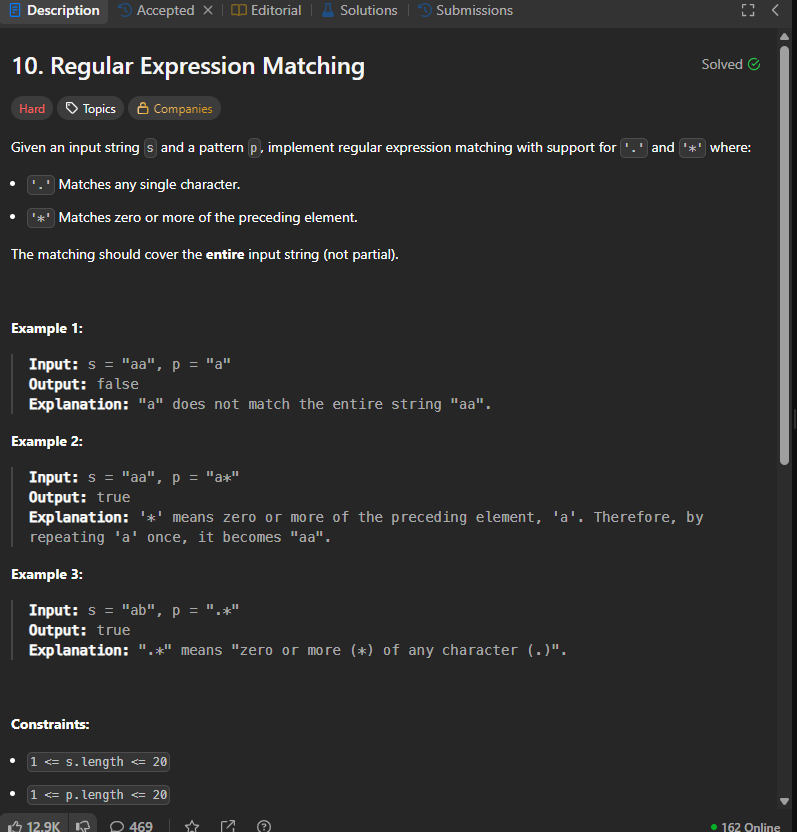

# Notes




## My own solution

1st hard question i have solved.

## Recursive solution

```cpp

class Solution {
    bool solve(string s,string p,int n,int m){
        if(n==-1 && m==-1) return true;
        if(n==-1 && m!=-1) {
            while (m >= 0) {
                if (p[m] == '*') m -= 2;
                else return false;
            }
            return true;
        }
        if(n!=-1 && m==-1) return false;

        if(s[n]==p[m] || p[m]=='.') return solve(s,p,n-1,m-1);
       // cout<<s.substr(0,n+1)<<" "<<p.substr(0,m+1)<<endl;
        if(p[m]=='*'){
            char ch=p[m-1];
            if(ch=='.') {
                bool res=false;
                int i=0;
                while(n-i>=0) {
                    res|=solve(s,p,n-i,m-2);
                    i++;
                }
                if(n-i==-1) res|=solve(s,p,-1,m-2);
                return res;
            }
            else {
            
                bool res=false;
                res|=solve(s,p,n,m-2);
                if(s[n]==ch){
                    int i=1;
                    while(n-i>=0 && s[n-i]==ch){
                        res|=solve(s,p,n-i,m-2);
                        i++;
                    }
                    res|=solve(s,p,n-i,m-2);
                }
                return res;

            }
        }

        return false;

    }
public:
    bool isMatch(string s, string p) {
       return  solve(s,p,s.size()-1,p.size()-1);
    }
};

```
## Dp solution Memoization

```cpp
class Solution {
    bool solve(string &s,string &p,int n,int m,vector<vector<int>>&dp){
        if(n==-1 && m==-1) return true;
        if(n==-1 && m!=-1) {
            while (m >= 0) {
                if (p[m] == '*') m -= 2;
                else return false;
            }
            return true;
        }
        if(n!=-1 && m==-1) return false;

        if(dp[n][m]!=-1) return dp[n][m];
        if(s[n]==p[m] || p[m]=='.') return dp[n][m]=solve(s,p,n-1,m-1,dp);
       // cout<<s.substr(0,n+1)<<" "<<p.substr(0,m+1)<<endl;
        if(p[m]=='*'){
            char ch=p[m-1];
            if(ch=='.') {
                bool res=false;
                int i=0;
                while(n-i>=0) {
                    res|=solve(s,p,n-i,m-2,dp);
                    i++;
                }
                if(n-i==-1) res|=solve(s,p,-1,m-2,dp);
                return dp[n][m]=res;
            }
            else {
            
                bool res=false;
                res|=solve(s,p,n,m-2,dp);
                if(s[n]==ch){//if match then only do this
                    int i=1;
                    while(n-i>=0 && s[n-i]==ch){
                        res|=solve(s,p,n-i,m-2,dp);
                        i++;
                    }
                    res|=solve(s,p,n-i,m-2,dp);
                }
                return dp[n][m]=res;

            }
        }

        return dp[n][m]=false;

    }
public:
    bool isMatch(string s, string p) {
        vector<vector<int>>dp(s.size(),vector<int>(p.size(),-1));
       return  solve(s,p,s.size()-1,p.size()-1,dp);
    }
};
```

## Print LCS


```cpp
#include <iostream>
#include <vector>
#include <string>
#include <algorithm>

using namespace std;

void printLCS(string s1, string s2) {
    int m = s1.length();
    int n = s2.length();
    vector<vector<int>> dp(m + 1, vector<int>(n + 1, 0));

    // 1. Fill the DP table
    for (int i = 1; i <= m; i++) {
        for (int j = 1; j <= n; j++) {
            if (s1[i - 1] == s2[j - 1])
                dp[i][j] = 1 + dp[i - 1][j - 1];
            else
                dp[i][j] = max(dp[i - 1][j], dp[i][j - 1]);
        }
    }

    // 2. Backtrack to find the string
    string lcs = "";
    int i = m, j = n;
    while (i > 0 && j > 0) {
        if (s1[i - 1] == s2[j - 1]) {
            lcs += s1[i - 1]; // Character is part of LCS
            i--; 
            j--;
        } else if (dp[i - 1][j] > dp[i][j - 1]) {
            i--; // Move up
        } else {
            j--; // Move left
        }
    }

    // Since we backtracked, the string is reversed
    reverse(lcs.begin(), lcs.end());
    
    cout << "LCS: " << lcs << endl;
    cout << "Length: " << dp[m][n] << endl;
}

int main() {
    string s1 = "ABCBDAB";
    string s2 = "BDCABA";
    printLCS(s1, s2);
    return 0;
}
```


#### Complexity Analysis
- Time Complexity: $O(m \times n)$ to fill the table and $O(m + n)$ to backtrack.
- Space Complexity: $O(m \times n)$ to store the DP table.

#### Why move Up vs. Left?
When backtracking, if the characters don't match, we move toward the cell that gave us the "maximum" value during the DP phase.1If dp[i-1][j] == dp[i][j-1], you can actually go either way. This means there might be multiple valid Longest Common Subsequences of the same length!


## Prnt All LCS

```cpp

#include <iostream>
#include <vector>
#include <string>
#include <set>
#include <algorithm>

using namespace std;

// Set to store unique LCS results (to avoid duplicates)
set<string> allLCS;

void findAllLCS(string& s1, string& s2, int i, int j, vector<vector<int>>& dp, string currentLCS) {
    // Base case: if we reached the end of either string
    if (i == 0 || j == 0) {
        reverse(currentLCS.begin(), currentLCS.end());
        allLCS.insert(currentLCS);
        return;
    }

    // If characters match, move diagonally
    if (s1[i - 1] == s2[j - 1]) {
        findAllLCS(s1, s2, i - 1, j - 1, dp, currentLCS + s1[i - 1]);
    } 
    else {
        // If the top cell is greater or equal, go Up
        if (dp[i - 1][j] >= dp[i][j - 1]) {
            findAllLCS(s1, s2, i - 1, j, dp, currentLCS);
        }
        // If the left cell is greater or equal, go Left
        // (Note: using >= here for both creates the branches)
        if (dp[i][j - 1] >= dp[i - 1][j]) {
            findAllLCS(s1, s2, i, j - 1, dp, currentLCS);
        }
    }
}

int main() {
    string s1 = "ABCBDAB";
    string s2 = "BDCABA";
    int m = s1.length(), n = s2.length();

    vector<vector<int>> dp(m + 1, vector<int>(n + 1, 0));

    // Fill DP table
    for (int i = 1; i <= m; i++) {
        for (int j = 1; j <= n; j++) {
            if (s1[i - 1] == s2[j - 1]) dp[i][j] = 1 + dp[i - 1][j - 1];
            else dp[i][j] = max(dp[i - 1][j], dp[i][j - 1]);
        }
    }

    findAllLCS(s1, s2, m, n, dp, "");

    cout << "Total unique LCS found: " << allLCS.size() << endl;
    for (string s : allLCS) {
        cout << s << endl;
    }

    return 0;
}
```
### Recursive Backtracking Logic
Match: If s1[i-1] == s2[j-1], this character must be part of the LCS. Move diagonally to (i-1, j-1).

Mismatch:

If dp[i-1][j] > dp[i][j-1], move Up.

If dp[i][j-1] > dp[i-1][j], move Left.

If dp[i-1][j] == dp[i][j-1], branch out and explore both Up and Left paths.

## Performance 
Finding all LCS can be computationally expensive if there are many overlaps (exponential in the worst case), but for typical strings, it is very efficient using the DP table as a guide.


The optimization is crucial because even though the DP table tells us the length of the LCS, the backtracking process itself can be very redundant.When you have multiple paths that lead to the same sub-problem $(i, j)$ in the DP table, your current recursive function will re-calculate all possible LCS strings from that coordinate downward multiple times. 

To solve this, we can store the results (the set of strings) for each coordinate $(i, j)$.

### The Core Concept: 
Memoization on BacktrackingWe create a 2D table (or map) where each cell memo[i][j] stores a list of all unique LCS strings that can be formed starting from that position.Standard DP: Stores the maximum length at $(i, j)$.Memoized Backtracking: Stores the actual strings at $(i, j)$.


```cpp

#include <iostream>
#include <vector>
#include <string>
#include <unordered_map>
#include <algorithm>

using namespace std;

// Memoization table: maps coordinate (i, j) to a list of LCS strings
unordered_map<string, vector<string>> memo;

vector<string> findAllLCS(string& s1, string& s2, int i, int j, vector<vector<int>>& dp) {
    // Base case: if we reached the end
    if (i == 0 || j == 0) {
        return {""};
    }

    // Check if result is already computed for this state
    string key = to_string(i) + "," + to_string(j);
    if (memo.count(key)) return memo[key];

    vector<string> results;

    if (s1[i - 1] == s2[j - 1]) {
        // If characters match, append current char to all strings from (i-1, j-1)
        vector<string> temp = findAllLCS(s1, s2, i - 1, j - 1, dp);
        for (string s : temp) {
            results.push_back(s + s1[i - 1]);
        }
    } else {
        // If mismatch, follow the paths that lead to the max length
        if (dp[i - 1][j] >= dp[i][j - 1]) {
            vector<string> up = findAllLCS(s1, s2, i - 1, j, dp);
            results.insert(results.end(), up.begin(), up.end());
        }
        if (dp[i][j - 1] >= dp[i - 1][j]) {
            vector<string> left = findAllLCS(s1, s2, i, j - 1, dp);
            results.insert(results.end(), left.begin(), left.end());
        }
    }

    // Remove duplicates (important if dp[i-1][j] == dp[i][j-1])
    sort(results.begin(), results.end());
    results.erase(unique(results.begin(), results.end()), results.end());

    return memo[key] = results;
}
```

# Q Minimum insertions to make string palindrome

### Problem Statement
Given a string `s`, find the minimum number of insertions needed to make it a palindrome. A palindrome is a sequence that reads the same backward as forward. You can insert characters at any position in the string.

### Examples

**Example 1**
```text
Input: s = "abcaa"
Output: 2
Explanation: Insert 2 characters "c", and "b" to make "abcacba", which is a palindrome.
```
### Constraints
- $1 \leq s.length \leq 1000$
- $s$ consists of only lowercase English letters.


```cpp
class Solution {
    int lps(string s, int i, int j, vector<vector<int>> &dp) {
        if (i > j || i == j) {
            return dp[i][j] = (i > j) ? 0 : 1;
        }
        if (dp[i][j] != -1) return dp[i][j];
        if (s[i] == s[j])
            dp[i][j] = lps(s, i + 1, j - 1, dp) + 2;
        else
            dp[i][j] = max(lps(s, i + 1, j, dp), lps(s, i, j - 1, dp));

        return dp[i][j];
    }

    int longestPalinSubseq(string &s) {
        int n = s.size();

        vector<vector<int>> dp(n, vector<int>(n, -1));
        // Return the result
        return lps(s, 0, n - 1, dp);
    }

   public:
    int minInsertion(string s) { return s.size() - longestPalinSubseq(s); }
};

```
### 1. Time Complexity: $O(N^2)$
* **The State Space:** You have a 2D DP table of size $N \times N$. This represents all possible combinations of the indices $(i, j)$.
* **The Work:** For each state $(i, j)$, you perform a constant amount of work ($O(1)$): a character comparison, a few additions, and a `max()` call.
* **The Memoization:** Since you store the result of every $(i, j)$ in the `dp` table and check `if(dp[i][j] != -1)` at the start, you ensure that each state is computed **exactly once**.
* **Total:** $State \times Work = N^2 \times 1 = \mathbf{O(N^2)}$.

### 2. Space Complexity: $O(N^2) + O(N)$
There are two parts to the space usage here:
* **Auxiliary Space (The Table):** You create a `vector<vector<int>>` of size $N \times N$. This is $O(N^2)$.
* **Recursion Stack Space:** In the worst case (like when characters don't match), the recursion depth goes from $(0, n-1)$ down to a base case. Each call reduces the range by 1. The maximum depth of the stack is $O(N)$.
* **Total:** $O(N^2 + N)$, which simplifies to $\mathbf{O(N^2)}$.

### 3. The "Senior Engineer" Critique: Why this can be optimized
While $O(N^2)$ is the standard time complexity, this specific code has a **Space and Safety weakness** that an interviewer might grill you on:

**A. The Stack Overflow Risk**
* If $N = 10,000$ (a common constraint on some platforms), your recursion depth is 10,000.
* As we discussed with Graphs/Trees, 10k recursive calls will likely crash the system stack.
* **The Fix:** Use the **Iterative (Bottom-Up)** approach. It uses the same $O(N^2)$ table but stays on the Heap, making it safer.

**B. The 1D Space Optimization**
* In the iterative version, you'll notice that to calculate the current row, you only ever need the *previous row* and the *previous-to-previous row* (for the $i+1, j-1$ case).
* **Advanced Optimization:** You can solve this problem using only $O(N)$ space (two rows). Your current recursive code is "locked" into $O(N^2)$ because the whole table must exist for the recursion to jump around.

### Summary for Interview
*"The complexity is $O(N^2)$ for both time and space. However, the recursive approach carries an $O(N)$ stack depth risk. In a production environment with large strings, I would convert this to a **Bottom-Up iterative approach** and further optimize the space to $O(N)$ by only keeping the last two rows of the DP state."*


