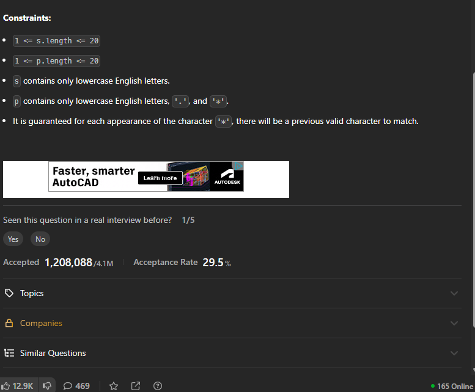

# Notes




## My own solution

1st hard question i have solved.

## Recursive solution

```cpp

class Solution {
    bool solve(string s,string p,int n,int m){
        if(n==-1 && m==-1) return true;
        if(n==-1 && m!=-1) {
            while (m >= 0) {
                if (p[m] == '*') m -= 2;
                else return false;
            }
            return true;
        }
        if(n!=-1 && m==-1) return false;

        if(s[n]==p[m] || p[m]=='.') return solve(s,p,n-1,m-1);
       // cout<<s.substr(0,n+1)<<" "<<p.substr(0,m+1)<<endl;
        if(p[m]=='*'){
            char ch=p[m-1];
            if(ch=='.') {
                bool res=false;
                int i=0;
                while(n-i>=0) {
                    res|=solve(s,p,n-i,m-2);
                    i++;
                }
                if(n-i==-1) res|=solve(s,p,-1,m-2);
                return res;
            }
            else {
            
                bool res=false;
                res|=solve(s,p,n,m-2);
                if(s[n]==ch){
                    int i=1;
                    while(n-i>=0 && s[n-i]==ch){
                        res|=solve(s,p,n-i,m-2);
                        i++;
                    }
                    res|=solve(s,p,n-i,m-2);
                }
                return res;

            }
        }

        return false;

    }
public:
    bool isMatch(string s, string p) {
       return  solve(s,p,s.size()-1,p.size()-1);
    }
};

```
## Dp solution Memoization

```cpp
class Solution {
    bool solve(string &s,string &p,int n,int m,vector<vector<int>>&dp){
        if(n==-1 && m==-1) return true;
        if(n==-1 && m!=-1) {
            while (m >= 0) {
                if (p[m] == '*') m -= 2;
                else return false;
            }
            return true;
        }
        if(n!=-1 && m==-1) return false;

        if(dp[n][m]!=-1) return dp[n][m];
        if(s[n]==p[m] || p[m]=='.') return dp[n][m]=solve(s,p,n-1,m-1,dp);
       // cout<<s.substr(0,n+1)<<" "<<p.substr(0,m+1)<<endl;
        if(p[m]=='*'){
            char ch=p[m-1];
            if(ch=='.') {
                bool res=false;
                int i=0;
                while(n-i>=0) {
                    res|=solve(s,p,n-i,m-2,dp);
                    i++;
                }
                if(n-i==-1) res|=solve(s,p,-1,m-2,dp);
                return dp[n][m]=res;
            }
            else {
            
                bool res=false;
                res|=solve(s,p,n,m-2,dp);
                if(s[n]==ch){//if match then only do this
                    int i=1;
                    while(n-i>=0 && s[n-i]==ch){
                        res|=solve(s,p,n-i,m-2,dp);
                        i++;
                    }
                    res|=solve(s,p,n-i,m-2,dp);
                }
                return dp[n][m]=res;

            }
        }

        return dp[n][m]=false;

    }
public:
    bool isMatch(string s, string p) {
        vector<vector<int>>dp(s.size(),vector<int>(p.size(),-1));
       return  solve(s,p,s.size()-1,p.size()-1,dp);
    }
};
```


