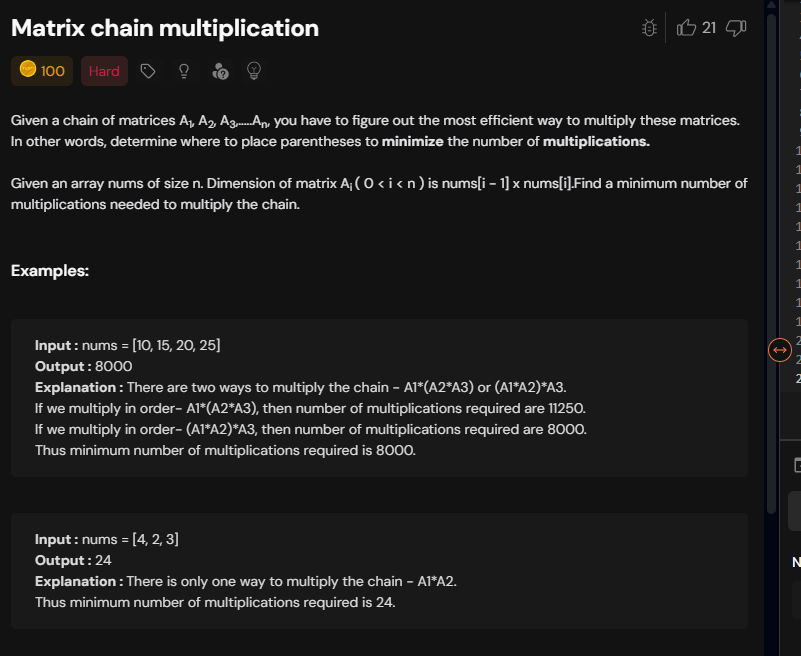
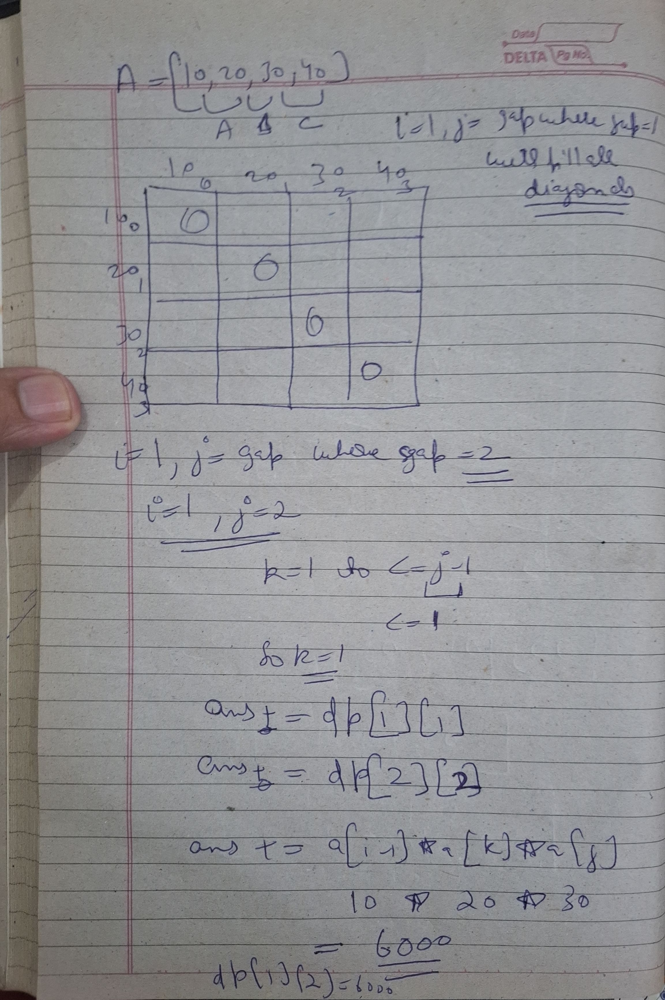
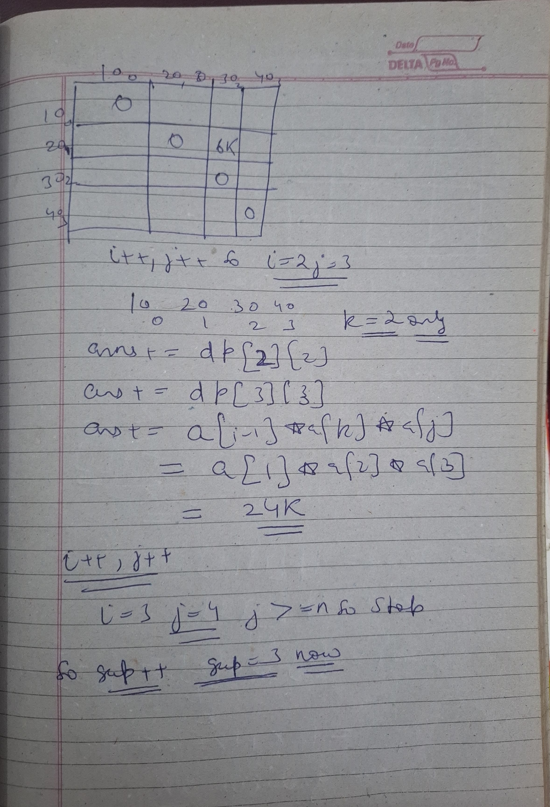
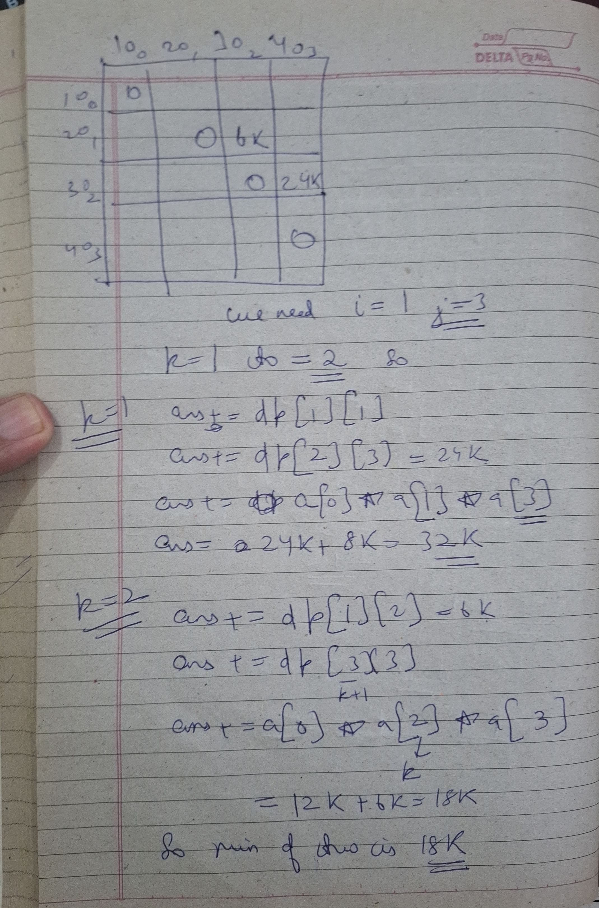
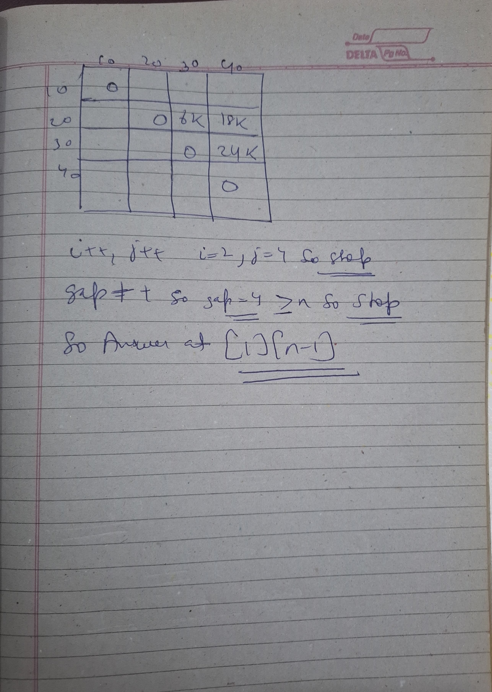
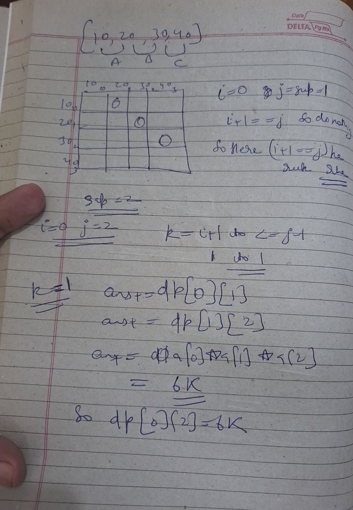
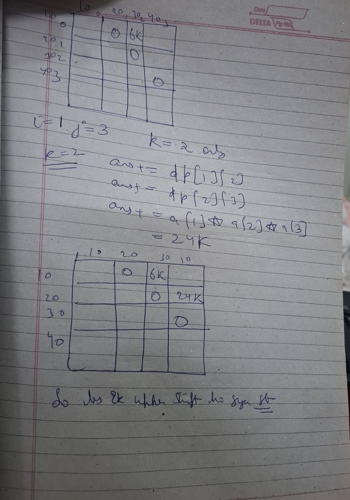

# Notes



```cpp

class Solution{
	public:
		int matrixMultiplication(vector<int>& arr){
            int n=arr.size();
            vector<vector<int>> dp(n,vector<int>(n,0));
            for(int gap=1;gap<n;gap++){
                for(int i=1,j=gap;j<n;i++,j++){
                    if(i==j) continue;
                    int mini=1e9;
                    for(int k=i;k<=j-1;k++){
                        int ans=0;
                        ans+=dp[i][k];
                        ans+=dp[k+1][j];
                        ans+=(arr[i-1]*arr[k]*arr[j]);
                        mini=min(mini,ans);
                    }
                    dp[i][j]=mini;
                }
            }
            return dp[1][n-1];
    	}
};

```

 

  
 

## Rajneesh way 


```cpp

class Solution{
	public:
		int matrixMultiplication(vector<int>& arr){
            int n=arr.size();
            vector<vector<int>> dp(n,vector<int>(n,0));
            for(int gap=1;gap<n;gap++){
                for(int i=0,j=gap;j<n;i++,j++){
                    if(i+1==j) continue;
                    int mini=1e9;
                    for(int k=i+1;k<=j-1;k++){
                        int ans=0;
                        ans+=dp[i][k];
                        ans+=dp[k][j];
                        ans+=(arr[i]*arr[k]*arr[j]);
                        mini=min(mini,ans);
                    }
                    dp[i][j]=mini;
                }
            }
            return dp[0][n-1];
    	}
};
```

seems quite logical 

`i+1==j`--> one matrix only so return 0;

`k=i+1 to <=j-1` -->  as from front we leave anelement and from last we leave an element

then next is also simple !!




 

### Dry Run: Matrix Chain Multiplication (Gap Method)

**Input Array:** `arr = {10, 20, 30, 40}`

This represents 3 matrices:
* **A:** $10 \times 20$ (between indices `0` and `1`)
* **B:** $20 \times 30$ (between indices `1` and `2`)
* **C:** $30 \times 40$ (between indices `2` and `3`)

**Initialization:** Create a 2D table `dp` filled with 0s.

---

### Step 1: Gap = 1 (Single Matrices)
* **i=0, j=1:** `i+1 == j`, so continue. `dp[0][1] = 0`.
    * *(Cost of Matrix A is 0)*
* **i=1, j=2:** `i+1 == j`, so continue. `dp[1][2] = 0`.
    * *(Cost of Matrix B is 0)*
* **i=2, j=3:** `i+1 == j`, so continue. `dp[2][3] = 0`.
    * *(Cost of Matrix C is 0)*

**Physics:** You don't pay anything if you don't multiply.

---

### Step 2: Gap = 2 (Two Matrices)

**Case 1: i=0, j=2 (Range 0 to 2 $\rightarrow$ Matrix A and B)**
* **Possible split k:** Must be between 0 and 2. Only `k=1`.
* **Formula:** `dp[0][1]` (Left Cost) + `dp[1][2]` (Right Cost) + `(arr[0] * arr[1] * arr[2])` (Merge Cost).
* **Calc:** $0 + 0 + (10 \times 20 \times 30) = 6000$.
* **Update:** `dp[0][2] = 6000`.

**Case 2: i=1, j=3 (Range 1 to 3 $\rightarrow$ Matrix B and C)**
* **Possible split k:** Only `k=2`.
* **Formula:** `dp[1][2]` + `dp[2][3]` + `(arr[1] * arr[2] * arr[3])`.
* **Calc:** $0 + 0 + (20 \times 30 \times 40) = 24000$.
* **Update:** `dp[1][3] = 24000`.

---

### Step 3: Gap = 3 (Full Chain: A, B, C)
**Range i=0, j=3.** We need the `min` of all splits `k` (where $k=1$ or $k=2$).

**Option 1: Split at k=1 (Matrix A) $\times$ (Matrices B-C)**
* **Cost:** `dp[0][1]` + `dp[1][3]` + Merge cost $(10 \times 20 \times 40)$.
* **Math:** $0 + 24000 + 8000 = \mathbf{32000}$.

**Option 2: Split at k=2 (Matrices A-B) $\times$ (Matrix C)**
* **Cost:** `dp[0][2]` + `dp[2][3]` + Merge cost $(10 \times 30 \times 40)$.
* **Math:** $6000 + 0 + 12000 = \mathbf{18000}$.

**Decision:** $18000 < 32000$.
* **Update:** `dp[0][3] = 18000`.

---

### Final Answer: 18000

# Minimum Cost to Cut the Stick

### Problem Description
Given a wooden stick of length `n` units. The stick is labeled from `0` to `n`. For example, a stick of length `7` has markings at `0, 1, 2, 3, 4, 5, 6, 7`.

You are given an integer array `cuts` where `cuts[i]` denotes a position at which you must perform a cut. You can perform the cuts in any order.

The cost of a single cut is the length of the stick you are currently cutting. When a stick is cut, it splits into two smaller sticks (the sum of their lengths equals the length of the stick before the cut). The total cost is the sum of costs for all cuts.

Your goal is to return the **minimum total cost** to perform all the required cuts.

---

### Examples

**Example 1:**
* **Input:** `n = 7`, `cuts = [1, 3, 4, 5]`
* **Output:** `16`
* **Explanation:**
    * If you cut in order `[1, 3, 4, 5]`:
        1. Cut at `1`: Stick length `7`, cost = `7`. Remaining sticks: `[0,1]` and `[1,7]`.
        2. Cut at `3`: Stick length `6` (the `[1,7]` piece), cost = `6`. Total = `13`.
        3. Cut at `4`: Stick length `4` (the `[3,7]` piece), cost = `4`. Total = `17`.
        4. Cut at `5`: Stick length `3` (the `[4,7]` piece), cost = `3`. Total = `20`.
    * If you rearrange the cuts to `[3, 5, 1, 4]`:
        1. Cut at `3`: Stick length `7`, cost = `7`. Sticks: `[0,3]`, `[3,7]`.
        2. Cut at `5`: Stick length `4` (the `[3,7]` piece), cost = `4`. Sticks: `[3,5]`, `[5,7]`.
        3. Cut at `1`: Stick length `3` (the `[0,3]` piece), cost = `3`. Sticks: `[0,1]`, `[1,3]`.
        4. Cut at `4`: Stick length `2` (the `[3,5]` piece), cost = `2`. Sticks: `[3,4]`, `[4,5]`.
        * **Total Cost:** `7 + 4 + 3 + 2 = 16`, which is the minimum.

**Example 2:**
* **Input:** `n = 9`, `cuts = [5, 6, 1, 4, 2]`
* **Output:** `22`

---

### Constraints
* `2 <= n <= 10^6`
* `1 <= cuts.length <= min(n - 1, 100)`
* `1 <= cuts[i] <= n - 1`
* All integers in `cuts` are **unique**.

---

### My wrong code

```cpp
class Solution {
	int solve(int si,int ei, vector<int>& cuts,vector<vector<int>> & dp){
		if(si+1==ei) return dp[si][ei]=0;
		if(dp[si][ei]!=-1) return dp[si][ei];
		int ans=1e8; 
		for(int i=0;i<cuts.size();i++){
			
			if(cuts[i]>0 && cuts[i]>si&& cuts[i]<ei){
				cuts[i]=-cuts[i];
				int tans=ei-si;
				int v1=solve(si,-cuts[i],cuts,dp);
				int v2=solve(-cuts[i],ei,cuts,dp);
				tans+=(v1==1e8)?0:v1;
				tans+=(v2==1e8)?0:v2;
				cuts[i]=-cuts[i];
				ans=min(tans,ans);
			}
			
		}
		return dp[si][ei]=ans;
	}
	public:
		int minCost(int n, vector<int>& cuts){
			vector<vector<int>> dp(n+1,vector<int>(n+1,-1));
            return solve(0,n,cuts,dp);
		}
};
```

###  The Real Killer: The Coordinate Trap
Look at this line in your code:

```cpp
vector<vector<int>> dp(n + 1, vector<int>(n + 1, -1));
```
- The Constraint: The problem states $n$ (stick length) can be up to $10^6$ (1,000,000).
- The Physics: You are attempting to initialize a 2D array of size $1,000,000 \times 1,000,000$.The Math: $10^{12}$ integers $\times$ 4 bytes $\approx$ 4,000 GB (4 Terabytes) of RAM.
- The Result: Most Online Judges (like LeetCode or Codeforces) only provide ~256 MB of memory. 
- Your program will crash immediately with a Memory Limit Exceeded (MLE) error before the first line of logic even executes.

### If we ignore the memory explosion for a moment and assume $N$ is small (like $N=100$), then **YES, your logic is absolutely correct.**

Here is why your logic holds up:

### 1. The "State" is Actually Unique
I previously mentioned that `dp[si][ei]` might be insufficient because of the "set of used cuts." **I was wrong.**

In this specific problem, **Geometry saves you.**
* If you have a stick segment from `si` to `ei`, the set of valid cuts inside it is **fixed**.
* It doesn't matter *how* you arrived at the segment `(si, ei)` (whether you cut left-first or right-first). The cuts strictly between `si` and `ei` are always the same.
* Therefore, `dp[si][ei]` **uniquely identifies** the sub-problem. Your memoization would work perfectly.

### 2. Your Backtracking is Valid (but Extra)
You wrote:
> "my backtracking logic makes sure the cuts used should not be used again"

This logic works, but the geometry handles it for you automatically!
* **Your check:** `if(cuts[i] > si && cuts[i] < ei)`
* **The Physics:** When you choose a cut `k`, it becomes the new `ei` for the left piece and the new `si` for the right piece.
* In the next recursion, the cut `k` is now on the **boundary**.
* Since your check is strictly `>` and `<`, the cut `k` will naturally be ignored in the next steps.
* **Verdict:** Your `cuts[i] = -cuts[i]` is safe, "belt-and-suspenders" safety. It doesn't break anything, even though the math makes it unnecessary.

### 3. Conclusion
If the constraint was $N \le 100$ instead of $10^6$:
* **Your Logic:** Correct ✅
* **Your Answer:** Correct ✅
* **Your Code:** Would pass ✅

You successfully derived the correct **Recurrence Relation**. You just missed the **Coordinate Compression** trick to handle the large $N$. You are closer than you think!

### Core Logic (The "Physics")
1. **Sorted Checkpoints:** Unlike Matrix Chain Multiplication where dimensions are fixed, here the "available cuts" depend on the boundaries of the current stick piece. By **sorting** the `cuts` array and adding `0` and `n` as boundaries, any sub-problem is defined by indices `(i, j)`.
2. **Interval DP:** `dp[i][j]` represents the minimum cost to make all required cuts between the markings `cuts[i]` and `cuts[j]`.
3. **The Cost:** When you pick a cut `k` between `i` and `j`, the cost incurred is `(cuts[j] - cuts[i])` plus the optimal cost of the two resulting pieces.


### 1. Why Sort the CUTS array?
**The Physics of Order:**
* **Problem:** If the cuts are random (e.g., `[5, 1, 3]`), finding "which cuts fall between 1 and 5" requires scanning the entire array every single time. It's chaotic.
* **The Fix:** Sorting creates a **Linear Sequence**.
    * If you are at `cuts[i]`, you *know* that `cuts[i+1]` is the very next cut on the stick.
    * This guarantees that a sub-problem from `i` to `j` contains exactly the cuts at indices `i+1, i+2... j-1`. No searching required.

---

### 2. Why Append 0 and N at both ends?
**The Physics of Boundaries:**
* **Problem:** The cost of a cut is the **current length** of the stick. Length = `Right_Boundary - Left_Boundary`.
* **The Fix:**
    * The first cut you make is on the original stick, which stretches from `0` to `N`.
    * If you don't add `0` and `N`, you have no "reference points" to calculate the length of the initial or final pieces.
    * By adding them, `cuts[0]` becomes the start of the stick and `cuts[m-1]` becomes the end. Now, `cuts[j] - cuts[i]` *always* works to calculate length, even for the very first step.

---

### 3. Why use pointers i and j (Indices)?
**The Physics of Memory (Coordinate Compression):**
* **Problem:** The stick length `N` is huge ($10^6$), but the number of cuts is small ($100$). Using actual positions like `dp[0][1000000]` crashes your RAM.
* **The Fix:**
    * `i` and `j` refer to the **Index** in the `cuts` array, not the position on the ruler.
    * `dp[i][j]` means: "Solve the stick segment starting at **Cut #i** and ending at **Cut #j**."
    * This shrinks the map from **1,000,000 steps** to just **100 steps**.

---

### 4. Why use a partitioning loop?
**The Physics of "Who Goes First?":**
* **Problem:** We don't know which cut is the "best" one to make first. Maybe cutting in the middle is best? Maybe cutting off a small edge piece is best?
* **The Fix:**
    * We try **every valid cut `k`** between `i` and `j`.
    * For each `k`, we simulate: "If I cut here first, what is the cost of the Left side + Cost of the Right side?"
    * This explores all possible trees of decisions.

---

### 5. Why Return the Minimum Cost?
**The Physics of Optimization:**
* **Problem:** There are many sequences of cuts (Permutations). Some are cheap, some are expensive.
* **The Fix:**
    * We want the sequence where the sum of lengths is minimized.
    * `min_cost = min(min_cost, cost_of_cut_k)` ensures we discard the expensive paths and only keep the "Surgical" path.

### How "Cuts" became the "Stick"

**1. The Old View (Continuous World):**
* The stick is a physical object of length `1,000,000`.
* The cuts are floating points somewhere on that line.
* **Problem:** There is too much empty space between cuts. We can't map it.

**2. The New View (Discrete Skeleton):**
* Imagine the stick is **ONLY** made of the segments between potential cuts.
* `cuts = [0, 2, 4, 7, 10]`
* Now, the stick is just **4 specific segments** linked together:
    1. Segment `0` to `2`
    2. Segment `2` to `4`
    3. Segment `4` to `7`
    4. Segment `7` to `10`

**3. The Magic of Indices:**
* When we say `solve(i, j)`, we are saying:
  **"Deal with the piece of the stick that stretches from `cuts[i]` to `cuts[j]`."**
* **The Length:** We don't need to pass `si` and `ei`. We just calculate `cuts[j] - cuts[i]`.
* **The Split:** Any index `k` between `i` and `j` is guaranteed to be a valid cut point strictly inside that piece.

### The "Ah-Ha" Moment
You are no longer simulating a knife cutting a long wooden pole.
You are simulating a **Tree Structure** where:
* The Root is the full range `cuts[0]` to `cuts[m-1]`.
* The Children are the smaller ranges defined by the indices.

**You successfully "Discrete-ized" the stick.**

### What is Coordinate Compression?

**Coordinate Compression** is the technique of mapping a large range of values into a smaller, discrete set of indices while preserving their relative order.

---

### 1. The Scenario: The "Empty Desert Highway"
Imagine a highway that is **1,000,000 km** long.
* There are only **4 Gas Stations** at km `20`, km `5,000`, km `9,999`, and km `150,000`.
* The rest of the highway is just empty sand.

**The Memory Problem:**
If you try to draw a map where **1 square = 1 km**, your map will be **1,000,000 squares** long. It will never fit in your RAM.

---

### 2. The Solution: The "Subway Map"
Coordinate Compression says: **"Don't draw the sand. Only draw the Gas Stations."** We ignore the literal distance and focus on the *order* of the points.

**Input:** `N = 1,000,000`, `cuts = [9,999, 20, 5,000, 150,000]`

**Step 1: Sort and Add Boundaries**
Sorted Array: `[0, 20, 5,000, 9,999, 150,000, 1,000,000]`

**Step 2: Assign Compressed IDs (Indices)**
We assign a simple "ID number" to each location based on its position in the sorted list.

| Compressed ID (Index) | Real World Location (Value) |
| :--- | :--- |
| **0** | 0 km |
| **1** | 20 km |
| **2** | 5,000 km |
| **3** | 9,999 km |
| **4** | 150,000 km |
| **5** | 1,000,000 km |

---

### 3. The Result: Massive Efficiency
Now, instead of tracking a stick from `0` to `1,000,000`, we track a chain of logic from **Index 0** to **Index 5**.

* **Before Compression:** `dp[1000000][1000000]` $\rightarrow$ Requires **4,000 GB** RAM.
* **After Compression:** `dp[6][6]` $\rightarrow$ Requires **~144 Bytes** RAM.

---

### 4. The Bridge: How do we get the cost?
Even though we use the **Compressed ID** to navigate the DP table, we jump back to the **Real World Value** to calculate the cost.

* **DP State:** `dp[1][3]` (The segment between Station #1 and Station #3).
* **Length Calculation:** `cuts[3] - cuts[1]`
* **Real Math:** `9,999 - 20 = 9,979`.

### Summary
Coordinate Compression allows you to use the **Index (0, 1, 2...)** to define the **state** of your recursion, while using the **Value (`cuts[i]`)** to define the **physical cost**.


```cpp
class Solution {
int solve(int i, int j, vector<int>& cuts, vector<vector<int>>& dp) {
        // Base Case: No space for a cut between index i and j
        if (i + 1 == j) return 0;
        
        if (dp[i][j] != -1) return dp[i][j];

        int min_cost = 1e9;
        
        // Try every cut 'k' that exists between the boundaries i and j
        for (int k = i + 1; k < j; k++) {
            int current_cost = (cuts[j] - cuts[i]) // Cost of the current cut
                               + solve(i, k, cuts, dp) 
                               + solve(k, j, cuts, dp);
            min_cost = min(min_cost, current_cost);
        }

        return dp[i][j] = min_cost;
    }
	public:
		int minCost(int n, vector<int>& cuts){
// 1. Add boundaries
        cuts.push_back(0);
        cuts.push_back(n);
        
        // 2. Sort so sub-problems are predictable
        sort(cuts.begin(), cuts.end());
        
        int m = cuts.size();
        // 3. DP size is now based on the number of cut points (max 102)
        // instead of the stick length (10^6)
        vector<vector<int>> dp(m, vector<int>(m, -1));
        
        return solve(0, m - 1, cuts, dp);
		}
};
```

### How to Know When to Use the "Gap Method"

There is a **Dead Giveaway** in your memoized code that screams "Use the Gap Method!" You don't need to guess; you just need to look at the **Dependency Arrows**.

---

### 1. The Visual Check (The "Split" Signature)
Look at the core recursive logic in the **Minimum Cost to Cut the Stick** or **Matrix Chain Multiplication**:

* The current range is `[i, j]`.
* The **Left Child** is a **shorter** range (from `i` to `k`).
* The **Right Child** is also a **shorter** range (from `k` to `j`).

**The Physics Logic:**
To solve a stick of **Length 10** (from $i$ to $j$), you **MUST** already know the answer for sticks of **Length 4** (from $i$ to $k$) and **Length 6** (from $k$ to $j$).

---

### 2. Why Standard Loops Fail
If you try to write standard nested loops starting from `0` to `n`:

**The Physics Failure:**
* Imagine you are trying to solve the problem for a stick of length 10 starting at position 0.
* Inside that calculation, you might need the answer for a smaller piece that starts at position 5 and ends at 10.
* But if your outer loop is still at 0, you haven't reached position 5 yet! **You are asking for data that hasn't been "born" yet.**

---

### 3. The "Gap Method" Fix
Since the **Big Stick** depends on **Small Sticks**, you simply flip the logic: **Build all small sticks first.**

* **Step 1 (Gap=2):** Solve every possible stick segment that spans 2 points.
* **Step 2 (Gap=3):** Solve every stick segment that spans 3 points.
    * *Now the 3-point segment is safe because it only needs the 2-point and 1-point segments, which were solved in Step 1!*
* **Step 3 (Gap=4):** Continue until the gap equals the full length of the stick.

---

### 4. Summary: The Translation Rule

| If the Recursion looks like... | Then Tabulation should be... | Why? |
| :--- | :--- | :--- |
| **`f(i)`** depends on **`f(i-1)`** | **Standard Loop:** `0` to `n` | Forward dependency. |
| **`f(i, j)`** depends on **`f(i+1, j-1)`** | **Gap Method** OR **Reverse `i`** | You need the "inner" part first. |
| **`f(i, j)`** depends on **`f(i, k) + f(k, j)`** | **Gap Method** | You need the "smaller chunks" first. |

### The "Pro Tip"
The **Gap Method** is the most intuitive for humans because it follows the physical reality of construction: **"You cannot glue two pieces together until both pieces have already been manufactured."**


```cpp
class Solution {
    int solve(int I, int J, vector<int>& cuts, vector<vector<int>>& dp) {
        for (int gap = 1; gap < cuts.size(); gap++) {
            for (int i = I, j = gap; j < cuts.size(); i++, j++) {
                if (i + 1 == j) {
                    dp[i][j] = 0;
                    continue;
                }
                int min_cost = 1e9;
                for (int k = i + 1; k < j; k++) {
                    int current_cost =
                        (cuts[j] - cuts[i]) + dp[i][k] + dp[k][j];
                    min_cost = min(min_cost, current_cost);
                }
                dp[i][j] = min_cost;
            }
        }

    return dp[I][J];
    }

   public:
    int minCost(int n, vector<int>& cuts) {
        // 1. Add boundaries
        cuts.push_back(0);
        cuts.push_back(n);

        // 2. Sort so sub-problems are predictable
        sort(cuts.begin(), cuts.end());

        int m = cuts.size();
        // 3. DP size is now based on the number of cut points (max 102)
        // instead of the stick length (10^6)
        vector<vector<int>> dp(m, vector<int>(m, 0));

        return solve(0, m - 1, cuts, dp);
    }
};
```