## Q1. Partition Equal Subset Sum (LeetCode 416)

**Problem:** Given an integer array `nums`, return `true` if you can partition the array into two subsets such that the sum of the elements in both subsets is equal or `false` otherwise.

**Example 1:**
```
Input: nums = [1,5,11,5]
Output: true
Explanation: The array can be partitioned as [1, 5, 5] and [11].
```

**Example 2:**
```
Input: nums = [1,2,3,5]
Output: false
Explanation: The array cannot be partitioned into equal sum subsets.
```

**Constraints:**
- `1 <= nums.length <= 200`
- `1 <= nums[i] <= 100`

**Approach:** Think of every element as either going into set `S1` (include) or set `S2` (exclude). We want `sum(S1) == sum(S2)`. Since `sum(S1) + sum(S2)` is always the total array sum, and we want them equal, that means `2 * sum(S1) = total sum`, i.e. `sum(S1) = total_sum / 2`. So the problem reduces exactly to **Subset Sum**: does there exist a subset whose sum equals `total_sum / 2`?

**Boundary case:** if the total array sum is **odd**, it's impossible to split it into two equal integer sums — return `false` immediately without doing any further work.

**Java:**
```java
class Solution {
    public boolean canPartition(int[] nums) {
        int sum = 0;
        for (int x : nums) sum += x;
        if (sum % 2 != 0) return false;
        int target = sum / 2;
        int n = nums.length;
        boolean[][] dp = new boolean[n + 1][target + 1];
        for (int i = 0; i <= n; i++) dp[i][0] = true;
        for (int i = 1; i <= n; i++) {
            for (int j = 1; j <= target; j++) {
                dp[i][j] = dp[i - 1][j];
                if (nums[i - 1] <= j) {
                    dp[i][j] = dp[i][j] || dp[i - 1][j - nums[i - 1]];
                }
            }
        }
        return dp[n][target];
    }
}
```

**C++:**
```cpp
class Solution {
public:
    bool canPartition(vector<int>& nums) {
        int sum = 0;
        for (int x : nums) sum += x;
        if (sum % 2 != 0) return false;
        int target = sum / 2;
        int n = nums.size();
        vector<vector<bool>> dp(n + 1, vector<bool>(target + 1, false));
        for (int i = 0; i <= n; i++) dp[i][0] = true;
        for (int i = 1; i <= n; i++) {
            for (int j = 1; j <= target; j++) {
                dp[i][j] = dp[i - 1][j];
                if (nums[i - 1] <= j) {
                    dp[i][j] = dp[i][j] || dp[i - 1][j - nums[i - 1]];
                }
            }
        }
        return dp[n][target];
    }
};
```

**Dry run** on `nums = [1,5,11,5]`: `sum = 22` (even), `target = 11`. Is there a subset summing to `11`? Yes — `{11}` alone, or equivalently `{1,5,5}` on the other side. `dp[4][11] = true`, so the answer is `true`, matching the expected output (`[1,5,5]` and `[11]`).

**Time Complexity: `O(n * target)`**, i.e. `O(n * sum)`. **Space Complexity: `O(n * target)`** for the DP table.

## Q2. Partition array into two subsets with minimum sum difference (GFG)

**Problem:** Given an array `arr` of size `n`, partition it into two subsets `S1` and `S2` such that the absolute difference between their sums is minimum, and return that minimum difference.

**Approach — the "two runners moving apart" intuition:** think of two points starting from the same spot and moving apart at equal speed — the distance between them grows at *twice* the rate either one moves (like two objects A and B moving away from point `x` with velocity `v`; at time `t`, the distance between them is `2vt`, not `vt`). Similarly here: `sum(S1) + sum(S2) = totalSum` is fixed. If `sum(S1)` decreases by some amount from the ideal midpoint `totalSum/2`, `sum(S2)` must increase by that *same* amount to keep the total fixed — so the difference `|S1 - S2|` grows at **twice** the rate that `S1` moves away from `totalSum/2`. This means the minimum possible difference is achieved by finding the achievable subset sum **closest to `totalSum/2`** (the closer a reachable `S1` is to the midpoint, the smaller the resulting difference).

**Algorithm:** Run the same Subset-Sum DP as Q2 (without needing the sum to be even this time), building the boolean table for every achievable sum from `0` to `totalSum`. Then scan the **last row** of that table from `totalSum/2` down to `0`, and the *first* `true` found there (i.e. the largest achievable sum `<= totalSum/2`) is the best `sum(S1)`. The minimum difference is then `totalSum - 2 * sum(S1)`.

**Java:**
```java
class Solution {
    public int minDifference(int[] arr) {
        int n = arr.length;
        int sum = 0;
        for (int x : arr) sum += x;
        boolean[][] dp = new boolean[n + 1][sum + 1];
        for (int i = 0; i <= n; i++) dp[i][0] = true;
        for (int i = 1; i <= n; i++) {
            for (int j = 1; j <= sum; j++) {
                dp[i][j] = dp[i - 1][j];
                if (arr[i - 1] <= j) {
                    dp[i][j] = dp[i][j] || dp[i - 1][j - arr[i - 1]];
                }
            }
        }
        int res = Integer.MAX_VALUE;
        for (int j = sum / 2; j >= 0; j--) {
            if (dp[n][j]) {
                res = sum - 2 * j;
                break;
            }
        }
        return res;
    }
}
```

**C++:**
```cpp
class Solution {
public:
    int minDifference(vector<int>& arr) {
        int n = arr.size();
        int sum = 0;
        for (int x : arr) sum += x;
        vector<vector<bool>> dp(n + 1, vector<bool>(sum + 1, false));
        for (int i = 0; i <= n; i++) dp[i][0] = true;
        for (int i = 1; i <= n; i++) {
            for (int j = 1; j <= sum; j++) {
                dp[i][j] = dp[i - 1][j];
                if (arr[i - 1] <= j) {
                    dp[i][j] = dp[i][j] || dp[i - 1][j - arr[i - 1]];
                }
            }
        }
        int res = INT_MAX;
        for (int j = sum / 2; j >= 0; j--) {
            if (dp[n][j]) {
                res = sum - 2 * j;
                break;
            }
        }
        return res;
    }
};
```

**Dry run** on `arr = [1,6,11,5]`: `sum = 23`, `sum/2 = 11`. Scanning the last row from `j=11` downward, `dp[4][11]` is `true` (subset `{11}` or `{6,5}` sums to `11`). So `sum(S1) = 11`, and the minimum difference `= 23 - 2*11 = 1` — the classic split `{1,5,6}` (sum 12) vs `{11}` (sum 11), difference `1`.

**Time Complexity: `O(n * sum)`. Space Complexity: `O(n * sum)`** — identical reasoning to Q2's Subset Sum DP.

**A related variant:** if the question instead asks for the *number* of subsets achieving a given target difference/sum, the same DP works but the recurrence combines the include/exclude branches with **`+` (counting)** instead of **`||`/OR** (existence) — since now every distinct way of reaching a sum needs to be counted, not just whether it's reachable at all.


## A quick roadmap: what comes after 0/1 Knapsack

A few more topic pointers worth keeping in mind when practicing (each is its own separate problem, not expanded further here):
- **Longest Common Subsequence** family — a genuinely simple type of DP; LeetCode 516, 1092 and 1035 are all Longest-Common-Subsequence-style problems.
- **Longest Common Substring** — best done **iteratively**, as originally thought (a recursive first attempt is not the natural fit here).
- **Longest Palindromic Substring** — one clean approach is to keep the string `S` and its reverse `S_reversed`, and find their **Longest Common Substring**.
- **Palindromic Partitioning** — follows a similar approach to Longest Palindromic Substring.

## DP on Sliding Window — filling order

Several string-DP problems (like Longest Palindromic Substring) use a 2D table indexed by `(start, end)` positions within the string, and the natural recurrence looks at `(start+1, end-1)` — i.e., a *smaller window strictly inside* the current one. Since that inner cell must already be computed, the table can't be filled row-by-row or column-by-column in the usual sense — instead, it must be filled by **increasing window size** (increasing `end - start`), i.e. diagonal by diagonal, starting from window size 0 (single characters) and growing outward.

For a string like `S = "babad"` (indices `0..4`), that means processing pairs in this order: all window-size-0 pairs `(0,0),(1,1),(2,2),(3,3),(4,4)` first, then all window-size-1 pairs `(0,1),(1,2),(2,3),(3,4)`, then window-size-2 pairs `(0,2),(1,3),(2,4)`, and so on up to the full string. This "DP on sliding window" fill order comes up in many string-DP problems beyond just palindromes.

**Time Complexity: `O(N^2)`** for this style of DP — there are `O(N^2)` `(start, end)` pairs total, each computed in `O(1)` once the smaller windows inside them are already known.


## Q3. Increasing Triplet Subsequence (LeetCode 334)

**Problem:** Given an integer array `nums`, return `true` if there exists a triple of indices `(i, j, k)` such that `i < j < k` and `nums[i] < nums[j] < nums[k]`. If no such indices exists, return `false`.

**Example 1:**
```
Input: nums = [1,2,3,4,5]
Output: true
Explanation: Any triplet where i < j < k is valid.
```

**Example 2:**
```
Input: nums = [5,4,3,2,1]
Output: false
Explanation: No triplet exists.
```

**Example 3:**
```
Input: nums = [2,1,5,0,4,6]
Output: true
Explanation: The triplet (3, 4, 5) is valid because nums[3] == 0 < nums[4] == 4 < nums[5] == 6.
```

**Constraints:**
- `1 <= nums.length <= 5 * 10^5`
- `-2^31 <= nums[i] <= 2^31 - 1`

**Follow up:** Could you implement a solution that runs in `O(n)` time complexity and `O(1)` space complexity?

**Why `O(n^2)` doesn't work here:** with `n` up to `5*10^5`, an `O(n^2)` solution would take roughly `2.5 * 10^10` operations — far too slow (`TLE`). Even `O(n log n)` (`5*10^5 * log(5*10^5) ≈ 5*10^5 * 20 ≈ 10^7`) is comfortably fast enough and gets Accepted, but the problem's follow-up specifically asks for `O(n)` / `O(1)`.

### Approach 1: `O(n log n)` — reuse the LIS `tails` trick, capped at length 3

This is exactly Q4's `O(n log n)` LIS approach, except we only care whether the LIS reaches length `>= 3` — we don't need its exact length beyond that.

**Java:**
```java
class Solution {
    private int upperBound(List<Integer> arr, int num) {
        int li = 0;
        int ri = arr.size();
        while (li < ri) {
            int mid = (li + ri) >> 1;
            if (num <= arr.get(mid))
                ri = mid;
            else li = mid + 1;
        }
        return li;
    }

    public boolean increasingTriplet(int[] arr) {
        int n = arr.length;
        List<Integer> res = new ArrayList<>();
        for (int i = 0; i < n; i++) {
            int idx = upperBound(res, arr[i]);
            if (idx == res.size()) res.add(arr[i]);
            else res.set(idx, arr[i]);
        }
        return res.size() >= 3;
    }
}
```

**C++:**
```cpp
class Solution {
    int upperBound(vector<int>& arr, int num) {
        int li = 0;
        int ri = arr.size();
        while (li < ri) {
            int mid = (li + ri) >> 1;
            if (num <= arr[mid])
                ri = mid;
            else li = mid + 1;
        }
        return li;
    }

public:
    bool increasingTriplet(vector<int>& arr) {
        int n = arr.size();
        vector<int> res;
        for (int i = 0; i < n; i++) {
            int idx = upperBound(res, arr[i]);
            if (idx == (int)res.size()) res.push_back(arr[i]);
            else res[idx] = arr[i];
        }
        return res.size() >= 3;
    }
};
```

**Time Complexity: `O(n log n)`. Space Complexity: `O(n)`** worst case, for the `res` list.

### Approach 2: `O(n)`, `O(1)` space — two running candidates

Track two values: `first` (the smallest value seen so far that could start a triplet) and `second` (the smallest value seen so far that is bigger than some earlier `first` — i.e. the best "middle" candidate). Scan once:
- If the current number is `<= first`, it becomes the new (smaller, better) `first`.
- Else if it's `<= second`, it becomes the new (smaller, better) `second` — meaning we found a smaller valid middle element, without losing the guarantee that *some* smaller element exists before it.
- Otherwise, the current number is strictly greater than both `first` and `second` — that completes a valid increasing triplet, so return `true` immediately.

If the scan finishes without ever hitting the third case, no triplet exists.

**Java:**
```java
class Solution {
    public boolean increasingTriplet(int[] nums) {
        int first = Integer.MAX_VALUE, second = Integer.MAX_VALUE;
        for (int n : nums) {
            if (first >= n)
                first = n;
            else if (second >= n)
                second = n;
            else
                return true;
        }
        return false;
    }
}
```

**C++:**
```cpp
class Solution {
public:
    bool increasingTriplet(vector<int>& nums) {
        int first = INT_MAX, second = INT_MAX;
        for (int n : nums) {
            if (first >= n)
                first = n;
            else if (second >= n)
                second = n;
            else
                return true;
        }
        return false;
    }
};
```

**Dry run** on `[2,1,5,0,4,6]`: `2` → `first=2`. `1` → `1<=first` → `first=1`. `5` → `5>first`, `5<=second(MAX)` → `second=5`. `0` → `0<=first` → `first=0`. `4` → `4>first(0)`, `4<=second(5)` → `second=4`. `6` → `6>first(0)` and `6>second(4)` → **return `true`** (the triplet is `0, 4, 6` at indices `3, 4, 5`), matching the expected output.

**Time Complexity: `O(n)`** — a single pass. **Space Complexity: `O(1)`** — only two tracking variables, satisfying the follow-up exactly.


## Q4. Minimum Operations to Make the Array K-Increasing (LeetCode 2111, Hard)

**Problem:** You are given a 0-indexed array `arr` consisting of `n` positive integers, and a positive integer `k`.

The array `arr` is called **K-increasing** if `arr[i-k] <= arr[i]` holds for every index `i`, where `k <= i <= n-1`.

- For example, `arr = [4, 1, 5, 2, 6, 2]` is K-increasing for `k = 2` because:
  - `arr[0] <= arr[2] (4 <= 5)`
  - `arr[1] <= arr[3] (1 <= 2)`
  - `arr[2] <= arr[4] (5 <= 6)`
  - `arr[3] <= arr[5] (2 <= 2)`
- However, the same `arr` is not K-increasing for `k = 1` (because `arr[0] > arr[1]`) or `k = 3` (because `arr[0] > arr[3]`).

In one **operation**, you can choose an index `i` and change `arr[i]` into **any** positive integer.

Return the minimum number of operations required to make the array K-increasing for the given `k`.

**Example 1:**
```
Input: arr = [5,4,3,2,1], k = 1
Output: 4
Explanation:
For k = 1, the resultant array has to be non-decreasing.
Some of the K-increasing arrays that can be formed are [5,6,7,8,9], [1,1,1,1,1], [2,2,3,4,4]. All of them
require 4 operations.
It is suboptimal to change the array to, for example, [6,7,8,9,10] because it would take 5 operations.
It can be shown that we cannot make the array K-increasing in less than 4 operations.
```

**Example 2:**
```
Input: arr = [4,1,5,2,6,2], k = 2
Output: 0
Explanation:
This is the same example as the one in the problem description.
Here, for every index i where 2 <= i <= 5, arr[i-2] <= arr[i].
Since the given array is already K-increasing, we do not need to perform any operations.
```

**Example 3:**
```
Input: arr = [4,1,5,2,6,2], k = 3
Output: 2
Explanation:
Indices 3 and 5 are the only ones not satisfying arr[i-3] <= arr[i] for 3 <= i <= 5.
One of the ways we can make the array K-increasing is by changing arr[3] to 4 and arr[5] to 5.
The array will now be [4,1,5,4,6,5].
Note that there can be other ways to make the array K-increasing, but none of them require less than 2
operations.
```

**Constraints:**
- `1 <= arr.length <= 10^5`
- `1 <= arr[i], k <= arr.length`

**Approach:** The condition `arr[i-k] <= arr[i]` for all valid `i` means: if we group indices by their **residue mod `k`**, each such group, read in order, must independently be a **non-decreasing** sequence. So split the array into `k` separate subsequences (index `0, k, 2k, ...`; index `1, k+1, 2k+1, ...`; etc.), and for each one, find its **Longest Non-Decreasing Subsequence** — the elements in that longest chain never need to change, and everything else in that group does. The total minimum operations = `n - (sum of the Longest Non-Decreasing Subsequence lengths across all k groups)`.

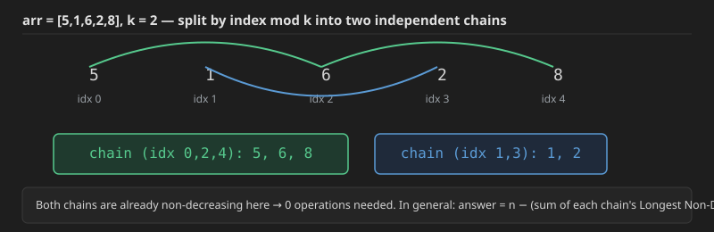

This reuses the exact same `O(n log n)` LIS machinery from Q4/Q5 — the only twist is that here we want the longest **non-decreasing** (not strictly increasing) subsequence, which changes the binary search from a strict upper bound to one that allows equal elements to extend a chain: searching for the first position where the array element is **strictly greater** than the new value (rather than `>=`), so that equal values get appended/extended rather than replacing an existing tail.

**Java:**
```java
class Solution {
    private int upperBound(List<Integer> arr, int num) {
        int li = 0;
        int ri = arr.size();
        while (li < ri) {
            int mid = (li + ri) >> 1;
            if (num < arr.get(mid))
                ri = mid;
            else li = mid + 1;
        }
        return li;
    }

    public int kIncreasing(int[] arr, int k) {
        int n = arr.length;
        int lsize = 0;
        for (int idx = 0; idx < k; idx++) {
            List<Integer> res = new ArrayList<>();
            for (int i = idx; i < n; i += k) {
                int idx1 = upperBound(res, arr[i]);
                if (idx1 == res.size()) res.add(arr[i]);
                else res.set(idx1, arr[i]);
            }
            lsize += res.size();
        }
        return n - lsize;
    }
}
```

**C++:**
```cpp
class Solution {
    int upperBound(vector<int>& arr, int num) {
        int li = 0;
        int ri = arr.size();
        while (li < ri) {
            int mid = (li + ri) >> 1;
            if (num < arr[mid])
                ri = mid;
            else li = mid + 1;
        }
        return li;
    }

public:
    int kIncreasing(vector<int>& arr, int k) {
        int n = arr.size();
        int lsize = 0;
        for (int idx = 0; idx < k; idx++) {
            vector<int> res;
            for (int i = idx; i < n; i += k) {
                int idx1 = upperBound(res, arr[i]);
                if (idx1 == (int)res.size()) res.push_back(arr[i]);
                else res[idx1] = arr[i];
            }
            lsize += res.size();
        }
        return n - lsize;
    }
};
```

Note the single deliberate difference from Q4/Q5's `upperBound`: the comparison here is `num < arr.get(mid)` (strict), not `num <= arr.get(mid)`. This is exactly what turns the "longest strictly increasing subsequence" search into a "longest **non-decreasing** subsequence" search, matching what K-increasing actually requires (`<=`, not `<`).

**Dry run** on `arr = [4,1,5,2,6,2]`, `k = 3`: split into 3 residue groups by index mod 3 — group 0 (indices 0,3): `[4,2]`, group 1 (indices 1,4): `[1,6]`, group 2 (indices 2,5): `[5,2]`. Longest non-decreasing subsequence of `[4,2]` is length 1 (either element alone); of `[1,6]` is length 2 (already non-decreasing); of `[5,2]` is length 1. Total kept = `1+2+1 = 4`. Operations needed = `6 - 4 = 2`, matching the expected output exactly.

**Time Complexity: `O(n log n)`** — across all `k` groups, the total number of elements processed is still `n`, and each does one `O(log(group size))` binary search.
**Space Complexity: `O(n)`** worst case, across the `k` temporary `res` lists (their combined size never exceeds `n`).


## A couple more pointers before moving on

- If a Subset-Sum-style problem asks to divide into **2** equal subsets, the approach above works directly. If it asks to divide into **3** (or more) equal subsets, that needs **Bitmasking DP** (or another technique) instead — this combination essentially never shows up in interviews, so it's fine to treat it as a "know it exists" topic rather than deeply practicing it.
- Worth revisiting separately: the **Minimum Edit Distance** problem.


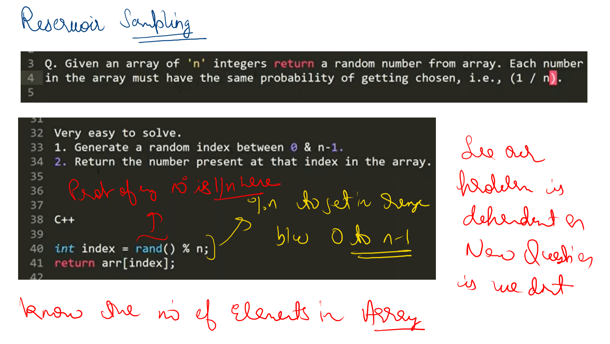 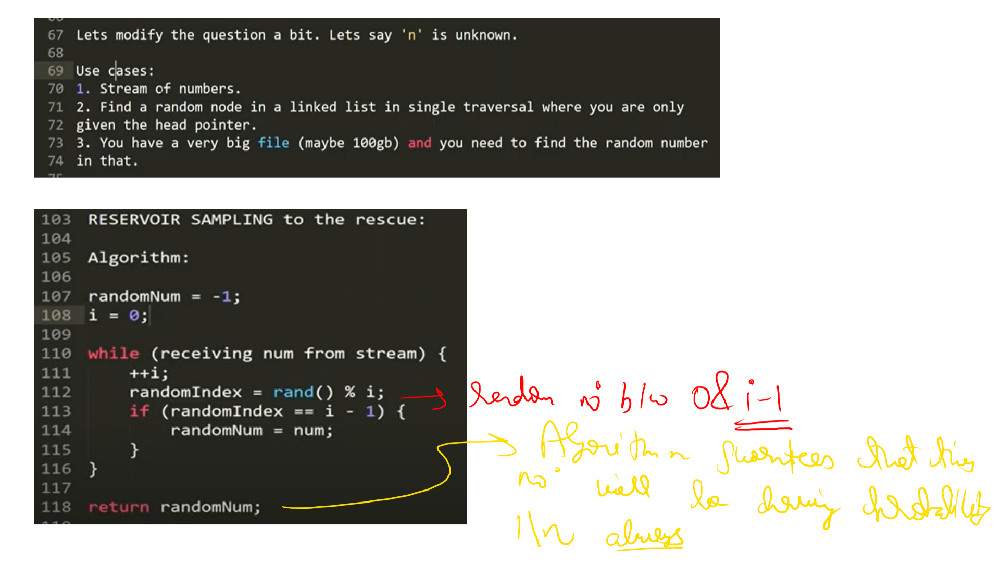 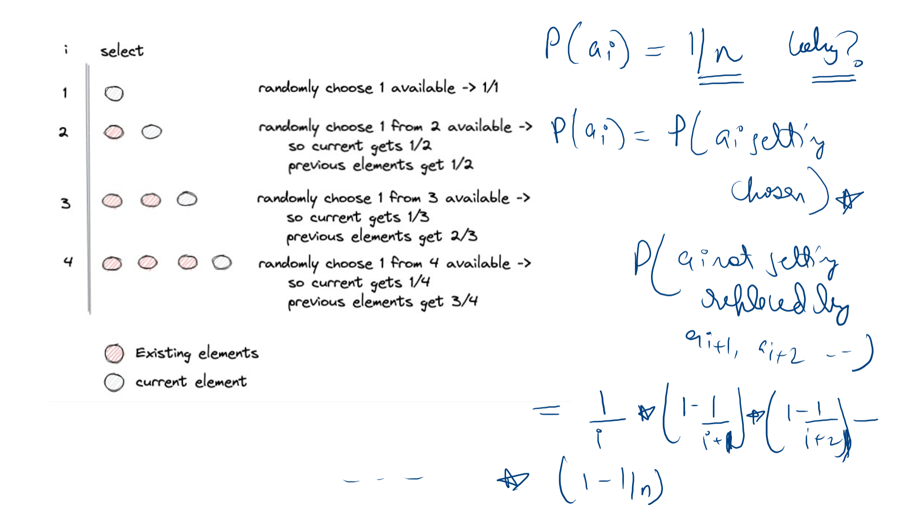 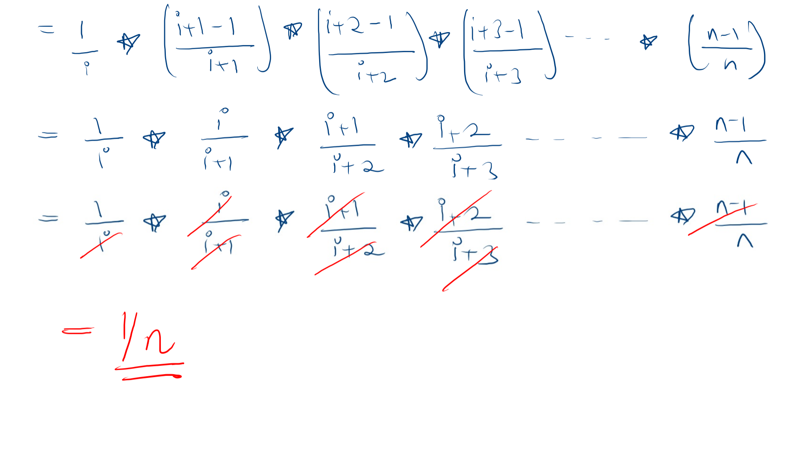 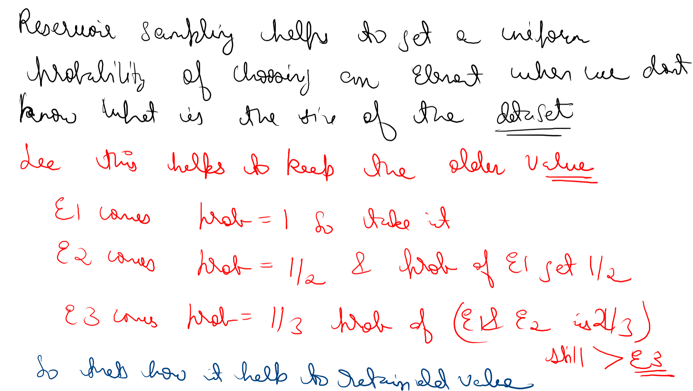 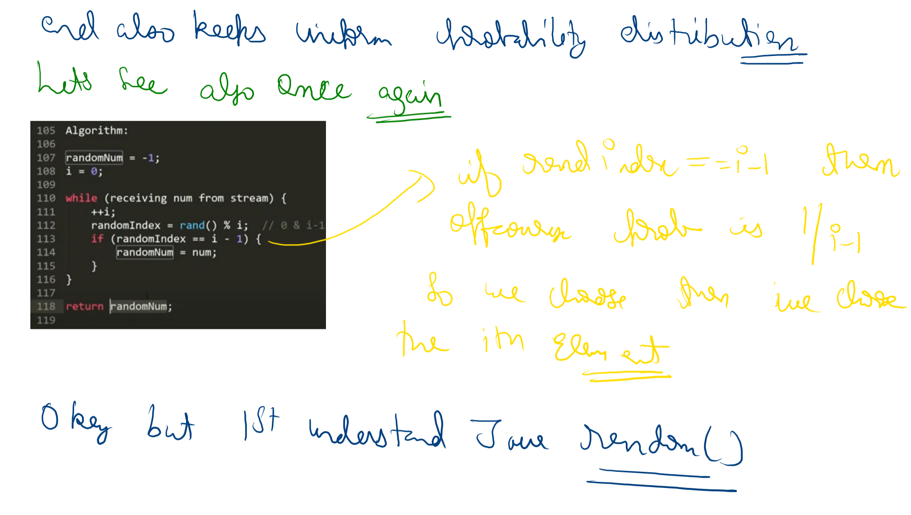 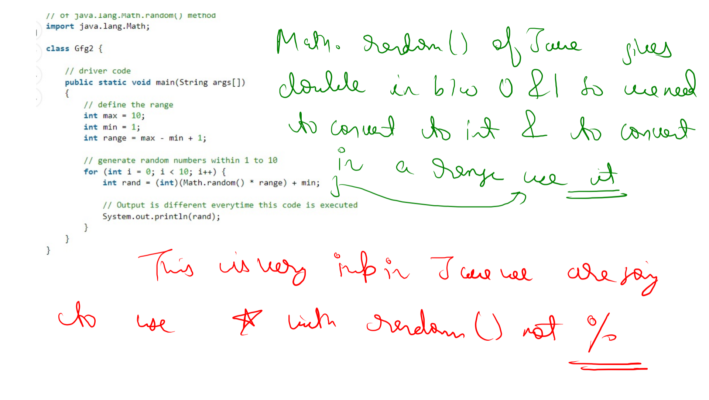 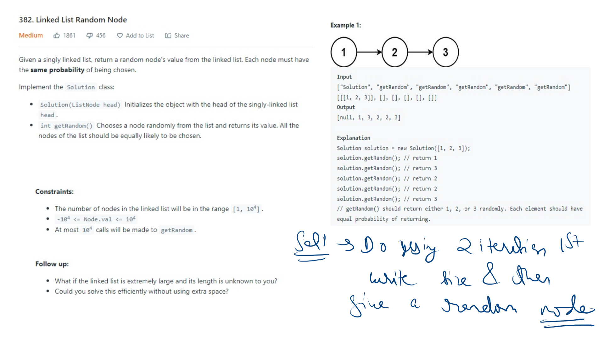 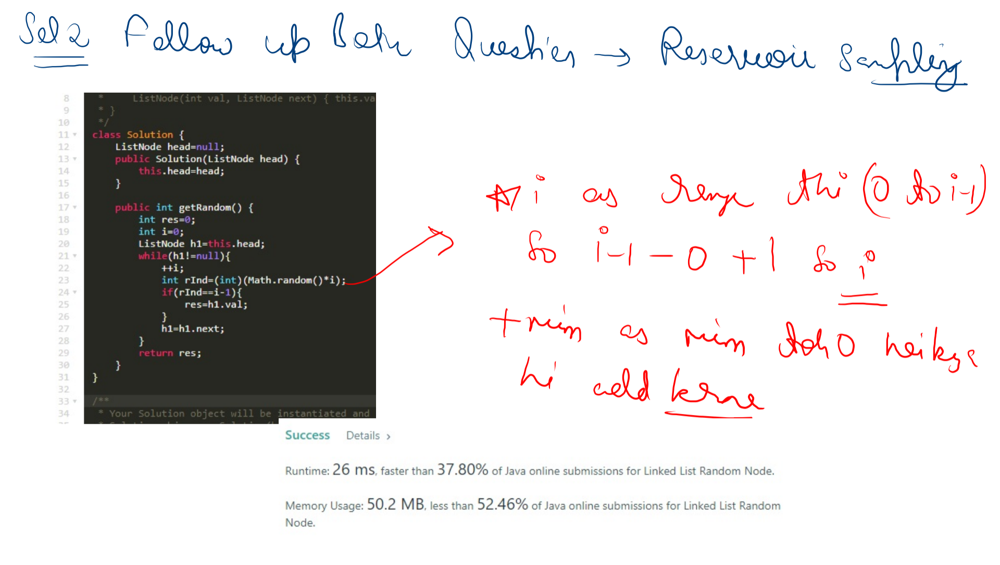 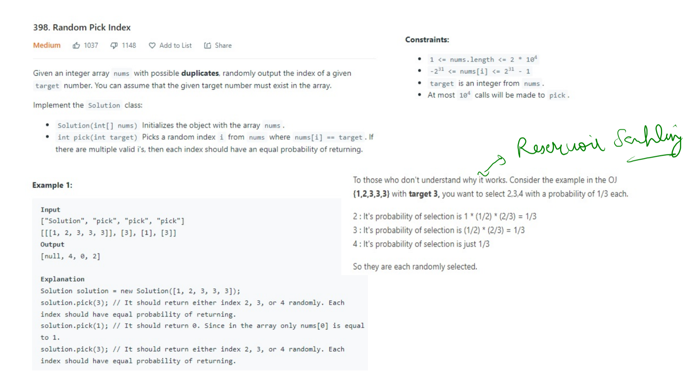 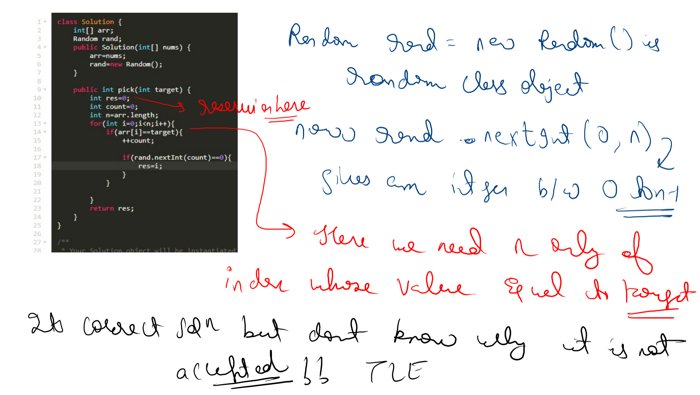 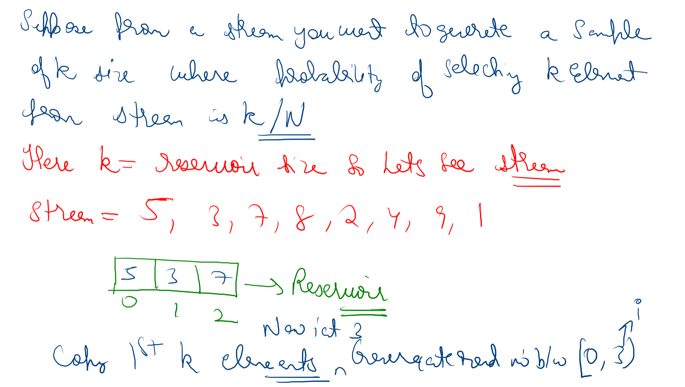 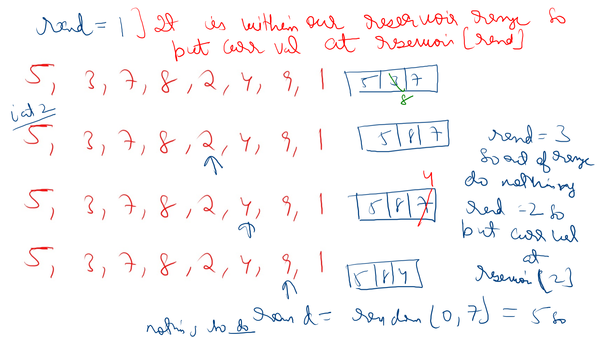 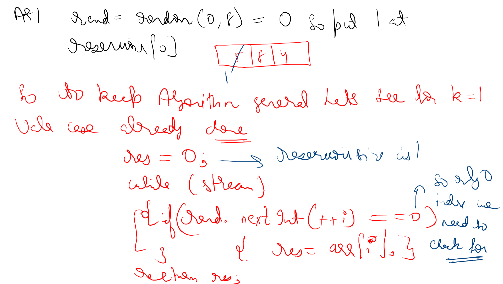 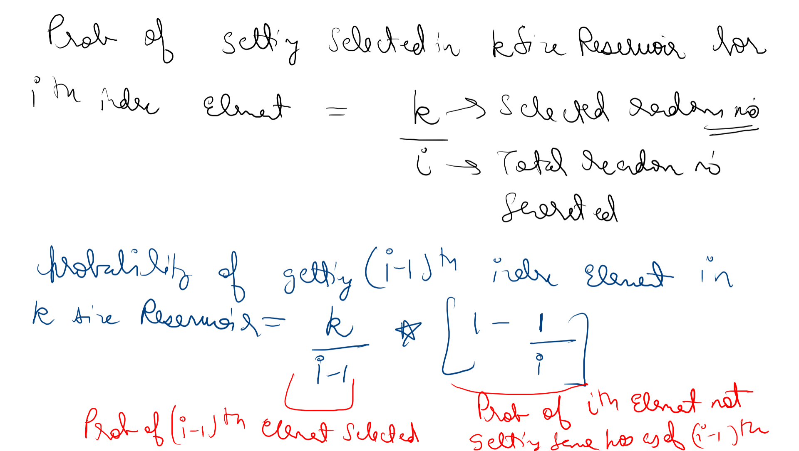 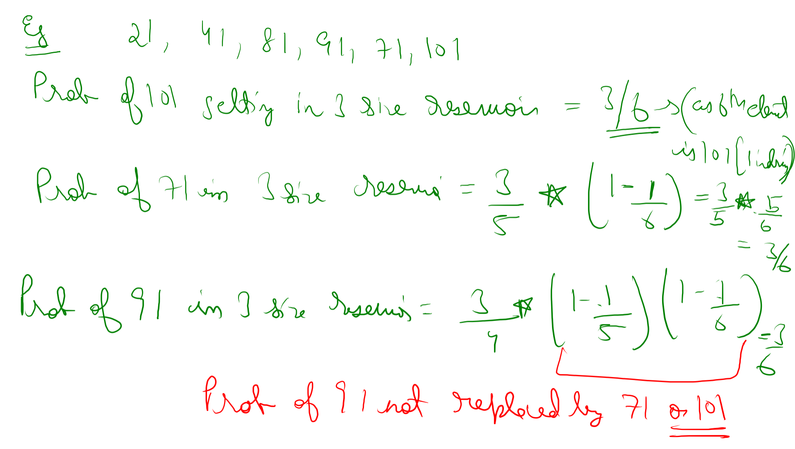
## Q5. Reservoir Sampling — picking a uniformly random element when `n` is unknown

**Warm-up problem:** Given an array of `n` integers, return a random number from the array. Each number in the array must have the same probability of getting chosen, i.e. `(1 / n)`.

**This is very easy to solve:**
1. Generate a random index between `0` and `n-1`.
2. Return the number present at that index in the array.

The probability of any number being chosen is `1/n` here, trivially.

```cpp
int index = rand() % n;
return arr[index];
```

**Now let's modify the question a bit: let's say `n` is unknown.** This comes up in several real situations:
1. A **stream** of numbers (you don't know in advance how many will arrive).
2. Find a random node in a **linked list** in a single traversal, where you're only given the head pointer (you don't know the list's length up front without a separate pass).
3. You have a very big **file** (maybe 100GB) and need to find a random number in it (reading the whole thing just to count entries first would be wasteful).

**Reservoir Sampling to the rescue.** The algorithm:
```
randomNum = -1;
i = 0;
while (receiving num from stream) {
    ++i;
    randomIndex = rand() % i;    // a random number between 0 and i-1
    if (randomIndex == i - 1) {
        randomNum = num;
    }
}
return randomNum;
```

The intuition: this algorithm guarantees that any given number seen so far will be the one held onto with probability `1/n` always, once the full stream (of length `n`, even though `n` isn't known ahead of time) has been processed.

### Why this works (a rigorous proof)

At the moment the `i`-th number arrives, we randomly choose 1 slot from `i` available "slots" (think of it as: at step `i`, there's a `1/i` chance the *current* number gets selected, and correspondingly an `(i-1)/i` chance each of the previously-held candidates keeps surviving this round — collectively, i.e. `(i-1)/i` chance the current holder is *not* overwritten).

So for element `a_i` (the `i`-th element to arrive) to be the FINAL answer after `n` total elements, two things must both happen:
1. `a_i` itself gets selected at step `i` — probability `1/i`.
2. `a_i` then survives (doesn't get replaced) at every subsequent step `i+1, i+2, ..., n` — probability `(1 - 1/(i+1)) * (1 - 1/(i+2)) * ... * (1 - 1/n)`.

```
P(a_i) = (1/i) * (1 - 1/(i+1)) * (1 - 1/(i+2)) * ... * (1 - 1/n)
       = (1/i) * (i/(i+1)) * ((i+1)/(i+2)) * ((i+2)/(i+3)) * ... * ((n-1)/n)
```

Every numerator cancels with the previous term's denominator (a telescoping product), leaving:

```
P(a_i) = 1/n
```

...for **every** `i`, regardless of position — confirming the algorithm gives a truly uniform `1/n` chance to each element, even though `n` was never known in advance.

**A neat side-effect of the algorithm:** it actually favors retaining *older* values in a specific, fair sense: when element 1 arrives, it's picked with probability `1` (trivially, it's the only one so far); when element 2 arrives, it has a `1/2` chance of being picked and element 1 still has a `1/2` chance of surviving; when element 3 arrives, it has a `1/3` chance, and elements 1 & 2 collectively still have `2/3` chance of one of them surviving. This is exactly consistent with — not a contradiction of — the uniform `1/n` end result.

**An important Java-specific detail:** `Math.random()` returns a `double` in `[0, 1)`, not an integer, so to pick a random integer within a specific range `[min, max]`, the pattern is:
```java
int range = max - min + 1;
int rand = (int)(Math.random() * range) + min;
```
This is the idiomatic Java way — **use multiplication with `Math.random()`, not a modulo (`%`) trick** the way C++'s `rand() % n` works, since `Math.random()` is not an integer generator to begin with.

### Applying it: Linked List Random Node (LeetCode 382)

**Problem:** Given a singly linked list, return a random node's value from the linked list. Each node must have the same probability of being chosen.

Implement the `Solution` class:
- `Solution(ListNode head)` Initializes the object with the head of the singly-linked list `head`.
- `int getRandom()` Chooses a node randomly from the list and returns its value. All the nodes of the list should be equally likely to be chosen.

**Example 1:**
```
Input
["Solution", "getRandom", "getRandom", "getRandom", "getRandom", "getRandom"]
[[[1, 2, 3]], [], [], [], [], []]
Output
[null, 1, 3, 2, 2, 3]

Explanation
Solution solution = new Solution([1, 2, 3]);
solution.getRandom(); // return 1
solution.getRandom(); // return 3
solution.getRandom(); // return 2
solution.getRandom(); // return 2
solution.getRandom(); // return 3
// getRandom() should return either 1, 2, or 3 randomly. Each element should have
equal probability of returning.
```

**Constraints:**
- The number of nodes in the linked list will be in the range `[1, 10^4]`.
- `-10^4 <= Node.val <= 10^4`
- At most `10^4` calls will be made to `getRandom`.

**Follow up:**
- What if the linked list is extremely large and its length is unknown to you?
- Could you solve this efficiently without using extra space?

**Approach 1 — two passes:** first traverse once just to find the list's size, then generate a random index in that range and traverse again to that index. This is a perfectly valid solution, but it doesn't address the follow-up's "unknown length" and "single traversal" constraints as elegantly.

**Approach 2 — Reservoir Sampling, answering both follow-up questions at once:** walk the list exactly once; at the `i`-th node visited (1-indexed via a running counter), generate a random index in `[0, i-1]`; if that random index equals `i-1` (i.e. it "selects" the current node), update the running answer to this node's value. Since only `O(1)` extra variables are used and the list is only walked once, this handles an unknown-length list in a single pass with `O(1)` extra space.

**Java:**
```java
class Solution {
    ListNode head = null;
    public Solution(ListNode head) {
        this.head = head;
    }

    public int getRandom() {
        int res = 0;
        int i = 0;
        ListNode h1 = this.head;
        while (h1 != null) {
            ++i;
            int rInd = (int) (Math.random() * i);
            if (rInd == i - 1) {
                res = h1.val;
            }
            h1 = h1.next;
        }
        return res;
    }
}
```

**C++:**
```cpp
class Solution {
    ListNode* head;
public:
    Solution(ListNode* head) {
        this->head = head;
    }

    int getRandom() {
        int res = 0;
        int i = 0;
        ListNode* h1 = head;
        while (h1 != nullptr) {
            ++i;
            int rInd = rand() % i;
            if (rInd == i - 1) {
                res = h1->val;
            }
            h1 = h1->next;
        }
        return res;
    }
};
```

Here `(int)(Math.random() * i)` gives a uniformly random integer in `[0, i-1]` (i.e. `i` possible values, `min = 0` so no offset is needed) — the direct application of the Reservoir Sampling algorithm above, one node at a time.

**Time Complexity: `O(n)` per `getRandom()` call** — one full traversal of the list. **Space Complexity: `O(1)`** — only a handful of variables, regardless of list length, exactly matching both follow-up requirements.


## Q6. Random Pick Index (LeetCode 398)

**Problem:** Given an integer array `nums` with possible **duplicates**, randomly output the index of a given `target` number. You can assume that the given target number must exist in the array.

Implement the `Solution` class:
- `Solution(int[] nums)` Initializes the object with the array `nums`.
- `int pick(int target)` Picks a random index `i` from `nums` where `nums[i] == target`. If there are multiple valid `i`'s, then each index should have an equal probability of returning.

**Example 1:**
```
Input
["Solution", "pick", "pick", "pick"]
[[[1, 2, 3, 3, 3]], [3], [1], [3]]
Output
[null, 4, 0, 2]

Explanation
Solution solution = new Solution([1, 2, 3, 3, 3]);
solution.pick(3); // It should return either index 2, 3, or 4 randomly. Each
index should have equal probability of returning.
solution.pick(1); // It should return 0. Since in the array only nums[0] is equal
to 1.
solution.pick(3); // It should return either index 2, 3, or 4 randomly. Each
index should have equal probability of returning.
```

**Constraints:**
- `1 <= nums.length <= 2 * 10^4`
- `-2^31 <= nums[i] <= 2^31 - 1`
- `target` is an integer from `nums`.
- At most `10^4` calls will be made to `pick`.

**Approach — Reservoir Sampling, applied only to the matching indices:** this is Q7's algorithm again, but instead of running it over *every* element of the stream, it's only "triggered" for elements that equal `target` — treat the sequence of matching indices as the stream to sample from.

**Why it works — a concrete illustration:** consider `nums = {1,2,3,3,3}` with `target = 3`. We want to select indices `2, 3, 4` each with probability `1/3`.
- Index `2` (the first match): probability of selection = `1 * (1/2) * (2/3) = 1/3` — selected on its own turn (prob `1`, since it's the first match), then survives being replaced by the 2nd match (prob `1/2`) and the 3rd match (prob `2/3`).
- Index `3` (the second match): probability of selection = `(1/2) * (2/3) = 1/3` — selected on its own turn (prob `1/2`), then survives being replaced by the 3rd match (prob `2/3`).
- Index `4` (the third/last match): probability of selection is just `1/3` — selected on its own turn.

So indeed, each is randomly selected with equal probability `1/3`.

**Java:**
```java
class Solution {
    int[] arr;
    Random rand;
    public Solution(int[] nums) {
        arr = nums;
        rand = new Random();
    }

    public int pick(int target) {
        int res = 0;
        int count = 0;
        int n = arr.length;
        for (int i = 0; i < n; i++) {
            if (arr[i] == target) {
                ++count;
                if (rand.nextInt(count) == 0) {
                    res = i;
                }
            }
        }
        return res;
    }
}
```

Here `rand.nextInt(count)` gives an integer uniformly in `[0, count-1]`, and we only need to check whether that value is index `0` of the current match count — exactly the same "is this the newly-arrived element being selected" check as Q7, just restricted to only the indices whose value equals `target`.

**C++:**
```cpp
class Solution {
    vector<int> arr;
public:
    Solution(vector<int>& nums) {
        arr = nums;
        srand(time(0));
    }

    int pick(int target) {
        int res = 0;
        int count = 0;
        int n = arr.size();
        for (int i = 0; i < n; i++) {
            if (arr[i] == target) {
                ++count;
                if (rand() % count == 0) {
                    res = i;
                }
            }
        }
        return res;
    }
};
```

**Time Complexity: `O(n)` per `pick()` call** — a full scan of the array is needed each time, since we don't precompute the positions of each value up front. (A common further optimization — not shown here — is to precompute a `HashMap<value, List<index>>` once in the constructor, so each `pick()` call only needs to generate one random index into that value's list directly, in `O(1)`, at the cost of `O(n)` extra space.)
**Space Complexity: `O(1)`** extra, beyond storing the input array itself.


## Q7. Reservoir Sampling — generalized to a sample of size `k`

Q7 covered picking exactly **1** uniformly random element from a stream of unknown length. The same idea generalizes directly: suppose you want to generate a sample of size `k` from a stream, where the probability of any particular element from the stream ending up in that sample is `k/n` (`n` = total stream length, still unknown in advance). Here `k` is the "reservoir size."

**Algorithm ("Algorithm R"):**
1. Copy the first `k` elements of the stream directly into the reservoir (they're automatically "in" until displaced).
2. For every element after that, at position `i` (0-indexed, `i >= k`), generate a uniformly random integer `j` in `[0, i]`. If `j < k`, overwrite `reservoir[j]` with the current element; otherwise (`j >= k`), leave the reservoir untouched.

**Dry run** on `stream = 5, 3, 7, 8, 2, 4, 9, 1` with `k = 3`:

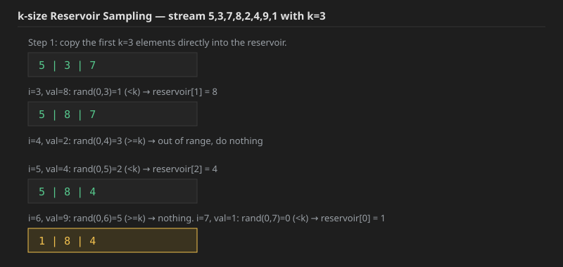

Final reservoir: `[1, 8, 4]` — a sample of 3 elements, each having had an equal `3/8` chance of being the one retained.

**Java:**
```java
public static int[] reservoirSample(int[] stream, int k) {
    int[] reservoir = new int[k];
    int i = 0;
    for (int num : stream) {
        if (i < k) {
            reservoir[i] = num;
        } else {
            int j = (int) (Math.random() * (i + 1)); // random in [0, i]
            if (j < k) {
                reservoir[j] = num;
            }
        }
        i++;
    }
    return reservoir;
}
```

**C++:**
```cpp
vector<int> reservoirSample(vector<int>& stream, int k) {
    vector<int> reservoir(k);
    int i = 0;
    for (int num : stream) {
        if (i < k) {
            reservoir[i] = num;
        } else {
            int j = rand() % (i + 1); // random in [0, i]
            if (j < k) {
                reservoir[j] = num;
            }
        }
        i++;
    }
    return reservoir;
}
```

This generalizes Q7's `k=1` algorithm exactly: with `k=1`, "copy the first `k` elements" becomes `res = arr[0]`, and the loop condition `j < k` becomes `j == 0` — matching `if (rand.nextInt(++i) == 0) res = arr[i];` from Q7 precisely (the only index we ever need to check for is `0`).

### Why this works, for any `k` (generalizing Q7's proof)

For the `i`-th element (1-indexed here, so `i` ranges from `1` to `n`) to end up in the final reservoir of size `k`:
- **If `i <= k`:** it's placed into the reservoir automatically on arrival (probability `1`). It then must survive every later step `m = k+1, ..., n` — at each such step, the probability that step `m`'s draw specifically targets *this* element's current slot is `(k/m) * (1/k) = 1/m` (probability `k/m` that the draw lands inside the reservoir at all, times `1/k` chance it's this exact slot), so the survival probability at step `m` is `1 - 1/m`. Multiplying across all remaining steps telescopes: `(k/(k+1)) * ((k+1)/(k+2)) * ... * ((n-1)/n) = k/n`.
- **If `i > k`:** the probability of being selected on its own turn is `k/i` (the reservoir has `k` slots out of `i` total candidates at that point). It must then survive steps `i+1, ..., n` the same way as above, giving survival probability `i/n`. Total: `(k/i) * (i/n) = k/n`.

Either way, **every element ends up in the final reservoir with probability exactly `k/n`** — confirming the algorithm is correct regardless of position in the stream, or of `n` being unknown ahead of time.

**Worked example** confirming this on `stream = 21, 41, 81, 91, 71, 101` with `k = 3` (`n = 6`):
- `P(101 selected)` (the 6th/last element, `i = 6`) `= 3/6` (no further steps to survive — it's the last one).
- `P(71 selected)` (`i = 5`) `= (3/5) * (1 - 1/6) = (3/5) * (5/6) = 3/6`.
- `P(91 selected)` (`i = 4`) `= (3/4) * (1 - 1/5) * (1 - 1/6) = (3/4) * (4/5) * (5/6) = 3/6`.

Every element comes out to exactly `3/6 = 1/2 = k/n`, confirming the proof.

**Time Complexity: `O(n)`** — one pass through the stream, `O(1)` work per element. **Space Complexity: `O(k)`** — only the reservoir array itself, regardless of how large the underlying stream `n` turns out to be.


