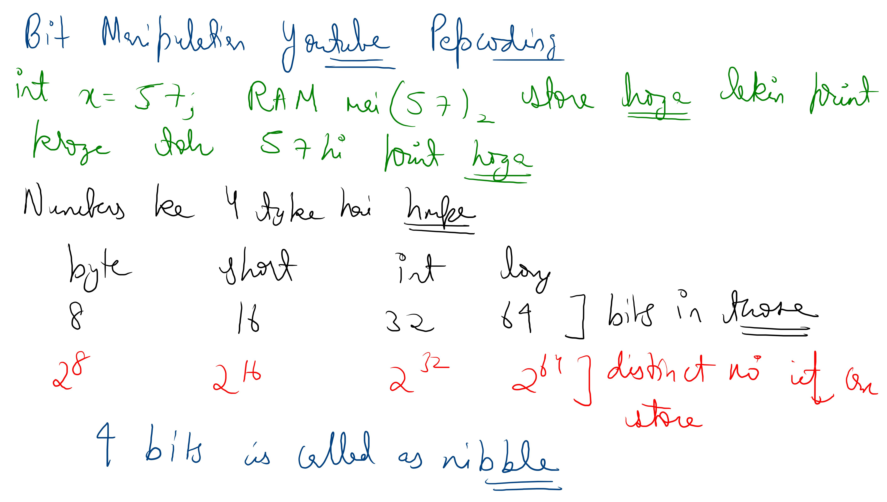

# Notes


 .jpg) .jpg) .jpg) 


.jpg) .jpg) .jpg) .jpg) .jpg) .jpg) .jpg) .jpg) .jpg) .jpg) .jpg) .jpg) .jpg) .jpg) .jpg) .jpg) .jpg) .jpg) .jpg) .jpg) .jpg) .jpg) .jpg)

### cpp

```cpp
#include<bits/stdc++.h>
using namespace std;
//tc->O(n) n is no of bits in number
string decimalToBinary(int n) {
    string result = "";
    
    while(n >0) {
        if(n % 2 == 1) result += '1';
        else result += '0';
        
        n = n / 2;
    }
    
    reverse(result.begin(),result.end());
    cout<<result<<endl;
    return result;
}

// Function to determine if the ith bit is set in N
//tc-->O(1) sc-->O(1)
bool isBitSet(int n, int i) {
    return (n & (1 << i)) != 0;
}

// Function to set the ith bit in N
//tc-->O(1) sc-->O(1)
int setBit(int n, int i) {
    return n | (1 << i);
}

// Function to clear the ith bit in N
//tc-->O(1) sc-->O(1)
int clearBit(int n, int i) {
    return n & ~(1 << i);
}

// Function to toggle the ith bit in N
//tc-->O(1) sc-->O(1)
int toggleBit(int n, int i) {
    return n ^ (1 << i);
}
// Function to remove the last set bit
//tc-->O(1) sc-->O(1)
//n-1 does not have last set bit as of n it sets that to 0 and after set bit all 
//bits are same
//n=12 (1100) n-1=1011=11
//in n-1 ----same as of n---| 0 in place of set bit| -----1's complememt of n-----------
int removeLastSetBit(int n) {
    return n & (n - 1);
}
// Function to determine if the number is a power of 2
//tc-->O(1) sc-->O(1)
bool isPowerOfTwo(int n) {
    return (n > 0) && ((n & (n - 1)) == 0);
}
// Function to determine the number of set bits 
//tc-->O(logN) or can say O(No of bits) Each bit is checked once. sc-->O(1)
int countSetBits(int n) {
    int count = 0;
    while (n > 0) {
        count += (n & 1);
        n >>= 1;
    }
    return count;
}

// Function to determine the number of set bits 
////tc-->O(No of set bits) Each bit is checked once. sc-->O(1)
    int countSetBits(int n) {
        int count = 0;
        while (n) {
            n &= (n - 1);
            count++;
        }
        return count;
    }
//Function to swap without temp variable
    void swap(int &x,int &y){
        x=x^y;
        y=x^y; //as x has x^y so y=x^y statement becomes y=(x^y)^y ,both y cancels out and y=x;
        x=x^y;//now x=x^y and y=x so x^y this statment becomes (x^y)^x ,both x cancels out and x=y so swapped
    }
int main (){
    decimalToBinary(12);//1100
    cout<<isBitSet(12,3)<<"\n";//1
    cout<<setBit(12,0)<<"\n";//output 13 means RightmostBIt is 0 position
    cout<<clearBit(13,0)<<"\n";//12
    cout<<toggleBit(12,0)<<"\n";//13
    cout<<removeLastSetBit(12)<<"\n";//8
    return 0;
}
```

### Java
```java

public class Bits {

    // Convert decimal to binary string
    public static String decimalToBinary(int n) {
        StringBuilder result = new StringBuilder();
        while (n > 0) {
            result.append(n % 2 == 1 ? '1' : '0');
            n = n / 2;
        }
        result.reverse();
        System.out.println(result.toString());
        return result.toString();
    }

    // Check if ith bit is set
    public static boolean isBitSet(int n, int i) {
        return (n & (1 << i)) != 0;
    }

    // Set the ith bit
    public static int setBit(int n, int i) {
        return n | (1 << i);
    }

    // Clear the ith bit
    public static int clearBit(int n, int i) {
        return n & ~(1 << i);
    }

    // Toggle the ith bit
    public static int toggleBit(int n, int i) {
        return n ^ (1 << i);
    }

    // Remove the last set bit
    public static int removeLastSetBit(int n) {
        return n & (n - 1);
    }

    // Check if number is a power of 2
    public static boolean isPowerOfTwo(int n) {
        return (n > 0) && ((n & (n - 1)) == 0);
    }

    // Count set bits using basic approach (O(no. of bits))
    public static int countSetBitsBasic(int n) {
        int count = 0;
        while (n > 0) {
            count += (n & 1);
            n >>= 1;
        }
        return count;
    }

    // Count set bits using Brian Kernighan's algorithm (O(no. of set bits))
    public static int countSetBitsFast(int n) {
        int count = 0;
        while (n != 0) {
            n &= (n - 1);
            count++;
        }
        return count;
    }

    // Swap two integers without a temp variable
    public static void swap(int[] pair) {
        // assuming pair has exactly two elements: [x, y]
        pair[0] = pair[0] ^ pair[1];
        pair[1] = pair[0] ^ pair[1];
        pair[0] = pair[0] ^ pair[1];
    }

    public static void main(String[] args) {
        decimalToBinary(12);                    // 1100
        System.out.println(isBitSet(12, 3));    // true
        System.out.println(setBit(12, 0));      // 13
        System.out.println(clearBit(13, 0));    // 12
        System.out.println(toggleBit(12, 0));   // 13
        System.out.println(removeLastSetBit(12)); // 8

        // Demonstrating swap
        int[] pair = {5, 9};
        System.out.println("Before swap: " + pair[0] + ", " + pair[1]);
        swap(pair);
        System.out.println("After swap: " + pair[0] + ", " + pair[1]);
    }
}
```


