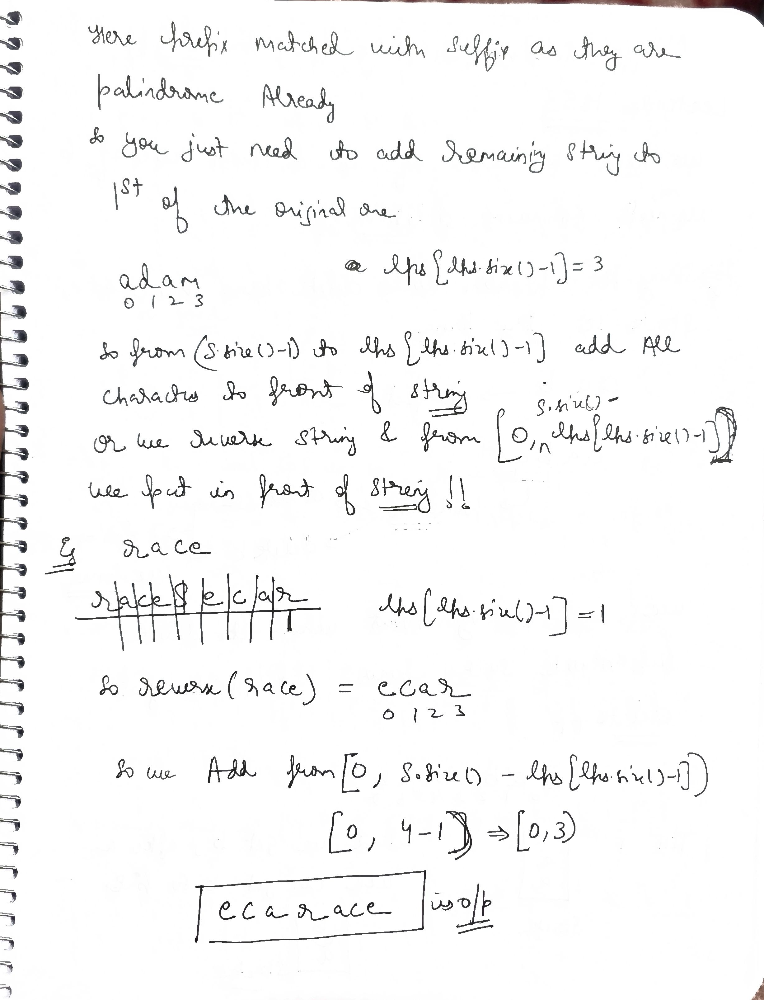

# Q1 Longest Happy Prefix

---

### **Problem Statement**
A string is called a **happy prefix** if is a non-empty prefix which is also a suffix (excluding itself).

Given a string `s`, return the **longest happy prefix** of `s`. Return an empty string `""` if no such prefix exists.

---

### **Example 1**
**Input:** `s = "level"`  
**Output:** `"l"`  
**Explanation:** The prefixes are `"l"`, `"le"`, `"lev"`, `"leve"`.  
The suffixes are `"l"`, `"el"`, `"vel"`, `"evel"`.  
The only happy prefix is `"l"`.

### **Example 2**
**Input:** `s = "ababab"`  
**Output:** `"abab"`  
**Explanation:** The happy prefixes are `"ab"` and `"abab"`. The longest is `"abab"`.

---

### **Constraints**
- $1 \le s.length \le 10^5$
- `s` consists of only lowercase English letters.

---

### **Intuition (KMP - LPS Array)**
The problem asks for the longest proper prefix that is also a suffix. This is exactly what the **LPS (Longest Prefix Suffix)** array in the **KMP algorithm** computes for the last index of a string.

### My wrong code

```cpp
class Solution {
    vector<int> lpsv;
    void calculatelps(string &s) {
        int n = s.size();
        int i = 1;
        int len = 0;
        while (i < n) {
            if (s[i] == s[len]) {
                len++;
                lpsv[i] = len;
                i++;
            } else {
                if (len > 0) {
                    len = lpsv[len - 1];
                } else {
                    lpsv[i++] = 0;
                }
            }
        }
    }

   public:
    string lps(string s) {
		lpsv.resize(s.size(),0);
        calculatelps(s);
		int mx=*max_element(lpsv.begin(),lpsv.end());
		return s.substr(0,mx);
	}
};
``` 

maximum will not work we need longest happy prefix of s which is also suffix!!

so for proper suffix we need last element of lps array 

see lps[i]--> In 0 to i  string ,prefix that is also suffix 

so for whole string we need last element in lps array

**Algorithm:**
1. Initialize an array `lps` of size `n` with zeros.
2. Use two pointers: `i = 1` and `len = 0`.
3. Traverse the string:
   - If `s[i] == s[len]`, increment `len` and set `lps[i] = len`, then move `i++`.
   - If `s[i] != s[len]`:
     - If `len != 0`, update `len = lps[len - 1]` (try the next best prefix).
     - If `len == 0`, set `lps[i] = 0` and move `i++`.
4. The value at `lps[n-1]` gives the length of the longest happy prefix.
5. Return the substring of `s` from index `0` with length `lps[n-1]`.

---

### Right code 

```cpp
class Solution {
    vector<int> lpsv;
    void calculatelps(string &s) {
        int n = s.size();
        int i = 1;
        int len = 0;
        while (i < n) {
            if (s[i] == s[len]) {
                len++;
                lpsv[i] = len;
                i++;
            } else {
                if (len > 0) {
                    len = lpsv[len - 1];
                } else {
                    lpsv[i++] = 0;
                }
            }
        }
    }

   public:
    string lps(string s) {
		lpsv.resize(s.size(),0);
		calculatelps(s);
		return s.substr(0,lpsv[lpsv.size()-1]);
	}
};
```

### **Complexity Analysis**
- **Time Complexity:** $O(N)$, where $N$ is the length of the string. Each character is processed at most twice (once by `i` and potentially during the `len` backtrack).
- **Space Complexity:** $O(N)$ to store the `lps` array.


# Q2  Shortest Palindrome


### **Problem Statement**
You are given a string `s`. You can convert `s` to a **palindrome** by adding characters in front of it.

Return the **shortest palindrome** you can find by performing this transformation.

---

### **Example 1**
**Input:** `s = "aacecaaa"`  
**Output:** `"aaacecaaa"`  
**Explanation:** By adding one 'a' in front, the string becomes a palindrome.

### **Example 2**
**Input:** `s = "abcd"`  
**Output:** `"dcbabcd"`  
**Explanation:** By adding "dcb" in front, the string becomes a palindrome.

---

### **Constraints**
- $0 \le s.length \le 5 \cdot 10^4$
- `s` consists of only lowercase English letters.

---


 


### **Intuition (KMP / LPS Approach)**
To find the shortest palindrome by adding characters at the front, we need to find the **longest palindromic prefix** of the string `s`. Once we find the longest palindromic prefix, we can take the remaining suffix, reverse it, and add it to the front of `s`.

**Algorithm:**
1. Create a temporary string `temp = s + "#" + reverse(s)`.
   - The `#` acts as a separator to ensure the LPS doesn't exceed the length of `s`.
2. Compute the **LPS (Longest Prefix Suffix)** array for this combined string `temp`.
3. The last value in the LPS array, `lps[temp.length() - 1]`, will give us the length of the longest prefix of `s` that is also a suffix of `reverse(s)`. This is equivalent to the **longest palindromic prefix** of `s`.
4. Identify the part of `s` that is **not** part of this palindromic prefix (from index `lps.back()` to the end).
5. Reverse this remaining part and prepend it to the original string `s`.

```cpp
class Solution {
    vector<int> lps;
    void calculatelps(string &s) {
        int n = s.size();
        int i = 1;
        int len = 0;
        while (i < n) {
            if (s[i] == s[len]) {
                len++;
                lps[i] = len;
                i++;
            } else {
                if (len > 0) {
                    len = lps[len - 1];
                } else {
                    lps[i++] = 0;
                }
            }
        }
    }

   public:
    string shortestPalindrome(string s) {
        string rev = s;
        reverse(rev.begin(), rev.end());
        string temp = s + "#" + rev;
		lps.resize(temp.size(),0);
        calculatelps(temp);
        int longest_pal_len = lps.back();
        string to_add = rev.substr(0, s.size() - longest_pal_len);

        return to_add + s;
    }
};
```
---

### **Complexity Analysis**
- **Time Complexity:** $O(N)$, where $N$ is the length of the string `s`. Constructing the temporary string takes $O(N)$ and computing the LPS array takes $O(N)$.
- **Space Complexity:** $O(N)$, as we store the modified string and the LPS array, both of which are proportional to the length of `s`.


