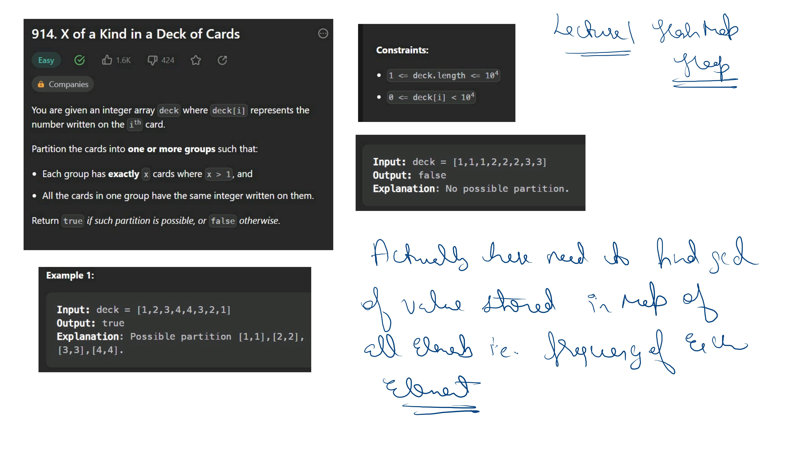

# Notes


 .jpg) .jpg) .jpg) .jpg) .jpg) .jpg) .jpg) .jpg) .jpg) .jpg) .jpg) .jpg) .jpg) .jpg) .jpg) .jpg) .jpg) .jpg) .jpg) .jpg) .jpg) .jpg) .jpg) .jpg)


.jpg) .jpg) .jpg) .jpg) .jpg) .jpg) .jpg) .jpg) .jpg) .jpg) .jpg) .jpg)


### Second Highest Occurring Element

Given an array of $n$ integers, find the second highest occurring element in the array. 

If there are multiple elements with the same second-highest frequency, return the **smallest** among them. 

If there is no second highest occurring element (e.g., all elements have the same frequency or there is only one distinct element), return **-1**.

---

#### Input Format
- An integer `n` representing the size of the array.
- An array `nums` of `n` integers.

#### Output Format
- Return the second highest occurring element. If it doesn't exist, return -1.

---

#### Constraints
- $1 \le n \le 10^5$
- $-10^9 \le nums[i] \le 10^9$

---

#### Examples

**Example 1:**
- **Input:** `nums = [1, 2, 2, 3, 3, 3]`
- **Output:** `2`
- **Explanation:** - Frequency of 1 is 1.
    - Frequency of 2 is 2.
    - Frequency of 3 is 3.
    - The highest frequency is 3 (element 3). The second highest frequency is 2 (element 2).

**Example 2:**
- **Input:** `nums = [4, 4, 5, 5, 6, 7]`
- **Output:** `4`
- **Explanation:** - Frequency of 4 is 2.
    - Frequency of 5 is 2.
    - Frequency of 6 is 1.
    - Frequency of 7 is 1.
    - The highest frequency is 2 (elements 4 and 5). The second highest frequency is 1 (elements 6 and 7). Since we need the second highest frequency's smallest element, we compare 4 and 5? No, the second highest frequency is 1. Wait, if frequencies are [2, 2, 1, 1], the highest is 2. The second highest is 1. Smallest of elements with frequency 1 is 6. 

**Example 3:**
- **Input:** `nums = [10, 10, 10]`
- **Output:** `-1`
- **Explanation:** There is only one distinct element, so no second highest frequency exists.


first i submitted wrong code

```cpp
class Solution {
public:
    int secondMostFrequentElement(vector<int>& nums) {
            unordered_map<int,int>mp;
        for(int val:nums){
            mp[val]++;
        }
        int firstmax=nums[0],secondMax=-1;

        for(auto p:mp){
            if(p.second>=mp[firstmax]) {
                if(p.second>mp[firstmax]) secondMax=firstmax;
                firstmax=p.first;
            }else if ( p.second >=mp[secondMax]){
                secondMax=p.second>mp[secondMax]?p.first:min(p.first,secondMax);
            }
        }
        return secondMax;
    }
};
```
also if we have [5,5,5,3,3,3,1,1,1,4,4,4,4] first max will be 5 and when it discovers 4 as firstmax secondmax will be 5 but it should be 1 as we want min element
 Right code

 ```cpp
 class Solution {
public:
    int secondMostFrequentElement(vector<int>& nums) {
            unordered_map<int,int>mp;
        for(int val:nums){
            mp[val]++;
        }
        int firstmax=nums[0],secondMax=-1;

        for(auto p:mp){
            if(p.second>=mp[firstmax]) {
                if(p.second>mp[firstmax]) secondMax=firstmax;
                firstmax=p.second>mp[firstmax]?p.first:min(p.first,firstmax);
            }else if ( p.second >=mp[secondMax]){
                secondMax=p.second>mp[secondMax]?p.first:min(p.first,secondMax);
            }
        }
        return secondMax;
    }
};
```
