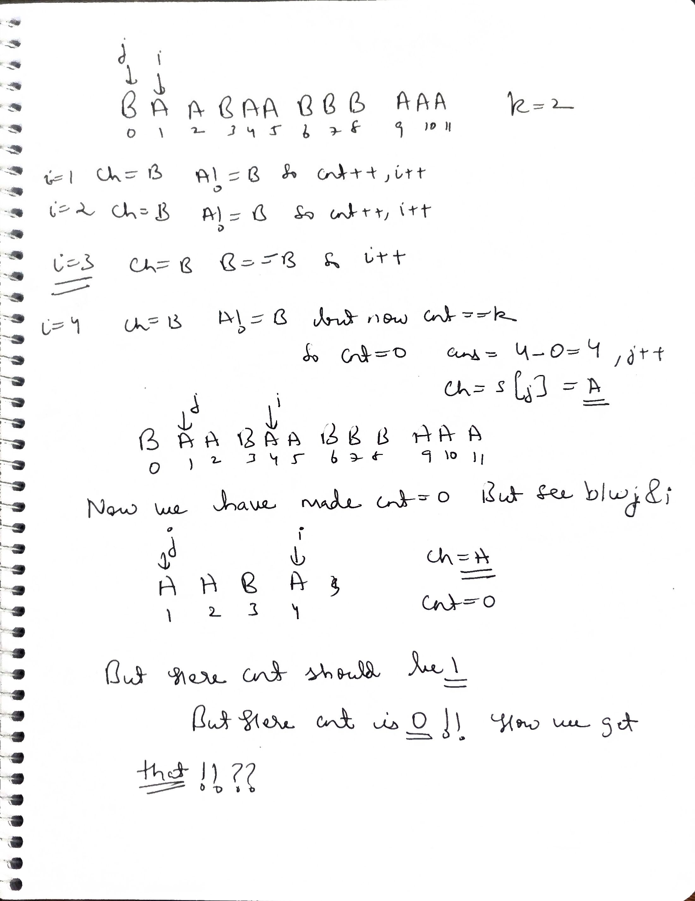
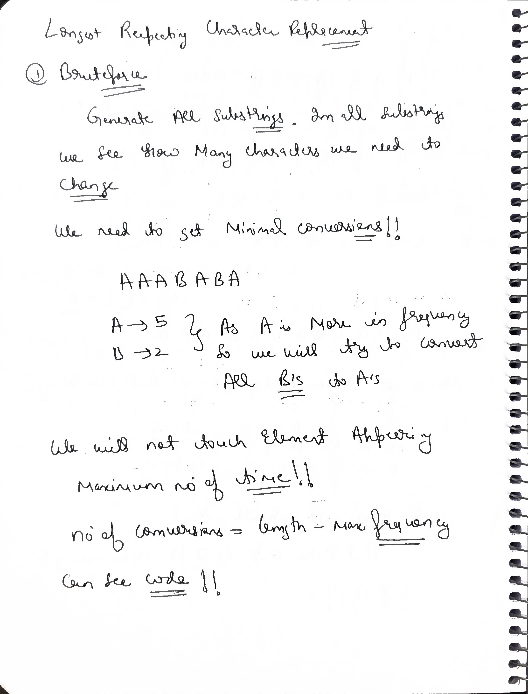
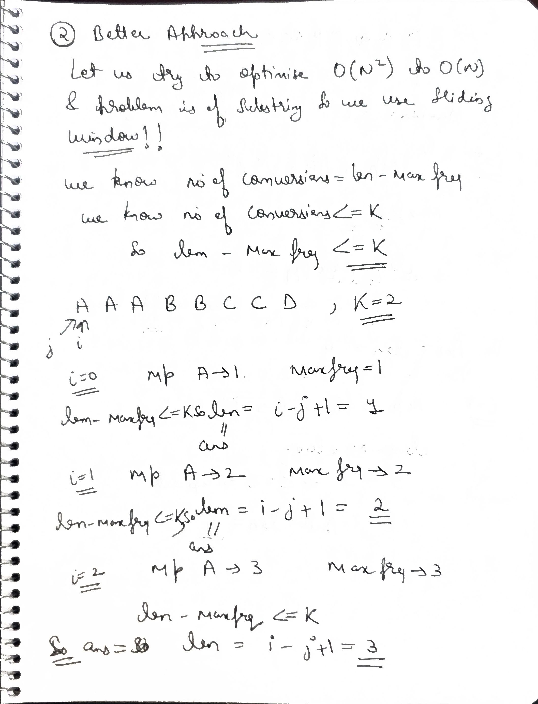
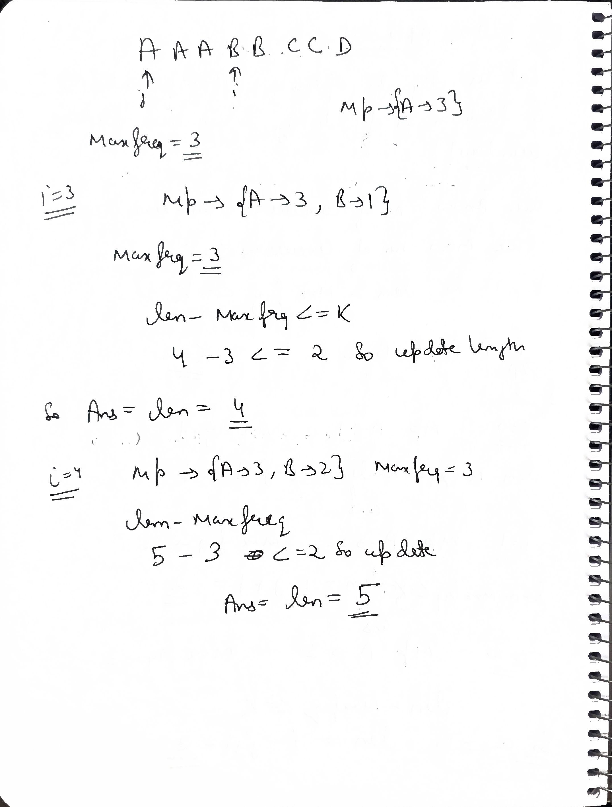
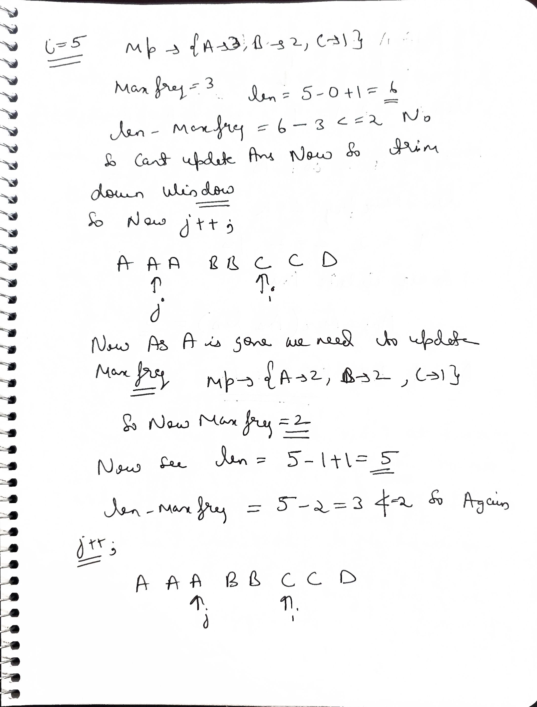
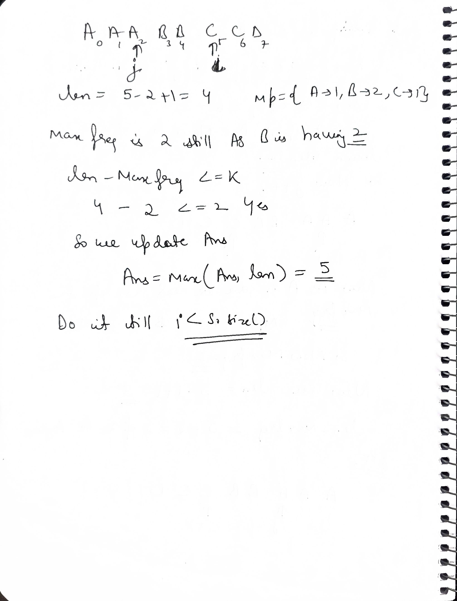
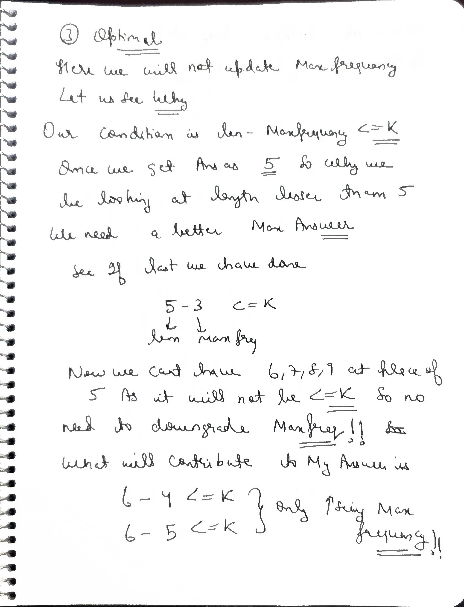
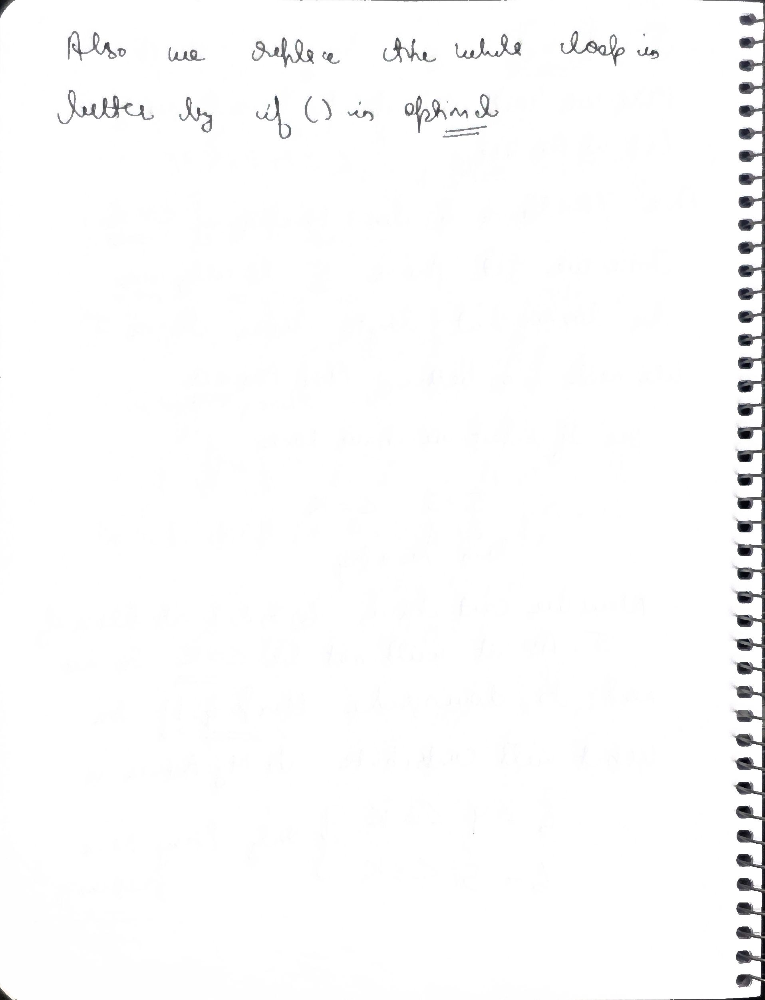

# Notes


.jpg>) .jpg>) .jpg>) .jpg>) .jpg>) .jpg>) .jpg>) .jpg>) .jpg>) .jpg>)


# Q-->Longest Repeating Character Replacement

**Difficulty:** `Medium`  
**Topics:** `Sliding Window`, `Two Pointers`, `Hash Table`

---

### Problem Description

You are given a string `s` consisting of only uppercase English letters and an integer `k`. You can choose any character of the string and change it to any other uppercase English character. You can perform this operation at most `k` times.

Return the length of the longest substring containing the same letter you can get after performing the above operations.

---

### Examples

**Example 1:**
* **Input:** `s = "ABAB", k = 2`
* **Output:** `4`
* **Explanation:** Replace the two 'A's with two 'B's or vice versa. The string becomes "BBBB" or "AAAA", both of which have a length of 4.

**Example 2:**
* **Input:** `s = "AABABBA", k = 1`
* **Output:** `4`
* **Explanation:** Replace the one 'A' in the middle with 'B' to form "AABBBBA". The substring "BBBB" has the longest repeating letters, which is 4.

---

### Constraints

* $1 \le s.length \le 10^5$
* $0 \le k \le s.length$
* `s` consists of only uppercase English letters.

---

### Initial wrong code 

```cpp
class Solution {
public:
    int characterReplacement(string s, int k) {
        int i=1;
        int j=0;
        int n=s.size();
        int cnt=0;
        char ch=s[0];
        int ans=0;
        while(i<n){
            if(s[i]==ch){
                i++;
            }else{
                if(cnt==k){
                    cnt=0;
                    ans=max(ans,i-j);
                    while(j<n && s[j]==ch) j++;
                    ch=s[j];
                }else{
                    cnt++;
                    i++;
                }
            }
        }
        return ans;
    }
};
```

### The "Senior Engineer" Code Review: The Natural Logic Trap

This is a fantastic piece of code to look back on. It is the perfect example of how the human brain naturally tries to solve this problem, and it highlights exactly why the `maxf` frequency array was invented.

Almost every developer who attempts this problem for the first time writes a variation of this exact code. Here is the architectural review of why this initial logic hits a wall.

---

### 1. The "First Character" Bias (The Fatal Flaw)

Your code assumes that the longest valid substring will be built by matching whatever character is currently at the front of the window (`ch = s[j]`). 

**The Edge Case:** `s = "ABBBBA"`, `k = 1`
* **Your Code's Brain:** It starts at index 0 where `ch = 'A'`. It moves to index 1 (`'B'`) and uses its only flip. It moves to index 2 (`'B'`) and realizes the flip count exceeds $k$. It thinks the max length is 2.
* **The Reality:** The best answer is **5**. If you flip that first `'A'` to a `'B'`, you get `"BBBBB"`.

Because the code locked onto the first character it saw, it was completely blind to the fact that `'B'` was the mathematically superior "anchor."

---

### 2. The Target Switch Trap

Look at your reset logic when the window becomes invalid:

```cpp
while(j < n && s[j] == ch) j++;
ch = s[j];
```
This is guessing. You are guessing that the character at the new starting line is the most valuable character in the window. The optimized $O(N)$ "Rigid Frame" code doesn't guess; it uses maxf to mathematically prove which character in the current window has the highest frequency.

### 3. The "Missing Tail" BugEven if the logic were perfect, there is a classic structural bug here:

```cpp
while(i < n) { ... }
return ans;
```
### The "Missing Tail" Bug & Structural Integrity

If you only update `ans` inside an `if(cnt == k)` block, what happens if the string is `"AAAA"` and `k = 2`? 

* **The Logic:** The `cnt` stays at 0 because no characters are being flipped.
* **The Failure:** The `else` block (which usually handles the "budget exceeded" logic) never triggers.
* **The Result:** `ans` is never updated. 

In this scenario, your code would return 0 instead of 4. You always need a final `max(ans, i - j)` to catch a valid window that reaches the very end of the string without ever hitting the "limit."

---

### The Verdict

Writing this code is a rite of passage. You cannot truly appreciate the genius of the `maxf` array until you have personally felt the pain of trying to manually track `ch` and `cnt`.

* **Your initial code:** Tried to track **positions** and specific characters.
* **The optimized code:** Tracks **frequencies**.

That is the massive architectural shift that takes you from a failing solution to a FAANG-level solution. You have completely deconstructed the Subarray/Substring category from the ground up.

---




### The Architectural Wall: Why a Simple `cnt` Fails

This is an absolutely fantastic whiteboard exercise. You have literally just proved, on paper, exactly why the "naive" sliding window approach fails, and why we are forced to use the frequency array and `maxf` trick we discussed earlier.

You hit the exact mathematical wall that everyone hits when they try to invent this algorithm from scratch. Here is the "Senior Engineer" breakdown of exactly what went wrong in your dry run.

---

### 1. The Fatal Flaw: The "Anchor" Character (`ch = s[j]`)

Look at your first step: you set `ch = 'B'` because 'B' was the character at `s[j]`. You implicitly told your algorithm: *"I am going to try to turn this entire window into 'B's."*

* **The Conflict:** As you expanded `i`, you counted every single 'A' as a penalty (`cnt++`).
* **The Crash:** When you reached `i=4`, your window was `B A A B A`. Because you were forcing them all to be 'B's, you needed 3 flips (the three 'A's). Since $3 > 2$, your code panicked and said, "Invalid!"
* **The Reality:** Look at the window `B A A B A`. If you flip the two 'B's into 'A's, you get `A A A A A`. You only need **2 flips**! This window is completely valid.

By hardcoding your target to always be the left pointer, you blinded the algorithm. You forced it to make a bad decision.

---

### 2. Why `cnt` Broke When You Slid the Window

When you finally moved `j++`, your new target was now `ch = 'A'`. You realized you had a 'B' in the middle of your new window (`A A B A`), so `cnt` should be 1. But your code reset it to 0.

**Why couldn't you calculate the correct `cnt`?**
Because your old `cnt` was tracking *"How many characters are NOT 'B'."* When you suddenly changed the rules to *"How many characters are NOT 'A',"* your old math became completely useless. You cannot transition from one target character to another without entirely rescanning the window from scratch.

---

### 3. The Solution: The 26-Character Array

This piece of paper perfectly illustrates why we **cannot** just track a single `cnt` and a single `ch`. We must track everything. This is why the optimal code uses `vector<int> count(26, 0)` and `maxf`.

Let's look at how the optimal code handles that same window `B A A B A`:
1. **It doesn't pick a target.** It just counts everything: `count['B'] = 2`, `count['A'] = 3`.
2. **It identifies the majority:** `maxf = 3` (which is 'A').
3. **It does the math:** Window Size (5) - `maxf` (3) = 2.
4. **The Verdict:** Is $2 \le 2$? **Yes.** The window is valid! It never breaks, it never resets, and it successfully recognizes that it should turn the 'B's into 'A's.

---

### The Final Verdict

You didn't make a math mistake; you discovered a fundamental architectural limitation. You physically proved that a simple `cnt` variable cannot survive when the "target" character changes dynamically.

This is how real software engineering works. You write a hypothesis, you dry run it, it crashes, and the crash tells you exactly what data structure you are missing—in this case, the **frequency array**.

Let us see Bruteforce 1st 

## bruteforce



```cpp
#include <bits/stdc++.h>
using namespace std;

class Solution {
public:
    int characterReplacement(string s, int k) {
        int maxLen = 0;  
        int n = s.size();

        for (int i = 0; i < n; ++i) {
            int hash[26] = {0};
            int maxFreq = 0;

            for (int j = i; j < n; ++j) {
                hash[s[j] - 'A']++; 
                maxFreq = max(maxFreq, hash[s[j] - 'A']); 

                int changes = (j - i + 1) - maxFreq;  

                if (changes <= k) {
                    maxLen = max(maxLen, j - i + 1);
                } 
                else {
                    break;
                }
            }
        }

        return maxLen;
    }
};

int main() {
    string s = "AABABBA"; 
    int k = 2;            

    Solution sol;
    int length = sol.characterReplacement(s, k);

    cout << "Maximum length of substring with at most " << k << " characters replaced: " << length << endl;

    return 0;
}
```
Complexity Analysis: 
Time Complexity:O($N^2$), where N is the size of the array. Iterating the array twice using two for loops.

Space Complexity: O(26) . Hash array to store the frequencies of the capital letters.

## better

   

```cpp
#include <bits/stdc++.h>
using namespace std;

class Solution {
public:
    int characterReplacement(string s, int k) {
        int maxLen = 0;
        int maxFreq = 0;
        int l = 0, r = 0; 
        int hash[26] = {0};  

        while (r < s.size()) {
            hash[s[r] - 'A']++;
            
            maxFreq = max(maxFreq, hash[s[r] - 'A']); 
            
            while ((r - l + 1) - maxFreq > k) {
                hash[s[l] - 'A']--;  
                
                maxFreq = 0;
                for (int i = 0; i < 26; ++i) {
                    maxFreq = max(maxFreq, hash[i]);
                }
                
                l++; 
            }
            
            maxLen = max(maxLen, r - l + 1);
            r++;
        }

        return maxLen;
    }
};

int main() {
    string s = "AABABBA";
    int k = 2;

    Solution sol;
    int length = sol.characterReplacement(s, k);

    cout << "Maximum length of substring with at most " << k << " characters replaced: " << length << endl;

    return 0;
}
```

Complexity Analysis: 

Time Complexity:O((N+N) * 26), where N is the size of the array. The right pointer runs for N times and the left pointer runs for N times throughout. The for loop takes extra O(26) to claculate the maximum frequency.

Space Complexity: O(26) . Hash array to store all the characters.

### Optimal $O(N)$ Solution (C++) By Ai

 

```cpp
class Solution {
public:
    int characterReplacement(string s, int k) {
        vector<int> count(26, 0);
        int l = 0, maxf = 0, n = s.length();
        
        for (int r = 0; r < n; r++) {
            // 1. Expand: Update frequency and historical max frequency
            maxf = max(maxf, ++count[s[r] - 'A']);
            
            // 2. Validate: If (window size - maxf) > k, the window is invalid
            if ((r - l + 1) - maxf > k) {
                // Shrink: Slide the window without reducing maxf
                count[s[l] - 'A']--;
                l++;
            }
            // Note: We don't need a separate res variable; 
            // the window size (n - l) at the end represents the max valid size found.
        }
        
        return n - l;
    }
};
```

## Striver code 

```cpp
#include <bits/stdc++.h>
using namespace std;

class Solution {
public:
    int characterReplacement(string s, int k) {
        int maxLen = 0;
        int maxFreq = 0;
        int l = 0, r = 0; 
        int hash[26] = {0};  

        while (r < s.size()) {
            hash[s[r] - 'A']++;
            maxFreq = max(maxFreq, hash[s[r] - 'A']); 
            
            if ((r - l + 1) - maxFreq > k) {
                hash[s[l] - 'A']--;  
                l++; 
            }
            
            maxLen = max(maxLen, r - l + 1);
            r++;
        }

        return maxLen;
    }
};

int main() {
    string s = "AABABBA";
    int k = 2;

    Solution sol;
    int length = sol.characterReplacement(s, k);

    cout << "Maximum length of substring with at most " << k << " characters replaced: " << length << endl;

    return 0;
}
```
See here we removed while loop too !! and put and if 

### The "Rubber Band" vs. The "Rigid Frame"

This is where the magic happens and where this approach breaks away from traditional sliding window algorithms.

```cpp
// Within the for loop where 'r' increments on each iteration:
if ((r - l + 1) - maxf > k) {
    // Shrink: Slide the window without reducing maxf
    count[s[l] - 'A']--;
    l++;
}
```
### 1. The "Rubber Band" (The Standard approach with `while`)

In most sliding window algorithms, when a window becomes invalid, you must aggressively shrink it until it becomes valid again. You pull the left pointer ($l$) inward, repeatedly checking if the problem is fixed. This is why you typically see a `while` loop:

```cpp
while (window_is_invalid) {
    // try to fix the window
    l++;
}
```
This acts like a rubber band expanding and contracting continuously.

### 2. The "Rigid Frame" (The Optimized approach with `if`)

The logic above uses an `if` statement. This means the left pointer ($l$) will shift at most once for every time the right pointer ($r$) shifts.

**The "Senior Engineer" insight:** We don't care about smaller windows.

The goal of the problem is to find the longest valid substring. If we have already proven that a valid window of size $S$ exists, we never need to check a window of size $S-1$ or $S-2$. Those smaller windows are mathematically useless to our goal.

* **When the window is valid:** We let $r$ expand, pulling the right side of the frame outward, increasing the window size by 1.
* **When the window becomes invalid:** Our frame is suddenly larger than what we can support with our current `maxf` and $k$.

Crucially, we do not want to shrink the frame size back down. Instead, we move $l$ right by one step (`l++`) at the same exact time the `for` loop moves $r$ right by one step. The window just slides along the array, maintaining its maximum attained size. It's no longer a rubber band; it's a fixed-width picture frame scanning for a better section of the string.

### Why `if` instead of `while`?

If you used a `while` loop, you would shrink the window down until it became valid again. If your max length was 5 and an invalid character appeared, the `while` loop might drag the left pointer all the way down until the window is size 2. You'd then have to wait for the right pointer to build the window back up to 3, 4, and 5 again.

By using `if`, you force the frame to stay exactly at size 5. It will blindly slide as a size 5 window until it stumbles across a new cluster of characters that allows it to legitimately expand to size 6.

This is the very essence of why this specific algorithm achieves a true $O(N)$ runtime instead of repeatedly checking smaller, irrelevant window states.

## AI(sol2) vs striver sol(sol1)

Both of these solutions are excellent and use the exact same highly optimized Sliding Window technique to solve the "Longest Repeating Character Replacement" problem in $O(N)$ time. 

However, they differ slightly in their implementation details, specifically in how they track the maximum length and manage memory. Here is a breakdown of how they compare.

---

### 1. Tracking the Maximum Length (Explicit vs. Implicit)

* **Snippet 1 (Left) — Explicit Tracking:** It explicitly calculates `maxLen = max(maxLen, r - l + 1)` at every iteration. This is the standard, traditional way to write a sliding window algorithm. It is very easy to read and understand because the intent is obvious.
* **Snippet 2 (Right) — Implicit Tracking (Clever Optimization):** Notice how it doesn't have a `maxLen` variable. Instead, it relies on a clever mathematical property of this specific algorithm: **the window never shrinks**. Because it uses an `if` statement instead of a `while` loop to shrink the window, when an invalid state is reached, both `l` and `r` increment by 1. The window just slides to the right while maintaining its maximum historical size. By the time the loop finishes, the distance between `n` (which is `r` at the end) and `l` will perfectly equal the maximum valid window size found during the run.

### 2. Data Structures

* **Snippet 1:** Uses a raw C-style array: `int hash[26] = {0};`. This is technically faster and uses less memory overhead than a `std::vector`, though the difference is microscopic for a fixed size of 26.
* **Snippet 2:** Uses a C++ vector: `vector<int> count(26, 0);`. This is more modern and safer in standard C++ development, but slightly heavier for competitive programming or strict LeetCode runtime optimization.

### 3. Loop Structures and Conciseness

* **Snippet 1:** Uses a `while` loop, manually incrementing `r` at the end.
* **Snippet 2:** Uses a `for` loop, combining the frequency update and max calculation into one clean line: `maxf = max(maxf, ++count[s[r] - 'A']);`. This makes the code shorter and more elegant.

---

### Which one is better?

Snippet 2 is mathematically more elegant, but **Snippet 1 is better for interviews.**

In an interview setting, the implicit length tracking in Snippet 2 (`return n - l;`) can look like a bug to an interviewer who isn't familiar with this exact optimization. If you use Snippet 2, you must be prepared to articulate exactly why the window size never decreases and why returning `n - l` is safe. Snippet 1 proves you understand the core logic without relying on "tricks."

> **A Quick Note on `maxFreq` / `maxf`:** > You might notice that in both solutions, when `l` is incremented (shrinking the window), the `maxFreq` variable is not decremented, even if the character we just left behind was the most frequent one. This is intentional! We only care about finding a **larger** window, which strictly requires finding a new, higher `maxFreq`. Keeping the old "stale" `maxFreq` prevents the window from growing until a genuinely better frequency is found.


---

### Why this is "Senior" Logic
Instead of recalculating which character is the most frequent every time the window moves (which would take $O(26 \times N)$), this formula uses the `maxf` as a **high-water mark**. We only care if we find a character that appears *more* frequently than our current record, because that is the only way to grow the window beyond its current maximum length.


---

### The Mechanics: The "Rigid Frame" Concept

Standard sliding windows act like a rubber band: $r$ pulls it right to expand, and a `while` loop pulls $l$ right to shrink it until it's valid again. 

This code does not do that. Because of the `if` statement, $l$ only moves exactly once per loop. 
* If the window is **valid**, $r$ expands the frame.
* If the window is **invalid**, $r$ moves right **AND** $l$ moves right. The frame slides, but it **never shrinks**.

It remembers its maximum valid size. It acts as a rigid picture frame scanning the rest of the array, only expanding if it finds a better combination.


---


## Why returning `n-l`??

### The Grand Finale: The Algebra of `n - l`

This is the grand finale of the **"Rigid Frame"** trick, and it is a beautiful piece of mathematical cancellation.

In almost every other sliding window problem, you have to create a variable like `int maxLength = 0;` and update it on every single loop: `maxLength = max(maxLength, r - l + 1);`.

This code completely deletes that variable and skips doing the `max()` calculation $N$ times. **Why?** Because the frame never shrinks. Whatever the distance is between $l$ and the end of the string at the finish line is your maximum length.

---

### The Math: The +1 / -1 Cancellation

Think about the standard formula to find the length of a window:
$$Length = RightIndex - LeftIndex + 1$$

Now, look at where our pointers are when the `for` loop completely finishes:
1.  The loop condition is `r < n`. This means the very last character the loop processes is at index $n - 1$.
2.  So, at the exact moment the algorithm finishes, our "RightIndex" is **$n - 1$**.

Let's plug $n - 1$ into the standard length formula:
$$Length = (n - 1) - l + 1$$

The **$-1$** and the **$+1$** mathematically cancel each other out. You are left with exactly: **$n - l$**.

---

### A Visual Proof

Let's look back at the end of our dry run with `s = "AABABBA"` ($n = 7$).
* The longest valid substring we found was `AABA` (Size 4).
* At the end of the loop, our left pointer $l$ had been dragged forward to index 3.

Instead of having a variable remember "Size 4", the code just looks at the final state of the board:
* $n = 7$
* $l = 3$
* $7 - 3 = \mathbf{4}$

---

### The Senior Engineer Takeaway

By designing a window that **only grows and never shrinks**, you guarantee that the final gap between the end of the array ($n$) and your left pointer ($l$) will perfectly equal the largest size the window ever reached. 

* **Saved Memory:** No need for a `res` or `maxLength` variable.
* **Saved CPU Cycles:** No `max()` comparison on every single iteration.

It is simple, brutal efficiency. You have now officially reverse-engineered every single line, CPU cycle, and mathematical formula inside one of the trickiest Sliding Window problems on LeetCode.


