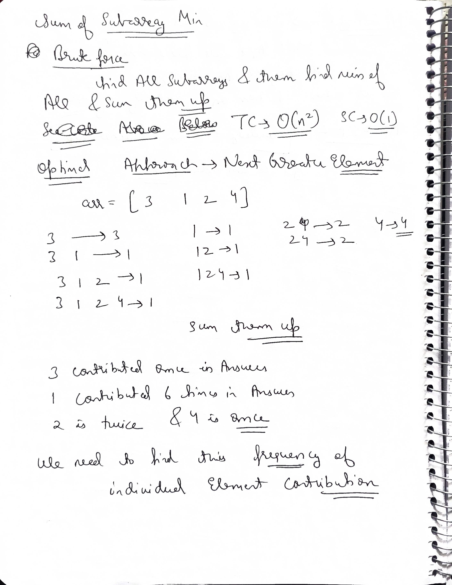
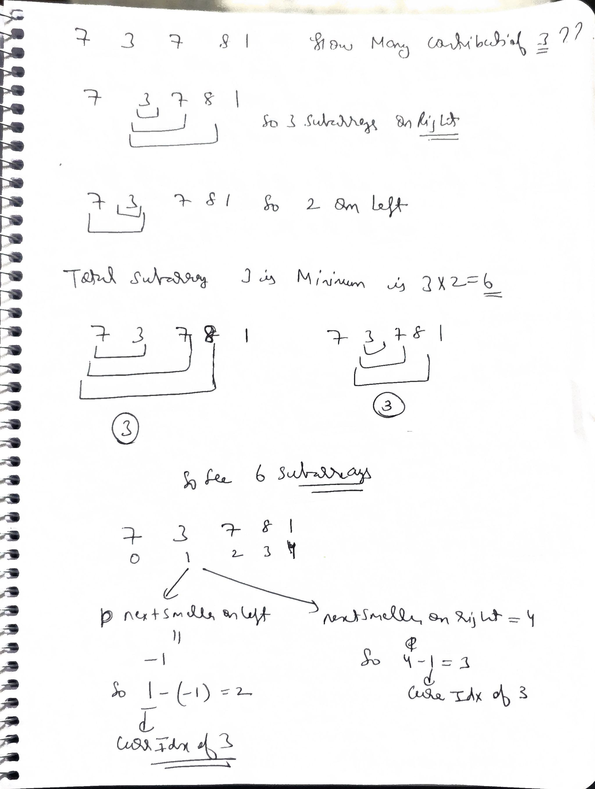
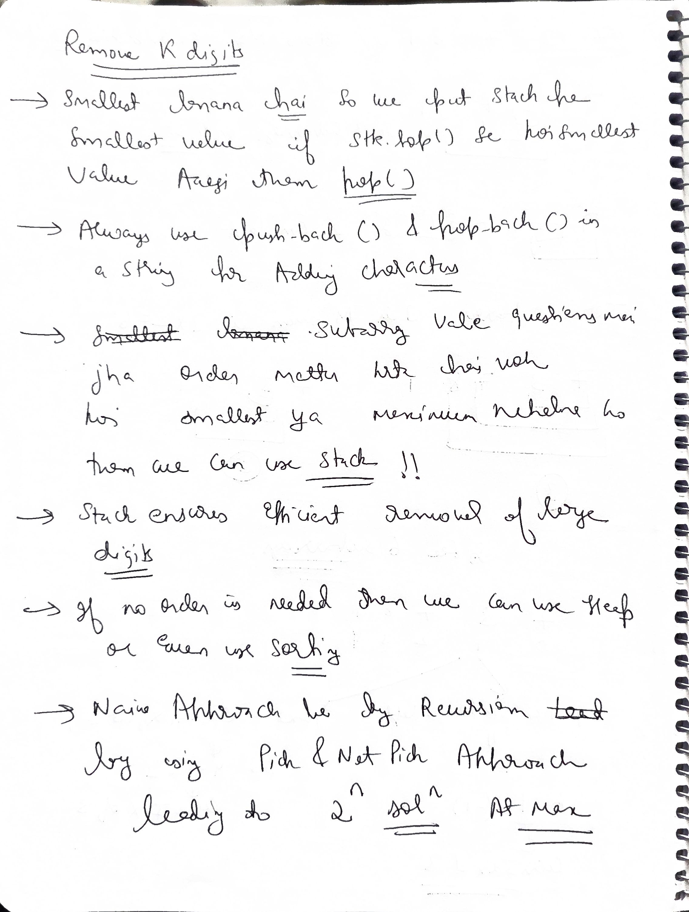

# Notes


.jpg>) 

---

## Next greater smaller

```java
import java.util.Stack;
import java.util.ArrayDeque;

public class question {

    // N : Next, G = greater, S : Smaller, L : Left, R : Right
    public static void NGOR(int[] arr, int[] ans) {
        int n = arr.length;
        Arrays.fill(ans, n); // Java : Arrays.fill(ans,n);

        Stack<Integer> st = new Stack<>();
        for (int i = 0; i < n; i++) {
            while (st.length != 0 && arr[st.peek()] < arr[i]) {
                ans[st.pop()] = i;
            }
            st.push(i);
        }
    }

    public static void NGOL(int[] arr, int[] ans) {
        int n = arr.length;
        Arrays.fill(ans, -1); // Java : Arrays.fill(ans,-1);

        Stack<Integer> st = new Stack<>();
        for (int i = n - 1; i >= 0; i--) {
            while (st.length != 0 && arr[st.peek()] < arr[i]) {
                ans[st.pop()] = i;
            }
            st.push(i);
        }
    }

    public static void NSOR(int[] arr, int[] ans) {
        int n = arr.length;
        Arrays.fill(ans, n); // Java : Arrays.fill(ans,n);

        Stack<Integer> st = new Stack<>();
        for (int i = 0; i < n; i++) {
            while (st.length != 0 && arr[st.peek()] > arr[i]) {
                ans[st.pop()] = i;
            }
            st.push(i);
        }
    }

    public static void NSOL(int[] arr, int[] ans) {
        int n = arr.length;
        Arrays.fill(ans, -1); // Java : Arrays.fill(ans,-1);

        Stack<Integer> st = new Stack<>();
        for (int i = n - 1; i >= 0; i--) {
            while (st.length != 0 && arr[st.peek()] > arr[i]) {
                ans[st.pop()] = i;
            }
            st.push(i);
        }
    }
}   

```

## Cpp

```c++

#include <iostream>
#include <stack>
#include <vector>

using namespace std;

// N : Next, G = greater, S : Smaller, L : Left, R : Right
void NGOR(vector<int> &arr, vector<int> &ans)
{
    int n = arr.size();
    ans.resize(n, n); //Java :  Arrays.fill(ans,n);

    stack<int> st;
    for (int i = 0; i < n; i++)
    {
        while (st.size() != 0 && arr[st.top()] < arr[i])
        {
            ans[st.top()] = i;
            st.pop();
        }
        st.push(i);
    }
}

void NGOL(vector<int> &arr, vector<int> &ans)
{
    int n = arr.size();
    ans.resize(n, -1); //Java :  Arrays.fill(ans,-1);

    stack<int> st;
    for (int i = n - 1; i >= 0; i--)
    {
        while (st.size() != 0 && arr[st.top()] < arr[i])
        {
            ans[st.top()] = i;
            st.pop();
        }
        st.push(i);
    }
}

void NSOR(vector<int> &arr, vector<int> &ans)
{
    int n = arr.size();
    ans.resize(n, n); //Java :  Arrays.fill(ans,n);

    stack<int> st;
    for (int i = 0; i < n; i++)
    {
        while (st.size() != 0 && arr[st.top()] > arr[i])
        {
            ans[st.top()] = i;
            st.pop();
        }
        st.push(i);
    }
}

void NSOL(vector<int> &arr, vector<int> &ans)
{
    int n = arr.size();
    ans.resize(n, -1); //Java :  Arrays.fill(ans,-1);

    stack<int> st;
    for (int i = n - 1; i >= 0; i--)
    {
        while (st.size() != 0 && arr[st.top()] > arr[i])
        {
            ans[st.top()] = i;
            st.pop();
        }
        st.push(i);
    }
}

```

# Understanding Monotonic Stacks

A **Monotonic Stack** is a specialized stack data structure that maintains elements in a specific sorted order (either increasing or decreasing) at all times. When a new element is added that would violate this order, you must "pop" existing elements until the order is restored.

---

### 1. Monotonically Increasing Stack
In an increasing stack, every element is **larger than (or equal to)** the element below it.

* **Rule:** Before pushing element $X$, pop all elements $Y$ such that $Y > X$.
* **Final State (Bottom to Top):** `[1, 3, 5, 8]`
* **Primary Use:** Finding the **Next Smaller Element**. Because the stack "kicks out" larger elements, the element left sitting below $X$ is the first value to its left that is smaller than it.


#### Dry Run Example
Array: `[5, 2, 7, 4]`
1.  **Push 5:** Stack is empty. Stack: `[5]`
2.  **Push 2:** $2 < 5$. Pop `5`. Stack: `[2]`
3.  **Push 7:** $7 > 2$. Push `7`. Stack: `[2, 7]`
4.  **Push 4:** $4 < 7$. Pop `7`. Stack: `[2, 4]`

---

### 2. Monotonically Decreasing Stack
In a decreasing stack, every element is **smaller than (or equal to)** the element below it.

* **Rule:** Before pushing element $X$, pop all elements $Y$ such that $Y < X$.
* **Final State (Bottom to Top):** `[10, 8, 6, 2]`
* **Primary Use:** Finding the **Next Greater Element**. The stack "kicks out" smaller elements, so the element $X$ eventually sits on top of is the first value to its left that is larger than it.


#### Dry Run Example
Array: `[3, 8, 2, 5]`
1.  **Push 3:** Stack is empty. Stack: `[3]`
2.  **Push 8:** $8 > 3$. Pop `3`. Stack: `[8]`
3.  **Push 2:** $2 < 8$. Push `2`. Stack: `[8, 2]`
4.  **Push 5:** $5 > 2$. Pop `2`. Stack: `[8, 5]`

---

### 3. Summary Table

| Stack Type | Order (Bottom to Top) | Pop Condition | Used to find... |
| :--- | :--- | :--- | :--- |
| **Increasing** | `[1, 2, 5, 9]` | `Stack.top() > Current` | Next **Smaller** Element |
| **Decreasing** | `[9, 5, 2, 1]` | `Stack.top() < Current` | Next **Greater** Element |

---

### 4. The "Challenger" Analogy
Think of the current element as a **challenger** trying to find a place in the stack:

* **In an Increasing Stack:** The challenger wants to find smaller values to stand on. It "fights" (pops) anyone taller than itself until it finds someone shorter.
* **In a Decreasing Stack:** The challenger is looking for taller values to hide behind. It "fights" (pops) anyone shorter than itself until it finds someone taller.


### 5. Complexity
* **Time Complexity:** $O(N)$ — Every element is pushed and popped exactly once.
* **Space Complexity:** $O(N)$ — In the worst case (already sorted array), all elements stay in the stack.
---


# Monotonic Stack: Next Greater/Smaller Element Logic

This collection of functions implements the **Monotonic Stack** pattern. This pattern is used to find the first element that satisfies a comparison condition (greater or smaller) to the left or right of every element in an array in linear time.

>The core idea is to maintain a monotonic stack (a stack where elements are always in increasing or decreasing order). When a new element breaks the order, we have found the "answer" for the elements currently in the stack.

---

### 1. Function Overview Matrix

| Function | Name | Search Direction | Comparison | Default Value (Boundary) |
| :--- | :--- | :--- | :--- | :--- |
| **NGOR** | Next Greater on Right | Left to Right | `arr[top] < arr[curr]` | `n` (Right Boundary) |
| **NGOL** | Next Greater on Left | Right to Left | `arr[top] < arr[curr]` | `-1` (Left Boundary) |
| **NSOR** | Next Smaller on Right | Left to Right | `arr[top] > arr[curr]` | `n` (Right Boundary) |
| **NSOL** | Next Smaller on Left | Right to Left | `arr[top] > arr[curr]` | `-1` (Left Boundary) |

---

### 2. Detailed Logic Explanation

#### Next Greater on Right (NGOR)
Finds the first index `j > i` such that `arr[j] > arr[i]`.
* **Mechanism**: As we iterate forward, the current element `arr[i]` "challenges" elements in the stack. If `arr[i]` is greater than the element at the stack's top index, then `i` is the answer for that index. 
* **Stack Property**: The stack remains **monotonically decreasing** (bottom to top).


#### Next Greater on Left (NGOL)
Finds the first index `j < i` such that `arr[j] > arr[i]`.
* **Mechanism**: We iterate **backwards**. The current element `arr[i]` (which is to the left of the items in the stack) acts as the potential "Greater" element for the items we've already passed.
* **Stack Property**: The stack remains monotonically decreasing.

#### Next Smaller on Right (NSOR)
Finds the first index `j > i` such that `arr[j] < arr[i]`.
* **Mechanism**: Similar to NGOR, but the current element `arr[i]` "challenges" the stack to see if it is **smaller**.
* **Stack Property**: The stack remains **monotonically increasing**.


#### Next Smaller on Left (NSOL)
Finds the first index `j < i` such that `arr[j] < arr[i]`.
* **Mechanism**: Iterates backwards to find the first smaller value to the left.
* **Stack Property**: The stack remains monotonically increasing.

---

### 3. Complexity Analysis

* **Time Complexity**: $O(n)$
    * Each element is pushed onto the stack exactly once.
    * Each element is popped from the stack at most once.
    * Even though there is a nested `while` loop, the total number of operations across the entire execution is $2n$.
* **Space Complexity**: $O(n)$
    * In the worst case (a sorted array where no elements are popped), the stack will store all $n$ indices.

---

### 4. Common Applications

Monotonic stacks are essential for solving higher-level problems:
1. **Largest Rectangle in Histogram**: Uses **NSOL** and **NSOR** to find the width boundaries for each bar.
2. **Trapping Rain Water**: Uses **NGOL** and **NGOR** to find the heights of the surrounding walls.
3. **Sliding Window Maximum**: Can be solved using a variation of the monotonic property (though usually implemented with a Deque).
4. **Sum of Subarray Minimums**: Uses **NSOL** and **NSOR** to determine the range in which an element is the minimum.

----

### Monotonic Stack Properties

To remember which stack to use, look at what the "challenger" (the current element) is looking for. If the challenger wants to **pop** elements because it is **bigger**, the stack stays **decreasing**. If it pops elements because it is **smaller**, the stack stays **increasing**.

| Function | Name | Stack Property | Explanation |
| :--- | :--- | :--- | :--- |
| **NGOR** | Next Greater Right | **Monotonically Decreasing** | Elements stay in the stack as long as they are large. A larger element pops them. |
| **NGOL** | Next Greater Left | **Monotonically Decreasing** | We loop backwards, but the logic is the same: larger elements pop smaller ones. |
| **NSOR** | Next Smaller Right | **Monotonically Increasing** | Elements stay in the stack as long as they are small. A smaller element pops them. |
| **NSOL** | Next Smaller Left | **Monotonically Increasing** | We loop backwards; smaller elements pop the larger ones currently in the stack. |

---

### Visualizing the Stack State (Bottom to Top)

#### 1. Next Greater (Right or Left)
The stack will look like: `[10, 8, 6, 3]`
* If the next number is `7`, it pops `3` and `6`, then sits on top of `8`.
* **Result**: The stack always stays in **decreasing** order from bottom to top.


#### 2. Next Smaller (Right or Left)
The stack will look like: `[2, 5, 7, 9]`
* If the next number is `4`, it pops `9`, `7`, and `5`, then sits on top of `2`.
* **Result**: The stack always stays in **increasing** order from bottom to top.


---

### Pro-Tip for Identification
* **Greater** in the name $\rightarrow$ **Decreasing** Stack.
* **Smaller** in the name $\rightarrow$ **Increasing** Stack.

*The stack property is always the **opposite** of the search target.*


.jpg>)
 .jpg>)
  .jpg>)
   .jpg>)
    .jpg>)
     .jpg>)
      
```cpp
      class Solution {
public:
    vector<int> nextGreaterElements(vector<int> &arr) {
        stack<int>stk;
        int n=arr.size();
       vector<int>res(arr.size(),-1);
       for(int i=0;i<2*arr.size();i++){
        while(stk.size()>0 &&arr[i%n]>arr[stk.top()]){
            res[stk.top()]=arr[i%n];
            stk.pop();
        }
        if(i<n) stk.push(i);
       }
       return res;
    }
};
```
# Stock Span Problem


### **Problem Statement**
The **stock span** of a stock's price on a given day is defined as the maximum number of consecutive days (including the current day) just before that day, for which the price of the stock on the current day is **greater than or equal** to its price on the previous days.

Design an algorithm that collects daily price quotes for a stock and returns the **span** of that stock's price for the current day.

---

### **Example 1**
**Input:** `prices = [100, 80, 60, 70, 60, 75, 85]`  
**Output:** `[1, 1, 1, 2, 1, 4, 6]`  
**Explanation:** - Day 1 (100): Span is 1.
- Day 2 (80): 80 < 100, Span is 1.
- Day 3 (60): 60 < 80, Span is 1.
- Day 4 (70): 70 > 60, Span is 2 (70, 60).
- Day 5 (60): 60 < 70, Span is 1.
- Day 6 (75): 75 > 60, 70, 60, Span is 4 (75, 60, 70, 60).
- Day 7 (85): 85 > 80, 60, 70, 60, 75, Span is 6.

---

### **Constraints**
- $1 \le prices.length \le 10^5$
- $1 \le prices[i] \le 10^5$
- Calls to the `next` function will be at most $10^5$.

---

### **Intuition (Monotonic Stack)**
The problem asks us to find how many consecutive days ending at the current day have a price less than or equal to the current day's price. This is equivalent to finding the **Nearest Greater Element to the Left (NGL)**.

If we know the index of the nearest element to the left that is strictly greater than the current price, the span is simply:
`Span = (Current Index) - (Index of NGL)`

## Mycode

```cpp
class Solution {
    vector<int> pgol;
    void prevGreaterOnLeft(vector<int> arr, int n) {
        pgol.resize(n, -1);
        stack<int> stk;

        for (int i = n - 1; i >= 0; i--) {
            while (stk.size() > 0 && arr[stk.top()] < arr[i]) {
                pgol[stk.top()] = i;
                stk.pop();
            }
            stk.push(i);
        }
    }

   public:
    vector<int> stockSpan(vector<int> arr, int n) {
         prevGreaterOnLeft(arr, n);
         for(int i=n-1;i>=0;i--){
            pgol[i]=i-pgol[i];
         }
         return pgol;
     }
};

```

### Why this fails
In C++, `std::vector::resize` **does not** reset or overwrite existing elements if the new size is the same as (or smaller than) the current size. It only fills the "newly added" slots with the default value (`-1`).

---

### The "Dirty Data" Scenario
* **Test Case 1:** You run the algorithm for an array of size 5. `pgol` is filled with specific indices.
* **Test Case 2:** You run it again for another array of size 5. `resize(5, -1)` sees the size is already 5, so it **does nothing**.
* **Result:** The slots that should have been reset to -1 (representing "no greater element found") still contain the indices from **Test Case 1**. Your logic will then use those old, "dirty" indices, leading to wrong answers.

---

### The Fix
To ensure every test case starts with a fresh slate, you have two options:

* **Option A (Recommended):** Declare `pgol` locally within the function. This ensures the memory is fresh and avoids global state issues.
* **Option B (Explicit Reset):** If you must keep it as a member variable, use `assign` instead of `resize`:
    ```cpp
    pgol.assign(n, -1);
    ```

---

## Ai code

```cpp

class Solution {
    // Helper function: Finds index of Previous Greater Element
    // Pass by reference (vector<int>&) to save memory/time
    void prevGreaterOnLeft(vector<int>& arr, int n, vector<int>& pgol) {
        stack<int> stk;

        // Iterating Right-to-Left to find "Next Greater on Left" for items in stack
        for (int i = n - 1; i >= 0; i--) {
            // While current element is strictly greater than stack top
            while (!stk.empty() && arr[i] > arr[stk.top()]) {
                pgol[stk.top()] = i;
                stk.pop();
            }
            stk.push(i);
        }
    }

public:
    vector<int> stockSpan(vector<int> arr, int n) {
        // 1. Initialize pgol locally to ensure it's clean every time
        vector<int> pgol(n, -1); 
        
        // 2. Fill the PGOL indices
        prevGreaterOnLeft(arr, n, pgol);
        
        // 3. Calculate Span: i - index_of_prev_greater
        for (int i = 0; i < n; i++) {
            pgol[i] = i - pgol[i];
        }
        
        return pgol;
    }
};
```
### Pro-Tip: 

Passing by ReferenceIf you are passing your results between functions, always pass the vector by reference (&). If you pass it by value, C++ will create a complete copy of the array, turning an $O(N)$ algorithm into $O(N^2)$ for large test cases.

---

### **Complexity Analysis**
- **Time Complexity:** $O(N)$ total for $N$ calls. Although there is a `while` loop, each element is pushed onto the stack exactly once and popped at most once across all calls to `next`. This is known as **amortized analysis**.
- **Space Complexity:** $O(N)$ in the worst case to store the stack if the prices are in decreasing order.

## Single pass solution

For interviews, it is often preferred to write this in a single pass from left to right without a helper function:
```cpp
vector<int> stockSpan(vector<int>& arr, int n) {
    stack<int> s;
    vector<int> span(n);
    
    for (int i = 0; i < n; i++) {
        // Pop elements that are less than or equal to current
        while (!s.empty() && arr[s.top()] <= arr[i]) {
            s.pop();
        }
        
        // If stack empty, span is i+1 (entire range)
        // Else, span is distance to top of stack
        span[i] = s.empty() ? (i + 1) : (i - s.top());
        
        s.push(i);
    }
    return span;
}
```

.jpg>)
      

      
.jpg>) .jpg>) .jpg>) .jpg>) .jpg>)


---

```cpp
class StockSpanner {
    stack<pair<int,int>> stk;
    int day;
public:
    StockSpanner() {
        day=0;
        stk.push({-1,-1});
    }
    
    int next(int price) {
        while(stk.top().first!=-1 && stk.top().first<=price){
            stk.pop();
        }
        int span=day-stk.top().second;
        stk.push({price,day++});
        return span;
    }
};

/**
 * Your StockSpanner object will be instantiated and called as such:
 * StockSpanner* obj = new StockSpanner();
 * int param_1 = obj->next(price);
 */
 ```
`{-1,-1}` if you do not put and stk is empty and next() is called then span calucation will give memory error as nothing on top() and u are accessing it.


# Q Sum of Subarray Minimums

**Difficulty:** Medium  
**Topics:** Array, Dynamic Programming, Stack, Monotonic Stack  

---

## Problem Description

Given an array of integers `arr`, find the sum of `min(b)`, where `b` ranges over every (contiguous) subarray of `arr`. Since the answer may be large, return the answer **modulo $10^9 + 7$**.

### Example 1:
**Input:** `arr = [3, 1, 2, 4]`  
**Output:** `17`  
**Explanation:** Subarrays are `[3]`, `[1]`, `[2]`, `[4]`, `[3,1]`, `[1,2]`, `[2,4]`, `[3,1,2]`, `[1,2,4]`, `[3,1,2,4]`.  
Minimums are `3, 1, 2, 4, 1, 1, 2, 1, 1, 1`.  
Sum is `17`.

### Example 2:
**Input:** `arr = [11, 81, 94, 43, 3]`  
**Output:** `444`

---

## Constraints:

* $1 \le \text{arr.length} \le 3 \cdot 10^4$
* $1 \le \text{arr[i]} \le 3 \cdot 10^4$

---
### Bruteforce

```cpp
#include <bits/stdc++.h>
using namespace std;

class Solution {
public:

   /* Function to find the sum of the 
   minimum value in each subarray */
   int sumSubarrayMins(vector<int> &arr) {
       
       // Size of array
       int n = arr.size();
       
       int mod = 1e9 + 7; // Mod value
       
       // To store the sum
       int sum = 0;
       
       // Traverse on the array
       for(int i=0; i < n; i++) {
           
           // To store the minimum of subarray
           int mini = arr[i];
           
           /* Nested loop to get all 
           subarrays starting from index i */
           for(int j=i; j < n; j++) {
               
               // Update the minimum value
               mini = min(mini, arr[j]);
               
               // Update the sum
               sum = (sum + mini) % mod;
           }
       }
       
       // Return the computed sum
       return sum;
   }
};

int main() {
   vector<int> arr = {3, 1, 2, 5};
   
   /* Creating an instance of 
   Solution class */
   Solution sol; 
   
   /* Function call to find the sum of the 
   minimum value in each subarray */
   int ans = sol.sumSubarrayMins(arr);
   
   cout << "The sum of minimum value in each subarray is: " << ans;
   
   return 0;
}

```
### Optimal



 


To understand why we multiply `left` and `right`, it helps to think of it as a **grid of possibilities**.

Every subarray is defined by two things: a **Starting Index** and an **Ending Index**. For a specific element $A[i]$ to be the "hero" (the minimum) of a subarray, that subarray **must** include $A[i]$.

---

### The Independent Choices
We have two independent decisions to make to form a valid subarray where $A[i]$ is the minimum:

1.  **Where can the subarray start?**
    It can start at index $i$, or any index to the left of $i$, as long as we don't hit an element smaller than $A[i]$.
    * The number of choices is `left`.
2.  **Where can the subarray end?**
    It can end at index $i$, or any index to the right of $i$, as long as we don't hit an element smaller than $A[i]$.
    * The number of choices is `right`.

### The Fundamental Counting Principle
In combinatorics, if there are $n$ ways to do one thing and $m$ ways to do another, there are $n \times m$ ways to do both.

Imagine $A[i]$ is at index 3, and your boundaries allow:
* **Possible Starts:** {1, 2, 3} (**3 choices**)
* **Possible Ends:** {3, 4, 5, 6} (**4 choices**)

By picking **any** start point from the left set and **any** end point from the right set, you "trap" the element $A[i]$ inside a subarray where it is guaranteed to be the minimum.

| Start Index | End Index | Resulting Subarray |
| :--- | :--- | :--- |
| 1 | 3 | $[A_1, A_2, A_3]$ |
| 1 | 4 | $[A_1, A_2, A_3, A_4]$ |
| 2 | 3 | $[A_2, A_3]$ |
| 3 | 5 | $[A_3, A_4, A_5]$ |
| ... | ... | ... |

There are exactly $3 \times 4 = 12$ such combinations.

---

### Why not Addition?
If you added them ($3 + 4 = 7$), you would only be counting the subarrays that *either* start at a new position *or* end at a new position, but not the combinations of both. Multiplication covers every possible window that spans across index $i$.

### The "Contribution" Logic
Once you have the total count (`freq`), you know exactly how many times $A[i]$ will appear as the minimum in the final sum.

$$\text{Total Sum Contribution} = A[i] \times \text{freq}$$


```cpp
class Solution {
    vector<int>nseol;
    vector<int>nseor;
    int MOD=1e9+7;
    void nseorFun(vector<int> &arr,int n){
        stack<int> s;
        for(int i=0;i<n;i++){
            while(s.size()>0 && arr[s.top()]>arr[i]){
                nseor[s.top()]=i;
                s.pop();
            }
            s.push(i);
        }
    }

    void nseolFun(vector<int> &arr,int n){
        stack<int> s;
        for(int i=n-1;i>=0;i--){
            //equal to for dupicates here
            while(s.size()>0 && arr[s.top()]>=arr[i]){
                nseol[s.top()]=i;
                s.pop();
            }
            s.push(i);
        }
    }
public:
    int sumSubarrayMins(vector<int> &arr) {
        int n=arr.size();
        nseol.resize(n,-1);
        nseor.resize(n,n);
        nseolFun(arr,n);
        nseorFun(arr,n);
        int ans=0;
        for(int i=0;i<n;i++){
            int left=i-nseol[i];
            int right=nseor[i]-i;
            long long freq=left *right;
            long long tres=(arr[i]*freq)%MOD;
            ans=(ans+tres)%MOD;
        }
        return ans;
    }
};

```

OR

```cpp

class Solution {
    vector<int>nseol;
    vector<int>nseor;
    int MOD=1e9+7;
    void nseorFun(vector<int> &arr,int n){
        stack<int> s;
        for(int i=0;i<n;i++){
            //equal to for duplicate here
            while(s.size()>0 && arr[s.top()]>=arr[i]){
                nseor[s.top()]=i;
                s.pop();
            }
            s.push(i);
        }
    }

    void nseolFun(vector<int> &arr,int n){
        stack<int> s;
        for(int i=n-1;i>=0;i--){
            while(s.size()>0 && arr[s.top()]>arr[i]){
                nseol[s.top()]=i;
                s.pop();
            }
            s.push(i);
        }
    }
public:
    int sumSubarrayMins(vector<int> &arr) {
        int n=arr.size();
        nseol.resize(n,-1);
        nseor.resize(n,n);
        nseolFun(arr,n);
        nseorFun(arr,n);
        int ans=0;
        for(int i=0;i<n;i++){
            int left=i-nseol[i];
            int right=nseor[i]-i;
            long long freq=left *right;
            long long tres=(arr[i]*freq)%MOD;
            ans=(ans+tres)%MOD;
        }
        return ans;
    }
};


```

Both works


### Followup 
How would the approach change for the sum of the maximum elements in each subarray?

Instead of a monotonic increasing stack, use a monotonic decreasing stack.

Tc-->O(n)
Sc-->O(n)

# Q Sum of Subarray Ranges

## Problem Statement
You are given an integer array `nums`. The **range** of a subarray of `nums` is the difference between the largest and smallest element in the subarray.

Return the **sum of all subarray ranges** of `nums`.

A subarray is a contiguous **non-empty** sequence of elements within an array.

---

## Examples

### Example 1
**Input:** `nums = [1, 2, 3]`  
**Output:** `4`  
**Explanation:** The 6 subarrays of `nums` are:
- `[1]`, range = 1 - 1 = 0
- `[2]`, range = 2 - 2 = 0
- `[3]`, range = 3 - 3 = 0
- `[1, 2]`, range = 2 - 1 = 1
- `[2, 3]`, range = 3 - 2 = 1
- `[1, 2, 3]`, range = 3 - 1 = 2  
**Total sum** = 0 + 0 + 0 + 1 + 1 + 2 = 4.

### Example 2
**Input:** `nums = [1, 3, 3]`  
**Output:** `4`  
**Explanation:** The 6 subarrays of `nums` are:
- `[1]`, range = 1 - 1 = 0
- `[3]`, range = 3 - 3 = 0
- `[3]`, range = 3 - 3 = 0
- `[1, 3]`, range = 3 - 1 = 2
- `[3, 3]`, range = 3 - 3 = 0
- `[1, 3, 3]`, range = 3 - 1 = 2  
**Total sum** = 0 + 0 + 0 + 2 + 0 + 2 = 4.

### Example 3
**Input:** `nums = [4, -2, -3, 4, 1]`  
**Output:** `59`

---

## Constraints
- `1 <= nums.length <= 1000` (Note: Optimal solutions using Monotonic Stack can handle up to `10^5`)
- `-10^9 <= nums[i] <= 10^9`

---

## Follow-up
Can you find a solution with **O(n)** time complexity?

## Sol 

Here we need to find max nd min both for each subarray and return the sum of range

So it is sum of all max - sum of all mins
```cpp
class Solution {
    vector<int>nseol;
    vector<int>nseor;
    vector<int>ngeol;
    vector<int>ngeor;
    int MOD=1e9+7;
    void nseorFun(vector<int> &arr,int n){
        stack<int> s;
        for(int i=0;i<n;i++){
            while(s.size()>0 && arr[s.top()]>arr[i]){
                nseor[s.top()]=i;
                s.pop();
            }
            s.push(i);
        }
    }
    void ngeorFun(vector<int> &arr,int n){
        stack<int> s;
        for(int i=0;i<n;i++){
            while(s.size()>0 && arr[s.top()]<arr[i]){
                ngeor[s.top()]=i;
                s.pop();
            }
            s.push(i);
        }
    }

    void nseolFun(vector<int> &arr,int n){
        stack<int> s;
        for(int i=n-1;i>=0;i--){
            while(s.size()>0 && arr[s.top()]>=arr[i]){
                nseol[s.top()]=i;
                s.pop();
            }
            s.push(i);
        }
    }
    void ngeolFun(vector<int> &arr,int n){
        stack<int> s;
        for(int i=n-1;i>=0;i--){
            while(s.size()>0 && arr[s.top()]<=arr[i]){
                ngeol[s.top()]=i;
                s.pop();
            }
            s.push(i);
        }
    }
   long long sumSubarrayMins(vector<int> &arr) {
        int n=arr.size();
        nseol.resize(n,-1);
        nseor.resize(n,n);
        nseolFun(arr,n);
        nseorFun(arr,n);
        long long ans=0;
        for(int i=0;i<n;i++){
            int left=i-nseol[i];
            int right=nseor[i]-i;
            long long freq=left *right;
            long long tres=arr[i]*freq;
            ans=ans+tres;
        }
        return ans;
    }
    long long sumSubarrayMaxs(vector<int> &arr) {
        int n=arr.size();
        ngeol.resize(n,-1);
        ngeor.resize(n,n);
        ngeolFun(arr,n);
        ngeorFun(arr,n);
        long long ans=0;
        for(int i=0;i<n;i++){
            int left=i-ngeol[i];
            int right=ngeor[i]-i;
            long long freq=left *right;
            long long tres=arr[i]*freq;
            ans=ans+tres;
        }
        return ans;
    }
public:
    long long subArrayRanges(vector<int> &nums) {
        return sumSubarrayMaxs(nums)-sumSubarrayMins(nums);
    }
};


```
or just use local variables
```cpp

class Solution {
 

    void nseorFun(vector<int> &arr,int n,vector<int> &nseor){
        stack<int> s;
        for(int i=0;i<n;i++){
            while(s.size()>0 && arr[s.top()]>arr[i]){
                nseor[s.top()]=i;
                s.pop();
            }
            s.push(i);
        }
    }
    void ngeorFun(vector<int> &arr,int n,vector<int> &ngeor){
        stack<int> s;
        for(int i=0;i<n;i++){
            while(s.size()>0 && arr[s.top()]<arr[i]){
                ngeor[s.top()]=i;
                s.pop();
            }
            s.push(i);
        }
    }

    void nseolFun(vector<int> &arr,int n,vector<int> &nseol){
        stack<int> s;
        for(int i=n-1;i>=0;i--){
            while(s.size()>0 && arr[s.top()]>=arr[i]){
                nseol[s.top()]=i;
                s.pop();
            }
            s.push(i);
        }
    }
    void ngeolFun(vector<int> &arr,int n,vector<int> &ngeol){
        stack<int> s;
        for(int i=n-1;i>=0;i--){
            while(s.size()>0 && arr[s.top()]<=arr[i]){
                ngeol[s.top()]=i;
                s.pop();
            }
            s.push(i);
        }
    }
   long long sumSubarrayMins(vector<int> &arr) {
        int n=arr.size();
        vector<int>nseol(n,-1);
        vector<int>nseor(n,n);
        nseolFun(arr,n,nseol);
        nseorFun(arr,n,nseor);
        long long ans=0;
        for(int i=0;i<n;i++){
            int left=i-nseol[i];
            int right=nseor[i]-i;
            long long freq=left *right;
            long long tres=arr[i]*freq;
            ans=ans+tres;
        }
        return ans;
    }
    long long sumSubarrayMaxs(vector<int> &arr) {
        int n=arr.size();
        vector<int>ngeol(n,-1);
        vector<int>ngeor(n,n);
        ngeolFun(arr,n,ngeol);
        ngeorFun(arr,n,ngeor);
        long long ans=0;
        for(int i=0;i<n;i++){
            int left=i-ngeol[i];
            int right=ngeor[i]-i;
            long long freq=left *right;
            long long tres=arr[i]*freq;
            ans=ans+tres;
        }
        return ans;
    }
public:
    long long subArrayRanges(vector<int> &nums) {
        return sumSubarrayMaxs(nums)-sumSubarrayMins(nums);
    }
};

```

# Q Remove K Digits

## Problem Statement
Given a string `num` representing a non-negative integer, and an integer `k`, return the smallest possible integer after removing `k` digits from `num`.

---

## Examples

### Example 1
**Input:** `num = "1432219"`, `k = 3`  
**Output:** `"1219"`  
**Explanation:** Remove the three digits 4, 3, and 2 to form the new number 1219 which is the smallest.

### Example 2
**Input:** `num = "10200"`, `k = 1`  
**Output:** `"200"`  
**Explanation:** Remove the leading 1 and the resulting number is 0200, which learns to 200 after removing the leading zero.

### Example 3
**Input:** `num = "10"`, `k = 2`  
**Output:** `"0"`  
**Explanation:** Remove all the digits from the number and it is left with nothing which is 0.

---

## Constraints
* `1 <= k <= num.length <= 10^5`
* `num` consists of only digits.
* `num` does not have any leading zeros except for the number '0' itself.





```cpp

class Solution {
public:
    string removeKdigits(string nums, int k) {
        if(k==nums.size()) return "0";
        stack<int> stk;
        for(int i=0;i<nums.size();i++){
            while(k>0 && stk.size()>0 && nums[stk.top()]>nums[i]){
                stk.pop();
                k--;
            }
            stk.push(i);
        }

        while(k>0 && stk.size()>0){
            stk.pop();
            k--;
        }
        if(stk.empty()) return "0";
        string res = "";
        while(!stk.empty()) {
            res.push_back(nums[stk.top()]);
            stk.pop();
        }
      
        // Trimming the zeroes at the back
        while(res.size() > 0 && 
              res.back() == '0') {

            res.pop_back();
        }
        
        // Reverse to get the actual number
        reverse(res.begin(), res.end());
        
        // Edge case
        if(res.empty()) return "0";
        
        // Return the stored result
        return res;

    }
};

```


