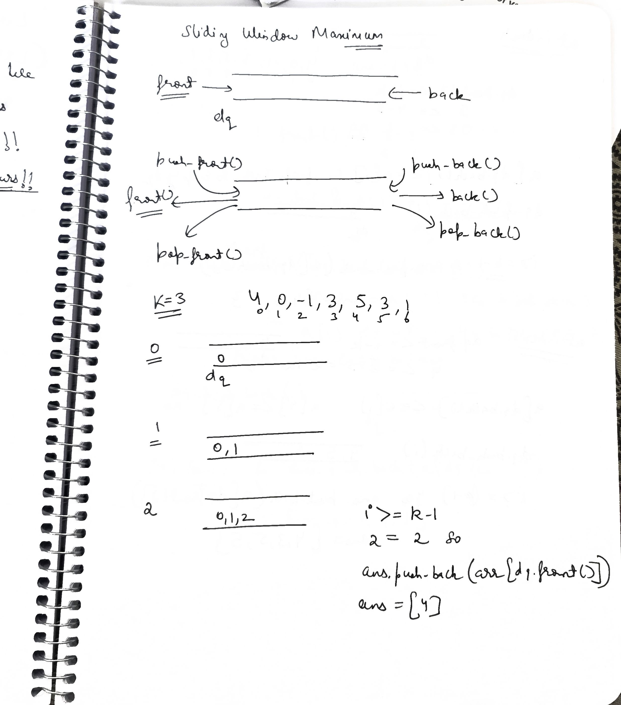
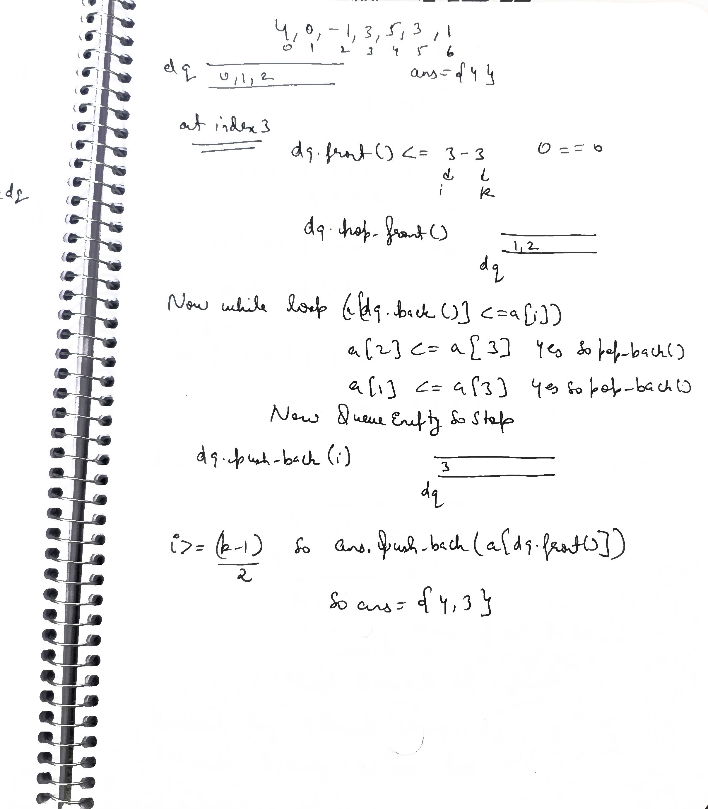
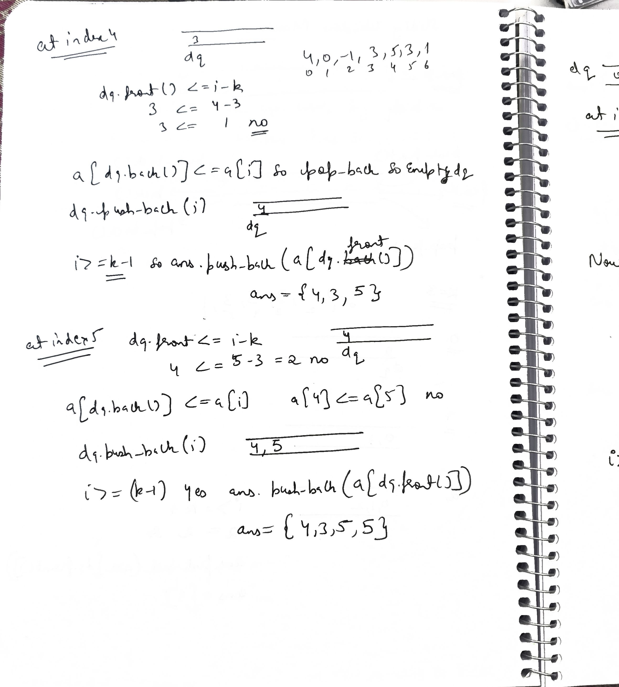
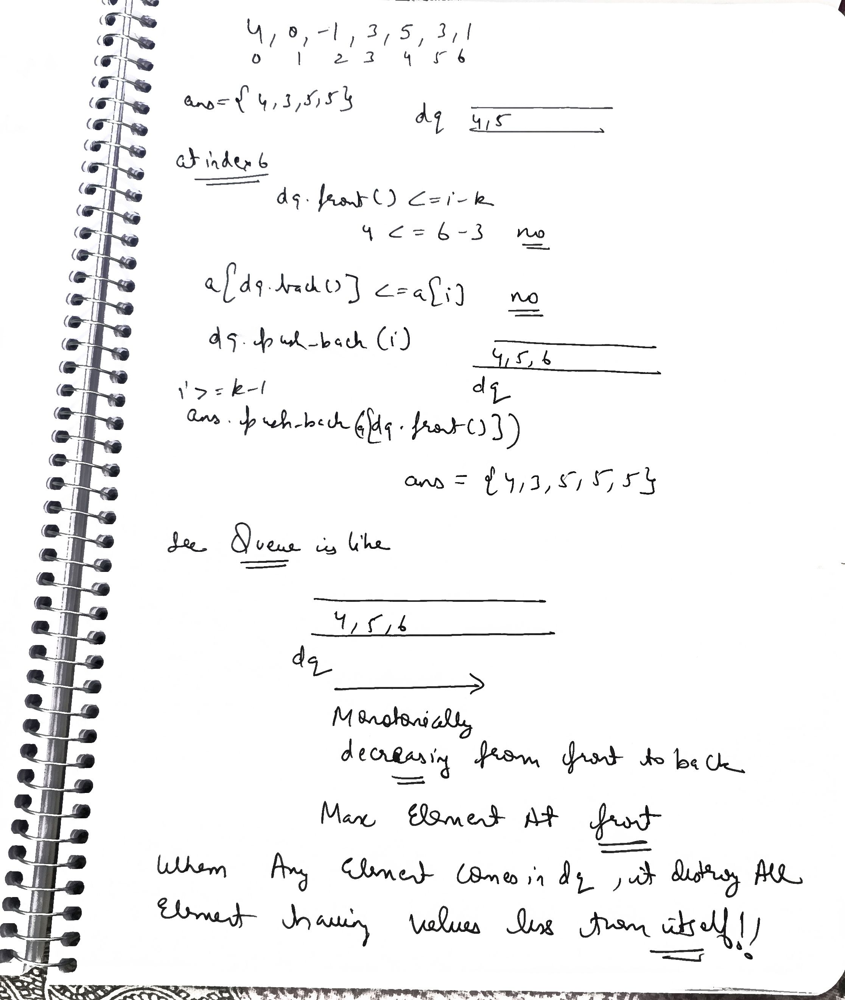

# Notes
.jpg>)


.jpg>) .jpg>) .jpg>) .jpg>) .jpg>) .jpg>) .jpg>)
 
 See in 004!!

.jpg>) 

## Brute 

```cpp
#include <bits/stdc++.h>
using namespace std;

class Solution {
public:
    // Function to get the maximum sliding window
    vector<int> maxSlidingWindow(vector<int> &arr, int k) {
        
        int n = arr.size(); // Size of array
        
        // To store the answer
        vector<int> ans;
        
        /* Traverse on the arrary 
        for valid window */
        for(int i=0; i <= n-k; i++) {
            
            // To store the maximum of the window
            int maxi = arr[i];
            
            // Traverse the window
            for(int j=i; j < i+k; j++) {
                // Update the maximum
                maxi = max(maxi, arr[j]);
            }
            
            // Add the maximum to the result
            ans.push_back(maxi);
        }
        
        // Return the stored result
        return ans;
    }
};

int main() {
    vector<int> arr = {4, 0, -1, 3, 5, 3, 6, 8};
    int k = 3;
    
    /* Creating an instance of 
    Solution class */
    Solution sol; 
    
    /* Function call to get the
    maximum sliding window */
    vector<int> ans = sol.maxSlidingWindow(arr, k);
    
    cout << "The maximum elements in the sliding window are: ";
    for(int i=0; i < ans.size(); i++) {
        cout << ans[i] << " ";
    }
    
    return 0;
}
```


## Optimal 
   
### Java 

```java

import java.util.*;

class Solution {
    // Function to get the maximum sliding window
    public int[] maxSlidingWindow(int[] arr, int k) {
        
        int n = arr.length; // Size of array
        
        // To store the answer
        int[] ans = new int[n - k + 1];
        int ansIndex = 0;
        
        // Deque data structure
        Deque<Integer> dq = new LinkedList<>();
        
        // Traverse the array
        for (int i = 0; i < n; i++) {
            
            // Update deque to maintain current window
            if (!dq.isEmpty() && dq.peekFirst() <= (i - k)) {
                dq.pollFirst();
            }
            
            /* Maintain the monotonic (decreasing) 
            order of elements in deque */
            while (!dq.isEmpty() && arr[dq.peekLast()] <= arr[i]) {
                dq.pollLast();
            }
            
            // Add current element's index to the deque
            dq.offerLast(i);
            
            /* Store the maximum element from 
            the first window possible */
            if (i >= (k - 1)) {
                ans[ansIndex++] = arr[dq.peekFirst()];
            }
        }
        
        // Return the stored result
        return ans;
    }

    public static void main(String[] args) {
        int[] arr = {4, 0, -1, 3, 5, 3, 6, 8};
        int k = 3;
        
        /* Creating an instance of 
        Solution class */
        Solution sol = new Solution(); 
        
        /* Function call to get the
        maximum sliding window */
        int[] ans = sol.maxSlidingWindow(arr, k);
        
        System.out.print("The maximum elements in the sliding window are: ");
        for (int i = 0; i < ans.length; i++) {
            System.out.print(ans[i] + " ");
        }
    }
}

```

here even `LinkedList<Integer> dq = new LinkedList<>();` will work!!

###  cpp code

```cpp
#include <bits/stdc++.h>
using namespace std;

class Solution {
public:
    // Function to get the maximum sliding window
    vector<int> maxSlidingWindow(vector<int> &arr, int k) {
        
        int n = arr.size(); // Size of array
        
        // To store the answer
        vector<int> ans;
        
        // Deque data structure
        deque <int> dq;
        
        // Traverse the 
        for(int i=0; i < n; i++) {
            
            // Update deque to maintain current window
            if (!dq.empty() && dq.front() <= (i-k)) {
                dq.pop_front();
            }
            
            /* Maintain the monotonic (decreasing) 
            order of elements in deque */
            while (!dq.empty() && arr[dq.back()] <= arr[i]) {
                dq.pop_back();
            }
            
            // Add current elements index to the deque
            dq.push_back(i);
            
            /* Store the maximum element from 
            the first window possible */
            if (i >= (k-1)) {
                ans.push_back(arr[dq.front()]);
            }
        }
        
        // Return the stored result
        return ans;
    }
};

int main() {
    vector<int> arr = {4, 0, -1, 3, 5, 3, 6, 8};
    int k = 3;
    
    /* Creating an instance of 
    Solution class */
    Solution sol; 
    
    /* Function call to get the
    maximum sliding window */
    vector<int> ans = sol.maxSlidingWindow(arr, k);
    
    cout << "The maximum elements in the sliding window are: ";
    for(int i=0; i < ans.size(); i++) {
        cout << ans[i] << " ";
    }
    
    return 0;
}
```

### Here is the breakdown of the Time (TC) and Space (SC) complexity for this Monotonic Deque solution.

The short answer is **$O(N)$ Time** and **$O(K)$ Space**. Here is the "Senior Engineer" explanation of why (especially proving the time is not $N^2$).

### 1. Time Complexity: $O(N)$
At first glance, you see a `for` loop (runs $N$ times) and a `while` loop inside it. A Junior engineer might mistakenly call this $O(N^2)$.

**Why it is Linear ($O(N)$):**
* **The Amortized Analysis:** Look at the lifecycle of a single element (index `i`).
    * It enters the Deque **exactly once** (`dq.push_back(i)`).
    * It leaves the Deque **at most once** (either via `pop_back` when a larger neighbor comes, or `pop_front` when it expires).
* **Total Operations:** Since every element is pushed once and popped once, the total number of operations across the entire run is $2N$.
* **Average:** $2N / N = O(1)$ per iteration.

**Verdict:** The algorithm runs in **$O(N)$ linear time**.

### 2. Space Complexity: $O(K)$
The space is determined by how many elements we store in the deque at any given moment.

* **The Constraint:** The line `if (!dq.empty() && dq.front() <= (i-k))` guarantees that we remove any index that falls out of the current window of size $K$.
* **Worst Case:** In a strictly decreasing array (e.g., `5, 4, 3, 2, 1`), no element is ever popped from the back (because `arr[i]` is always smaller than `dq.back()`). In this specific case, the deque will store all $K$ elements of the current window.
* **Auxiliary Space:** The deque takes **$O(K)$** space.
    * *(Note: The output vector `ans` takes $O(N - K + 1)$ space, but we typically do not count the space required for the output in the complexity analysis unless asked.)*

### Summary Table

| Complexity | Value | Reason |
| :--- | :--- | :--- |
| **Time** | $O(N)$ | Each element is added and removed at most once. |
| **Space** | $O(K)$ | The Deque stores at most $K$ indices (the active window). |


# std::deque<int> Cheat Sheet

Here is the complete "Cheat Sheet" for the `std::deque<int>` container in C++.
Since you are using deque for the Sliding Window Maximum problem, the most important functions for you are in the **Element Access** and **Modifiers** sections.

### 1. Most Important (Sliding Window Essentials)
These are the only 4 functions you need for 90% of Deque problems.

| Function | Description | Time Complexity |
| :--- | :--- | :--- |
| `dq.push_back(x)` | Adds `x` to the end. | $O(1)$ |
| `dq.push_front(x)` | Adds `x` to the beginning. | $O(1)$ |
| `dq.pop_back()` | Removes the last element. | $O(1)$ |
| `dq.pop_front()` | Removes the first element. | $O(1)$ |
| `dq.front()` | Returns the first element (without removing). | $O(1)$ |
| `dq.back()` | Returns the last element (without removing). | $O(1)$ |

### 2. Element Access (Looking inside)

| Function | Description |
| :--- | :--- |
| `dq.at(i)` | Returns element at index `i` (with bounds checking). |
| `dq[i]` | Returns element at index `i` (faster, no checking). |
| `dq.front()` | Reference to the first element. |
| `dq.back()` | Reference to the last element. |

### 3. Capacity (Size and Empty check)

| Function | Description |
| :--- | :--- |
| `dq.empty()` | Returns `true` if deque is empty. |
| `dq.size()` | Returns the number of elements. |
| `dq.max_size()` | Returns max possible elements system can hold. |
| `dq.resize(n)` | Resizes the deque to contain `n` elements. |
| `dq.shrink_to_fit()` | Reduces memory usage to fit current size. |

### 4. Modifiers (Changing content)

| Function | Description |
| :--- | :--- |
| `dq.clear()` | Removes all elements. |
| `dq.insert(pos, x)` | Inserts `x` at iterator position `pos`. |
| `dq.erase(pos)` | Removes element at iterator position `pos`. |
| `dq.erase(start, end)` | Removes elements in range `[start, end)`. |
| `dq.emplace_back(args)` | Constructs element in-place at the end (Faster than push). |
| `dq.emplace_front(args)` | Constructs element in-place at the front. |
| `dq.swap(dq2)` | Swaps contents with another deque `dq2`. |

### 5. Iterators (Traversing)

| Function | Description |
| :--- | :--- |
| `dq.begin()` | Iterator to the first element. |
| `dq.end()` | Iterator to the element after the last. |
| `dq.rbegin()` | Reverse iterator to the last element. |
| `dq.rend()` | Reverse iterator to before the first. |

---

### Interview Tip: std::deque vs std::vector
* **Vector:** Elements are contiguous (next to each other). Adding to the front is slow ($O(N)$) because everything shifts.
* **Deque:** Elements are chunked. Adding to the front is fast ($O(1)$) because it just allocates a new chunk.

> **Rule of Thumb:** Use **Deque** when you need `push_front` / `pop_front`. Use **Vector** for everything else.


##   LinkedList<Integer> dq = new LinkedList<>() vs Deque<Integer> dq = new LinkedList<>()

This is a classic "Software Engineering" interview question: **"Programming to an Interface vs. Programming to an Implementation."**

In short: **Always use the second one** (`Deque<Integer> dq = ...`).

Here is the breakdown of why using the interface is the "Senior" choice.

### 1. The Comparison

| Feature | `LinkedList<Integer> dq` | `Deque<Integer> dq` |
| :--- | :--- | :--- |
| **Type** | Concrete Class (`LinkedList`) | Interface (`Deque`) |
| **Methods Available** | Everything. You can use `dq.get(5)`, `dq.set(2, 9)`, `dq.indexOf(3)`. | Restricted. You can **ONLY** use Deque methods (`addFirst`, `pollLast`, `peek`). |
| **Intent** | Unclear. *"Is this a list? A queue? A stack?"* | Crystal Clear. *"This is a Double-Ended Queue."* |
| **Flexibility** | Low. You are stuck with `LinkedList`. | High. You can swap the implementation later. |

### 2. Why Deque (The Interface) is Better
When you write `Deque<Integer> dq`, you are applying a constraint to yourself.

* **Safety:** You cannot accidentally call `dq.get(i)` (which is $O(N)$ in a Linked List and would ruin your time complexity). The compiler will stop you.
* **Portability:** If you later decide that `LinkedList` is too slow (because of memory overhead), you can change one line of code.


### 3. The "Senior" Optimization: Don't use LinkedList
For competitive programming and algorithm interviews, `LinkedList` is almost always the wrong choice for a Deque.

**Why?**
* **LinkedList:** Every element is a separate Object (Node) with `next` and `prev` pointers. This causes **Cache Misses** (CPU has to jump around memory) and extra Garbage Collection.
* **ArrayDeque:** Uses a resizable array (circular buffer). Elements are next to each other in memory. This is significantly faster due to **CPU Caching**.

### The Best Line of Code to Write:
```java
Deque<Integer> dq = new ArrayDeque<>();
```


