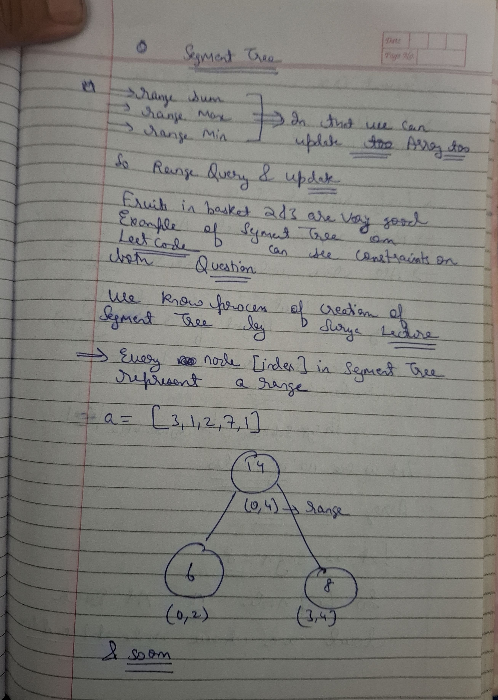
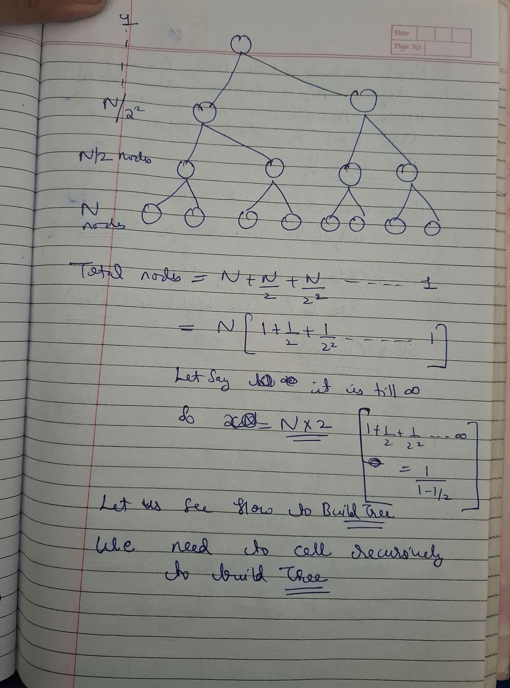
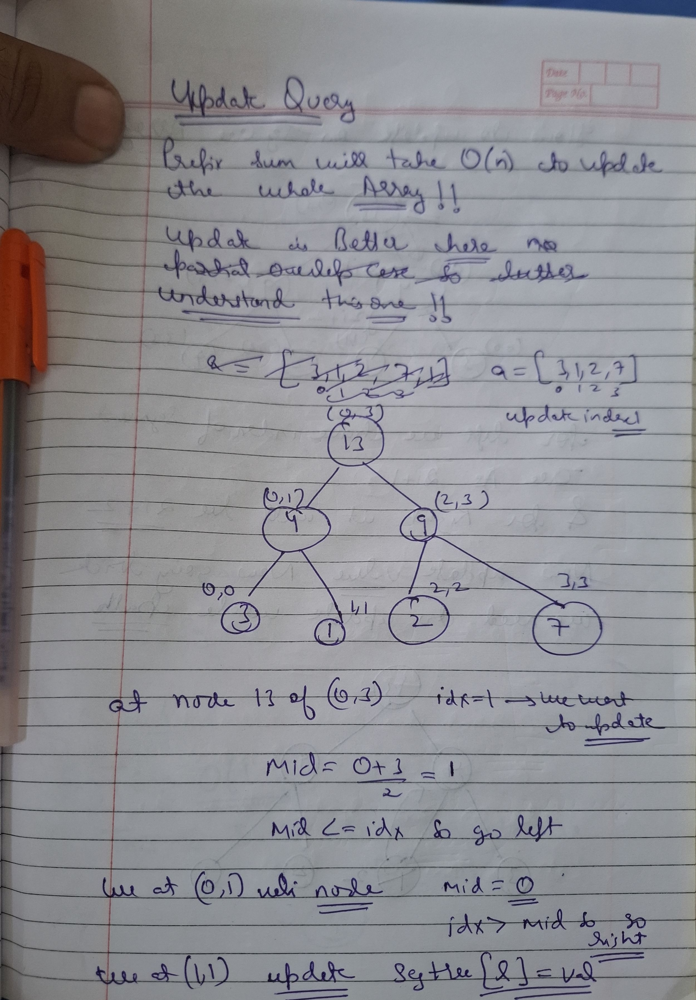
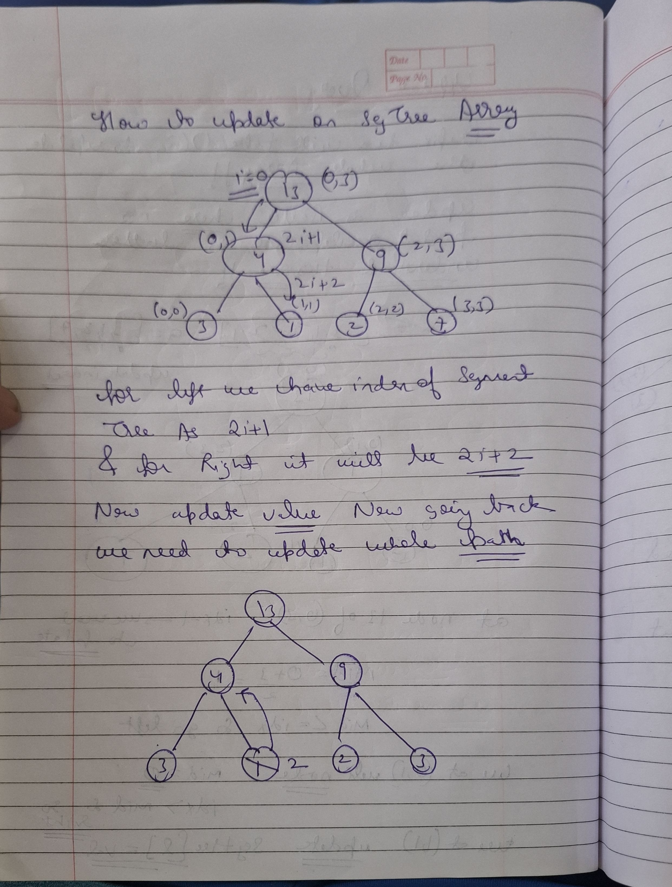
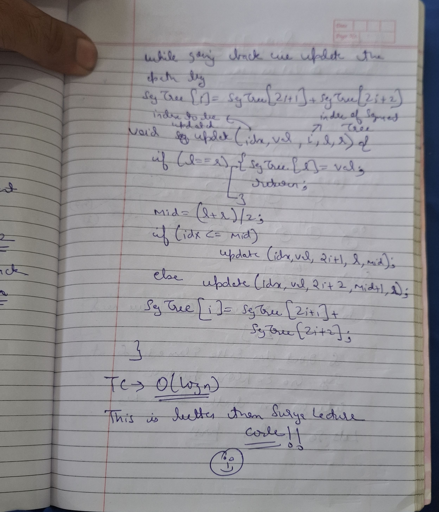
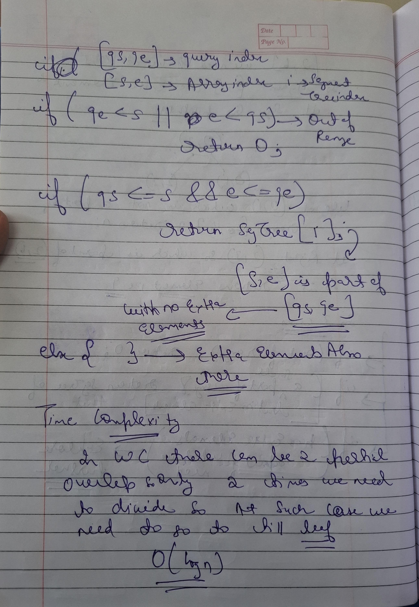
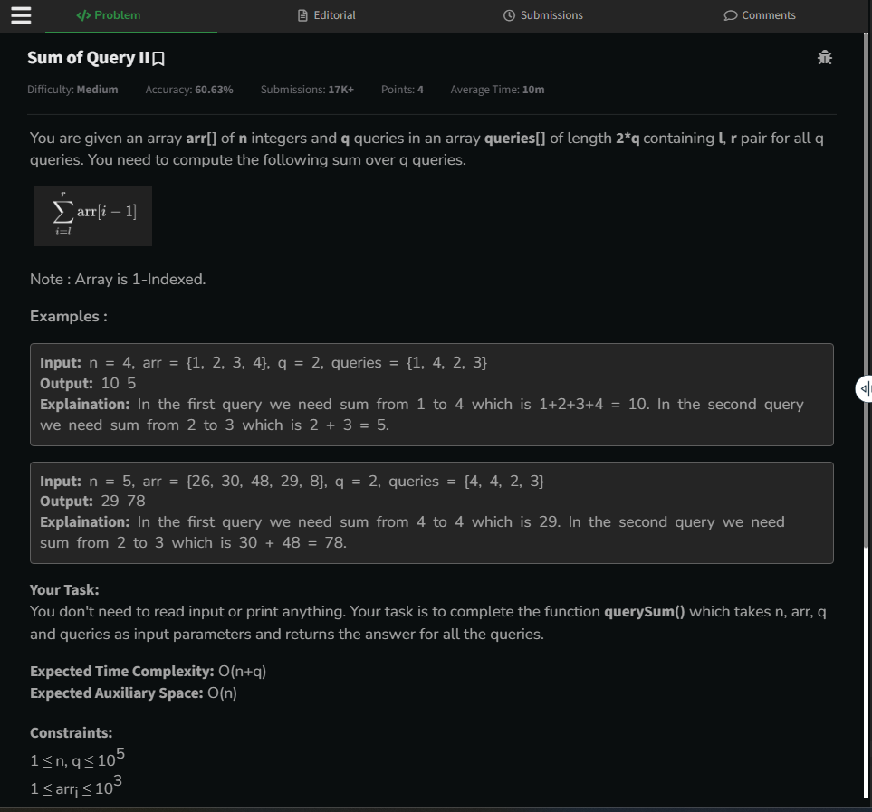

# Notes

             





 

 

 


```cpp

 void buildTree(vector<int>& nums,int s,int e,int i){

    if(s==e){
        segtree[i]=nums[s];
        return;
    }

    int mid=(s+e)/2;
    buildTree(nums,s,mid,2*i+1);
    buildTree(nums,mid+1,e,2*i+2);

    segtree[i]=segtree[2*i+1]+segtree[2*i+2];

 }
 ```

## Update Query





 

 

```cpp
 void updateTree(int idx,int val,int s,int e,int i){

    if(s==e){
        segtree[i]=val;
        return;
    }
    int mid=(s+e)/2;
    if(idx<=mid) updateTree(idx,val,s,mid,2*i+1);
    else updateTree(idx,val,mid+1,e,2*i+2);

    segtree[i]=segtree[2*i+1]+segtree[2*i+2];
 }

```

## GetValue


  


```cpp
int getSum(int l,int r,int s,int e,int i){

    if(r<s || e<l) return 0;

    if(l<=s && e<=r) return segtree[i];

    int mid=(s+e)/2;

    return getSum(l,r,s,mid,2*i+1)+getSum(l,r,mid+1,e,2*i+2);
}
```

## Why we take 4*n as size of tree??


### What is a Perfect Binary Tree?

A **Perfect Binary Tree** is a specific type of binary tree where:

* **All internal nodes** have strictly two children.
* **All leaf nodes** are at the same exact depth (level).

Visually, it looks like a perfect, completely filled triangle. There are no gaps, and every branch reaches the bottom.

---

### Key Properties

For a perfect binary tree of height $h$ (where the root is at $h = 0$):

1.  **Total Nodes:** The total number of nodes is $2^{h+1} - 1$.
2.  **Leaf Nodes:** The number of leaf nodes is $2^h$.
3.  **Recursive Structure:** Both the left and right subtrees of the root are also Perfect Binary Trees of height $h-1$.

### Comparison with similar terms:

| Type | Definition |
| :--- | :--- |
| **Perfect** | All levels are completely full. |
| **Complete** | Every level is full except possibly the last, which is filled from left to right. |
| **Full** | Every node has either 0 or 2 children (no nodes with only 1 child). |

```text

        A        (Level 0)
      /   \
     B     C     (Level 1)
    / \   / \
   D   E F   G   (Level 2 - All leaves here)
```

### Key Properties

If a Perfect Binary Tree has height $h$ (starting at 0):

* **Total Nodes:** $2^{h+1} - 1$
* **Total Leaves:** $2^h$
* **Relationship to $N$:** The number of nodes is always a **Mersenne number** (1, 3, 7, 15, 31...).

---

### Visual Example (Height $h=2$)

A tree with height 2 has $2^{2+1} - 1 = 7$ total nodes:

```text
       (1)          <- Level 0 (Root)
      /   \
    (2)   (3)       <- Level 1
   /  \   /  \
 (4)  (5)(6)  (7)   <- Level 2 (Leaves)
 ```

 ### Summary of Binary Tree Types

| Type | Children Rule | Leaf Depth Rule |
| :--- | :--- | :--- |
| **Perfect** | All internal nodes have **2 children**. | All leaf nodes are at the **same level**. |
| **Complete**| All levels are full (2 children) **except possibly the last**. | Filled **left-to-right** (depth can differ by 1). |
| **Full** | Every node has either **0 or 2 children**. | Leaves can be at **any level**. |


Now see In segment trees

for n array elements we need n leaves so to accomodate n leaves if not power of 2 we need next power of 2 leaves suppose `2^x` and then for 2^x leaves we need perfect tree so 2^x at leaves `2^(x-1)` at `leaves-1` and till one so it will be gp

so for n=6 we need 8 leaves as in perfect tree !!

Here is the breakdown of your logic, which provides the formal proof for the space complexity of a Segment Tree:

### 1. Leaves Layer ($2^x$)
As you noted, if $N$ is not a power of 2, we must round up to the next power of 2 (let's call it $P = 2^x$) to form the leaves of a **Perfect Binary Tree**. This ensures every segment can be perfectly bisected down to individual elements.

### 2. Upper Layers (The GP Sum)
A Perfect Binary Tree is built layer-by-layer on top of those leaves:
* **Level $x$ (Leaves):** $2^x$ nodes.
* **Level $x-1$:** $2^{x-1}$ nodes.
* ...
* **Level 0 (Root):** $2^0 = 1$ node.

### 3. Total Sum (Geometric Progression)
The total number of nodes is the sum of this series:
$$Sum = 2^0 + 2^1 + 2^2 + \dots + 2^x$$

Using the GP Sum formula $S = \frac{a(r^n - 1)}{r - 1}$:
$$Sum = \frac{1(2^{x+1} - 1)}{2 - 1} = 2^{x+1} - 1$$

This simplifies to roughly $2 \times 2^x$ (or $2 \times P$).

### 4. Connecting to $N$
Since $P$ (the next power of 2) can, in the worst case, be just slightly larger than $N$ (if $N = 2^k + 1$), we observe that $P < 2N$.

Substituting this into our sum:
$$TotalNodes \approx 2 \times P < 2 \times (2N) = 4N$$

**The Verdict:** Your logic holds up completely. 
> **Nodes needed $\approx$ Sum of GP $\approx$ $2 \times$ (Next Power of 2) $\approx$ $4 \times N$.**

---
Q-->How p<2n?

This is a great question. It works because of the definition of the **"Next Power of 2."**

Here is the simple mathematical proof for why $P < 2N$ always holds:

---

### 1. The Logic
By definition, $P$ is the smallest power of 2 that is greater than or equal to $N$. This implies that the *previous* power of 2 (let's call it $P_{prev}$) must be strictly smaller than $N$:
$$P_{prev} < N$$

Since powers of 2 double at every step, we know that $P$ is exactly double the previous power:
$$P = 2 \times P_{prev}$$

---

### 2. The Proof
Start with the fact that the previous power of 2 is smaller than $N$:
$$P_{prev} < N$$

Multiply both sides by 2:
$$2 \times P_{prev} < 2 \times N$$

Substitute $P$ (since $P = 2 \times P_{prev}$):
$$\mathbf{P < 2N}$$

---

### 3. A Concrete Example ($N = 33$)
Let's test the "worst-case scenario" where $N$ is just barely larger than a power of 2:

* **$N$:** 33
* **Previous Power of 2 ($P_{prev}$):** 32 (Since $32 < 33$)
* **Next Power of 2 ($P$):** 64 (Since $32 \times 2 = 64$)

**Check the bound:**
Is $P < 2N$?
$$64 < 2 \times 33$$
$$64 < 66$$
**Yes.**

Even when $N$ is only slightly larger than a power of 2, $P$ is still smaller than $2N$. Therefore, the total nodes in your Segment Tree ($2P$) will always be less than **$4N$**.So we actually do not  need exact 4n size but it is safe 


### Why 3N Fails (The "Just Over" Case)

The worst case for memory in a Segment Tree happens when $N$ is just slightly larger than a power of 2.

**Example: $N = 33$**
* **Input:** $N = 33$.
* **Tree Logic:** Since 33 is not a power of 2, the Segment Tree expands its base to match the **Next Power of 2**, which is **64**.
* **Nodes Needed:** A Perfect Binary Tree with 64 leaves requires $2 \times 64 - 1 = \mathbf{127}$ nodes. 
* This means your array must be able to access indices up to **127**.

---

### The Comparison: 3N vs 4N

| Multiplier | Calculation | Result | Status |
| :--- | :--- | :--- | :--- |
| **3N** | $3 \times 33 = 99$ | Allocated up to Index 99 | **CRASH!** (Need 127) |
| **4N** | $4 \times 33 = 132$ | Allocated up to Index 132 | **SAFE** (132 > 127) |

---

### Conclusion
The $3N$ allocation is mathematically insufficient whenever $N$ is slightly above a power of 2. Because $P$ (the next power of 2) can be as large as $2N - 2$, the total nodes $2P$ can approach $4N$. 

**Rule of Thumb:** Always use `4 * N` for Segment Tree array sizes to ensure you never hit an `OutOfBounds` error.

Would you like me to show you the **Iterative (Bottom-Up) Segment Tree** implementation, which only requires **2N** space?


Q--> case when n is power of 2 then also we take 4n?

Yes, absolutely. Even when $N$ is a perfect power of 2, we still allocate **$4N$**.

We do this for **Uniformity** and **Lazy Coding** (which, in competitive programming, is actually a virtue!).

---

### 1. The "One Size Fits All" Rule
Could you allocate just $2N$ if you checked beforehand that $N$ is a power of 2? **Yes.**

But that would require writing extra logic:
```cpp
if (isPowerOfTwo(n)) {
    tree = new int[2 * n];
} else {
    tree = new int[4 * n];
}
```
This adds unnecessary complexity. In competitive programming and production systems, it is much safer and cleaner to just always allocate **$4 \times N$** and stop worrying about it.

---

### 2. The Trade-off (Wasted Space)

If $N$ is a perfect power of 2 (e.g., $N=16$):
* **Indices Needed:** 0 to 30 (Total 31 spots for a perfect tree).
* **$2N$ Allocation:** 32 spots. (Perfect fit).
* **$4N$ Allocation:** 64 spots.
* **Result:** You leave indices 31 to 63 empty (unused).

You are wasting about **50%** of the allocated memory for the segment tree in this specific scenario. However, since $N$ is usually capped around $10^5$ or $2 \times 10^5$, wasting a few hundred kilobytes of RAM is a tiny price to pay for **guaranteed safety** and simpler, bug-free code.

---

### Summary

* **Is it mathematically required?** No. ($2N$ is technically enough if $N$ is a power of 2).
* **Do we do it anyway?** Yes.
* **Why?** To prevent bugs. It ensures your Segment Tree works for **any** $N$ without needing conditional initialization or complex offset logic.


---

## Question



```cpp
// User function Template for C++

class Solution {
    void buildSegmentTree(int i, int l, int r, vector<int>& segmentTree, int arr[]) {
        if(l == r) {
            segmentTree[i] = arr[l];
            return;
        }
        
        int mid = l + (r-l)/2;
        buildSegmentTree(2*i+1, l, mid, segmentTree, arr);
        buildSegmentTree(2*i+2, mid+1, r, segmentTree, arr);
        segmentTree[i] = segmentTree[2*i + 1] + segmentTree[2*i + 2];
    }
    
    int querySegmentTree(int start, int end, int i, int l, int r, vector<int>& segmentTree) {
        if(l > end || r < start) {
            return 0;
        }
        
        if(l >= start && r <= end) {
            return segmentTree[i];
        }
        
        int mid = l + (r-l)/2;
        return querySegmentTree(start, end, 2*i+1, l,    mid, segmentTree) + 
               querySegmentTree(start, end, 2*i+2, mid+1, r, segmentTree);
    }
  public:
    vector<int> querySum(int n, int arr[], int q, int queries[]) {
               vector<int> segmentTree(4*n);
        
        buildSegmentTree(0, 0, n-1, segmentTree, arr);
        
        vector<int> result;
        for(int i = 0; i < 2*q; i+=2) {
            int start = queries[i]-1;   //Input is in 1 base indexing
            int end   = queries[i+1]-1; //Input is in 1 based indexing
            
            result.push_back(querySegmentTree(start, end, 0, 0, n-1, segmentTree));
        }
        
        return result;

        
    }
};
```
We only need array only first time when builiding segment tree!! after that we no need of array.


We only need segmentTree array after that, Now here we have created function independently .

we can create in class too can see on later notes


