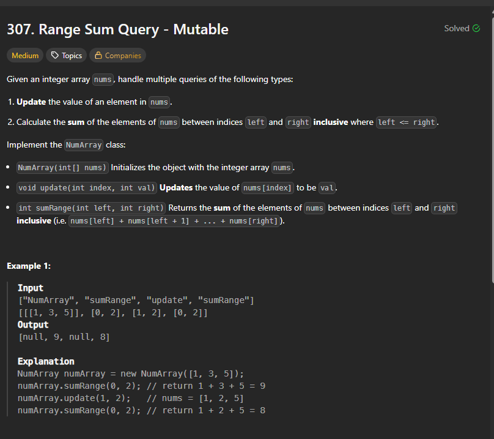
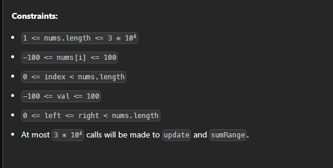

# Notes





```cpp
class NumArray {
    vector<int>segtree;
    int n=0;
    int sz=0;

 void buildTree(vector<int>& nums,int s,int e,int i){

    if(s==e){
        segtree[i]=nums[s];
        return;
    }

    int mid=(s+e)/2;
    buildTree(nums,s,mid,2*i+1);
    buildTree(nums,mid+1,e,2*i+2);

    segtree[i]=segtree[2*i+1]+segtree[2*i+2];

 }

 void updateTree(int idx,int val,int s,int e,int i){

    if(s==e){
        segtree[i]=val;
        return;
    }
    int mid=(s+e)/2;
    if(idx<=mid) updateTree(idx,val,s,mid,2*i+1);
    else updateTree(idx,val,mid+1,e,2*i+2);

    segtree[i]=segtree[2*i+1]+segtree[2*i+2];
 }

int getSum(int l,int r,int s,int e,int i){

    if(r<s || e<l) return 0;

    if(l<=s && e<=r) return segtree[i];

    int mid=(s+e)/2;

    return getSum(l,r,s,mid,2*i+1)+getSum(l,r,mid+1,e,2*i+2);
}

public:
    NumArray(vector<int>& nums) {
        n=nums.size();
        sz=4*n;
        segtree.resize(sz);
        buildTree(nums,0,n-1,0);
    }
    
    void update(int index, int val) {

        updateTree( index, val,0,n-1,0);
        
    }
    
    int sumRange(int left, int right) {
        return getSum(left,right,0,n-1,0);
    }
};

/**
 * Your NumArray object will be instantiated and called as such:
 * NumArray* obj = new NumArray(nums);
 * obj->update(index,val);
 * int param_2 = obj->sumRange(left,right);
 */
 ```
Sometimes no need of update so can use this way 

```cpp

class Solution {
    void buildSegmentTree(int i, int l, int r, vector<int>& segmentTree, int arr[]) {
        if(l == r) {
            segmentTree[i] = arr[l];
            return;
        }
        
        int mid = l + (r-l)/2;
        buildSegmentTree(2*i+1, l, mid, segmentTree, arr);
        buildSegmentTree(2*i+2, mid+1, r, segmentTree, arr);
        segmentTree[i] = segmentTree[2*i + 1] + segmentTree[2*i + 2];
    }
    
    int querySegmentTree(int start, int end, int i, int l, int r, vector<int>& segmentTree) {
        if(l > end || r < start) {
            return 0;
        }
        
        if(l >= start && r <= end) {
            return segmentTree[i];
        }
        
        int mid = l + (r-l)/2;
        return querySegmentTree(start, end, 2*i+1, l,    mid, segmentTree) + 
               querySegmentTree(start, end, 2*i+2, mid+1, r, segmentTree);
    }
  public:
    vector<int> querySum(int n, int arr[], int q, int queries[]) {
               vector<int> segmentTree(4*n);
        
        buildSegmentTree(0, 0, n-1, segmentTree, arr);
        
        vector<int> result;
        for(int i = 0; i < 2*q; i+=2) {
            int start = queries[i]-1;   //Input is in 1 base indexing
            int end   = queries[i+1]-1; //Input is in 1 based indexing
            
            result.push_back(querySegmentTree(start, end, 0, 0, n-1, segmentTree));
        }
        
        return result;

        
    }
```


