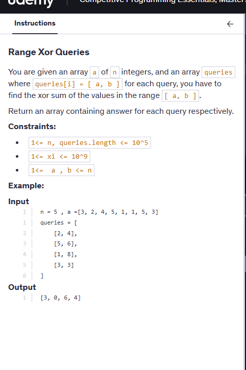

# Notes




### Code

```cpp

#include<bits/stdc++.h>
using namespace std;

class STree {
    vector<int>segtree;
    int n=0;
    int sz=0;

 void buildTree(vector<int>& nums,int s,int e,int i){

    if(s==e){
        segtree[i]=nums[s];
        return;
    }

    int mid=(s+e)/2;
    buildTree(nums,s,mid,2*i+1);
    buildTree(nums,mid+1,e,2*i+2);

    segtree[i]=segtree[2*i+1]^segtree[2*i+2];

 }


int getXor(int l,int r,int s,int e,int i){

    if(r<s || e<l) return 0;

    if(l<=s && e<=r) return segtree[i];

    int mid=(s+e)/2;

    return getXor(l,r,s,mid,2*i+1)^getXor(l,r,mid+1,e,2*i+2);
}

public:
    STree(vector<int>& nums) {
        n=nums.size();
        sz=4*n;
        segtree.resize(sz);
        buildTree(nums,0,n-1,0);
    }
    
    
    int xorRange(int left, int right) {
        return getXor(left,right,0,n-1,0);
    }
};

vector<int>solve(int n, vector<int>a, vector<vector<int>> queries){
    int size=a.size();
    STree st (a);
    vector<int> res;
    for(int i=0;i<queries.size();i++){
        int l=queries[i][0]-1; //as in queries 1-based indexing used
        int r=queries[i][1]-1;
        res.push_back(st.xorRange(l,r));
    }
    return res;
    
    
}
```

Simple as no updates are here .so no update is written here.


