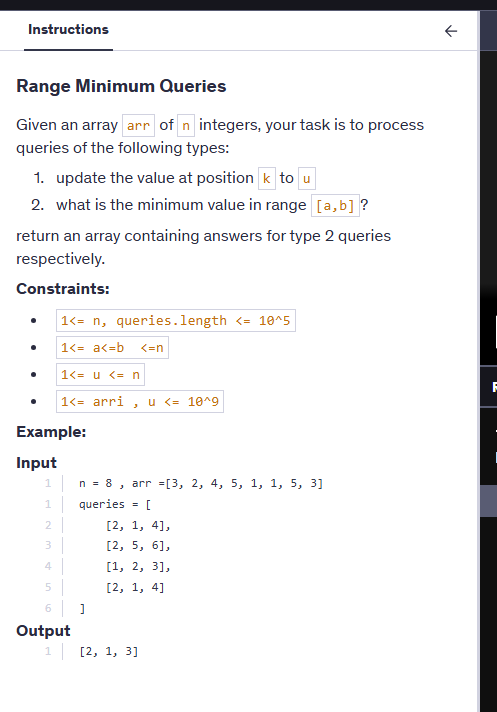

# Notes 



```cpp
#include<bits/stdc++.h>
using namespace std;


class STree {
    vector<int>segtree;
    int n=0;
    int sz=0;

 void buildTree(vector<int>& nums,int s,int e,int i){

    if(s==e){
        segtree[i]=nums[s];
        return;
    }

    int mid=(s+e)/2;
    buildTree(nums,s,mid,2*i+1);
    buildTree(nums,mid+1,e,2*i+2);

    segtree[i]=min(segtree[2*i+1],segtree[2*i+2]);

 }

 void updateTree(int idx,int val,int s,int e,int i){

    if(s==e){
        segtree[i]=val;
        return;
    }
    int mid=(s+e)/2;
    if(idx<=mid) updateTree(idx,val,s,mid,2*i+1);
    else updateTree(idx,val,mid+1,e,2*i+2);

    segtree[i]=min(segtree[2*i+1],segtree[2*i+2]);
 }

int getMin(int l,int r,int s,int e,int i){

    if(r<s || e<l) return INT_MAX; //see here returning INT_MAX

    if(l<=s && e<=r) return segtree[i];

    int mid=(s+e)/2;

    return min(getMin(l,r,s,mid,2*i+1),getMin(l,r,mid+1,e,2*i+2));
}

public:
    STree(vector<int>& nums) {
        n=nums.size();
        sz=4*n;
        segtree.resize(sz);
        buildTree(nums,0,n-1,0);
    }
    
    void update(int index, int val) {

        updateTree( index, val,0,n-1,0);
        
    }
    
    
    int minRange(int left, int right) {
        return getMin(left,right,0,n-1,0);
    }
};

vector<int> solve(int n, vector<int>a, vector<vector<int>> queries){
  
    STree st (a);
    vector<int> res;
    for(int i=0;i<queries.size();i++){
        if(queries[i][0]==1){
            int idx=queries[i][1]-1;
            int val=queries[i][2];
            st.update(idx,val);
        }else{
            int l=queries[i][1]-1; //as in queries 1-based indexing used
            int r=queries[i][2]-1;
            res.push_back(st.minRange(l,r));
        }
    }
    return res;
}
```


