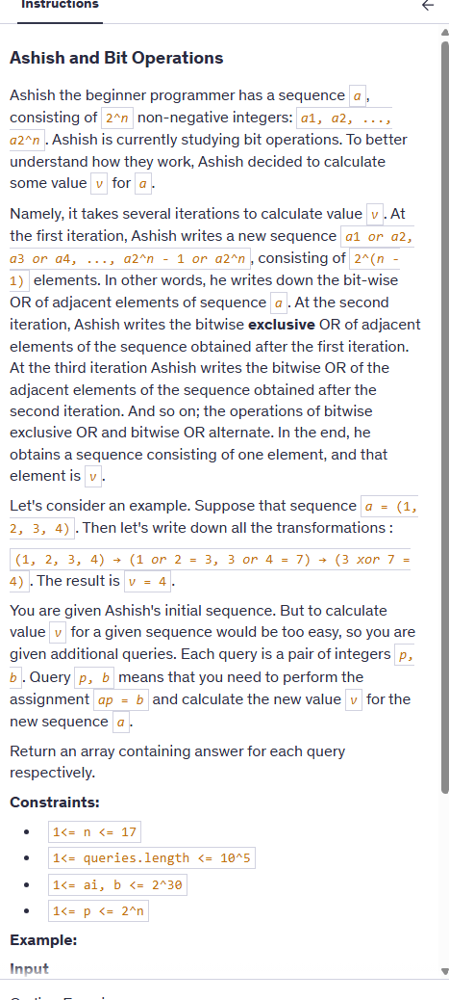
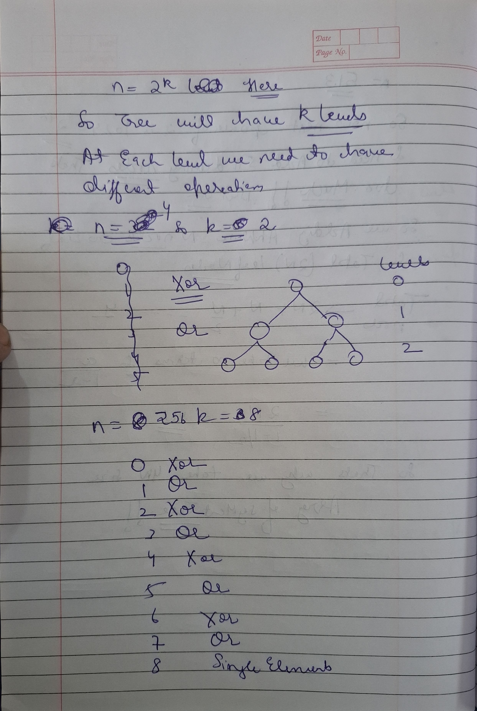
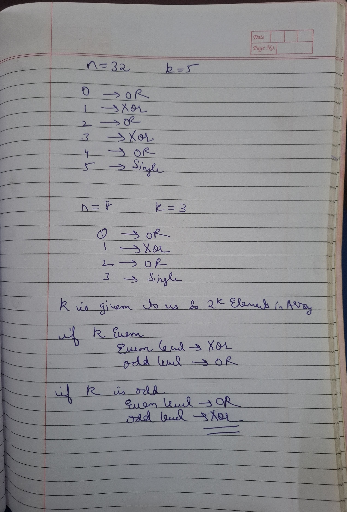

 # Notes




Here it is given size is n=2^k so we know we will have 2*n nodes

so we can take segment tree size as 2*n or to be on safer side use 4*n.


 

```cpp

#include<bits/stdc++.h>
using namespace std;


class STree {
    vector<int>segtree;
    int n=0;
    int sz=0;
    int lvls=0;

 void buildTree(vector<int>& nums,int s,int e,int i,int level){

    if(s==e){
        segtree[i]=nums[s];
        return;
    }

    int mid=(s+e)/2;
    buildTree(nums,s,mid,2*i+1,level+1);
    buildTree(nums,mid+1,e,2*i+2,level+1);
    
    if(lvls%2==0){
        if(level%2!=0) segtree[i]=segtree[2*i+1]|segtree[2*i+2];
        else segtree[i]=segtree[2*i+1]^segtree[2*i+2];
        
    }else {
         if(level%2!=0) segtree[i]=segtree[2*i+1]^segtree[2*i+2];
        else segtree[i]=segtree[2*i+1]|segtree[2*i+2];
    }

 }


int getBitOp(int l,int r,int s,int e,int i,int levels){

    if(r<s || e<l) return 0;

    if(l<=s && e<=r) return segtree[i];

    int mid=(s+e)/2;

     if(lvls%2==0){
        if(levels%2!=0) return getBitOp(l,r,s,mid,2*i+1,levels+1)| getBitOp(l,r,mid+1,e,2*i+2,levels+1);
        else return getBitOp(l,r,s,mid,2*i+1,levels+1)^ getBitOp(l,r,mid+1,e,2*i+2,levels+1);
        
    }else {
         if(levels%2!=0) return getBitOp(l,r,s,mid,2*i+1,levels+1)^ getBitOp(l,r,mid+1,e,2*i+2,levels+1);
        else return getBitOp(l,r,s,mid,2*i+1,levels+1)| getBitOp(l,r,mid+1,e,2*i+2,levels+1);
    }
}
 void updateTree(int idx,int val,int s,int e,int i,int level){

    if(s==e){
        segtree[i]=val;
        return;
    }
    int mid=(s+e)/2;
    if(idx<=mid) updateTree(idx,val,s,mid,2*i+1,level+1);
    else updateTree(idx,val,mid+1,e,2*i+2,level+1);

     if(lvls%2==0){
        if(level%2!=0) segtree[i]=segtree[2*i+1]|segtree[2*i+2];
        else segtree[i]=segtree[2*i+1]^segtree[2*i+2];
        
    }else {
         if(level%2!=0) segtree[i]=segtree[2*i+1]^segtree[2*i+2];
        else segtree[i]=segtree[2*i+1]|segtree[2*i+2];
    }
 }

public:
    STree(vector<int>& nums,int treeLevels) {
        n=nums.size();
        sz=2*n;
        lvls=treeLevels;
        segtree.resize(sz);
        buildTree(nums,0,n-1,0,0);
    }
    void update(int index, int val) {

        updateTree( index, val,0,n-1,0,0);
        
    }
    
    int bitRange(int left, int right) {
        return getBitOp(left,right,0,n-1,0,0);
    }
};

vector<int> solve(int n, vector<int>a, vector<vector<int>> queries){
    STree st(a,n);
    
    vector<int> res;
    for(vector<int>q:queries){
        int idx=q[0]-1;
        int val=q[1];
        st.update(idx,val);
        res.push_back(st.bitRange(0,a.size()-1));
    }
    return res;
    

}
```
# Why this problem Strictly Require a Segment Tree

This problem is a perfect example of why the **Segment Tree** is a more powerful (though more complex) tool than the **Fenwick Tree**. To answer the question directly: **No, you cannot use a Fenwick Tree here.**

Here is the "Physics" breakdown of why this problem requires a Segment Tree.

---

### 1. The "Alternating Levels" Rule
In this problem, the operation depends entirely on the **height (level)** of the node:
* **Bottom level:** `OR`
* **Level above:** `XOR`
* **Level above that:** `OR`
* ...and so on.

**The Fenwick Problem:** A Fenwick Tree doesn't have "levels" in a consistent hierarchy. It is a flat array where nodes are combined based on their **Binary Trailing Zeros**. There is no concept of "this level does XOR and the next does OR." A Fenwick Tree assumes a **single, consistent operation** (like addition) across the entire structure.

---

### 2. The Non-Invertible Operation (`OR`)
As we discussed, Fenwick Trees rely on **Prefixes** and **Inverses**.

* While `XOR` has an inverse (itself), **`OR` is destructive (information-losing).**
* If you know `(A OR B) = 7` and `A = 4`, you have no way of knowing if `B` was `3`, `7`, or `2`.
* Because you can't "undo" an `OR` operation, you cannot use the `Query(R) - Query(L-1)` logic that makes Fenwick Trees work. You can't "subtract" a prefix to find a range result.

---

### 3. The Tournament Bracket Physics
The Segment Tree works here because it functions like a **Tournament Bracket**:

1.  **The Players (Leaves):** They compete in the first round using the `OR` rule.
2.  **The Winners:** They move to the second round and compete using the `XOR` rule.
3.  **The Champion (Root):** The final result is the outcome of all these alternating rounds.

When you update a value at the bottom, you only need to "re-play" the matches for that **one specific path** up to the root. Segment Trees excel at this because they store the result of every intermediate "match" in a dedicated node.

---

### 4. Summary Table

| Feature | Fenwick Tree | Segment Tree |
| :--- | :--- | :--- |
| **Logic** | Prefix-based ($0 \to i$) | Range-based ($L \to R$) |
| **Operations** | Must be Invertible (Sum, XOR) | Can be anything (Min, Max, OR, Alternating) |
| **Structure** | Flat/Binary Jumps | Hierarchical/Tournament Bracket |
| **Xenia's Problem** | ❌ Impossible | ✅ Perfect Match |

---

### 💡 Engineering Tip for your Code
In your constructor, you used `sz = 2 * n`. In a recursive Segment Tree like yours, it is safer to use **`4 * n`**. 
- **The Physics:** If $N$ is not a perfect power of 2, the recursive tree can branch deeper than $2N$ indices, leading to an **Array Out of Bounds** error. Using $4N$ is the standard "safety factor" for Segment Trees.

# Why  Problem Fails on Fenwick

### 1. Structural Mismatch
- **Segment Tree:** Maintains a perfect power-of-2 hierarchy where each level can have a custom rule (Alternating `OR` / `XOR`).
- **Fenwick Tree:** Uses a binary-indexed jump system that cannot distinguish between "even" and "odd" levels of a tree.

### 2. The "OR" Information Loss
- `OR` and `XOR` are combined in this problem.
- Since `OR` is not invertible (you cannot "subtract" an `OR` result), the prefix-sum logic of Fenwick Trees is physically impossible to apply.

### 3. The Rule of Thumb
- Use **Fenwick** for: Single, invertible operations (Sum, XOR, Product).
- Use **Segment Tree** for: Complex, alternating, or non-invertible operations (Min, Max, OR, Alternating Logic).


