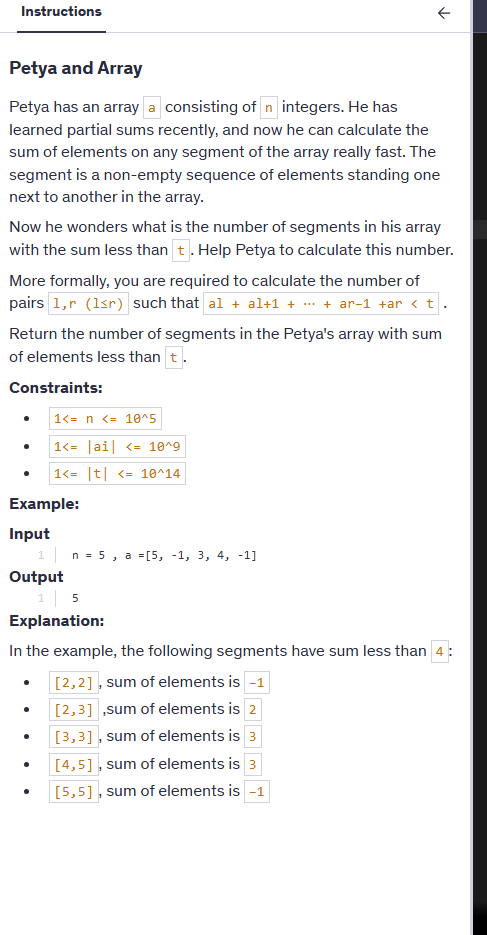
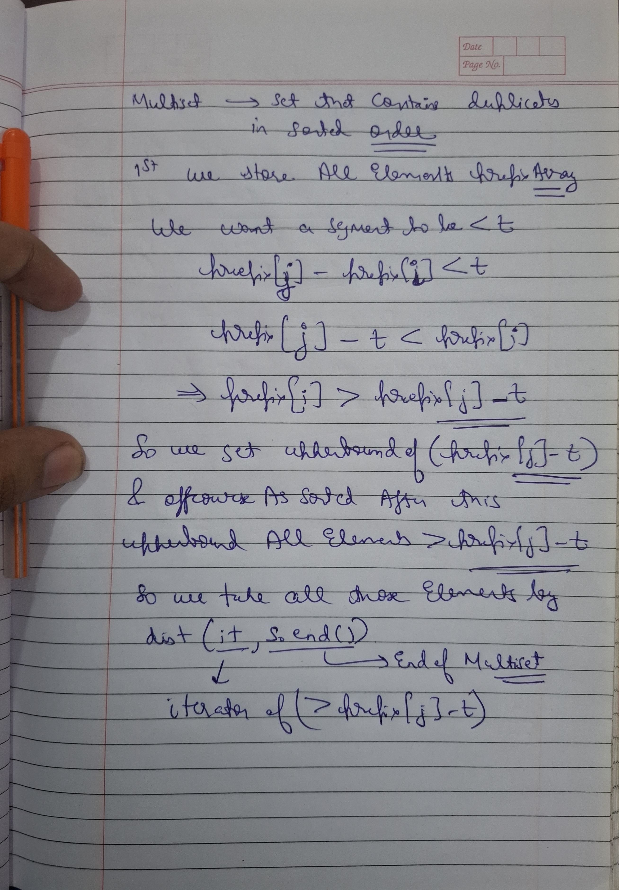

# Notes




```cpp

#include<bits/stdc++.h>
using namespace std;

class NumArray {
    vector<long long>segtree;
    int n=0;
    int sz=0;
    long long cnt=0;

 void buildTree(vector<int>& nums,int s,int e,int i){

    if(s==e){
        segtree[i]=nums[s];
        return;
    }

    int mid=(s+e)/2;
    buildTree(nums,s,mid,2*i+1);
    buildTree(nums,mid+1,e,2*i+2);

    segtree[i]=segtree[2*i+1]+segtree[2*i+2];

 }

 void traverse(int s,int e,int i,int val){
     if(segtree[i]<val) cnt++;
    if(s==e ){
        return;
    }
    int mid=(s+e)/2;
    traverse(s,mid,2*i+1,val);
    traverse(mid+1,e,2*i+2,val);

 }
 ```

 Wrong approach as each subarray is not covered by segments, we need to check for each subarray!!


 sp for each subarray we getting sum so O(n^2.log(n))

 ```cpp
 #include<bits/stdc++.h>
using namespace std;

class NumArray {
    vector<int>segtree;
    int n=0;
    int sz=0;

 void buildTree(vector<int>& nums,int s,int e,int i){

    if(s==e){
        segtree[i]=nums[s];
        return;
    }

    int mid=(s+e)/2;
    buildTree(nums,s,mid,2*i+1);
    buildTree(nums,mid+1,e,2*i+2);

    segtree[i]=segtree[2*i+1]+segtree[2*i+2];


 }

int getSum(int l,int r,int s,int e,int i){

    if(r<s || e<l) return 0;

    if(l<=s && e<=r) return segtree[i];

    int mid=(s+e)/2;

    return getSum(l,r,s,mid,2*i+1)+getSum(l,r,mid+1,e,2*i+2);
}

public:
    NumArray(vector<int>& nums) {
        n=nums.size();
        sz=4*n;
        segtree.resize(sz);
        buildTree(nums,0,n-1,0);
    }
    
    
    int sumRange(int left, int right) {
        return getSum(left,right,0,n-1,0);
    }
};


long long solve(int n,long long t, vector<int>a){
     NumArray  stree(a);
     long long cnt=0;
     for(int i=0;i<n;i++){
         for(int j=i;j<n;j++){
             if(stree.sumRange(i,j)<t) cnt++;
         }
     }
     return cnt;
}
```
we can do O(n^2) solution by mutiset and prefix sum array

```cpp

#include<bits/stdc++.h>
using namespace std;


long long solve(int n,long long t, vector<int>a){
    vector<long long> prefix(n + 1, 0);
    for (int i = 0; i < n; ++i)
        prefix[i + 1] = prefix[i] + a[i];

    multiset<long long> s;
    s.insert(0);  // prefix[0]

    long long count = 0;

    for (int j = 1; j <= n; ++j) {
        // Find number of prefix[i-1] > prefix[j] - t
        auto it = s.upper_bound(prefix[j] - t);
        count += distance(it, s.end());

        // Insert current prefix for future queries
        s.insert(prefix[j]);
    }

    return count;
}
```


when the array contains only positive numbers, the two pointers / sliding window technique becomes perfectly suitable and efficient.

```cpp

#include <bits/stdc++.h>
using namespace std;

long long countSegmentsLessThanT(int n, vector<int>& a, long long t) {
    long long count = 0;
    long long sum = 0;
    int l = 0;

    for (int r = 0; r < n; ++r) {
        sum += a[r];
        while (sum >= t && l <= r) {
            sum -= a[l++];
        }
        count += (r - l + 1); // all subarrays [l..r], [l+1..r], ..., [r..r]
    }

    return count;
}

int main() {
    int n = 5;
    vector<int> a = {1, 2, 1, 2, 1};
    long long t = 4;
    cout << countSegmentsLessThanT(n, a, t) << endl;  // Output: 10
    return 0;
}

```

### ✅ What r - l + 1 Means
This counts how many subarrays ending at index r and starting at any index between l and r.

In our case:

Start at l = 1 → [2, 3, 4]

Start at 2 → [3, 4]

Start at 3 → [4]

So:


Subarrays ending at r=3:

[2, 3, 4]

[3, 4]

[4]
→ Total = 3 = r - l + 1


### 🔢 What n(n+1)/2 Means
Here, n = r - l + 1 = 3

This counts all subarrays (any start and end) inside the segment [l..r], regardless of whether they end at r.

From the subarray [2, 3, 4]:

All possible subarrays:

[2]

[2, 3]

[2, 3, 4]

[3]

[3, 4]

[4]

→ Total = 3*(3+1)/2 = 6


