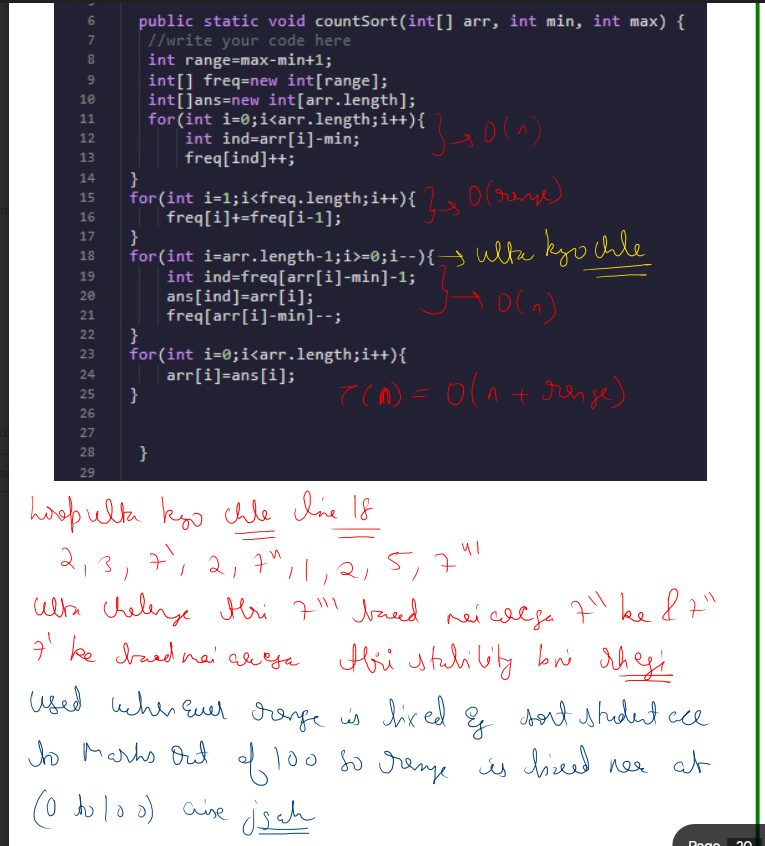
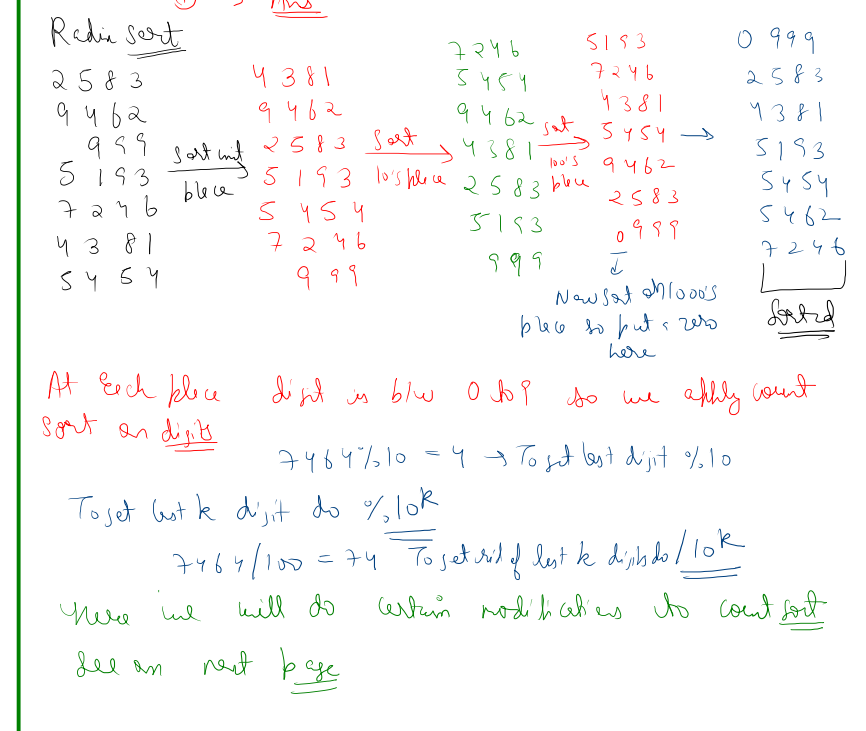
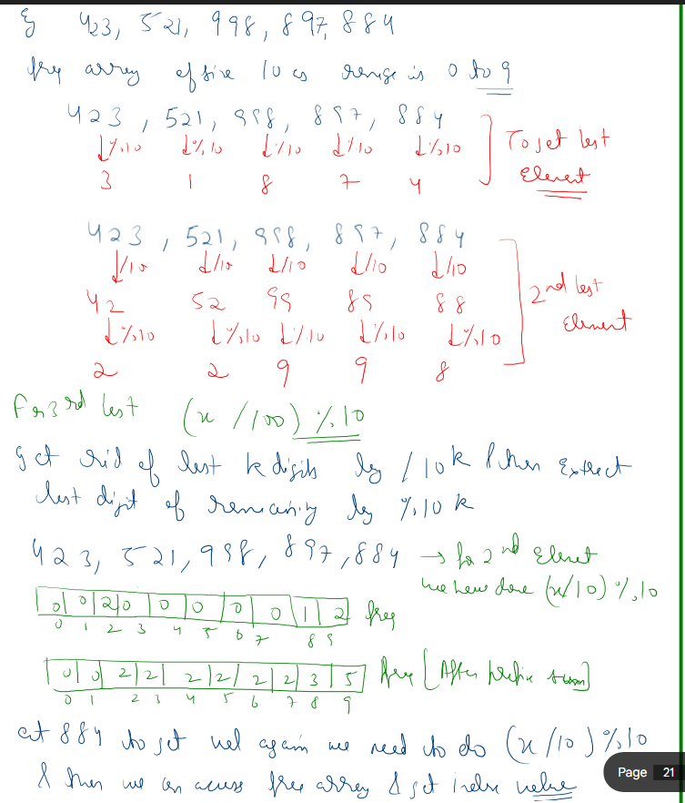
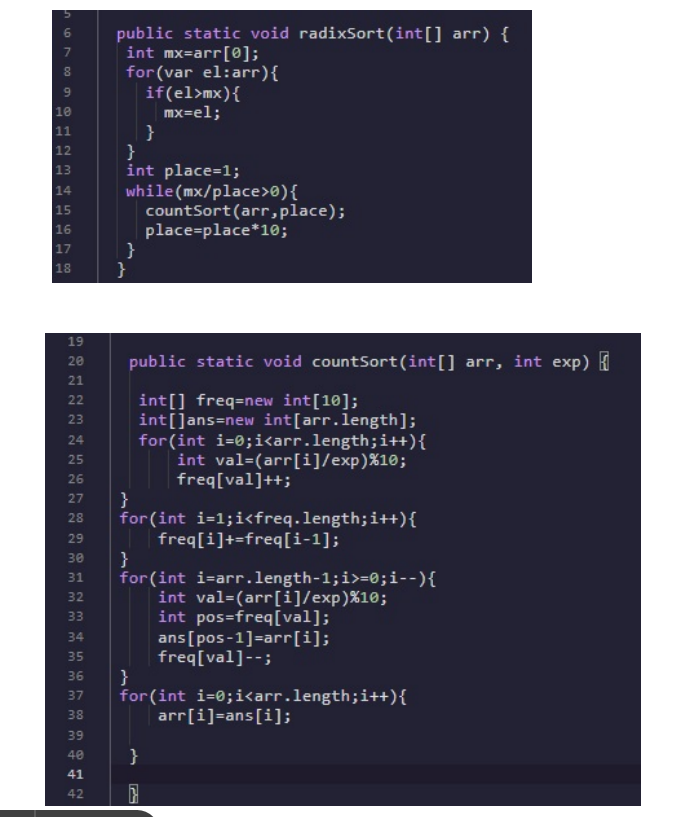
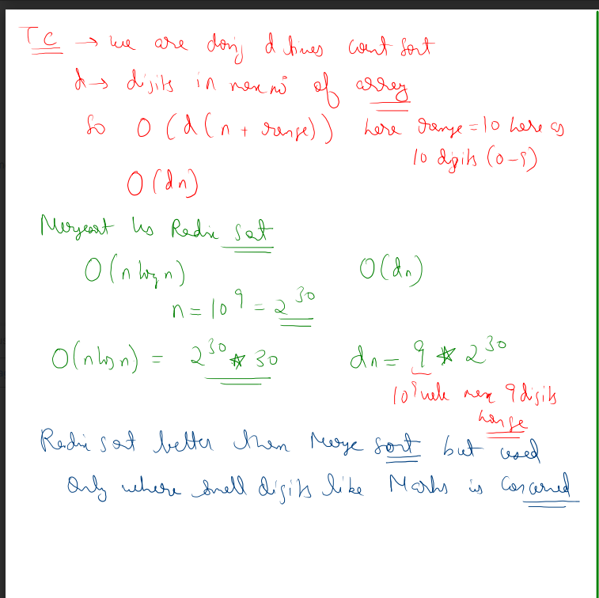

# Notes
.jpg>)
(1).jpg>) (2).jpg>) (3).jpg>) (4).jpg>) (5).jpg>) (6).jpg>) (7).jpg>) (8).jpg>) (9).jpg>)


## Selection sort 

```cpp
class Solution {
public:
    vector<int> selectionSort(vector<int>& nums) {
        for(int i=0;i<nums.size();i++){
            int min=i;
            for(int j=i+1;j<nums.size();j++){
                if(nums[j]<nums[min]){
                    min=j;
                }
            }
            if(min!=i){
                swap(nums[min],nums[i]);
            }
        }
        return nums;
    }
};

```
## Bubble sort 

```cpp
class Solution {
public:
    vector<int> bubbleSort(vector<int>& arr) {
        for(int i=0;i<arr.size();i++){
            bool swapped=false;
            for(int j=0;j<arr.size()-i-1;j++){
                if(arr[j]>arr[j+1]){
                    swap(arr[j],arr[j+1]);
                    swapped=true;
                }
            }
            if(swapped==false) break;
        }
        return arr;
    }
};

```
## Insertion sort

```cpp
class Solution {
public:
    vector<int> insertionSort(vector<int>& arr) {
        for(int i=1;i<arr.size();i++){
            for(int j=i-1;j>=0;j--){
                if(arr[j]>arr[j+1]) swap(arr[j],arr[j+1]);
                else break;
            }
        }
        return arr;
    }
};

```

## Merge sort

```cpp

class Solution {
    void merge(vector<int>& arr,int lo,int mid,int hi){
        vector<int> temp;
        int left = lo;
        int right = mid + 1;
        while(left<=mid && right <=hi){
            if(arr[left]<=arr[right]){
                temp.push_back(arr[left++]);
            }else 
                temp.push_back(arr[right++]);
        }
        while (left <= mid) {
            temp.push_back(arr[left++]);
        }

        while (right <= hi) {
            temp.push_back(arr[right++]);
        }
        for (int i = lo; i <= hi; i++) {
            arr[i] = temp[i - lo];
        }
    }
    void mergeSortFunction(vector<int>& arr,int lo,int hi){
        if(lo>=hi) return;
        int mid=(lo+hi)/2;
        mergeSortFunction(arr,lo,mid);
        mergeSortFunction(arr,mid+1,hi);
        merge(arr,lo,mid,hi);
    }
public:
    vector<int> mergeSort(vector<int>& nums) {
         mergeSortFunction(nums,0,nums.size()-1);
         return nums;
    }
};

```

## Quick Sort

```cpp
class Solution {
    int getPartiton(vector<int>& arr,int l,int r){
        int pivot=arr[r];
        int i=0,j=0;
        while(i<=r){
            if(arr[i]<=pivot){
                swap(arr[i],arr[j]);
                i++;
                j++;
            }else{
                i++;
            }
        }
        return j-1;
    }

    void sortQuick(vector<int>& arr,int l,int r){
            if(l>=r) return;

            int p=getPartiton(arr,l,r);
            sortQuick(arr,l,p-1);
            sortQuick(arr,p,r);
    }
public:
    vector<int> quickSort(vector<int>& nums) {
        int n=nums.size();
        sortQuick(nums,0,n-1);
        return nums;
    }
};

```

## Heap sort

```cpp
class Solution {
    void downheapify(vector<int> &v ,int size ,int i){
        int idx=i;
        int leftidx=2*i+1;
        int rightidx=2*i+2;
        if(leftidx<size && v[leftidx]>v[idx]) idx=leftidx;
        if(rightidx<size && v[rightidx]>v[idx]) idx=rightidx;
        if(idx!=i){
            swap(v[idx],v[i]);
            downheapify(v,size,idx);
        }
    }
public:
    void heapSort(vector<int>&nums) {
        int n=nums.size();
        for(int i=n/2-1;i>=0;i--){
            downheapify(nums,n,i);
        }

        for(int i=n-1;i>=0;i--){
            swap(nums[i],nums[0]);
            downheapify(nums,i,0);
        }

    }
};
```

>Note:In heaps upHeapify is only callled when we adding only 1 value.Rest all we have downHeapify.

## Basic Heap code 

```cpp 

#include <bits/stdc++.h>
using namespace std;

class Heap {
        void upHeapify(int i){
            if(i==0) return;
           int parIdx=(i-1)/2;
           if(v[parIdx]>v[i]){
               swap(v[parIdx],v[i]);
               upHeapify(parIdx);
           }
       }
       
       void downHeapify(int idx){
           int resIdx=idx;
           int lIdx=2*idx+1;
           int rIdx=2*idx+2;
           if(lIdx<v.size()&& v[lIdx]<v[resIdx]) resIdx=lIdx;
           if(rIdx<v.size() && v[rIdx]<v[resIdx]) resIdx=rIdx;
           if(resIdx!=idx){
               swap(v[resIdx],v[idx]);
               downHeapify(resIdx);
           }
           
       }
    public:
   vector<int> v;
    void insert(int val){
        v.push_back(val);
        if(v.size()==1) return;
        upHeapify(v.size()-1);
    }
    
    void Heapify(int index) {
        downHeapify(0);
    }
    
    void delete_from_heap(){
        int n=v.size();
        if(n==1) {
            v.pop_back();
            return;
        }
        swap(v[n-1],v[0]);
        v.pop_back();
        Heapify(0);
    }
    
};


int main() {
    Heap* h1 = new Heap();
    int n;
    cin>>n;
    for(int i=0; i<n; i++)
    {
        string command;
        cin>>command;
        if(command=="insert"){
            int value;
            cin>>value;
            h1->insert(value);
        }
        else if(command=="delete")
        {
            h1->delete_from_heap();
        }
        else if(command=="print"){
            for(auto j: h1->v)
            {
                cout<<j<<" ";
            }
            cout<<endl;
        }
    }

}

```
### Count sort

```cpp
#include <bits/stdc++.h>

using namespace std;

vector<int> countsort(vector<int>& arr) {
    int n = arr.size();

    int mnval=INT_MAX;
    int maxval = 0;
    for (int i = 0; i < n; i++){
        maxval = max(maxval, arr[i]);
        mnval=min(mnval,arr[i]);
    }

    // create and initialize count array
    vector<int> count(maxval-mnval + 1, 0);
    // count frequency of each element
    for (int i = 0; i < n; i++)
        count[arr[i]-mnval]++;

    // compute prefix sum
    for (int i = 1; i <= maxval-mnval; i++){
        count[i] += count[i - 1];
    }
    
    // build output array
    vector<int> ans(n);
    for (int i = n - 1; i >= 0; i--) {
        int idx=count[arr[i]-mnval] - 1;
        ans[idx] = arr[i];
        count[arr[i]-mnval]--;
    }

    return ans;
}

int main() {
    vector<int> arr = {7,8,9,5,5,5,6,8,8,8,9,7,6};
    vector<int> sorted = countsort(arr);

    for (int x : sorted)
        cout << x << " ";

    return 0;
}
```

Output 5 5 5 6 6 7 7 8 8 8 8 9 9 




## Radix sort 












