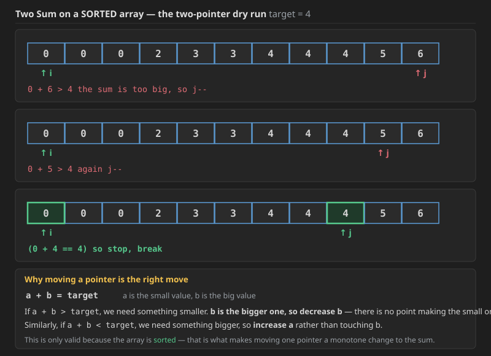
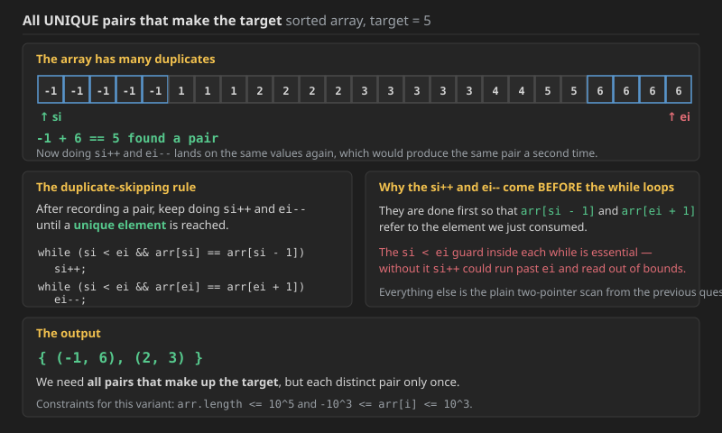
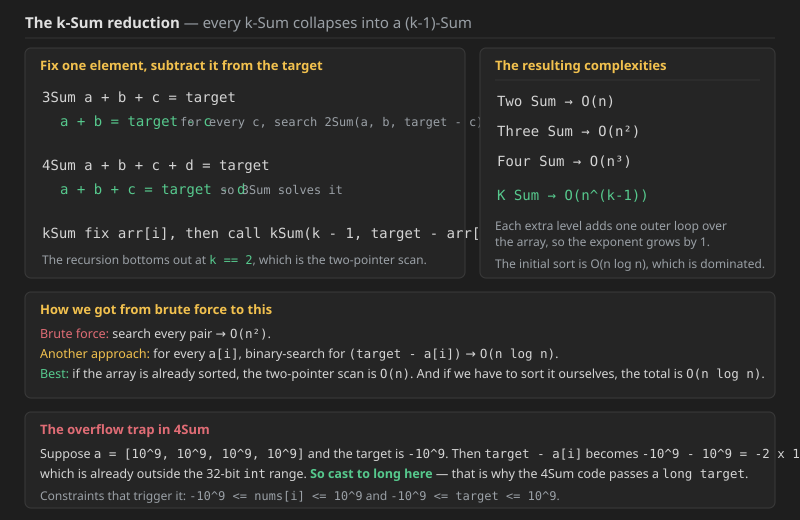
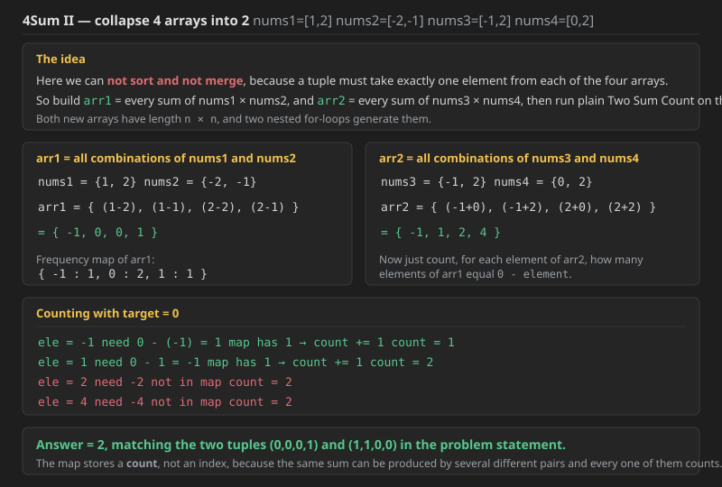

## Q1. Two Sum


Given an array of integers **nums** and an integer **target**. Return the indices (0 - indexed) of two elements in nums such that they add up to target.

Each input will have exactly one solution, and the same element **cannot** be used twice. Return the answer in increasing order.

### Examples

```text
Input: nums = [1, 6, 2, 10, 3], target = 7
Output: [0, 1]
Explanation: nums[0] + nums[1] = 1 + 6 = 7

Input: nums = [1, 3, 5, -7, 6, -3], target = 0
Output: [1, 5]
Explanation: nums[1] + nums[5] = 3 + (-3) = 0

Input: nums = [-6, 7, 1, -7, 6, 2], target = 3
```


## Bruteforce

For all problems in group we can start with this bruteforce 

```cpp
class Solution {
public:
    vector<int> twoSum(vector<int>& nums, int target) {
        int i,j;
        vector<int>arr={-1,-1};
        for(i=0;i<nums.size();i++){
            for(j=i+1;j<nums.size();j++){
            if(nums[i]+nums[j]==target)
            {
             arr={i,j};
                break;}
            }
        
            if(arr[0]!=-1)
                break;
        }
    
    return arr;}
};
```

## Map Approach 

```java
class Solution {
    public int[] twoSum(int[] nums, int target) {
        int []res=new int[2];
        Map<Integer,Integer>mp=new HashMap<>();
        for(int i=0;i<nums.length;i++){
            int val=target-nums[i];
            if(mp.containsKey(val)==true){
                res[0]=i;
                res[1]=mp.get(val);
                return res;
            }
            mp.put(nums[i],i);
        }
        return new int[]{-1,-1};
    }
}
```

cannot use sorting one as order needs to be maintained as need to return indices!!so we stored indexes in map ,but if there is no index needed can use this below without map and return elements


```cpp

class Solution {
    void fillMap(unordered_map<int,int>&mp,vector<int>& nums){
        for(int i=0;i<nums.size();i++){
            mp[nums[i]]=i;
        }
    }
public:
    vector<int> twoSum(vector<int>& nums, int t) {
        int n=nums.size();
        unordered_map<int,int>mp;
        fillMap(mp,nums);
        sort(nums.begin(),nums.end());
        int i=0,j=n-1;
        vector<int>res(2,0);
        while(i<j){
            int sum=nums[i]+nums[j];
            if(sum==t){
                res[0]=mp[nums[i]];
                res[1]=mp[nums[j]];
                return res;
            }
            if(sum<t) i++;
            else j--;
        }
        return res;
    }
};

```


**Complexity of the approaches above:**

* **Brute force &#8212; Time `O(N^2)`, Space `O(1)`.** Two nested loops try every pair, and there are `N(N-1)/2` of them. The early `break` only helps on lucky inputs and does not change the bound.
* **HashMap &#8212; Time `O(N)`, Space `O(N)`.** One pass: for each `nums[i]` we look up `target - nums[i]`, which is `O(1)` on average in a hash map. The map holds at most `N` entries. This is the version to write when **indices** are required.
* **Sort + two pointers &#8212; Time `O(N log N)`, Space `O(N)` for the index map.** This one is shown above but is the wrong tool here: **sorting destroys the original indices**, and rebuilding them from a map breaks on duplicates. That is exactly the failing case recorded above &#8212; for `nums = [3,3], target = 6` the map keeps only the last index of `3`, so it outputs `[1,1]` instead of `[0,1]`.

**Here we need indexes so we cannot sort.** The sorted two-pointer method only becomes usable once the problem asks for the **values** rather than the positions, which is what the next question does.


Here we need indexes so we cannot sort 

---

## Q2. Two Sum II - Input Array Is Sorted (LeetCode 167)


Given a **1-indexed** array of integers `numbers` that is already **sorted in non-decreasing order**, find two numbers such that they add up to a specific `target` number. Let these two numbers be `numbers[index1]` and `numbers[index2]` where `1 <= index1 < index2 <= numbers.length`.

Return *the indices of the two numbers*, `index1` and `index2`, **added by one** as an integer array `[index1, index2]` *of length 2*.

The tests are generated such that there is **exactly one solution**. You **may not** use the same element twice.

Your solution must use only constant extra space.

### Examples

```text
Input:  numbers = [2,7,11,15], target = 9
Output: [1,2]
Explanation: The sum of 2 and 7 is 9. Therefore, index1 = 1, index2 = 2.
             We return [1, 2].

Input:  numbers = [2,3,4], target = 6
Output: [1,3]
Explanation: The sum of 2 and 4 is 6. Therefore index1 = 1, index2 = 3.
             We return [1, 3].

Input:  numbers = [-1,0], target = -1
Output: [1,2]
Explanation: The sum of -1 and 0 is -1. Therefore index1 = 1, index2 = 2.
             We return [1, 2].
```

### Constraints

* `2 <= numbers.length <= 3 * 10^4`
* `-1000 <= numbers[i] <= 1000`
* `numbers` is sorted in **non-decreasing order**
* `-1000 <= target <= 1000`
* The tests are generated such that there is **exactly one solution**.

Note that last line carefully &#8212; **there is exactly one solution**, so the moment a pair is found we can stop.

### The dry run



Take the sorted array `[0, 0, 0, 2, 3, 3, 4, 4, 4, 5, 6]` with `target = 4`. Put `i` at the start and `j` at the end:

```text
i = 0 (value 0),  j = 10 (value 6)     0 + 6 > 4     the sum is too big, so j--
i = 0 (value 0),  j =  9 (value 5)     0 + 5 > 4     again j--
i = 0 (value 0),  j =  8 (value 4)     0 + 4 == 4    so stop, break
```

### Why moving one pointer is the correct move

```text
a + b = target
^       ^
|       the bigger value
the smaller value
```

If `a + b > target`, then we need to **decrease** something. Since `b` is the bigger one, decrease `b` &#8212; there is no sense in making the already-small `a` smaller.

Similarly, if `a + b < target`, then we need something bigger, so **increase `a`**, because `a` is the smaller one; there is no sense touching `b`.

This reasoning only holds because the array is **sorted**, which is what makes each pointer move a monotone change to the sum.

### Approaches and their cost

* **Brute force** &#8212; search every pair &#8212; `O(n^2)`.
* **Another approach** &#8212; for every `a[i]`, binary-search for `(target - a[i])` &#8594; `O(n log n)`.
* **The efficient one** &#8212; `O(n)` if the array is already sorted. If we have to sort it ourselves, the total becomes `O(n log n)`.


as already sorted so no need to sort but approach is this only

**Java**

```java
class Solution {
    public int[] twoSum(int[] nums, int target) {
        Arrays.sort(nums);
        int[] res=new int[2];
        int n=nums.length;
        int i=0;
        int j=n-1;
        while(i<j){
            if(nums[i]+nums[j]==target){
                res[0]=i;
                res[1]=j;
                break;
            }
            else if(nums[i]+nums[j]<target){
                i++;
            }
            else j--;
        }
        return res;
    }
}
```

The `Arrays.sort` at the top costs `O(n log n)`, and the scan itself is `O(n)`. **If the array is already sorted, the whole thing is `O(n)`.**

**C++** (was missing; same logic as the Java above)

```cpp
class Solution {
public:
    vector<int> twoSum(vector<int>& nums, int target) {
        sort(nums.begin(), nums.end());
        vector<int> res(2, 0);
        int n = nums.size();
        int i = 0;
        int j = n - 1;
        while (i < j) {
            if (nums[i] + nums[j] == target) {
                res[0] = i;
                res[1] = j;
                break;
            }
            else if (nums[i] + nums[j] < target) {
                i++;
            }
            else j--;
        }
        return res;
    }
};
```

### A cleaner version of the same scan

**Java**

```java
// 167
public int[] twoSum(int[] arr, int target) {

    int n = arr.length, si = 0, ei = n - 1;

    while (si < ei) {
        int sum = arr[si] + arr[ei];
        if (sum == target)
            return new int[] { si + 1, ei + 1 };
        else if (sum < target)
            si++;
        else
            ei--;
    }

    return new int[]{-1,-1};
}
```

The `+ 1` on both indices is there because the question uses **1-based indexing**.

**C++** (was missing; same logic as the Java above)

```cpp
// 167
vector<int> twoSum(vector<int>& arr, int target) {

    int n = arr.size(), si = 0, ei = n - 1;

    while (si < ei) {
        int sum = arr[si] + arr[ei];
        if (sum == target)
            return vector<int>{ si + 1, ei + 1 };
        else if (sum < target)
            si++;
        else
            ei--;
    }

    return {-1,-1};
}
```

**Complexity &#8212; Q2:**

* **Time `O(n)`.** Each iteration of the `while` moves either `si` forward or `ei` backward, and they can only meet once, so the total number of iterations is bounded by `n`. Nothing is ever revisited.
* **Space `O(1)`,** which is exactly what the problem demands. Only two indices and a sum are kept; no map and no copy of the array.
* **Why this beats the HashMap version here.** A map would also be `O(n)` time but `O(n)` space. The sortedness is extra information the problem hands us for free, and the two-pointer scan is the way to spend it.


---

## Q3. Two Sum &#8212; all unique pairs in a sorted array

We have a **sorted array**, and now we need to find **all unique combinations that make up the target**.



For the sorted array

```text
[-1,-1,-1,-1,-1, 1,1,1, 2,2,2,2, 3,3,3,3,3, 4,4, 5,5, 6,6,6,6]   target = 5
```

the output is

```text
{ (-1, 6),  (2, 3) }
```

**We need all pairs that make up the target**, each distinct pair reported only once.

### Constraints

* `arr.length <= 10^5`
* `-10^3 <= arr[i] <= 10^3`

### The problem compared with the previous question: duplicates

In the previous question we simply did `si++` and `ei--` after finding a pair. Here that lands on the **same values again**, producing the same pair a second time.

So now, keep doing `si++` and `ei--` **until a unique element is reached**.

### Java

```java
public List<List<Integer>> twoSum(int[] arr, int target, int si, int ei) {
    List<List<Integer>> ans = new ArrayList<>();
    while (si < ei) {
        int sum = arr[si] + arr[ei];
        if (sum == target) {
            ArrayList<Integer> smallAns = new ArrayList<>();
            smallAns.add(arr[si]);
            smallAns.add(arr[ei]);
            ans.add(smallAns);
            si++;
            ei--;
            while (si < ei && arr[si] == arr[si - 1])
                si++;
            while (si < ei && arr[ei] == arr[ei + 1])
                ei--;
        } else if (sum < target)
            si++;
        else
            ei--;
    }

    return ans;
}
```

Notice the range `[si, ei]` is passed in, which is what lets this same function be reused as the inner step of 3Sum and 4Sum later.

The `si++` and `ei--` are deliberately done **before** the two `while` loops, so that `arr[si - 1]` and `arr[ei + 1]` refer to the element just consumed. The `si < ei` guard inside each `while` is essential &#8212; without it `si++` could run past `ei` and read out of bounds.

### C++ (was missing)

```cpp
vector<vector<int>> twoSum(vector<int>& arr, int target, int si, int ei) {
    vector<vector<int>> ans;
    while (si < ei) {
        int sum = arr[si] + arr[ei];
        if (sum == target) {
            vector<int> smallAns;
            smallAns.push_back(arr[si]);
            smallAns.push_back(arr[ei]);
            ans.push_back(smallAns);
            si++;
            ei--;
            while (si < ei && arr[si] == arr[si - 1])
                si++;
            while (si < ei && arr[ei] == arr[ei + 1])
                ei--;
        } else if (sum < target)
            si++;
        else
            ei--;
    }

    return ans;
}
```

**Complexity &#8212; Q3:**

* **Time `O(n)`** on an already-sorted array. The duplicate-skipping `while` loops look nested, but they only ever move `si` forward and `ei` backward, the same pointers the outer loop moves. Across the entire run each pointer travels at most `n` steps, so the total work is linear. If sorting is needed first, the total becomes `O(n log n)`.
* **Space `O(1)` auxiliary**, plus `O(number of pairs)` for the output list, which is not counted as auxiliary space.
* **Why this is the right place to handle duplicates.** Dealing with them here, inside the innermost Two Sum, means every caller above it (3Sum, 4Sum, kSum) gets duplicate-free results for free.

---

## Q4. 3Sum (LeetCode 15)

**Difficulty:** Medium

Given an integer array nums, return all the triplets `[nums[i], nums[j], nums[k]]` such that `i != j`, `i != k`, and `j != k`, and `nums[i] + nums[j] + nums[k] == 0`.

Notice that the solution set must not contain duplicate triplets.

### Examples

```text
Input:  nums = [-1,0,1,2,-1,-4]
Output: [[-1,-1,2],[-1,0,1]]
Explanation:
nums[0] + nums[1] + nums[2] = (-1) + 0 + 1 = 0.
nums[1] + nums[2] + nums[4] = 0 + 1 + (-1) = 0.
nums[0] + nums[3] + nums[4] = (-1) + 2 + (-1) = 0.
The distinct triplets are [-1,0,1] and [-1,-1,2].
Notice that the order of the output and the order of the triplets does not matter.

Input:  nums = [0,1,1]
Output: []
Explanation: The only possible triplet does not sum up to 0.

Input:  nums = [0,0,0]
Output: [[0,0,0]]
Explanation: The only possible triplet sums up to 0.
```

### Constraints

* `3 <= nums.length <= 3000`
* `-10^5 <= nums[i] <= 10^5`

### The approach



**Brute force** would be `O(n^3)` &#8212; look at every triplet.

**The real approach:**

```text
a + b + c = target

a + b = target - c        so for every c, search  twoSum(a, b, target - c)
```

Here `target = 0`, so for each fixed element we search for `0 - nums[i]`.

### Java

```java
class Solution {
    public void prepareAns(List<List<Integer>> ans,
            List<List<Integer>> smallAns, int fixEle) {

        for (List<Integer> arr : smallAns) {
            List<Integer> ar = new ArrayList<>();
            ar.add(fixEle);
            for (int ele : arr)
                ar.add(ele);
            ans.add(ar);
        }
    }

    public List<List<Integer>> threeSum(int[] nums) {
        Arrays.sort(nums);
        List<List<Integer>>ans=new ArrayList<>();
        for(int i=0;i<nums.length;){
            List<List<Integer>>tAns= twoSum(nums,-nums[i],i+1,nums.length-1);
            prepareAns(ans,tAns,nums[i]);
            i++;
            while (i < nums.length && nums[i] == nums[i - 1])
                i++;
        }
        return ans;
    }
}
```

`prepareAns` exists to **add the third element to the answers coming back from Two Sum** &#8212; the inner call only returns pairs, so the fixed element has to be pasted onto the front of each one.

**A subtle detail about where the `i++` goes.** If you put the `i++` in the `for` header, it leads to an **array out of bounds at index 0**, because the duplicate-skip `while` reads `nums[i - 1]`. And if you put it after line 41 without the guard, the `while` at `i == 1` would... the point is that the increment must happen **before** the duplicate-skipping loop and the loop must be guarded, which is why the `for` header has an empty increment slot.

### C++ 

```cpp
class Solution {
public:
    void prepareAns(vector<vector<int>>& ans,
            vector<vector<int>>& smallAns, int fixEle) {

        for (vector<int>& arr : smallAns) {
            vector<int> ar;
            ar.push_back(fixEle);
            for (int ele : arr)
                ar.push_back(ele);
            ans.push_back(ar);
        }
    }

    vector<vector<int>> threeSum(vector<int>& nums) {
        sort(nums.begin(), nums.end());
        vector<vector<int>> ans;
        for (int i = 0; i < (int) nums.size();) {
            vector<vector<int>> tAns = twoSum(nums, -nums[i], i + 1, (int) nums.size() - 1);
            prepareAns(ans, tAns, nums[i]);
            i++;
            while (i < (int) nums.size() && nums[i] == nums[i - 1])
                i++;
        }
        return ans;
    }
};
```


**Complexity &#8212; Q4 (3Sum):**

* **Time `O(n^2)`.** The outer loop runs `n` times and each iteration calls a Two Sum that is `O(n)`, giving `n x n`. The `O(n log n)` sort at the start is dominated by that. Brute force would be `O(n^3)`, so fixing one element and reducing to Two Sum saves a whole factor of `n`.
* **Space `O(log n)` to `O(n)` for the sort**, plus the output list. No hash map is needed at all, which is the payoff of sorting first.
* **How duplicates are avoided at two levels.** The outer loop skips repeated values of the fixed element, and the inner Two Sum skips repeated values of the pair. Both are needed &#8212; skipping at only one level still lets duplicate triplets through.


## Full solution 


## 3-sum 

3-sum just `nums[i]+nums[j]+nums[k]=0`

so its just 2-sum of `nums[i]+nums[j]=-nums[k]`


```cpp

class Solution {
  void getAns(vector<vector<int>>& tres,vector<vector<int>>& res,int el){
        for(vector<int>temp:tres){
            res.push_back({el,temp[0],temp[1]});
        }
    }
    vector<vector<int>> twoSum(vector<int>& a,int tar,int si,int ei){
        vector<vector<int>> ans;
        while(si<ei){
            int sum=a[si]+a[ei];
            if(sum==tar){
                ans.push_back({a[si],a[ei]});
                si++;
                ei--;
                while(si<ei && a[si]==a[si-1]) si++;
                while(si<ei && a[ei]==a[ei+1]) ei--;
            }else if(sum>tar) ei--;
            else si++;
        }
        return ans;
    }
public:
    vector<vector<int>> threeSum(vector<int>& nums) {
        vector<vector<int>> res;
        int n = nums.size();
        sort(nums.begin(), nums.end());
        for(int i=0;i<n;){
           vector<vector<int>> tres= twoSum(nums,-nums[i],i+1,n-1);
           getAns(tres,res,nums[i]);
           i++;
           while(i<n && nums[i]==nums[i-1]) i++;
        }
        return res;
    }
};

```

Time Complexity:O(n log n) for sorting + O(n * n) for nested loops in threeSum and twoSum, resulting in O(n^2) overall.

Space Complexity:O(1) excluding the output array, as only a constant amount of extra space is used for variables. If we consider the space taken by the output array, then it will depend on the number of triplets formed. In the worst-case scenario, where many triplets are formed, the space complexity could be O(n^2).

---

## Q5. 4Sum (LeetCode 18)

**Difficulty:** Medium

Given an array `nums` of `n` integers, return *an array of all the **unique** quadruplets* `[nums[a], nums[b], nums[c], nums[d]]` such that:

* `0 <= a, b, c, d < n`
* `a`, `b`, `c`, and `d` are **distinct**
* `nums[a] + nums[b] + nums[c] + nums[d] == target`

You may return the answer in **any order**.

### Examples

```text
Input:  nums = [1,0,-1,0,-2,2], target = 0
Output: [[-2,-1,1,2],[-2,0,0,2],[-1,0,0,1]]

Input:  nums = [2,2,2,2,2], target = 8
Output: [[2,2,2,2]]
```

### Constraints

* `1 <= nums.length <= 200`
* `-10^9 <= nums[i] <= 10^9`
* `-10^9 <= target <= 10^9`

### The approach

```text
a + b + c + d = target

a + b + c = target - d        so the 3Sum we just wrote solves it
```

### Java

```java
public List<List<Integer>> fourSumUtil(int[] arr, int target, int si, int ei) {
    List<List<Integer>> ans = new ArrayList<>();
    for (int i = si; i < ei;) {
        List<List<Integer>> smallAns = threeSum(arr, (long)target - (long)arr[i], i + 1, ei);
        prepareAns(ans, smallAns, arr[i]);
        i++;
        while (i < ei && arr[i] == arr[i - 1])
            i++;
    }

    return ans;
}

public List<List<Integer>> fourSum(int[] nums, int target) {
    Arrays.sort(nums);

    return fourSumUtil(nums,target,0,nums.length-1);
}
```

The `threeSum` it calls now takes a `long target`:

```java
public List<List<Integer>> threeSum(int[] nums,long target,int si,int ei) {
    List<List<Integer>>ans=new ArrayList<>();
    for(int i=si;i<ei;){
        List<List<Integer>>tAns= twoSum(nums,target-(long)nums[i],i+1,ei);
        prepareAns(ans,tAns,nums[i]);
        i++;
        while (i < ei && nums[i] == nums[i - 1])
            i++;
    }
    return ans;
}
```

and so does `twoSum`:

```java
public List<List<Integer>> twoSum(int[] arr, long target, int si, int ei) {
    List<List<Integer>> ans = new ArrayList<>();
    while (si < ei) {
        long sum =(long) arr[si] + (long)arr[ei];
        if (sum == (long)target) {
            ArrayList<Integer> smallAns = new ArrayList<>();
            smallAns.add(arr[si]);
            smallAns.add(arr[ei]);
            ans.add(smallAns);
            si++;
            ei--;
            while (si < ei && arr[si] == arr[si - 1])
                si++;
            while (si < ei && arr[ei] == arr[ei + 1])
                ei--;
        } else if (sum < (long)target)
            si++;
        else
            ei--;
    }

    return ans;
}
```

**Why the `long` casts.** Suppose `a = [10^9, 10^9, 10^9, 10^9]` and the target is `-10^9`. Then `target - arr[i]` is `-10^9 - 10^9 = -2 x 10^9`, which already **overflows a 32-bit int**, so from here on it has to be a `long`.

### C++ (was missing; same logic as the Java above)

```cpp
vector<vector<int>> twoSum(vector<int>& arr, long long target, int si, int ei) {
    vector<vector<int>> ans;
    while (si < ei) {
        long long sum = (long long) arr[si] + (long long) arr[ei];
        if (sum == target) {
            vector<int> smallAns;
            smallAns.push_back(arr[si]);
            smallAns.push_back(arr[ei]);
            ans.push_back(smallAns);
            si++;
            ei--;
            while (si < ei && arr[si] == arr[si - 1])
                si++;
            while (si < ei && arr[ei] == arr[ei + 1])
                ei--;
        } else if (sum < target)
            si++;
        else
            ei--;
    }

    return ans;
}

vector<vector<int>> threeSum(vector<int>& nums, long long target, int si, int ei) {
    vector<vector<int>> ans;
    for (int i = si; i < ei;) {
        vector<vector<int>> tAns = twoSum(nums, target - (long long) nums[i], i + 1, ei);
        prepareAns(ans, tAns, nums[i]);
        i++;
        while (i < ei && nums[i] == nums[i - 1])
            i++;
    }
    return ans;
}

vector<vector<int>> fourSumUtil(vector<int>& arr, int target, int si, int ei) {
    vector<vector<int>> ans;
    for (int i = si; i < ei;) {
        vector<vector<int>> smallAns = threeSum(arr, (long long) target - (long long) arr[i], i + 1, ei);
        prepareAns(ans, smallAns, arr[i]);
        i++;
        while (i < ei && arr[i] == arr[i - 1])
            i++;
    }

    return ans;
}

vector<vector<int>> fourSum(vector<int>& nums, int target) {
    sort(nums.begin(), nums.end());

    return fourSumUtil(nums, target, 0, (int) nums.size() - 1);
}
```

**Complexity &#8212; Q5 (4Sum):**

* **Time `O(n^3)`.** One more outer loop on top of 3Sum: `n` choices for the fixed element, each running an `O(n^2)` 3Sum. The `O(n log n)` sort is dominated. With `n <= 200` that is at most `8 x 10^6` operations.
* **Space `O(log n)` to `O(n)` for the sort**, plus the output. Again no hash map.
* **The overflow point is worth repeating:** the accumulator must be `long` (Java) / `long long` (C++) from the top of the chain downward, not just at the innermost comparison, because the subtraction that overflows happens on the way **down**.

---

## Q6. kSum &#8212; the generic version

Whenever we need something generic, the k-Sum generic version is the one to write &#8212; and it makes the pattern obvious: **if you are asked for 7Sum, it will call 6Sum, then 5Sum, and so on.**

```text
kSum  ->  fix arr[i],  then call kSum(k - 1, target - arr[i])
```

The recursion bottoms out at `k == 2`, which is the two-pointer scan we already have.

### Java

```java
public List<List<Integer>> kSum(int[] arr, long target, int k, int si, int ei) {
    if (k == 2)
        return twoSum(arr, target, si, ei);

    List<List<Integer>> ans = new ArrayList<>();
    for (int i = si; i < ei;) {
        List<List<Integer>> smallAns = kSum(arr, target - (long)arr[i], k - 1, i + 1, ei);
        prepareAns(ans, smallAns, arr[i]);
        i++;
        while (i < ei && arr[i] == arr[i - 1])
            i++;
    }

    return ans;
}

public List<List<Integer>> fourSum(int[] arr, int target) {
    int n = arr.length;
    Arrays.sort(arr);
    return kSum(arr, (long)target, 4, 0, n - 1);
}
```

```text
Runtime 24 ms   Beats 50.45%      Memory 43.3 MB   Beats 31.1%
```

### C++ (was missing; same logic as the Java above)

```cpp
vector<vector<int>> kSum(vector<int>& arr, long long target, int k, int si, int ei) {
    if (k == 2)
        return twoSum(arr, target, si, ei);

    vector<vector<int>> ans;
    for (int i = si; i < ei;) {
        vector<vector<int>> smallAns = kSum(arr, target - (long long) arr[i], k - 1, i + 1, ei);
        prepareAns(ans, smallAns, arr[i]);
        i++;
        while (i < ei && arr[i] == arr[i - 1])
            i++;
    }

    return ans;
}

vector<vector<int>> fourSum(vector<int>& arr, int target) {
    int n = arr.size();
    sort(arr.begin(), arr.end());
    return kSum(arr, (long long) target, 4, 0, n - 1);
}
```

**Complexity &#8212; Q6 (kSum):**

* **Time `O(n^(k-1))`.** Each level of the recursion adds one loop over the array, and the recursion has `k - 2` such levels before it reaches the `O(n)` two-pointer base case. So the ladder reads: Two Sum `O(n)`, Three Sum `O(n^2)`, Four Sum `O(n^3)`, k-Sum `O(n^(k-1))`.
* **Space `O(k)` for the recursion stack** plus `O(n log n)`-worth of sort overhead and the output list. The depth is `k`, not `n`, so the stack is never a concern.
* **Note this really is the same Two Sum underneath.** Only the wrapper changes; the duplicate-skipping and the pointer movement are untouched all the way down.

---

## Q7. 4Sum II (LeetCode 454)

**Difficulty:** Medium

Given four integer arrays `nums1`, `nums2`, `nums3`, and `nums4` all of length `n`, return the number of tuples `(i, j, k, l)` such that:

* `0 <= i, j, k, l < n`
* `nums1[i] + nums2[j] + nums3[k] + nums4[l] == 0`

### Examples

```text
Input:  nums1 = [1,2], nums2 = [-2,-1], nums3 = [-1,2], nums4 = [0,2]
Output: 2
Explanation:
The two tuples are:
1. (0, 0, 0, 1) -> nums1[0] + nums2[0] + nums3[0] + nums4[1] = 1 + (-2) + (-1) + 2 = 0
2. (1, 1, 0, 0) -> nums1[1] + nums2[1] + nums3[0] + nums4[0] = 2 + (-1) + (-1) + 0 = 0

Input:  nums1 = [0], nums2 = [0], nums3 = [0], nums4 = [0]
Output: 1
```

### Constraints

* `n == nums1.length`
* `n == nums2.length`
* `n == nums3.length`
* `n == nums4.length`
* `1 <= n <= 200`
* `-2^28 <= nums1[i], nums2[i], nums3[i], nums4[i] <= 2^28`

Whenever something generic gets a **smaller time and space constraint**, the k-Sum generic version is what you reach for. But this question is different, because the four arrays are separate.

### First, the two-array version

Given two arrays `A` and `B`, count the pairs with `A[i] + B[j] == target`. **Can we solve it?**

```text
A = [1, 3, 6, 7, 0, 5, -1, -2, -4, -7]        target = 4
B = [3, 7, 8, -2, -3, -6, 0, 1, 5, 11]
```

**We cannot sort and then merge like the earlier Two Sum**, because a pair must take one element from `A` and one from `B`, so the two arrays cannot be mixed together.

**One solution:** build a **HashMap of A** holding element to count-of-that-element, then for each `B[i]` look up `target - B[i]` and add its count.

```text
count += hm.get(target - B[i])
```

### Java

```java
public int twoSumCount(int[] nums1, int[] nums2, int target) {
    HashMap<Integer, Integer> map = new HashMap<>();
    for (int ele : nums1)
        map.put(ele, map.getOrDefault(ele, 0) + 1);

    int count = 0;
    for (int ele : nums2)
        if (map.containsKey(target - ele))
            count += map.get(target - ele);

    return count;
}
```

`getOrDefault()` in Java returns the value associated with the specified key in the HashMap. If the key does not exist, it returns the specified default value. That is what lets the frequency count be written in a single line.

### C++ (was missing; same logic as the Java above)

```cpp
int twoSumCount(vector<int>& nums1, vector<int>& nums2, int target) {
    unordered_map<int, int> mp;
    for (int ele : nums1)
        mp[ele] = mp.count(ele) ? mp[ele] + 1 : 1;

    int count = 0;
    for (int ele : nums2)
        if (mp.count(target - ele))
            count += mp[target - ele];

    return count;
}
```
.jpg>) .jpg>) .jpg>) .jpg>)

### Now extend it to four arrays



**Create all combinations of `nums1` and `nums2` in `arr1`, and all combinations of `nums3` and `nums4` in `arr2`.** To get all combinations, use **2 for loops**.

```text
nums1 = {1, 2}          nums2 = {-2, -1}
arr1  = { (1-2), (1-1), (2-2), (2-1) }
      = { -1, 0, 0, 1 }

nums3 = {-1, 2}         nums4 = {0, 2}
arr2  = { (-1+0), (-1+2), (2+0), (2+2) }
      = { -1, 1, 2, 4 }
```

Now just run `twoSumCount` on `arr1` and `arr2` with target 0:

```text
frequency map of arr1:  { -1 : 1,  0 : 2,  1 : 1 }

ele = -1   need  1    map has it   count = 1
ele =  1   need -1    map has it   count = 2
ele =  2   need -2    not present  count = 2
ele =  4   need -4    not present  count = 2
```

**Answer = 2**, which matches the expected output.

### Java

```java
class Solution {
    private int twoSumCount(int[] nums1, int[] nums2, int target) {
        HashMap<Integer, Integer> map = new HashMap<>();
        for (int ele : nums1)
            map.put(ele, map.getOrDefault(ele, 0) + 1);

        int count = 0;
        for (int ele : nums2)
            if (map.containsKey(target - ele))
                count += map.get(target - ele);

        return count;
    }

    public int fourSumCount(int[] nums1, int[] nums2, int[] nums3, int[] nums4) {
        HashMap<Integer, Integer> map = new HashMap<>();

        int n = nums1.length, idx = 0;
        int[] A = new int[n * n];
        int[] B = new int[n * n];

        for (int e1 : nums1)
            for (int e2 : nums2)
                A[idx++] = e1 + e2;

        idx = 0;
        for (int e1 : nums3)
            for (int e2 : nums4)
                B[idx++] = e1 + e2;

        return twoSumCount(A, B, 0);
    }
}
```

### C++ (was missing; same logic as the Java above)

```cpp
class Solution {
    int twoSumCount(vector<int>& nums1, vector<int>& nums2, int target) {
        unordered_map<int, int> mp;
        for (int ele : nums1)
            mp[ele] = mp.count(ele) ? mp[ele] + 1 : 1;

        int count = 0;
        for (int ele : nums2)
            if (mp.count(target - ele))
                count += mp[target - ele];

        return count;
    }

public:
    int fourSumCount(vector<int>& nums1, vector<int>& nums2,
                     vector<int>& nums3, vector<int>& nums4) {

        int n = nums1.size(), idx = 0;
        vector<int> A(n * n), B(n * n);

        for (int e1 : nums1)
            for (int e2 : nums2)
                A[idx++] = e1 + e2;

        idx = 0;
        for (int e1 : nums3)
            for (int e2 : nums4)
                B[idx++] = e1 + e2;

        return twoSumCount(A, B, 0);
    }
};
```

### A shorter version that never builds the two arrays

**Java**

```java
public int fourSumCount(int[] nums1, int[] nums2, int[] nums3, int[] nums4) {
    HashMap<Integer, Integer> map = new HashMap<>();
    for (int e1 : nums1)
        for (int e2 : nums2)
            map.put(e1 + e2, map.getOrDefault(e1 + e2, 0) + 1);

    int count = 0, target = 0;
    for (int e1 : nums3)
        for (int e2 : nums4)
            if (map.containsKey(target - e1 - e2))
                count += map.get(target - e1 - e2);

    return count;
}
```

The first double loop puts every `(e1 + e2)` into the map, returning its current value and increasing it by one. If it is not present, `getOrDefault` hands back the default value of 0. The second double loop then searches the map for `(target - e1 - e2)`.

**C++** (was missing; same logic as the Java above)

```cpp
int fourSumCount(vector<int>& nums1, vector<int>& nums2,
                 vector<int>& nums3, vector<int>& nums4) {
    unordered_map<int, int> mp;
    for (int e1 : nums1)
        for (int e2 : nums2)
            mp[e1 + e2] = mp.count(e1 + e2) ? mp[e1 + e2] + 1 : 1;

    int count = 0, target = 0;
    for (int e1 : nums3)
        for (int e2 : nums4)
            if (mp.count(target - e1 - e2))
                count += mp[target - e1 - e2];

    return count;
}
```

**Complexity &#8212; Q7 (4Sum II):**

* **Time `O(n^2)`.** Building the map is one double loop of `n^2` iterations; counting is another double loop of `n^2` iterations, each with an `O(1)` average hash lookup. Total `O(n^2)`. The brute force of trying every `(i, j, k, l)` would be `O(n^4)`, and with `n = 200` that is `1.6 x 10^9` against `4 x 10^4` here.
* **Space `O(n^2)`.** The map holds up to `n^2` distinct pair sums. The first version also allocates two arrays of size `n^2`; the shorter version skips those and keeps only the map, which is why it is the one to prefer.
* **Why the map stores a count rather than an index.** The same pair-sum can be produced by many different `(i, j)` pairs, and **every one of them forms a valid tuple**, so the multiplicity has to be carried. That is the key difference from the index-returning Two Sum in Q1.

